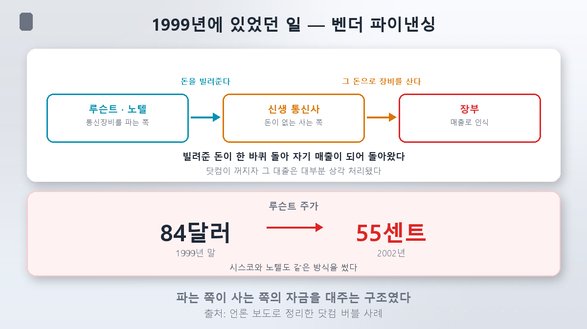
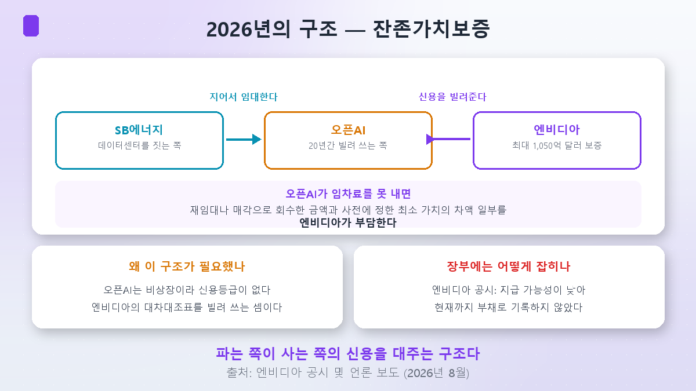
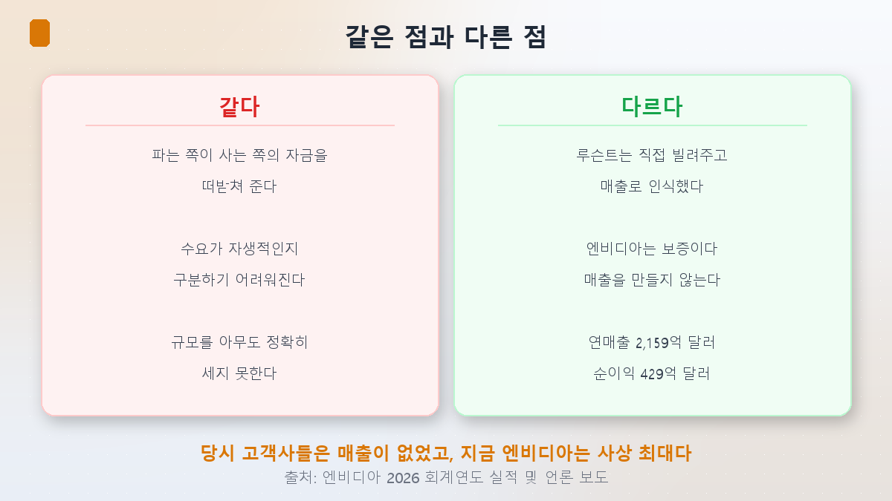
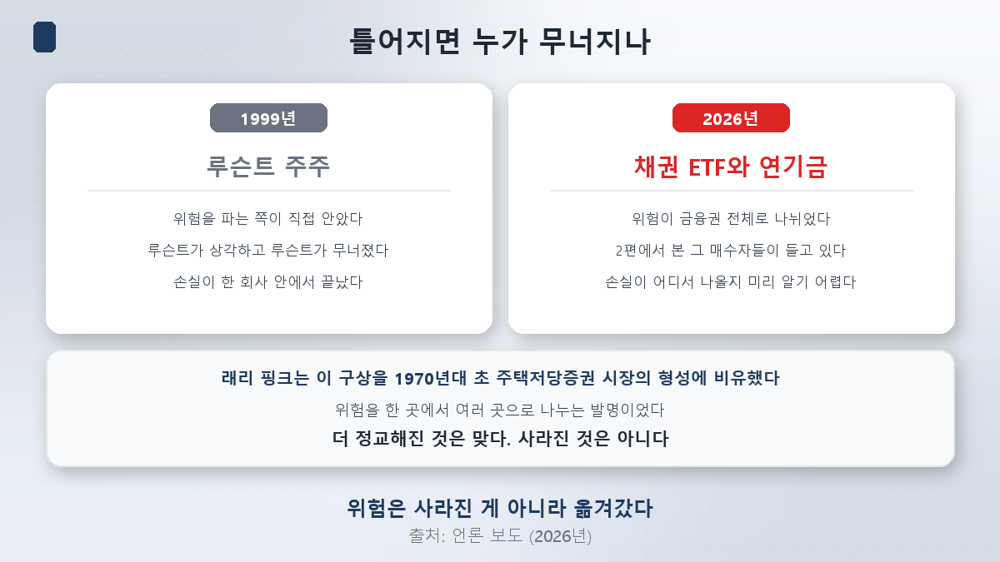

このシリーズでもっとも論争的な回です。結論から言うと、**どちらの言い分にも理があります。**

## 私が中古車を売っているとしましょう

お客さんが車を買いたいのですが、ローンが通りません。信用がないからです。そこで私が信販会社にこう言います。

> 「3年後にこの車が最低いくらにはなるよう、私が責任を持ちます」

すると、ローンが通ります。お客さんは車を買います。**その車を売っているのも私です。**

嘘は一つもついていません。車は本物ですし、お客さんも本当に使います。ただこの取引では、**お客さんの信用は私の信用です。**

いまエヌビディアがやっているのがこれです。そして**1999年にも似たことがありました。**

## 1999年に起きたこと

ドットコムの時代、通信網を敷くという新興事業者が次々に現れました。ただ、お金がありませんでした。そこで装置を売る会社が乗り出します。**ルーセント、シスコ、ノーテル。**

やり方は単純でした。**装置を買うためのお金を貸し、そのお金で自社の装置を買わせる。** これを**ベンダーファイナンス（販売者金融）**といいます。

帳簿の上では美しく見えました。貸したお金が一周まわって**売上**になって戻ってくるからです。売上が伸び、株価が上がり、もっと貸せる余力が生まれました。

ドットコムがしぼむと、新興事業者は返せませんでした。融資の大半は**償却**されました。そして、こうなりました。

| ルーセントの株価 | |
|---|---|
| 1999年末 | **84ドル** |
| 2002年 | **55セント** |

## 2026年に起きていること

エヌビディアは、米オハイオ州パイク郡に建設中の**ポーツパイク**データセンター・キャンパスに関連して、開発会社であるソフトバンク子会社**SBエナジー**との間で、最大**1,050億ドル**規模の**残存価値保証契約**を結びました。ここに入るオープンAIが賃借人です。

**残存価値保証（RVG）**とは、こういう約束です。

> オープンAIが賃料を払えなくなった場合、再賃貸や売却で回収した金額と、**あらかじめ決めておいた最低価値**との差額の一部を**エヌビディアが負担する。**

なぜこれが必要だったのか。**オープンAIは非上場で、独自の信用格付けがありません。** 格付けがなければ、20年の賃貸借契約を引き受けてくれる金融機関を見つけるのは困難です。そこでエヌビディアが出てきます。**オープンAIがエヌビディアの貸借対照表を信用補完として借りている構造**だという解釈が出てくる理由です。

そしてここで押さえておきたい点があります。エヌビディアは開示でこう述べています。

> **「支払いの可能性が低いため、現時点まで負債は計上されていない」**

[第2回](/ja/p/datacenters-off-the-books/)で見た契約上の債務は、それでも注記には載っていました。**これは注記にも負債として載りません。** 偶発債務として扱われるだけです。

### その上にもう一層

エヌビディアは別途、**アポロ・グローバル・マネジメント、ブラックロック、ブラックストーン、ブルックフィールド、ゴールドマン・サックス、KKR**の6金融機関と覚書を結び、**5,000億ドル以上**の外部資本を動員する資金調達プラットフォームを構築することにしました。**GPUを不動産やインフラのように、金融市場で取引できる資産にする**という構想です。

## ところが数字が合いません

ここで妙なことに気づきました。**規模についての数字が出典ごとに違うのです。**

| 何を数えたのか | 規模 |
|---|---|
| メタ・ブロードコムなどAI企業の残存価値保証の推計 | 約**700億ドル** |
| エヌビディアからオープンAIのデータセンターへの単一保証 | 最大**1,050億ドル** |
| エヌビディアのエコシステム・パートナーへの資本コミットメント | 約**3,000億ドル** |
| ウォール街6社との資金調達プラットフォーム | **5,000億ドル以上** |
| 報道が「循環金融」としてまとめて呼ぶ規模 | **7,500億ドル以上** |

業界全体の推計が700億ドルなのに、**単一の取引ひとつが1,050億ドル**です。集計基準と時点がそれぞれ違うからです。ちなみにオープンAIの案件も、当初は最大2,500億ドルまで保証しうるという観測が出たあとで、いまの規模に落ち着きました。

そこでこの記事では、**もっとも具体的に確認できる数字**、つまり相手方と対象が明示されている1,050億ドルを基準に書きます。残りは参考です。

ただ、この不一致自体がひとつのことを語っています。**まだ誰も、この構造の全体像を正確には数えられていません。**

## 同じ点と違う点

### 同じです

- **売る側が買う側の資金を支えます。** 形は融資から保証に変わりましたが、買う側が売る側の信用に寄りかかる構造は同じです。
- **需要が自生的なのか見分けにくくなります。** 自分が回した資金で生まれた需要と、そうでない需要が混ざるからです。
- **規模を誰も正確に数えられません。** 上で見たとおりです。

### 違います

**第一に、ルーセントは直接貸して、それを売上として計上しました。** エヌビディアの残存価値保証は**売上を生みません。** お金も出ていきません。条件が成立したときにだけ、後から負担が生じます。会計的には別の物です。

**第二に、当時の顧客企業には売上がありませんでした。** いまのエヌビディアはこうです。

| エヌビディア 2026会計年度 | |
|---|---|
| 年間売上 | **2,159億ドル**（+65%、初の2,000億ドル超え） |
| 純利益 | **429億6,000万ドル**（+94%、過去最高） |
| 第4四半期売上 | **681億2,700万ドル**（+73%） |

JPモルガンの表現がこの違いをよくまとめています。**「資本がAIを追いかけているのであって、その逆ではない」。** いまのAI企業はドットコム期の企業よりフリーキャッシュフローがはるかに多い、という指摘も併せて出ています。

ジェンスン・フアンCEOも反論しました。**「これは我々がサプライチェーン管理に適用しているのと同じ原則だ。顧客需要を予測でき、それによって長期的な生産能力を確保できるときに、重要な資源を投入するということだ」。** エヌビディア側は、この措置が資金需要を賄うためではなく**インフラの供給を確保する**ためだと強調しています。

**第三に、自ら規模を縮めました。** オープンAIの案件は最大2,500億ドルまでいきうるという観測がありましたが、1,050億ドルに落ち着きました。歯止めなく膨らんでいるわけではない、という根拠でもあります。

## ただ、違うことが、より良いという意味でしょうか

ここが今回の核心です。

**1999年にルーセントが崩れたとき、損をしたのはルーセントとその株主でした。** リスクを販売者が直接抱えていたからです。84ドルが55セントになるあいだ、その損失は一社のなかで完結しました。残酷ですが、明快でした。

いまの構造は違います。**リスクが金融業界全体に分けられています。**

ブラックロックのラリー・フィンク会長は、この構想を**自身が1970年代初頭に経験した住宅ローン担保証券（MBS）市場の形成過程**になぞらえました。ブラックストーンはAIコンピューティングを**「住宅ローン市場が住宅を見るのと同じような、金融可能な資産」**だと説明しました。

この比喩は的確です。だからこそ、落ち着きません。

MBSの発明は実際に前進でした。一か所に集まっていたリスクを複数に分ける技術でしたから。**2008年までは。**

ですから、こう整理するのが正確だと思います。

> **1999年より精巧になったのは確かです。リスクが消えたわけではありません。**
> **移っただけです。**

そしてどこへ移ったかは、[第2回](/ja/p/datacenters-off-the-books/)ですでに見ました。ピムコとブラックロックのETF、そして年金基金です。**ルーセントが崩れたときに損をしたのはルーセントの株主でしたが、この構造が崩れたら損失がどこから出てくるのかは、事前にはわかりにくいのです。**

## いま市場はどちらに賭けているか

どちらも実際にお金を賭けています。

**懸念する側**

- **マイケル・バーリ**がエヌビディアの空売りを増やしました。
- **S&Pがオラクルの信用格付けをBBBからBBB-に引き下げました。** 積極的なAIインフラ拡張が、これまでの安定した事業構造を損なっているという理由です。
- **オラクルの5年物CDSプレミアム**が、関連データの集計が始まった2008年末以降でもっとも高い水準まで上昇しました。CDSは債務不履行に備える保険料のようなもので、上がれば市場がその会社のリスクを大きく見ているという意味です。
- **国際決済銀行（BIS）**は「AI投資競争が財務的な脆弱性を生んでいる」と指摘しました。

**過度だという側**

- **バンク・オブ・アメリカ**は、市場がエヌビディアのAIエコシステム投資のリスクを**過大評価**しているとして、最大50%割安だと見ています。
- **JPモルガン**は「一定の注意は必要だ」としつつも、いまの取引はドットコム時代とは違うと整理しました。
- そして実績があります。上の2,159億ドルは予想ではなく、**すでに刻まれた数字**です。

## 何を見ておくべきか

この論争にいま判定は下せません。代わりに、**判定が下るときに先に動く指標**を知っておくほうが役に立ちます。

1. **オラクルのCDSプレミアム。** AI債務の体温計の役割を果たしています。報道が「AIリスクのバロメーター」と呼ぶ理由です。
2. **格付けの変化。** 格付けは遅れて動きますが、動けば明確なシグナルです。S&Pのオラクル引き下げが最初の事例でした。
3. **中古GPUの価格と賃料。** 残存価値保証は結局「3年後にこの物はいくらか」に賭けた契約です。[第2回](/ja/p/datacenters-off-the-books/)で見た耐用年数の論争が、ここでお金として決着します。
4. **保証規模の開示。** エヌビディアが「負債として計上していない」とした項目が、いつ負債に変わるのかが分岐点です。

## まとめ

- **1999年、ルーセント・シスコ・ノーテルは顧客に資金を貸して自社の装置を買わせ、売上として計上しました。** ドットコムがしぼむと大半が償却され、ルーセントの株価は1999年末の84ドルから2002年に**55セント**になりました。
- **エヌビディアはオープンAIが使うオハイオのデータセンターに最大1,050億ドルを保証しました。** オープンAIが賃料を払えなければ回収額と事前の最低価値との差額の一部を負担する構造で、エヌビディアは**「支払いの可能性が低いため負債を計上していない」**と開示しています。
- **規模すら合意されていません。** 業界推計700億、単一取引1,050億、資本コミットメント3,000億、金融プラットフォーム5,000億、報道が呼ぶ循環金融7,500億。集計基準がばらばらです。
- **1999年とは違います。** ルーセントは直接貸して売上に計上しましたが、エヌビディアは保証であり売上を生みません。なにより当時の顧客企業には売上がなく、エヌビディアは年間売上**2,159億ドル**、純利益**429億ドル**でともに過去最高です。
- **ただし違うことが、より良いという意味ではありません。** ラリー・フィンクはこの構想を1970年代初頭のMBS市場の形成になぞらえました。リスクを複数に分ける発明でした。**精巧になったのは確かで、消えたわけではありません。** 1999年はルーセントの株主が抱えましたが、いまは第2回で見た債券ETFと年金基金が持っています。
- **見ておくもの**：オラクルのCDS、格付けの変化、中古GPUの価格と賃料、そして保証が負債に移る時点。

次回はふたたび韓国に戻ります。[第3回](/ja/p/did-ai-really-raise-rates/)で宿題をひとつ残しました。韓国の国債30年物が過去最高なのに、**韓国にはハイパースケーラーがありません。** では米国の金利がそのまま伝わったのか、それとも国内の事情が別にあるのか。**第5回**でその経路をたどります。

> ⚠️ この記事は個人の学習メモであり、特定の銘柄や投資手法を勧めるものではありません。本文の保証規模・実績・信用指標は確認時点（2026年8月29日）の開示と報道に基づくもので、常に変動します。循環金融と残存価値保証の総額は集計基準によって大きく変わるため複数の数字を併記し、いずれかを確定値として提示していません。AI投資をめぐるバブル論争は結論の出ていない事案であり、本文はどちらも支持しません。個別企業に関する否定的な記述は、格付会社の公表された措置と公開市場データに限定しています。ドル金額は為替変動を考慮して円換算を省略しています。投資判断とその結果はご自身の責任です。
