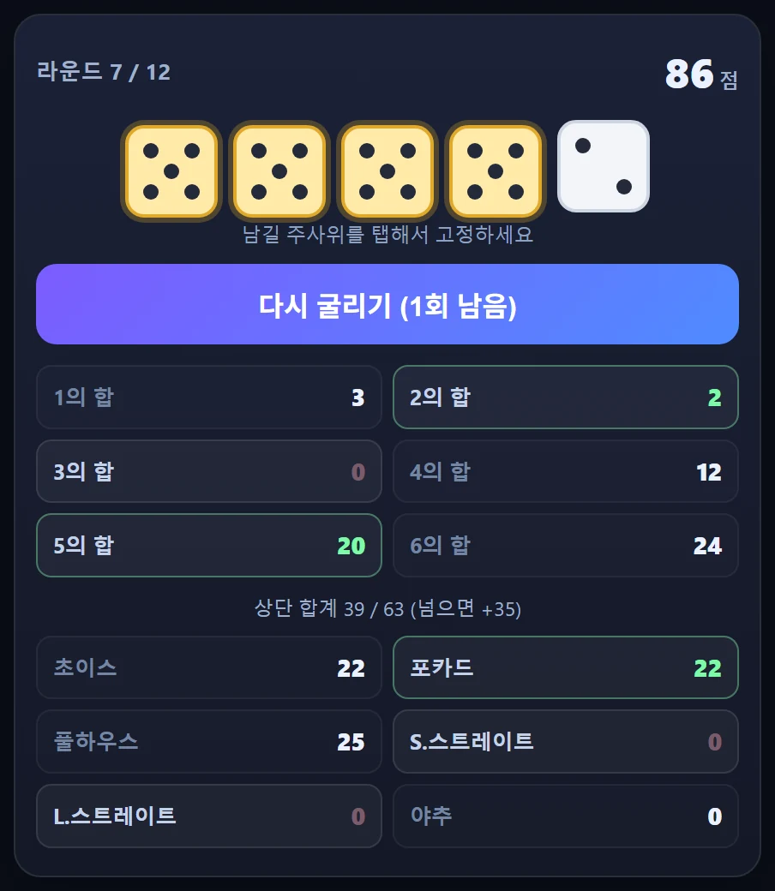
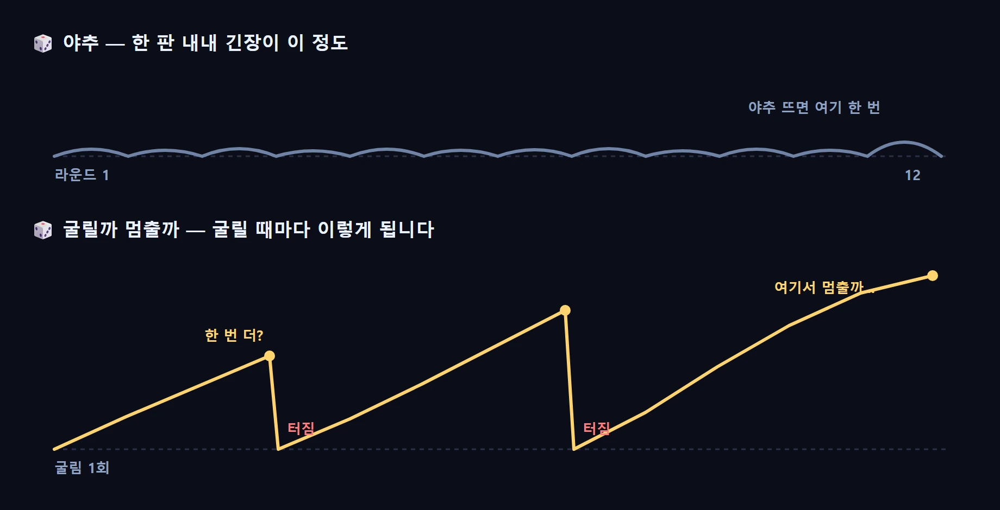
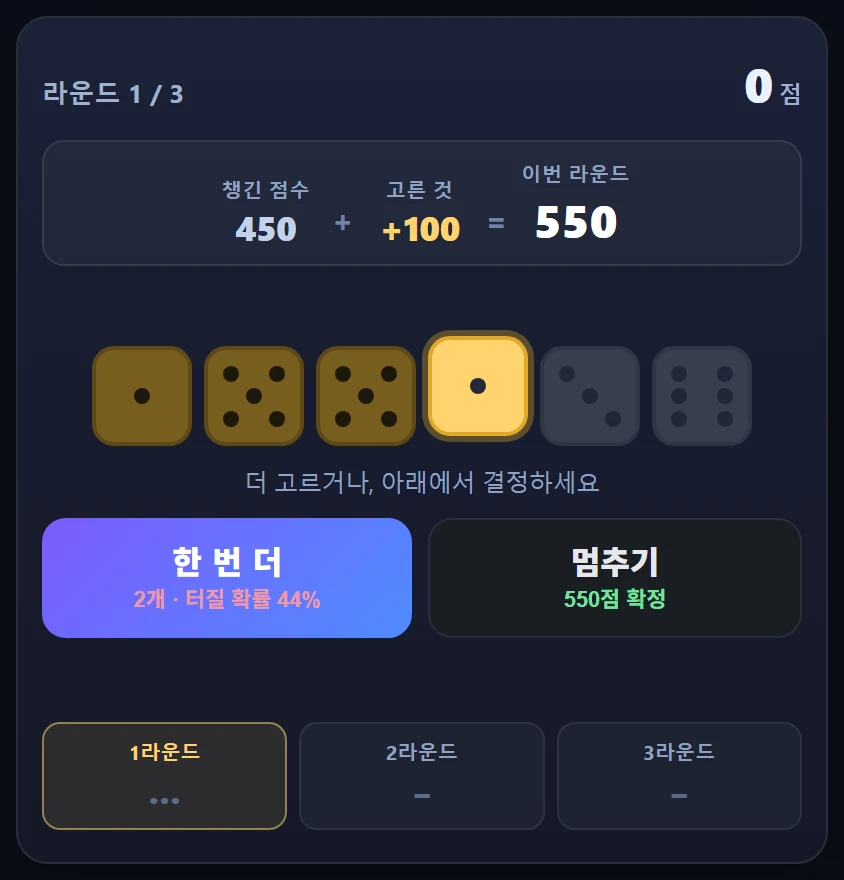

继[上一期](/p/ai-game-lab-build-9/)的奥德赛之后，我做了第十款游戏。**做了两次，两次都扔了。**

所以这一期没有新游戏。取而代之的是**两次退回来**的经过。

被扔掉的两个我没有删。游戏实验室的列表里看不到它们，但知道地址就能进。读到一半想试就点进去。

👉 **[第一个原型 — 今日骰子](/games/dice-yacht/)** · **[第二个原型 — 再来一次](/games/dice-push/)**

## 第十款本来打算完全不用图

到现在为止的游戏都用[ComfyUI](/p/claude-local-image-generation/)画的图。可图是有限的。画再多，总有一天会出现见过的那张，兴趣就是从那一刻开始掉的。

所以这次定的规矩是**不用图**。连骰子的点都用 CSS 的圆点画。这个判断我现在也认为是对的。

## 第一次 — 做完了，可我不想点开

我按快艇骰子（Yacht）的方式做的。五颗骰子最多摇三次，把十二个牌型填满。

它跑得很好。计分逻辑连边界情况一共验了十八种——四条、葫芦、大小顺子，加上奖励分和回合推进，全对。一个文件 21KB，一张图都没用。

然后我打开它——**手伸不出去。**

一开始我以为是说明不够。计分板上只写着`四条` `葫芦` `小顺子`。**要凑出什么才能拿到那个分，屏幕上哪儿都没写。** 那是只有已经懂这游戏的人才读得懂的界面。

可我把说明全都补齐之后，感觉一模一样。问题不在说明。

## 快艇骰子里没有紧张感

**没有可失去的东西。** 每回合必定拿到分然后往下走。就算划个零分，也只是进入下一回合。没有风险，就没有紧张。

**决定不是刺激，是作业。** 「五点合计20分，还是四条23分」不是让心跳加速的选择，是道算术题。存在最优解，熟了以后就机械地下了。

还有最要命的一点——**快艇骰子本来是一群人围着桌子边聊边玩的游戏。** 一半的乐趣来自人。一个人在手机上玩，那一半没了，剩下的只有**填表格**。

## 第二次 — 这回我用数字来调

推倒重做。同样是骰子，但改成每一刻都有决定的形式。

摇完只留下能得分的骰子，然后选：**再摇一次，还是停？** 如果摇出来一个能得分的都没有，**这一回合全部清零。**

这次我没凭感觉调，而是让自动玩家**每种策略跑3000局**：胆小（留一次就停）、谨慎（爆掉概率到30%就停）、贪心（撑到45%）、莽撞（摇到爆为止）。

五颗骰子时，**每回合平均只摇1.8次**。摇两下回合就结束，紧张根本来不及积累。**加到六颗，最优点就出现了。**

| 策略 | 平均分 |
|---|---|
| 胆小 | 1058 |
| **谨慎** | **1343** |
| 贪心 | 1082 |
| 莽撞 | 0 |

摇少了吃亏，摇多了也吃亏。正是我要的形状。

## 我的猜想又错了

回合还是觉得短，于是我想起 Farkle 的一条经典规则：**没攒够300分不许停。** 强制多摇几次，紧张感就会上去吧——我是这么以为的。

一测，正好相反。

| | 胆小 | 谨慎 | 差距 |
|---|---|---|---|
| 无下限 | 1058 | 1343 | **+27%** |
| 下限300分 | 1282 | 1321 | **+3%** |

下限没有增加紧张，而是**取消了决定**。它把所有人赶进同一种打法，于是打得好和打得差最后分数差不多。真放进去就毁了这游戏。

## 全都调好了，还是不好玩

我把概率直接写在按钮上。「再来一次 — 2颗 · 爆掉概率44%」旁边是「停下 — 锁定550分」。把概率摆出来，选择才真的成了选择。

然后我又打开它——**还是不好玩。**

到这里我停了。整套规则都换掉做了两次，两次都不中，那问题就不在规则，而在**类型**。

## 答案早就写在我自己做过的东西里

决定放弃之后，我才回头看了看做过的那些。

| 游戏 | 好玩的到底是什么 |
|---|---|
| 🗑️ [纸团投篮](/games/paper-hoop/) | 拉一下松手 → **看它飞出去** |
| 🎣 [深海钓鱼](/games/deep-fishing/) | 提竿那**一瞬间的手感** |
| 🪐 [宇宙进化](/games/space-merge/) | 一放下去就**炸开似地合体** |
| 🍰 [甜点叠塔](/games/stack-tower/) | **时机**卡得刚好 |

我最喜欢的那几个，全是**用手和眼睛玩的游戏**。结果在半秒内传到身上。

骰子——无论快艇还是 Farkle——都是**在脑子里判断数字的游戏**。屏幕上没有会动的东西。我做什么样的东西才玩得开心，早就写满了整个书架，偏偏只有我自己没在读。

## 「少用图」不知不觉变成了「画面不会动」

这次我给自己定的条件是**「少用图片素材」**。可做着做着，它悄悄变成了**「画面不动也行」**。

这两件事完全不同。**没有图片文件，和画面是静止的，是两回事。** 光靠图形和线条也能动得很充分，我却一次把两样都砍掉了。

做 vibe coding 时这种事一直在发生：**条件定得含糊，结果就会跑到最极端那一头。** 你说「少一点」，回来的是「干脆没有」。这次我一直到亲眼看见才察觉。

## 这期学到的

**好玩是测不出来的。**

前几期里，测量替我抓到了很多东西：[越合并空间越空](/p/ai-game-lab-build-6/)的结构性缺陷、[原来问题在对比度而不是背景](/p/ai-game-lab-build-8/)、[照着屏幕说的做反而会输](/p/ai-game-lab-build-9/)的关卡，都是数字告诉我的。这次测量也照样管用。平衡调好了，概率是准的，还抓住了一个错误的猜想。

**可这些都没能让它变好玩。**

数字能回答的只到*怎么做*。*做什么*是开测之前就得定下来的问题，而我在那里错了两次。

所以我要换个顺序。**以后先写一句话：「这个游戏的乐趣就在这一刻。」** 写不出这句话就不做。等做完了再问好不好玩，太晚了。扔掉两个才明白。

## 我重排了候选清单

我把候选里**所有靠脑子算的游戏整个拿掉了**。骰子、摆牌、心算，全删。换上**不用图也能让画面动起来的游戏**。

扔掉的两个我不觉得可惜。做过两次才知道**自己不该做什么**。做了九款都没弄明白的事，扔掉第十款反而学会了。

---

两个被弃的原型都还开着。想亲自确认哪里不好玩也可以。我自己觉得第二个总归比第一个强一些，但哪一个我都不想再打开了。

👉 **[今日骰子（第一个）](/games/dice-yacht/)** · **[再来一次（第二个）](/games/dice-push/)** · [看看整个AI游戏实验室](/games/)
