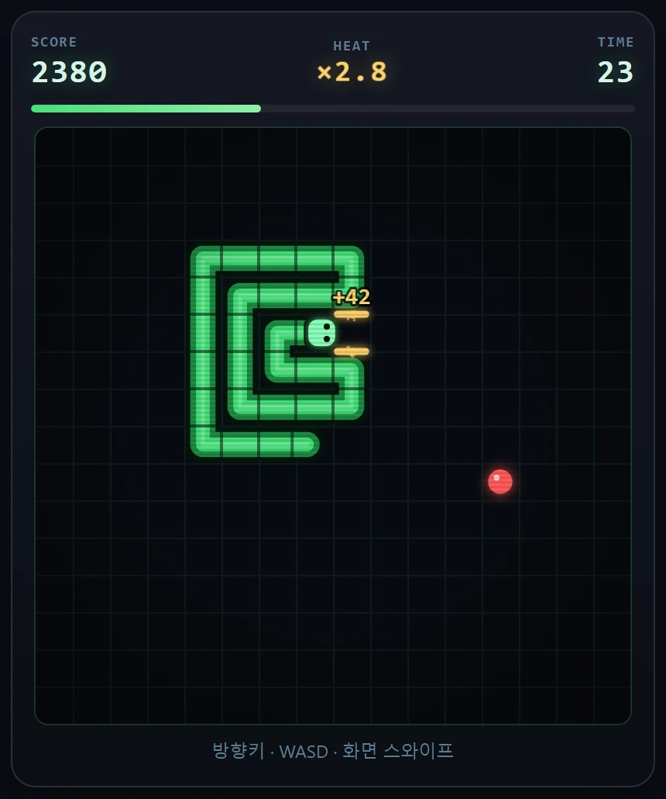
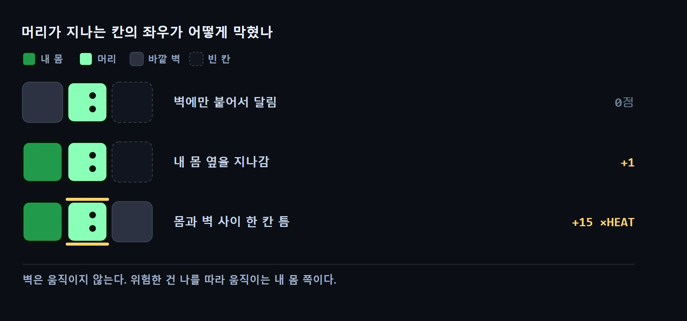

제가 만든 게임에서 제일 점수가 잘 나오는 방법은 **아무 데도 안 가고 테두리만 도는 것**이었습니다.

한 번도 안 부딪히고, 위험은 하나도 안 지고, **2,800점.** 제 설계는 정확히 그 반대였는데 말이죠.

## 뭘 만들었나

열 번째 게임으로 **60초 스네이크**를 만들었습니다. ([지난 편](/p/ai-game-lab-build-10/)에서 주사위 게임을 두 번 만들어 두 번 다 버리고 갈아탄 자리입니다.)

시간은 **60초로 고정**이고, 그 안에 최대한 높은 점수를 내면 됩니다. 부딪혀도 판이 끝나지 않아요. **몸만 처음 길이로 돌아간 뒤 1.2초 멈췄다가 이어집니다.** 시계는 그동안에도 흘러가고요. 그래서 잘하든 못하든 모두가 똑같이 60초를 씁니다.

규칙 하나만 보통 스네이크와 다릅니다. **먹이를 몇 개 먹었느냐가 아니라, 지금 지나간 칸이 얼마나 위험했느냐로 점수가 납니다.** 벽과 내 꼬리 사이 한 칸 틈을 스치고 지나가면 크게 들어오고, 트인 곳으로 편하게 돌면 0점이에요.

👉 **[60초 스네이크 하러 가기](/games/snake60/)**



이렇게 만든 이유는 두 가지였습니다. 스네이크는 **순수 실력 게임**이라 잘하는 사람이 항상 이깁니다. 하루 한 판씩 겨루는 형태에선 못하는 사람이 영영 못 이겨요. 그리고 **60초 안엔 몸이 별로 안 길어져서** 스네이크 특유의 조여드는 긴장까지 없습니다.

그래서 점수를 **"지나간 자리의 위험도"**로 옮겼습니다. 노린 건 하나였어요. **안전하게 돌면 점수가 안 나오게.**

## 그런데 봇을 풀어놨더니

밸런스를 눈대중으로 잡기 싫어서 **자동 플레이어**를 만들어 돌렸습니다. 겁쟁이, 먹이만 쫓는 놈, 위험하게 노는 놈, 무모한 놈. 각각 80판씩요.

결과가 이랬습니다.

> **테두리만 60초 뱅뱅 돌면, 한 번도 안 부딪히고 2,800점.**

"안전하면 점수가 없다"고 설계해놓고 **가장 안전한 길이 최고점**이 되어 있었습니다. 완전히 뒤집혀 있었어요.

원인은 한 줄이었습니다. 저는 위험을 **"옆이 막혔는가"**로 정의했는데, 처음엔 **바깥 벽도 막힌 면으로 셌습니다.**

**벽은 움직이지 않습니다.** 벽에 붙어 달리는 건 위험해 보이지만 실제로는 아무 일도 안 일어나요.

## 고쳤더니 더 얌전한 게 나왔습니다

그래서 **막힌 면에 내 몸이 하나는 있어야** 점수를 주도록 고쳤습니다. 벽만으로는 0점.

다시 돌렸더니 이번엔 순서가 맞게 나왔어요. 위험하게 노는 쪽이 겁쟁이보다 훨씬 높았습니다. 그런데 옆 칸 숫자가 이상했습니다.

| | 평균 점수 | **부딪힌 횟수** |
|---|---|---|
| "위험하게" 노는 플레이어 | 2,911 | **0.0번** |

위험하게 논다면서 **한 번도 안 부딪혔습니다.** 480칸 중 393칸에서 점수를 뽑으면서요.

자기 몸 옆에 **나란히 붙어 달리는 게 안정적인 자세**였던 겁니다. 몸이 뒤를 따라오니 옆은 계속 막혀 있는데, 부딪힐 일은 없어요. 벽 뺑뺑이를 막았더니 **몸 뺑뺑이**가 최적해가 됐습니다.

## 중간에 봇이 유령을 쫓기도 했습니다

한 번은 봇이 아무것도 안 하고 제자리를 돌길래 한 수씩 로그를 찍어봤습니다.

```
 8 머리=14,7  선택=왼쪽    옆막힘
 9 머리=13,7  선택=아래    옆막힘
10 머리=13,8  선택=오른쪽  옆막힘
11 머리=14,8  선택=위      옆막힘   ← 8수로 되돌아감
```

**네 칸을 뱅뱅** 돌면서 매번 "옆이 막혔다"고 판단하는데, 실제 점수는 0이었습니다.

게임이 아니라 **자를 잘못 만든 거였습니다.** 봇이 후보 칸의 위험도를 **"이동하기 전" 상태로** 재고 있었어요. 뱀은 앞으로 가면 꼬리가 빠져나갑니다. 그러니까 지금은 막혀 있어도 **도착할 때쯤엔 비어 있을 칸**을 막혔다고 세고 있었던 거예요. 있지도 않은 점수를 쫓아 제자리를 돌고 있었습니다.

로그를 안 찍었으면 멀쩡한 게임 쪽을 뜯어고쳤을 겁니다.

## 두 번 다 같은 착각이었습니다

벽 뺑뺑이와 몸 뺑뺑이에는 공통점이 있었습니다.

**둘 다 "따라오지 않는 것" 옆을 달리고 있었습니다.**

벽은 아예 안 움직입니다. 내 몸을 나란히 따라갈 때도, 몸은 **내 뒤를 그대로 복사해 따라올 뿐** 나를 향해 오지 않아요. 둘 다 옆이 막혀 있지만, **둘 다 나를 위협하지 않습니다.**

위험은 "막혀 있는가"가 아니라 **"내가 다음에 갈 자리를 누가 먼저 차지할 수 있는가"**에서 옵니다. 규칙을 이렇게 정리했습니다.

- 벽만 옆에 있음 → **0점** (벽은 나를 못 쫓아온다)
- 내 몸이 옆에 있음 → **+1** (붙어는 있지만 안정적이다)
- **몸과 벽 사이, 혹은 몸과 몸 사이 한 칸 틈** → **+15에 배수까지**

세 번째만 진짜 위험합니다. 한 칸만 틀어지면 죽고, 그 틈은 내가 움직이는 동안 **모양이 계속 바뀌니까요.**



이렇게 고치고 다시 재봤습니다.

| 전략 | 평균 | 최고 | 부딪힘 |
|---|---|---|---|
| 트인 곳만 달림 | 1,155 | 2,248 | 1.1번 |
| 먹이만 쫓음 | 1,949 | 3,788 | 1.0번 |
| **몸 옆 나란히** | **1,682** | 2,635 | 0.0번 |
| **좁은 틈 사냥** | 1,935 | **6,671** | 2.9번 |

나란히 달리기가 **그냥 잘 두는 것보다 낮아졌습니다.** 최고점은 틈 사냥이 독점하고요. 좁은 틈을 노린 이동 중 **열에 하나는 대가를 치릅니다.**

## 사람이었으면 못 찾았을 겁니다

이걸 봇으로 찾은 데는 이유가 있습니다. **봇에겐 부끄러움이 없거든요.**

사람은 테두리만 60초 도는 짓을 잘 안 합니다. 이길 수 있어도 안 해요. **"이렇게 이기면 재미없잖아"**라는 감각이 있으니까요. 제가 직접 백 판을 했어도 못 찾았을 겁니다. 저는 제 게임을 **제가 의도한 방식으로** 플레이했을 테니까요.

봇은 그런 게 없습니다. 점수만 봅니다. 재미없어도 이기면 그렇게 합니다.

나중에 찾아보니 게임 디자이너들 사이에선 오래된 이야기더군요. **기회만 주면 플레이어는 게임에서 재미를 최적화해 없애버린다**는 겁니다. 플레이어는 재미가 아니라 **이기는 걸** 최적화하니까요.

## 아직 하나쯤 더 있을 겁니다

두 개를 막았지만 다 막았다고 생각하진 않습니다. 첫 번째를 막았을 때도 다 됐다 싶었다가 두 번째가 나왔거든요.

**[60초 스네이크](/games/snake60/)** 한 판 해보시고 몇 점 나왔는지 알려주세요. 혹시 제가 아직 못 막은 지름길을 찾으시면 그것도요 — 바로 막겠습니다. 🐍

*다음 편은 새 게임을 들고 오겠습니다.*
