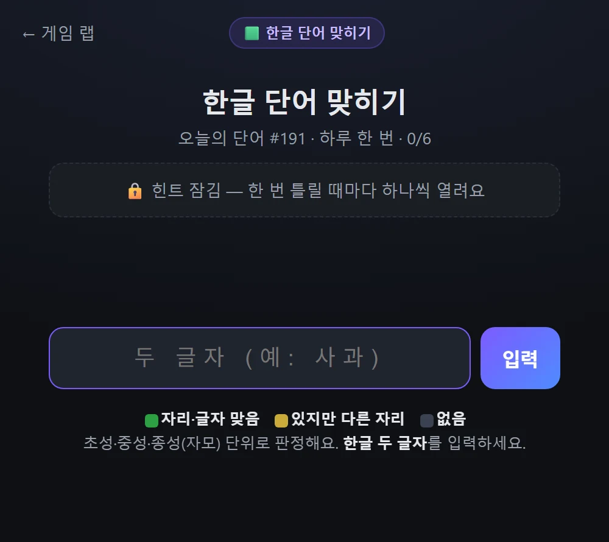
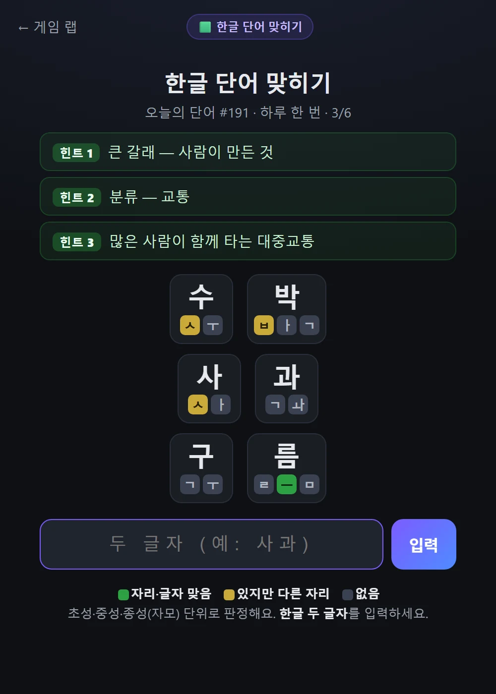

[지난 편](/p/ai-game-lab-build-1/)에서 "게임을 하나씩 계속 얹겠다"고 했으니, 약속대로 **두 번째 게임**을 만들었습니다. 이번엔 **한글판 워들** — 매일 두 글자 단어 하나를 맞히는 게임이에요.

👉 **[한글 단어 맞히기 하러 가기](/games/hangul-word/)**

## 워들이 뭐냐면

혹시 '워들(Wordle)' 아세요? 2022년 초에 전 세계를 휩쓴 단어 맞히기 게임이에요. 규칙은 단순합니다:

- 숨겨진 **다섯 글자 영어 단어**를 **여섯 번** 안에 맞힌다
- 한 번 추측할 때마다 글자마다 색으로 힌트를 준다 — 🟩(자리·글자 맞음) · 🟨(단어에 있지만 자리가 틀림) · ⬜(없음)
- **하루에 딱 한 단어.** 모두가 같은 문제를 풀고, 결과를 이모지 격자로 공유

이 "하루 한 문제 + 색 힌트" 조합이 은근히 중독적이라 한때 어마어마하게 유행했죠. 저는 이걸 **한글로** 만들어보고 싶었습니다.

## 한글로 워들을 만들면

영어는 알파벳을 한 칸씩 맞히면 되는데, 한글은 어떻게 할까요? 핵심은 **한글 한 글자가 자모로 쪼개진다**는 거예요.

- '버' = ㅂ + ㅓ
- '스' = ㅅ + ㅡ
- 받침이 있으면 셋 — '박' = ㅂ + ㅏ + ㄱ

그래서 영어 워들이 알파벳 칸을 색칠하듯, 한글 워들은 **초성·중성·종성(자모) 한 칸씩** 색칠해서 알려줍니다. 화면은 이렇게 생겼어요:

## 이렇게 플레이합니다

1. **오늘의 두 글자 단어**가 정해져 있어요 (하루 한 번, 모두 같은 문제)
2. 두 글자를 입력하면, 자모마다 색이 칠해집니다 — 🟩 자리까지 맞음 / 🟨 있지만 다른 자리 / ⬜ 없음
3. 이 색 힌트를 보고 좁혀가며 **여섯 번 안에** 맞히면 됩니다

예를 들어 정답이 '버스'일 때 '구름'을 넣으면, '름'의 ㅡ가 초록으로 뜹니다(정답 '스'의 ㅡ와 자리까지 일치). 이렇게 자모를 하나씩 맞춰가는 거예요:

## 막히면? 힌트가 하나씩 열립니다

여기가 이 게임에서 제일 공들인 부분이에요. 그냥 두 글자 맞히라고만 하면 시작 실마리가 없어서 너무 막막하고, 그렇다고 처음부터 설명을 다 주면 한 번에 맞혀버려서 싱겁더라고요. (사실 이 사이를 잡느라 몇 번을 갈아엎었습니다.)

그래서 이렇게 했어요: **시작은 힌트 없이. 한 번 틀릴 때마다 힌트가 하나씩, 점점 세게 열립니다.**

1. **큰 갈래** — "사람이 만든 것" (수십 개 중 하나, 거의 감 안 옴)
2. **분류** — "교통"
3. **설명** — "많은 사람이 함께 타는 대중교통"
4. **초성** — "ㅂ ㅅ"
5. **첫 글자** — "버_"

위 스크린샷에서 보드 위에 쌓인 초록 상자들이 그거예요(세 번 틀려서 세 개 열린 상태). 덕분에 **감 좋으면 힌트 없이 빨리 맞혀 고득점**, 막히면 틀릴수록 점점 좁혀지는 도움을 받습니다. 난이도를 플레이어가 스스로 조절하는 셈이죠.

## 그리고 결과 공유

맞히고 나면 결과가 `🟩🟨⬜` 이모지 격자로 만들어져서 한 번에 공유할 수 있어요. 정답은 안 보여주고 "몇 번 만에, 얼마나 헤맸는지"만 색으로 남기는 워들 방식 그대로입니다. 연속 출석과 누적 점수도 기기에 차곡차곡 쌓이고요.

---

그래서 지금 [게임 랩](/games/)엔 게임이 둘입니다 — 🎨 AI 그림 맞히기, 🟩 한글 단어 맞히기.

**[한글 단어 맞히기 한 판](/games/hangul-word/)** 해보시고, 오늘 단어 몇 번에 맞혔는지 · 힌트가 적당한지 알려주세요. "이 단어 힌트가 이상하다" 하는 게 있으면 바로 고칩니다. 🚀

*다음 편엔 세 번째 게임이나, 아니면 사람들이 실제로 하러 왔는지 이야기를 들고 오겠습니다.*
