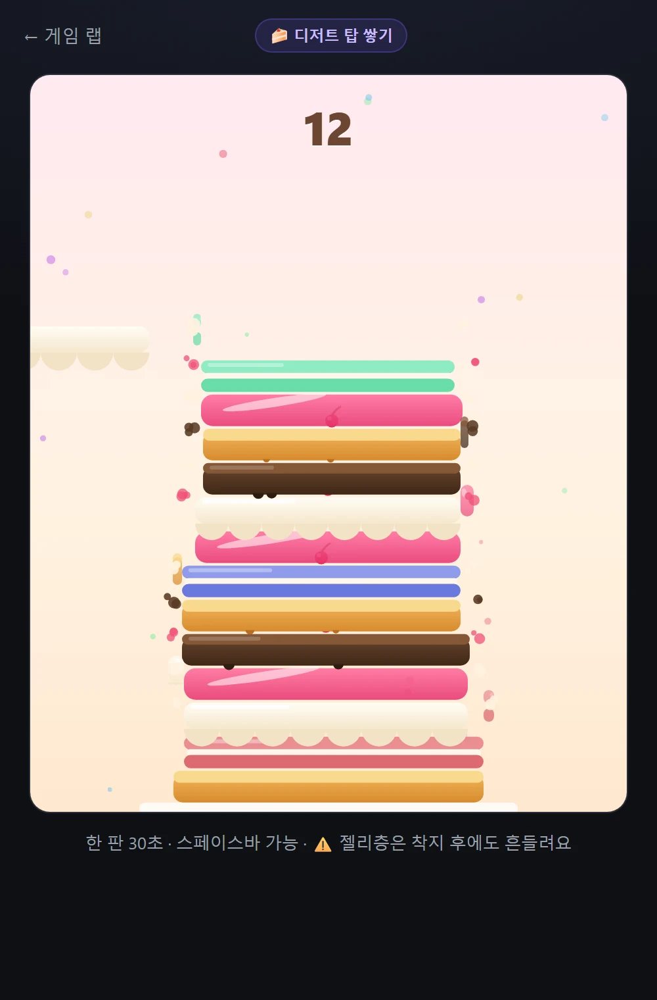
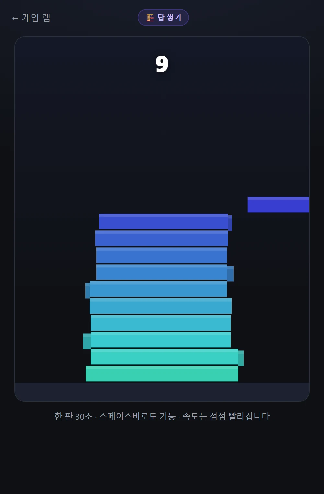
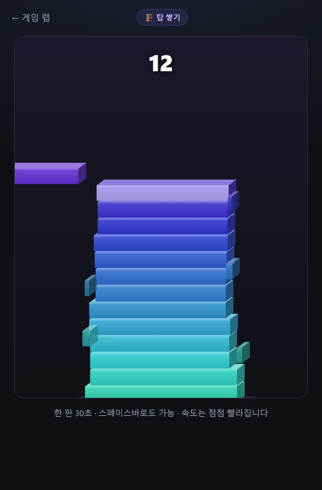

[지난 편](/p/ai-game-lab-build-2/)까지 만든 두 게임(그림 퀴즈, 한글 워들)을 놓고 보니 공통점이 있더라고요 — **둘 다 머리 쓰는 게임**입니다. 라이브러리에 퀴즈만 쌓이면 재미없죠. 그래서 세 번째는 완전히 반대로, 아무 생각 없이 순전히 **손맛**으로 하는 게임을 만들었습니다. 결과물은… **디저트 탑 쌓기**가 됐어요. 왜 "디저트"인지는 뒤에서 이야기하겠습니다.

👉 **[디저트 탑 쌓기 하러 가기](/games/stack-tower/)**

## '탑 쌓기' 장르가 뭐냐면

모바일 게임 좀 해보셨으면 'Stack'류 게임을 기억하실 거예요. 규칙은 이게 전부입니다:

- 블록이 **좌우로 왔다 갔다** 움직인다 → **탭하면 뚝** 떨어진다
- 아래 블록과 **겹친 부분만 남고**, 튀어나온 부분은 싹둑 잘려나간다
- 블록이 점점 좁아지다가, 완전히 빗나가면 끝 — **몇 층까지 쌓았나?**

배우는 데 30초, 한 판에 30초. 그런데 "한 판만 더"가 끝없이 나오는 마성의 장르죠.

## 이렇게 플레이합니다

1. 화면 **탭**(PC는 스페이스바) 한 번 = 디저트 낙하
2. 삐끗한 만큼 잘려서 탑이 점점 좁아집니다 — 착지할 때마다 크림이 찌익 튀고요
3. 오차 몇 픽셀 이내로 딱 맞추면 **PERFECT** — 안 잘리고, **체리나 딸기가 톡 하고 올라갑니다** (탑에 그대로 남아서, 퍼펙트 이력이 훈장처럼 쌓여요)
4. 연속 PERFECT면 좁아졌던 폭이 조금씩 **회복**됩니다 (실수해도 컴백 가능)
5. 올라갈수록 점점 빨라집니다. 점수 = 층수

팬케이크, 마카롱, 생크림, 초콜릿… 층마다 다른 디저트가 올라오는데, 문제는 —

## 젤리는 흔들립니다 🍮

몇 층마다 한 번씩 **젤리**가 나옵니다. 이 젤리, 착지한 뒤에도 탄성 때문에 **좌우로 부르르 흔들려요.** 그리고 다음 블록의 판정은 흔들리고 있는 **실시간 위치 기준**입니다. 흔들리는 젤리 위에 다음 디저트를 얹어야 하니, 타이밍을 완전히 빼앗기죠. 대신 그 위에 뭔가 얹히면 젤리는 그 자리에 눌려 고정됩니다. 이 게임의 시그니처 기믹이에요 — "아, 젤리다…" 하는 순간의 긴장감.

## 막대기가 마카롱이 되기까지

사실 이번 편의 진짜 이야기는 이겁니다. 이 게임, **세 번 변신했어요.**

**1차 — 색깔 막대기.** 로직을 다 만들고 첫 버전을 보여줬더니 돌아온 반응: *"좋은데, 탑 디자인이 너무 구리다."* …맞는 말이었습니다:

**2차 — 입체(2.5D).** 그래서 블록에 윗면·옆면을 붙여 입체로 갈아엎었습니다. 훨씬 나아졌죠:

**3차 — 디저트.** 그런데 여기서 "아예 디저트를 쌓으면 어때? 젤리는 흔들리고!"라는 아이디어가 나왔고 — 그 순간 이 게임이 흔한 Stack 클론에서 **자기 정체성이 있는 게임**으로 바뀌었습니다. 파스텔 배경, 케이크 스탠드, 시럽 드립, 퍼펙트 체리, 그리고 흔들리는 젤리까지. 위의 플레이 화면이 그 결과예요.

게임 로직은 처음부터 끝까지 그대로입니다. 바뀐 건 **그리는 코드와 콘셉트**뿐인데, 게임의 인상은 매번 완전히 달라졌어요. 만들면서 배운 것: 규칙이 게임의 뼈대라면, **콘셉트는 게임의 얼굴**이더라고요.

## 이제 게임이 셋 — 성격이 다 다릅니다

| | 게임 | 성격 |
|---|------|------|
| 🎨 | [AI 그림 맞히기](/games/guess-image/) | 머리 (퀴즈) |
| 🟩 | [한글 단어 맞히기](/games/hangul-word/) | 습관 (데일리) |
| 🍰 | [디저트 탑 쌓기](/games/stack-tower/) | 손맛 (아케이드) |

"비슷한 게임 모음"이 아니라, 이제야 [게임 랩](/games/)이 구색을 갖춘 느낌입니다.

---

**[디저트 탑 한 판](/games/stack-tower/)** 쌓아보시고 몇 층인지 알려주세요. 참고로 저는 젤리 위에서 자꾸 무너집니다. 🚀

*다음 편엔 네 번째 게임이나, 아니면 슬슬 "사람들이 실제로 하러 왔나" 성적표를 들고 오겠습니다.*
