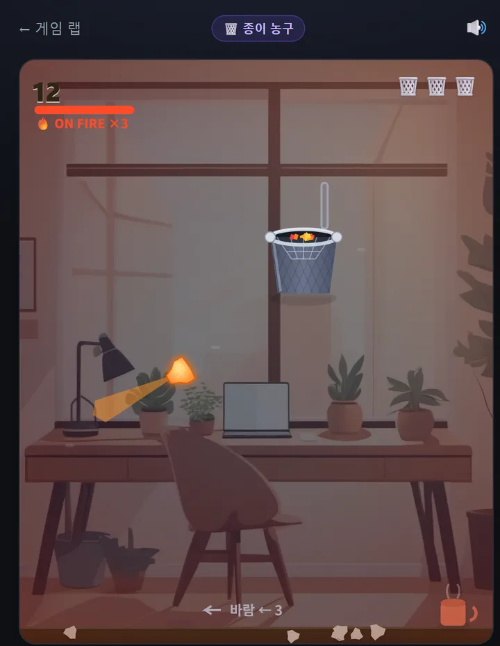

[지난 편](/p/ai-game-lab-build-4/)까지 게임 랩엔 네 개가 쌓였습니다 — 🎨 그림 퀴즈, 🟩 한글 워들, 🍰 디저트 탑, 🕹️ 낙하 회피. 다섯 번째는 **종이 농구**예요. 근데 이번 편은 좀 다릅니다. 새 게임을 하나 더 늘리기보다, **게임 하나를 "그냥 되는" 상태에서 "진짜 게임처럼"까지 다듬는 것**에 집중했거든요.

말보다 보는 게 빠르니 **플레이 영상**부터 👇



👉 **[종이 농구 직접 하러 가기](/games/paper-hoop/)**

## 어떤 게임이냐면

3초컷입니다:

- 구겨진 종이를 **화면 아무 곳이나 당겼다 놓아** 휴지통에 골인 (공을 안 짚어도 돼요)
- **가운데로 쏙 = 스월(2점)**, 림이나 백보드 맞고 들어가면 **뱅크(1점)**
- **바람** 주의! 연속 골인하면 **🔥 ON FIRE**(2배 점수)
- 3번 놓치면 끝. 점수는 누적·최고 기록·연속 출석까지 다른 게임처럼 쌓여요

## 처음엔 "게임 같지가 않았다"

솔직히 첫 버전은 별로였어요. 발사가 너무 빨라서 종이가 **번쩍 사라지는** 수준이라 손맛이 0이었죠. 그래서:

- 비행을 **2배 느리게**(궤적·난이도는 그대로, 보이는 속도만)
- **잔상 꼬리** + 바닥 그림자 + 빗나가면 **바닥에 튕기는** 마무리

이것만 넣었는데 바로 "오, 게임이네" 소리가 나왔습니다. **완성도의 8할은 손맛**이더라고요.

## 그다음 '고퀄'로 끝까지 밀어봤다

여기서 멈춰도 됐는데, 어디까지 되나 궁금해서 다 넣어봤어요:

- 🔊 **사운드** — 에셋 파일 **0개**. WebAudio로 발사 "휘익", 스월 "사악~", 뱅크 "통-딩"을 **코드로 합성**했습니다
- 🏀 **물리** — 좌우 림에 튕겨 덜덜거리는 **in&out**, 뒤 **백보드 뱅크샷**, 입구엔 **천 네트가 출렁**
- 🔥 **ON FIRE** — 연속 골인으로 게이지가 차고, 만렙이면 **공에 불붙고 2배** (NBA Jam 오마주)
- 🎯 **3점 라인** — 먼 통일수록 고득점. **백스핀(마그누스)**으로 궤적이 살짝 휘어요
- ✨ 그 외 히트스톱·카메라 펀치줌·리본 잔상 같은 자잘한 **연출 주스**까지

## 우리 집 그래픽카드가 배경을 그렸다

제일 좋아하는 부분이에요. 배경 사무실 일러스트를 **집에 있는 그래픽카드(ComfyUI/SDXL)로 직접 뽑아서** 깔았습니다. [예전에 노트북에 ComfyUI를 깔아둔 것](/p/claude-local-image-generation/)을 이렇게 써먹네요. 브라우저에서 바로 돌아가는 가벼운 게임인데도 배경은 손그림풍이죠. 여기에 **낮/밤 테마**까지 붙였어요.

## 오래 붙잡는 장치들

- 📅 **데일리 챌린지** — 날짜 시드라 그날은 **모두 같은 통·바람**. "오늘 몇 점?" 공유용
- 🏅 **업적** · 🖼️ **결과를 이미지 카드로 공유** · ▶️ **베스트 샷 리플레이**
- ♿ **접근성** — 멀미 방지(모션 축소 존중), 색약 안전 파워 표시

## 마지막에 배운 것: 작은 UX가 게임을 살린다

다 만들고 플레이하다가 치명적인 걸 발견했어요. 슬링샷이 **공(좌하단 구석) 기준**이라 뒤로 당길 공간이 없었던 거예요. 그래서 **"화면 아무 곳이나 짚고 상대적으로 당기기"**로 바꾸니 완전히 달라졌습니다. 화려한 기능 20개보다 **이 한 줄짜리 조작 수정**이 체감이 훨씬 컸어요.

## 이제 게임 랩이 5개

| | 게임 | 성격 |
|---|------|------|
| 🎨 | [AI 그림 맞히기](/games/guess-image/) | 머리 (퀴즈) |
| 🟩 | [한글 단어 맞히기](/games/hangul-word/) | 습관 (데일리) |
| 🍰 | [디저트 탑 쌓기](/games/stack-tower/) | 손맛 (아케이드) |
| 🕹️ | [낙하 회피](/games/dodge/) | 반사신경 (액션) |
| 🗑️ | [종이 농구](/games/paper-hoop/) | 조준 (물리) |

머리·습관·손맛·반사신경·조준 — [게임 랩](/games/)이 5색이 됐습니다.

---

**[종이 농구 한 판](/games/paper-hoop/)** 하고 몇 점인지 알려주세요. 스월로 3연속 넣으면 불붙습니다. 🔥

*다음 편엔 여섯 번째 게임을 들고 오겠습니다.*
