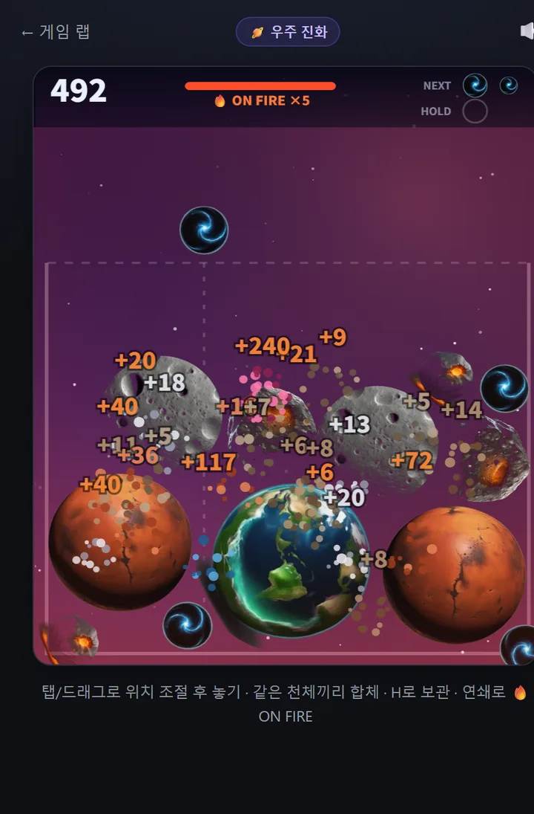
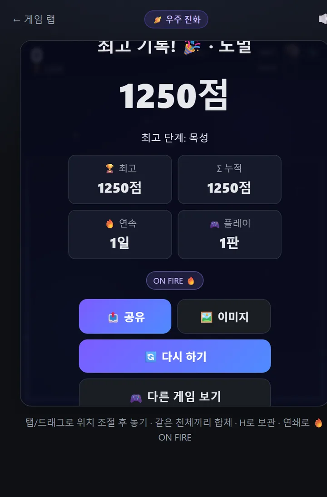

After the paper hoop in [the last post](/p/ai-game-lab-build-5/), game number six is **Space Merge** — a drop-and-merge puzzle where matching bodies fuse and evolve one step at a time. You start at ✨dust and work your way up to a 🌌galaxy.

The real story this time isn't the game itself, it's **how I fixed "it's too easy."** Short version: I didn't tune it by feel. **I ran simulations.**



👉 **[Go play Space Merge yourself](/games/space-merge/)**

## What it is

- **Tap to drop a celestial body.** When two matching ones touch, they **fuse and evolve**
- ✨dust → ☄️meteor → asteroid → 🌑moon → Mars → 🌍Earth → Jupiter → 🪐Saturn → brown dwarf → ⭐star → 🌌**galaxy** (11 tiers)
- Merge in quick succession for **🔥ON FIRE** (double points); stash one in **HOLD** for later
- Overflow the container and it's over. The 📅**daily challenge** gives everyone the same sequence that day

## The graphics card in my house painted the planets

All 11 sprites came out of [the ComfyUI setup I installed a while back](/p/claude-local-image-generation/). But generating them was only half the job:

- Some came back on grey backgrounds, so clipping them to circles left a **grey plate around each body** → I auto-detected the background color, made it **transparent**, and re-cropped tight to the object
- The moon had a **crescent shadow** that made it the odd one out → regenerated with "flat front lighting" (took three tries)
- One image had **four Marses** in it; Jupiter came with background flames attached, so I zoomed the crop in further

Turns out **half the work is reshaping what the AI gives you** to fit the game.

## "Too easy" — caught with numbers, not vibes

After the first build, the feedback was "isn't this a bit easy?" Normally I'd nudge some values and hope. This time I **made the game play itself and measured**. I ran a player that drops at random and one that drops near matching bodies, many games each.

The result was startling:

> **Even dropping completely at random, it reached the 9th tier every single game, and a run lasted 156 drops.**

The cause showed up in the numbers too. **Every merge was freeing up 22% of the space.** I'd set each tier's radius to grow 1.25×, but then two bodies (area 2) fuse into something with area 1.56. Which means **the container empties out as you merge** — it could never fill up. To conserve area the growth needs to be √2 ≈ 1.41×.

## I ran all 12 combinations and picked one

I simulated **12 configurations** across radius growth, container size, and drop distribution, then picked the best. Two criteria: *a run shouldn't drag on*, and *a good player should clearly outscore a careless one*.

| | Random play | Top tier reached |
|---|---|---|
| Before | ended after 156 drops | tier 9 |
| **After** | **63 drops** | **tier 6** |
| **Hard** | **48 drops** | **tier 5** |

One fun detour: on hard, the "strategic" player somehow scored *worse* than the random one. I bumped the sample from 3 games to 8, re-ran it, and it was **just noise**. Had I tuned on 3 games, I'd have fixed the wrong thing.

## Hard mode needs THREE to merge

I split difficulty into easy/normal/hard — and **hard changes the rule itself**: you need **three** touching bodies to fuse, not two. Triple Town style. That single change makes scores drop to a quarter.

Under the hood it groups all touching same-tier bodies into one cluster and fuses when the cluster hits three, so a line or a triangle both work — they just have to be touching.

## What I took away

**"Is it fun?" is taste, but "is it too easy?" is measurable.** Let the game play itself for a few runs and you get numbers; fix against the numbers and you're faster and more accurate. That's how I found the **"merging frees up space"** flaw — something I would never have spotted by just playing.

## The game lab is now six

| | Game | Vibe |
|---|------|------|
| 🎨 | [Guess the AI Image](/games/guess-image/) | Brain (quiz) |
| 🟩 | [Korean Word Guess](/games/hangul-word/) | Habit (daily) |
| 🍰 | [Dessert Stack](/games/stack-tower/) | Timing (arcade) |
| 🕹️ | [Dodge](/games/dodge/) | Reflex (action) |
| 🗑️ | [Paper Hoop](/games/paper-hoop/) | Aim (physics) |
| 🪐 | [Space Merge](/games/space-merge/) | High score (merge puzzle) |

---

**[Play a run of Space Merge](/games/space-merge/)** and tell me how far you got. I still haven't seen the **galaxy**. 🌌

*Next time: either a seventh game, or a report card on whether anyone actually showed up to play.*
