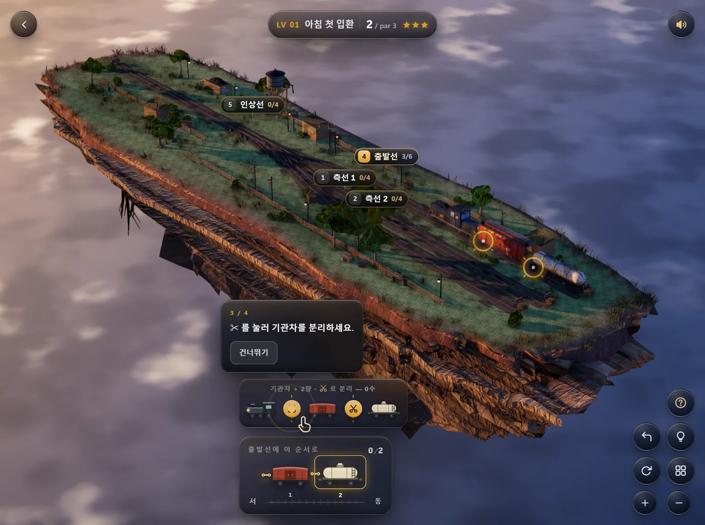
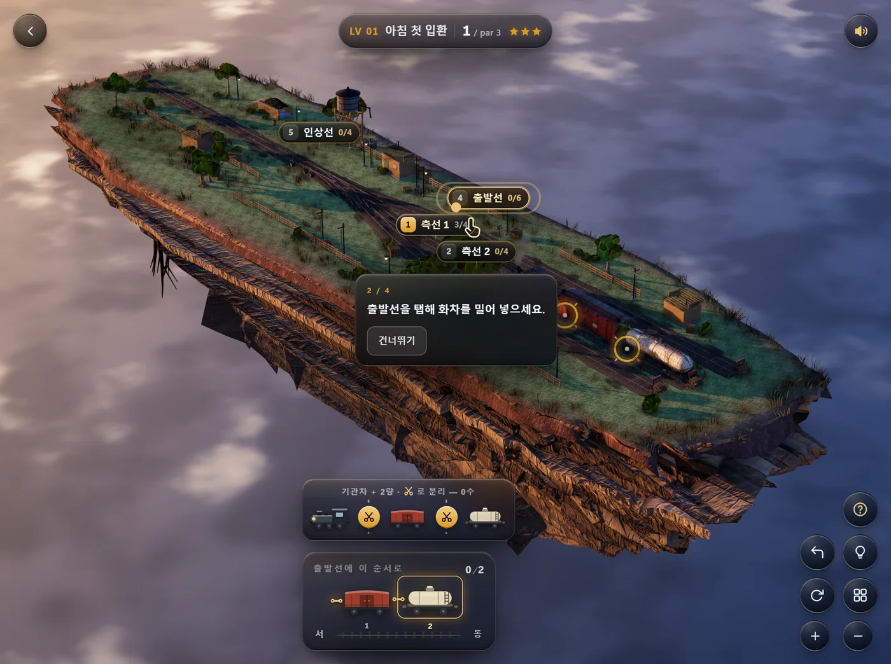
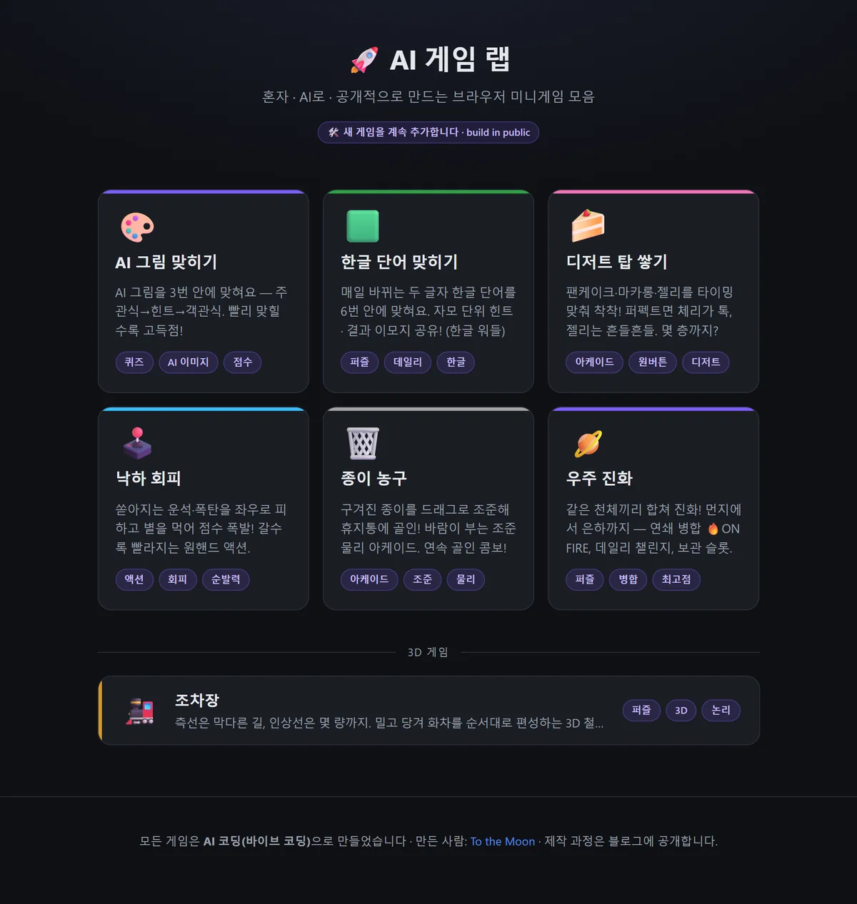

[지난 편](/p/ai-game-lab-build-6/)의 우주 진화에 이어, 일곱 번째 게임은 **조차장**입니다. 화차를 밀고 당겨 정해진 순서로 열차를 편성하는 3D 퍼즐이에요. 🚂

👉 **[조차장 직접 하러 가기](/games/shunting/)**

이번 편은 게임 소개보다 **만드는 과정에서 크게 헤맨 이야기**가 절반입니다. AI 에이전트를 60명 넘게 붙였는데 점수가 오히려 내려간 라운드가 있었고, 그 원인이 제가 예상한 것과 전혀 달랐거든요.

## 시작은 남이 만든 게임을 본 것

7월 말에 **클로드 오브 듀티(Claude of Duty)** 소식을 봤습니다. Matt Shumer가 Claude Opus 5에 프롬프트 하나를 던져서 브라우저 FPS를 통째로 받아냈다는 것이었습니다. Three.js와 WebGL2로 돌아가고, 약 55,000줄에 11개 서브시스템, 그리고 **외부 에셋이 하나도 없습니다**. 텍스처도 메시도 사운드도 전부 코드가 런타임에 만듭니다. 공개 5일 만에 깃허브 별 2,381개가 붙었습니다.

부러웠다기보다 **되는지 궁금했습니다.** 저도 해보고 싶었습니다.

다만 FPS를 따라 만들 생각은 없었습니다. 같은 걸 하나 더 만드는 건 의미가 없고, 무엇보다 저는 총 쏘는 게임을 잘 모릅니다. 그래서 소재를 찾다가 네이버 블로그에서 게임 광고를 하나 봤습니다. 주차장에 차가 빽빽하게 들어차 있고 화살표로 빼내는, 흔한 모바일 퍼즐 광고였습니다.

저게 무슨 장르인지 물어봤더니 언블록 퍼즐(러시아워 계열)과 소트 퍼즐이 한 광고에 섞여 있는 거라고 하더군요. 그래서 "주차 말고 다른 형태로 5개만 뽑아봐라"고 했습니다. 조차장, 광선 미로, 나사 풀기, 엘리베이터 배차, 실타래 풀기가 나왔습니다.

**조차장**을 골랐습니다. 국내 브라우저 게임에 거의 없는 소재였고, 물리 엔진 없이 순수 로직으로 끝나는 게 마음에 들었습니다.

미술 방향은 "떠 있는 디오라마"로 잡았습니다. 조차장이 땅에서 뜯겨 나온 흙덩이 위에 얹혀 하늘에 떠 있습니다. 위는 잔디와 자갈, 아래는 암반 지층과 늘어진 뿌리. 카메라 화각을 24°로 좁게 잡아서 실제 크기의 세계가 아니라 **손바닥에 올려놓은 모형처럼** 보이게 했습니다. 맨 위 표지 이미지가 그 결과입니다.

## 던진 프롬프트

이게 전부입니다. 이 다음부터는 에이전트들이 알아서 했습니다.

> 조차장 아이디어를 가지고 해당 분야 최고의 게임을 만들어 달라.
>
> 모든 면에서 완벽하고 **시각적으로 아름다워야** 하며, 텍스처부터 물리 효과를 비롯해 생각할 수 있는 모든 요소를 **AAA급 품질**로 구현해야 합니다. 여러 하위 에이전트를 병렬로 투입하고, 각 에이전트가 개별 요소를 하나씩 담당하게 하여 게임을 완벽하게 만들어 주세요. 각 요소를 반복해서 개선하고, **별도의 하위 에이전트가 시각적으로 검토**하여 AAA급 품질에 도달했는지 확인하게 하세요. 검토 에이전트는 **매우 엄격하게** 평가해야 하며, 결과물이 **AAA급으로 보이지 않는다면** 만족할 때까지 계속 개선해야 합니다.
>
> 각 하위 에이전트가 실제 `oskarstalberg.com/Townscaper` 나 `krunker.io` 이런 게임들과 비교했을 때 그 품질에 완전히 감탄할 때까지 멈추지 마세요. **실제 게임 화면과 나란히 놓고 블라인드 테스트**를 진행하여 어느 쪽이 더 좋아 보이는지 판단할 수 있을 정도여야 합니다. 구현 방법에 제한은 없고 현재 PC의 모든 자원을 이용해도 좋으니 완벽해질 때까지 반복해서 개선하세요. 하위 에이전트들을 병렬로 적극 활용하고 최고 수준의 코딩 역량을 투입하세요. 이 개발에 필요한 모든 권한을 승인한다.

읽어보면 아시겠지만 이 프롬프트에서 품질을 가리키는 단어는 **전부 보는 것에 관한 것**입니다. 시각적으로 아름답게, 시각적으로 검토, 아름답게 보이지 않는다면, 나란히 놓고 어느 쪽이 더 **좋아 보이는지**.

"플레이할 수 있어야 한다"는 말은 한 번도 없습니다. 이 사실이 나중에 정확히 그대로 돌아옵니다.

## 어떤 게임인가

조차장은 화물열차를 재배열하는 곳입니다. 도착한 화차를 목적지별로 갈라서 다시 편성합니다. 이 작업을 **입환(入換, shunting)** 이라고 부릅니다.

게임은 그걸 그대로 옮겼습니다. 화면 아래에 주문서가 있습니다. "출발선에 이 순서로" — 유개차, 유조차, 호퍼차. 측선에 흩어진 화차를 그 순서대로 출발선에 세우면 클리어입니다.

<video src="play.mp4" poster="poster.webp" autoplay muted loop playsinline controls preload="metadata" style="width:100%;max-width:960px;border-radius:12px;display:block;margin:1.4rem auto 0.6rem;"></video>

*첫 레벨 클리어 전체(3배속). 측선으로 가서 물고 → 출발선에 밀어 넣고 → 분리하고 → 기관차만 빠져나옵니다. 3수.*

조작은 **두 가지뿐**입니다.

**선로를 탭한다.** 기관차가 그 선로로 갑니다. 도착하면 거기 서 있던 화차 **전부와 자동으로 연결**됩니다. 이게 1수입니다.

**연결기를 자른다.** 편성 어디서든 끊을 수 있습니다. 끊긴 뒤쪽은 그 자리에 남고, 기관차는 앞쪽만 데리고 갑니다. **수를 소모하지 않습니다.**

끝입니다. 밀기 버튼도, 당기기 버튼도, 속도 조절도 없습니다.

## 규칙은 두 개뿐인데 왜 어려운가

측선은 **막다른 길**입니다. 한쪽 끝에 차막이가 있어서 드나드는 문이 하나뿐입니다. 자료구조로 말하면 **스택**입니다. 먼저 넣은 화차가 가장 안쪽에 갇히고, 꺼낼 때는 나중에 넣은 것부터 나옵니다.

그래서 순서를 바꾸려면 **다른 측선을 임시 보관소로 써야 합니다.**

두 번째 레벨이 이 개념만 가르칩니다. 이름은 "거꾸로 선 두 량"입니다.

```
시작:   측선1 │ 🟥 🩶            목표:   출발선 │ 🩶 🟥
```

빨강과 회색이 순서대로 서 있는데 주문서는 반대입니다. 그냥 물고 가서 놓으면 순서가 그대로입니다. 하나를 다른 측선에 잠시 내려놓고, 다른 하나를 먼저 출발선에 넣고, 내려놓은 걸 다시 가져와야 합니다. 이게 **par 5**입니다.

여기에 제약이 하나 더 붙습니다. **인상선(引上線)** — 측선 사이를 오갈 때 반드시 거쳐야 하는 짧은 선로입니다. 여기 들어갈 수 있는 량 수가 정해져 있습니다.

8레벨부터 이 값이 3으로 조여집니다. 화차 5량을 한꺼번에 끌고 나올 수 없다는 뜻입니다. **나눠서 옮겨야 합니다.** 이때부터 난이도가 확 오릅니다.

그리고 마지막 한 가지. 화차를 다 놓아도 **기관차가 출발선에 남아 있으면 끝나지 않습니다.** 실제 철도에서 기관차를 분리하고 되돌아가는 동작이라 그렇게 만들었는데, 이게 나중에 문제가 됩니다.


*선로마다 번호·이름·현재량/용량이 붙어 있고, 하단 편성 바에서 가위(✂)로 원하는 지점을 자릅니다.*

## 14개 레벨

레벨은 손으로 짰고, 각 레벨의 **par(최소 이동 수)는 전부 탐색으로 검증**했습니다. 하드코딩한 값과 실제 최적해가 하나도 어긋나지 않습니다.

| 구간 | 화차 | par | 가르치는 것 |
|---|---|---|---|
| 1~3 | 2~3량 | 3~6 | 조작, 후입선출, 부분 분리 |
| 4~7 | 4~5량 | 6~9 | 측선 3개 활용 |
| 8~11 | 5~6량 | 10~13 | 인상선 3량 제약 |
| 12~14 | 6~8량 | 14~19 | 측선 용량 비대칭 |

이름도 붙였습니다. 아침 첫 입환, 거꾸로 선 두 량, 자갈 열차, 짧은 인상선, 노을 진 조차장, 막차 준비, 야간 조성, 마지막 열차. **시간대가 아침에서 밤으로 흐릅니다.** 뒤로 갈수록 해가 지고 마지막 레벨들은 가로등이 켜진 밤입니다.

풀이가 막히면 힌트가 최적 경로의 다음 한 수를 알려줍니다. 최적임을 보장하려고 매번 탐색을 돌리는데, 마지막 레벨(8량)에서 1.5초가 걸렸습니다. 게임이 멈춘 것처럼 보입니다. 상태를 정수로 인코딩하고 역방향 인덱스를 캐싱해서 **최대 블로킹을 7.9밀리초로** 줄였습니다.

## 에셋 0개로 만들기

클로드 오브 듀티에서 제일 인상적이었던 게 이 부분이라 그대로 따라 했습니다. 이미지 파일도, 사운드 파일도, 3D 모델 파일도 없습니다. **전부 코드가 만듭니다.**

**텍스처.** 자갈은 보로노이 셀을 깔고 셀마다 밝기를 흩뜨립니다. 침목은 방향성 노이즈로 나뭇결을 내고 능선 노이즈로 갈라짐을 넣습니다. 화차 도장은 베이스 컬러 위에 패널 라인·용접 비드·리벳 격자를 높이맵으로 얹고, 모서리에서 페인트가 벗겨져 프라이머와 녹이 드러나게 하고, 리벳에서 녹물이 아래로 흘러내리게 하고, 하단 30%에 흙먼지를 깝니다. 이 높이맵을 소벨 필터로 미분해 노멀맵을 뽑습니다.

**지오메트리.** 레일은 실제 59kg 레일 단면(넓은 저부 → 잘록한 복부 → 버섯 머리)을 그려서 선로 곡선을 따라 압출합니다. 분기기는 텅레일·크로싱·가드레일·전환간까지 실제 부품으로 만들어서 전환할 때 블레이드가 움직입니다. 화차는 6종인데 **색을 지워도 실루엣만으로 구별**되게 했습니다.

**소리.** 연결 충격음은 노이즈 버스트를 340Hz·820Hz·1900Hz 밴드패스 세 개에 병렬로 통과시켜 금속 공진을 만들고, 60Hz 사인 감쇠로 저역 '쿵'을 얹습니다. 디젤 엔진은 톱니 오실레이터 스택에 실린더 발화 리듬을 진폭 변조로 걸었습니다. 15종을 이렇게 합성했습니다.

의존성은 **Three.js 하나**뿐이고 그마저 파일 하나로 넣어뒀습니다. 빌드 스텝이 없습니다. HTML 파일을 열면 그냥 돕니다.

**움직임**에도 공을 들였습니다. 연결기마다 유격이 있어서 기관차가 출발하면 뒤 차량이 자기 앞 유격이 다 풀린 뒤에야 끌려옵니다. 정지할 때는 반대로 뒤에서부터 밀려와 닫힙니다. 파도가 편성을 타고 흐릅니다.

## 그런데 3라운드가 수렴하지 않았다

여기까지가 의도였습니다. 실제로는 이랬습니다.

설계 문서를 쓰고 에이전트 13명에게 모듈을 하나씩 맡겨 동시에 짰습니다. 약 24,000줄이 나왔습니다. 그다음 "매우 엄격한 아트 디렉터" 심사 에이전트를 붙여 통과할 때까지 고치고 다시 심사받는 루프를 돌렸습니다.

3라운드, 에이전트 33명 투입. 점수는 이렇게 움직였습니다.

```
1라운드  4.18 / 10
2라운드  4.92
3라운드  4.50   ← 오히려 내려감
```

### 심사위원 3명이 똑같이 오진했다

세 라운드 내내 반복된 지적이 있었습니다.

> "그림자가 없다. 앰비언트 오클루전이 화면에서 사라졌다. 물체가 전부 떠 보인다."

그래서 3라운드 내내 AO 반경과 그림자 bias를 만졌습니다. 점수는 안 올랐습니다.

이상해서 직접 계측했습니다. 기능을 껐다 켜면서 화면이 얼마나 바뀌는지 픽셀 단위로 셌습니다.

| 토글 | 변화 픽셀 | 최대 차이 |
|---|---|---|
| SSAO 끔 → 켬 | 19.9% | 164 |
| 그림자 끔 → 켬 | 12.5% | 248 |

**둘 다 멀쩡히 돌고 있었습니다.**

진짜 원인은 최종 합성의 톤 커브였습니다. 히스토그램을 재보니 `p99 = 179`, 클리핑 0.000%. 씬에서 **가장 밝은 픽셀이 70% 회색**이었습니다. 순백이 없으니 AO와 그림자가 만든 대비가 전부 뭉개진 것입니다.

심사위원들은 **증상은 정확히 봤지만 원인을 틀렸습니다.** 저는 그 진단을 그대로 브리핑에 넣어 33명을 엉뚱한 곳으로 보냈습니다.

### 그리고 아무도 게임을 해보지 않았다

시각 심사를 마치고 게임을 열었습니다. 첫 반응이 이랬습니다.

> "게임 방법을 모르겠는데"

이어서 "클리어 방법이 뭔데", "기관차를 어떻게 빼는데", "미션이 뭐였는데".

화면 텍스트를 전부 덤프해봤습니다.

```
LV 01 | 아침 첫 입환 | 0 / par 3 | 편성 목표 | 0/2 | 서 동
```

**규칙이 어디에도 없었습니다.** 레벨 힌트 텍스트는 데이터에 있었고 튜토리얼 함수도 구현돼 있었는데, 화면까지 오지 못했습니다.

심사 에이전트 9명이 3라운드에 걸쳐 12개 축으로 채점했습니다. 형태, 재질, 텍스처, 라이팅, 그림자, AO, 색, 구도, 환경, 포스트, UI, 통일감. **UI 축에서 6~7점을 줬습니다.**

아무도 "규칙을 모르는 사람이 이걸 플레이할 수 있나"를 묻지 않았습니다.

여기서 앞의 프롬프트로 돌아갑니다. 저는 "시각적으로 검토하라"고 했고, "AAA급으로 보이지 않는다면 계속 개선하라"고 했습니다. **에이전트들은 정확히 시킨 대로 했습니다.** 12개 축은 그 프롬프트를 충실히 옮긴 것이었고, 그래서 12개 축 전부가 보는 것에 관한 것이었습니다.

빠진 건 에이전트의 성실성이 아니라 **제 질문**이었습니다.

검증 방식을 바꿨습니다. 소스 코드 열람을 금지한 "처음 보는 플레이어" 에이전트를 붙였습니다. 화면 스크린샷과 화면 텍스트만 보고 실제로 클리어해야 통과. 붙이자마자 진짜 문제가 쏟아졌습니다.

- 화차 분리가 3D 공간의 10px짜리 투명한 구를 클릭하는 게 유일한 방법이었습니다. 모바일에선 불가능합니다.
- 숫자키 매핑이 레벨마다 바뀌었습니다. 어떤 레벨에선 `4`가 출발선인데 다른 레벨에선 인상선이었습니다.
- "기관차를 빼야 끝난다"는 규칙을 알려주지 않아 화차를 다 놓고도 막혔습니다.

고친 뒤 붙인 테스터 2명은 소스 없이 3개 레벨을 전부 클리어했습니다. 한 명은 par로 풀었습니다.


*단계별 코치 카드. 손가락 커서가 다음에 누를 곳을 짚고, 건너뛰기 버튼이 항상 있습니다.*

## 결과

병목을 계측으로 가르고 나니 나머지는 기계적이었습니다.

| | 전 | 후 |
|---|---|---|
| 모바일 fps (중급 폰) | 6.9 | 약 26 |
| 드로우콜 | 2,670 | 280 |
| 품질 전환 정지 | 10,299ms | 500ms |
| 힌트 응답 | 499ms (그마저 오답) | 7.9ms |
| 줌 한 칸 | 거리의 0.12% | 10% |

드로우콜이 2,670이었던 이유는 풀 뭉치 227개와 잡초 206개가 **개별 메시**로 흩어져 각각 본 패스와 그림자 패스로 두 번씩 그려졌기 때문입니다. 인스턴싱으로 묶으니 280이 됐습니다.

여기서도 계측이 방향을 정했습니다. 해상도를 4분의 1로 줄여도 fps가 안 올랐습니다. 픽셀이 아니라 CPU 문제라는 뜻이었고, 그래서 후처리가 아니라 드로우콜을 팠습니다.


*미니게임과 결이 달라서 구분선 아래에 가로로 길게 따로 놓았습니다.*

## 개발 후기

**만드는 데 든 시간보다 진단하는 데 든 시간이 훨씬 길었습니다.** 24,000줄이 나오는 데는 반나절이 안 걸렸습니다. 그런데 "왜 안 예쁜가"를 알아내는 데 사흘이 걸렸고, 그중 이틀은 틀린 진단을 좇느라 썼습니다.

에이전트를 많이 붙이면 빨라집니다. 그건 사실입니다. 13명이 동시에 짜서 하루 만에 게임 하나가 나왔습니다. 문제는 **틀린 방향으로도 똑같이 빨라진다**는 것입니다. "그림자가 없다"는 오진 하나로 33명이 사흘 치 작업을 엉뚱한 곳에 쏟았습니다. 사람 혼자였으면 세 번째 시도쯤에 "이상한데?" 하고 멈췄을 텐데, 에이전트는 시킨 대로 끝까지 갑니다.

**그래서 계측이 전부였습니다.** 이 프로젝트에서 잘 풀린 순간은 전부 제가 직접 숫자를 재서 브리핑에 넣었을 때였습니다. "AO를 켜고 끄면 화면의 19.9%가 바뀐다", "해상도를 1/4로 줄여도 fps가 안 오른다" — 이런 문장 하나가 들어가면 한 라운드에 해결됐습니다. 반대로 "화면이 칙칙해 보인다" 같은 인상을 넘기면 몇 라운드를 헤맸습니다.

**AI 심사는 문제 발견에는 좋고 원인 진단에는 나쁩니다.** 심사위원들이 "뭔가 잘못됐다"고 한 건 매번 맞았습니다. 다만 "왜"는 매번 틀렸습니다. 이 둘을 구분해서 쓰면 꽤 쓸 만한 도구입니다. 구분하지 않으면 비싼 소음입니다.

그리고 제일 뼈아팠던 것. **사용자 한 명이 심사 에이전트 9명을 이겼습니다.** "게임 방법을 모르겠는데" 한마디가 아홉 번의 심사보다 정확했습니다. 그 한마디를 듣기 전까지 저는 이 게임이 "보기엔 좀 아쉽지만 게임으로는 되는" 상태라고 믿고 있었습니다. 사실은 정반대였습니다. **보기엔 그럭저럭이고 게임으로는 안 되는** 상태였습니다.

클로드 오브 듀티에 대한 평가 중에 이런 게 있었습니다. "돌아가긴 하는데 학생 프로젝트처럼 보이지, 출시할 물건 같지는 않다." 직접 해보니 그 말이 정확히 무슨 뜻인지 알겠습니다. **돌아가는 것과 완성된 것 사이의 거리가 생각보다 멉니다.** 그리고 그 거리는 코드량으로 좁혀지지 않습니다.

## 남은 것

아직 안 끝났습니다. 모바일 부팅이 79초 걸립니다. 부팅 직후 검은 화면이 한 번 번쩍이는데 원인만 알고 안 고쳤습니다. 열차의 무게감 연출도 절반쯤입니다. 사운드는 전부 코드로 합성했는데 **아직 아무도 귀로 들어본 적이 없습니다** — 파형은 측정했지만 그건 다른 문제입니다.

그래도 게임은 돌아가고, 규칙을 모르는 사람이 클리어할 수 있습니다. 거기까지는 왔습니다.

**[👉 조차장 플레이하기](/games/shunting/)** · [AI 게임 랩 전체 보기](/games/)

---

### 참고

- [Claude of Duty: 55,000 lines of 3D game code from a single prompt](https://www.navsplace.net/claude-of-duty-single-prompt-fps-20260726/)
- ["Claude of Duty" one-shot FPS demo gets a skeptical reality check](https://enterprisedna.co/resources/ai-pulse/ai-pulse-2026-07-27-claude-of-duty-one-shot-fps-demo-gets-a-skeptical-reality-ch/)
- [Claude of Duty — Opus 5 Procedural FPS](https://explainx.ai/blog/claude-of-duty-opus-5-procedural-fps-july-2026)
