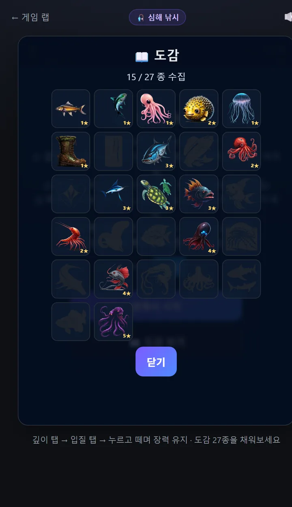
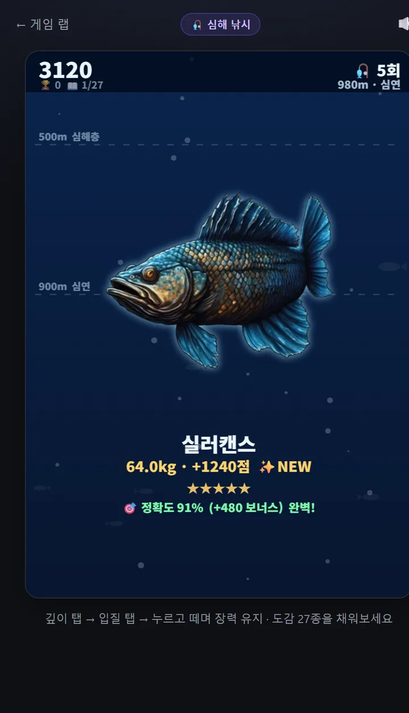
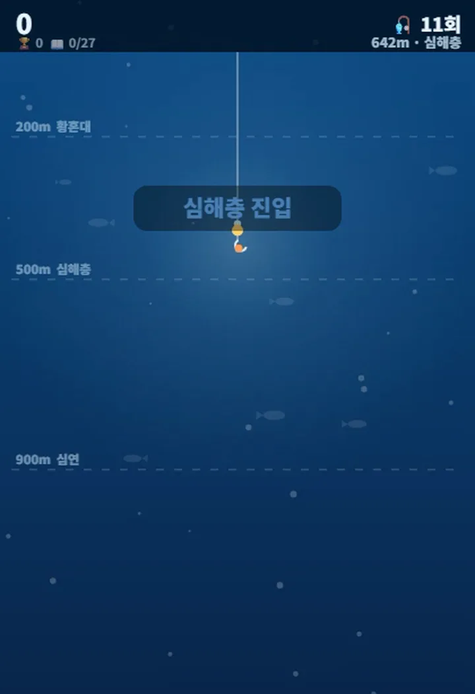

[前回](/p/ai-game-lab-build-7/)の操車場に続いて、八つ目のゲームは**深海釣り**です。水面から**1,200mの深淵まで**潜って魚を釣り、**27種の図鑑**を埋めていきます。

ゲームラボに初めて生まれた**「集める楽しさ」**です。ほかのゲームは終わればスコアしか残りませんが、これは釣った魚が**ずっと残ります。**



👉 **[深海釣りを自分で遊びに行く](/games/deep-fishing/)**

## どんなゲーム?

タップ3回で一匹です。

- ① **深さを決める** — 動くバーをタップ。深いほど希少で難しい
- ② **アワセ** — 魚が寄ってきて餌を**つついて**（フェイント）、**ガツンと食った瞬間**にタップ
- ③ **ファイト** — 押すと巻き、離すと出る。**張力を緑のゾーンに**保つ

1回の釣行はキャスト12回。**カタクチイワシから🐉クラーケンまで27種**がいて、真ん中をうまく保つほど**精度ボーナス**（最大+85%）が付きます。



## 魚27種はComfyUIで自分で描いた

[以前ノートPCに入れておいた**ComfyUI**](/p/claude-local-image-generation/)で27種すべて生成しました。今回も生成して終わりではなくて — ジンベエザメは白い背景の箱付きで出てきて、エイは海底の砂まで一緒に付いてきて、ブリは二匹重なって出ました。

背景色を自動検出して透過にし、被写体にぴったり切り直し、それでもダメなものはプロンプトを変えて生成し直しました。**ComfyUIが描いてくれたものをゲームに合わせて整えるのが仕事の半分**だと、今回も確認できました。

## 最初のバージョンは空中にアワセているようだった

とりあえず動くところまで作って自分で遊んでみたら、変でした。画面には**糸が一本あるだけ**で、何も見えないのに「今タップ!」という文字だけが出るんです。何を見て合わせろというのか分かりませんでした。

そこで**魚を実際に見せる**ことにしました。

- 魚が**横から泳いで近づいてきて**
- 餌を**つつきます**（ウキが軽く揺れる = フェイント）
- **ガツンと食った瞬間**、ウキがスッと沈んで水しぶきが弾けます

これで「早すぎるとバラす」というルールが**目で納得できるルール**になりました。フェイントと本命を見分けるのが腕前になります。

## 魚に黒い背景が付いて見えたが、測ったら違った

遊び続けていると、魚によっては**黒い背景が付いているように**見えました。背景除去が甘かったかと思い、27種すべて計測してみました。

**背景が残ったスプライトは一つもありませんでした。** 僕が当たりをつけた原因が外れていたわけです。

本当の原因は別にありました。**魚と水の明るさがほぼ同じだった**んです。

| 魚 | 魚の明るさ | その深さの水の明るさ | 差 |
|---|---|---|---|
| ウミガメ | 127 | 130 | **3** |
| コウモリダコ | 45 | 20 | 25 |

700mより下は水の明るさが20を切るのに、深海魚も暗い。**黒い背景に黒い物体**だったんです。

そこで**針に深海ランタン**を付けました。餌の周りを照らすので魚が見えるようになり、深海の雰囲気も出ました。掛かった魚の輪郭にほのかな発光も足しています。

> 感覚のままスプライトを生成し直していたら、時間を溶かすだけでした。測ってみたら問題は全く別のところにありました。

## 糸はそのままで魚だけ上がっていた

巻き上げるとき妙にバラバラな感じがしてコードを開いたら、糸の先端が**画面中央に固定**されていました。魚だけが上に動くので、二つが分離して見えていたんです。

- 糸の先を**魚の口に固定**しました。上がってくると糸も一緒に短くなります
- **張力で糸の形が変わります** — 張れば直線、緩めば垂れた曲線、限界近くでは**赤く太く**
- 巻いた分だけ**深度の数字も減り**、おまけに**水が明るくなります**



## それでも何か物足りない — 三度目の診断

ここまで直してもまだ何か物足りませんでした。今回は勘で当てずに**最初からコードを漁りました。** 三つ出てきました。

**① 魚が泳いでいなかった。** コードに**回転が一箇所もありませんでした。** 静止画がスライドしているだけの状態です。泳ぐときに体を傾け、暴れるときに体をぐっとひねる、それだけで全く変わりました。

**② 深海へ向かう「旅」がなかった。** 降下のコードはこうでした。

```js
curDepth += Math.max(3, targetDepth*0.012)   // 常に1.4秒
```

**100mでも1,200mでも降下時間が同じ**だったんです。深海釣りなのに深海へ行く感覚がゼロでした。深さに比例した降下（最大3.5秒）に変え、背景が上へ流れるようにし、**`200m 薄明帯` `500m 漸深層` `900m 深淵`**の道標が過ぎ去るようにしました。

**③ 糸が宙から始まっていた。** 船も水面もありませんでした。**船と波**を入れて、糸が船から下りるようにしました。深くなると水面は闇に消え、巻き上げるとまた現れます。



## 大きさが重さを語る

魚の大きさを**希少度**基準にしていたら、**1kgのフグが900kgのジンベエザメと同じくらい**に見えました。重さ（対数）基準に変え、**アタリの前に重さを先に決めて**、見える大きさと実際に釣れる重さを一致させました。今は画面を見ただけで大物か小物か分かります。

## 駆け引きを入れてゲームを壊しかけた

最後に、**魚が下へ突っ込む瞬間**（手を離して耐える）を入れました。ところがシミュレーションを回すと:

| | 入れる前 | 入れた直後 |
|---|---|---|
| 捕獲率 | 83% | **33%** |

**捕獲率が半分になり**、ファイトが膠着して終わらないケースまで出ました。抵抗力・進行度の損失・発動回数をすべて下げて戻しました。今は緊張感だけ足して、難易度はそのままです。

今回も、**「面白そうだから」入れた機能がゲームを壊しかけたのを数字が捕まえてくれました。**

## これでゲームラボは八つ

| | ゲーム | 性格 |
|---|--------|------|
| 🎨 | [AI絵当てクイズ](/games/guess-image/) | 頭脳 (クイズ) |
| 🟩 | [ハングル単語当て](/games/hangul-word/) | 習慣 (デイリー) |
| 🍰 | [デザートタワー](/games/stack-tower/) | 手応え (アーケード) |
| 🕹️ | [ドッジ](/games/dodge/) | 反射神経 (アクション) |
| 🗑️ | [ペーパーホープ](/games/paper-hoop/) | 狙い (物理) |
| 🪐 | [宇宙進化](/games/space-merge/) | ハイスコア (合体パズル) |
| 🚂 | [操車場](/games/shunting/) | 論理 (3Dパズル) |
| 🎣 | [深海釣り](/games/deep-fishing/) | **コレクション (図鑑)** |

## 今回学んだこと

**「なんか変」はそれ自体では情報になりません。でもその下には必ず具体的な原因があります。** 今回は三度掘り下げて、そのたびにコードから原因が出てきました — 回転がなく、降下時間が固定で、糸の先端座標が固定。どれも**一行か二行の原因**でした。

そして一度は**僕が当たりをつけた原因が外れていました。** 「背景除去が失敗したのか?」と思ったら、測ってみるとコントラストの問題でした。直す前に測る方がずっと速かったです。

---

**[深海釣りを一回](/games/deep-fishing/)** 遊んで、何種釣れたか教えてください。僕はまだ**クラーケン**を見ていません。 🐉

*次回は九つ目のゲームを持ってきます。*
