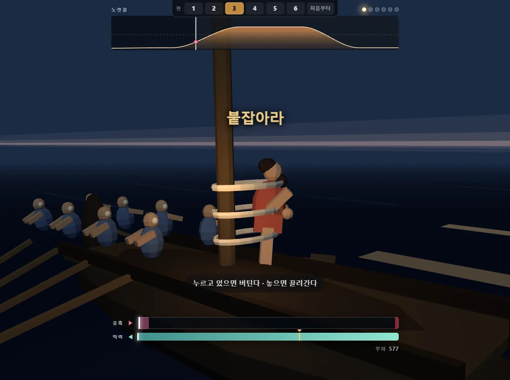
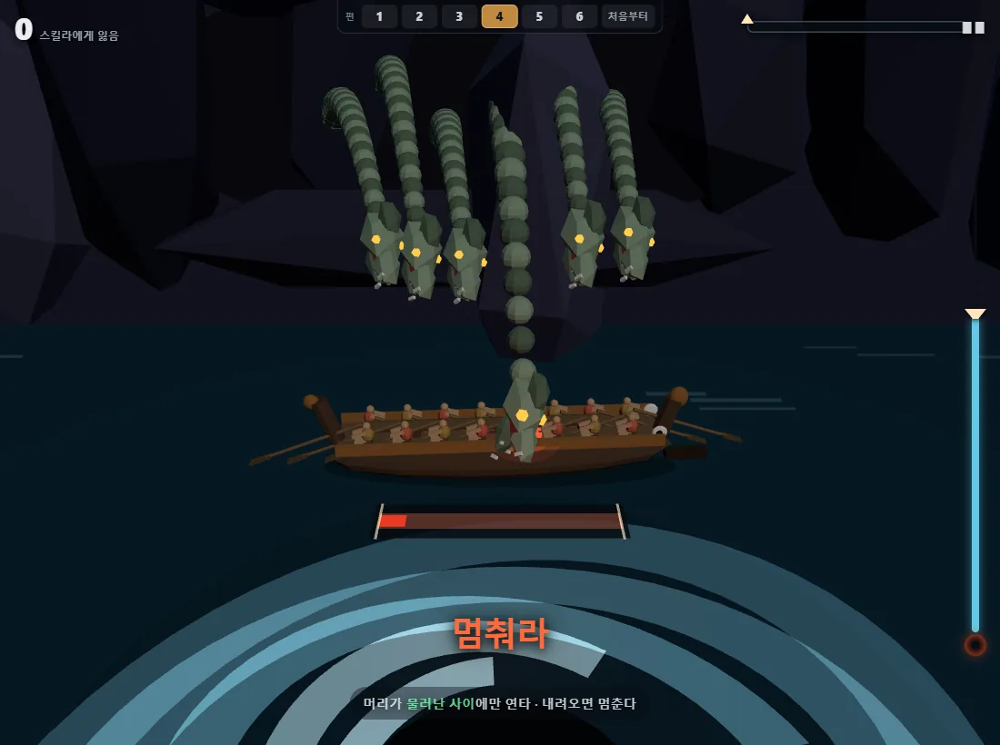
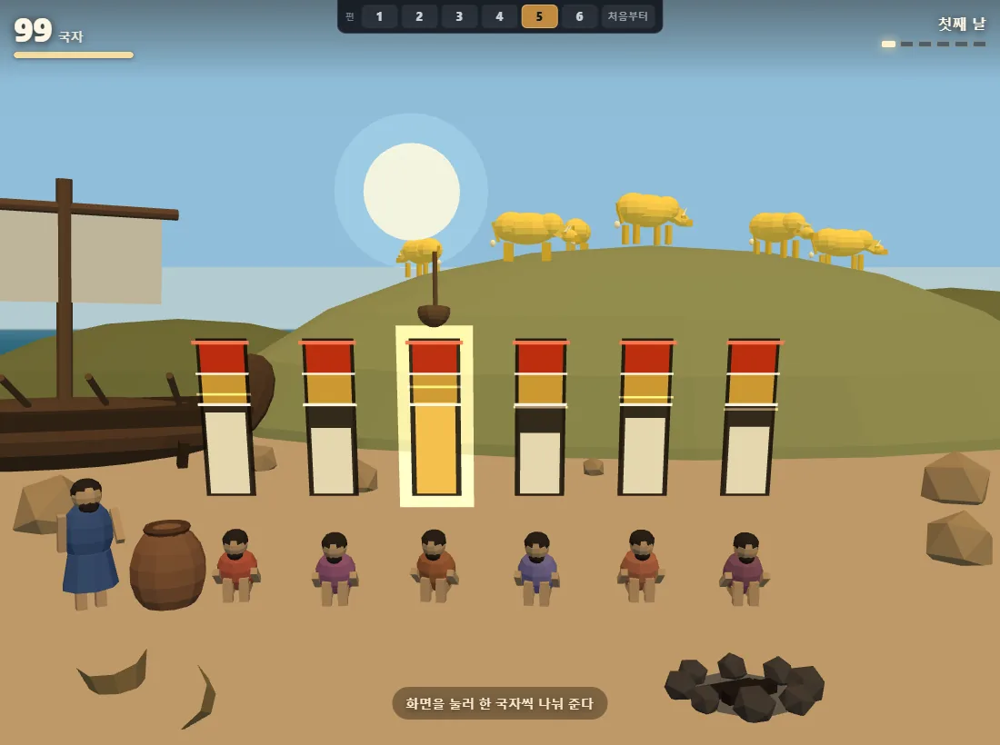
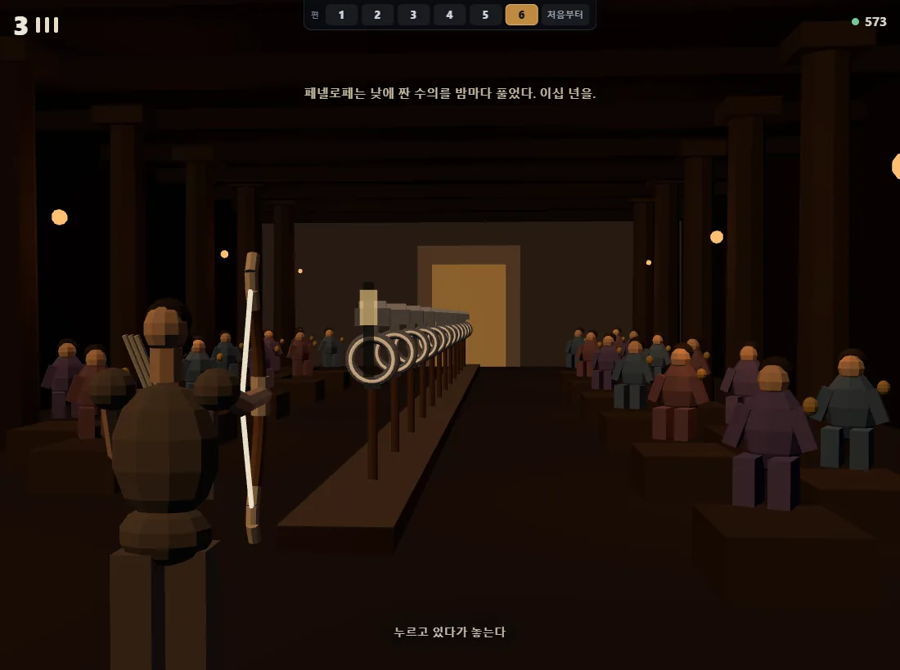
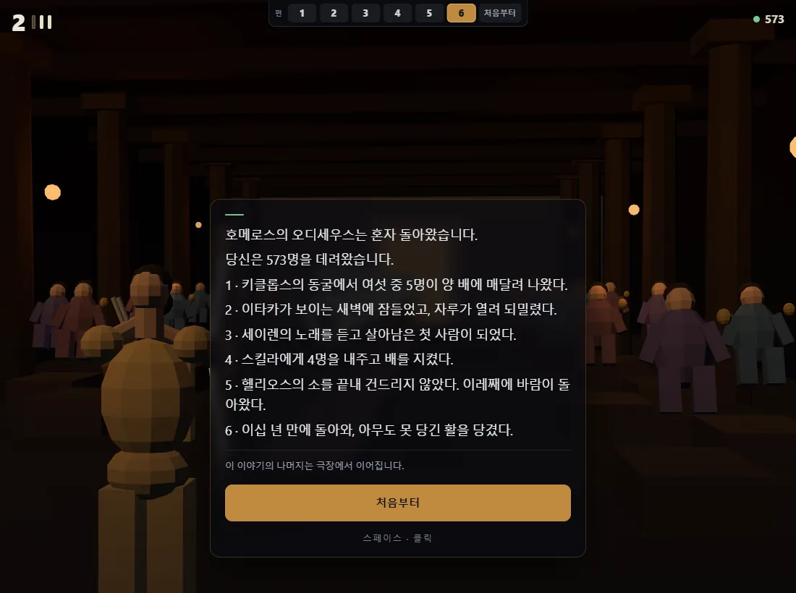
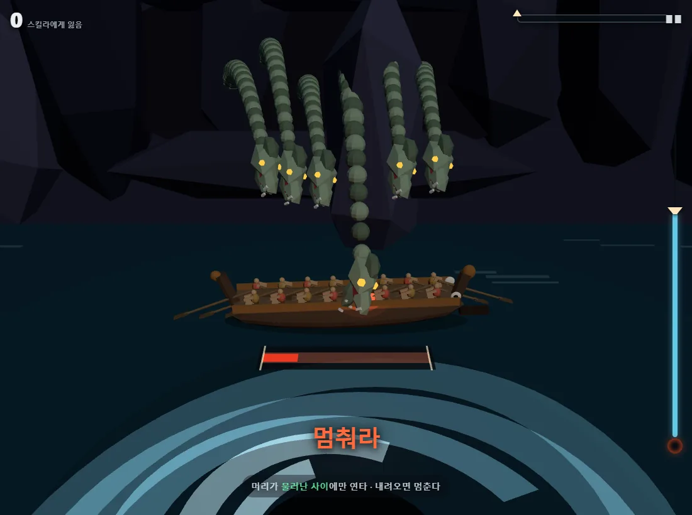

[前回](/p/ai-game-lab-build-8/)の深海釣りに続いて、九つ目のゲームは**オデュッセイア**です。トロイアからイタケまでの20年、その旅の六つの場面を**ボタン一つで**体験するゲームです。⛵

**映画を観に行く前にやれば予習、観た後にやれば復習です。**私は観た後に作ったので、後者から始めたことになりますね。

👉 **[オデュッセイアを遊ぶ](/games/odyssey/)**

> **押す前に一つだけ。**ゲーム内のテキストはまだ韓国語のみです —
> 物語カードもゲージも結果画面も。ボタン一つなので操作は問題なく、六つの場面は
> 見ればわかりますが、物語こそが目的なので、多言語化を次のパッチの筆頭に置いています。

## 3時間がまったく退屈しませんでした

ノーランの〈オデュッセイア〉を観ました。**すごく面白かったです。**

まず**配役がとてもよく合っていました。**マット・デイモンのオデュッセウスもそうですし、ペネロペイア役の**アン・ハサウェイ**が本当に美しく映っていました。20年待つ人の顔はこうあるべきだ、という顔でした。

一つだけ引っかかったのは、よりによってその前の週にスパイダーマンを観ていたことです。テレマコス役に**トム・ホランド**、アテナ役に**ゼンデイヤ**が出てくるのですが、頭ではわかっているのに、どうしてもピーターとMJが重なってしまい、その場面だけ少し没入が途切れました。😅（ゼンデイヤのアテナは、本当に女神なのかオデュッセウスの罪悪感が生んだ幻なのかを、あえて開いたまま撮ったそうです。そこは良かったです。）

それでも**オデュッセウスの物語が冗長なほど見事に広がっていくので**、3時間がまったく退屈しませんでした。劇場を出るとき、むしろ余韻が残っていました。

## ところが一緒に観た人とは温度が違いました

出ながら話していて気づきました。**私は原作の筋を知って観に行き、一緒に観た人は知らなかったのです。**同じ場面を観ても、残るものが違いました。

セイレーンの前でなぜ自分だけ縛られているのか、目の前の牛をなぜ食べないのか、最後に弓を引くのがなぜそれほど重要な場面なのか — 知って観れば「ああ、あれがそれか」ですが、知らずに観るとただ通り過ぎます。

原作を読んでから行けというのは負担が大きく、あらすじを読めというのも**読んでも残りません。**他人の物語の要約は30分後には忘れてしまいます。

そこで**自分で体験させれば残るのではないか**と思いました。

## 30分、ボタン一つ

決めたルールは単純です。

| | |
|---|---|
| ステージ | 6話 |
| 操作 | **スペース・クリック・タップ** — 三つとも同じ動作 |
| 1話 | 5分以内 |
| 全体 | 30分以内 |
| PC・モバイル | 同一 |

ボタンを一つにまとめたのは制約ではなく**選択**でした。操作を覚えるのに時間を使えば、物語が入る余地がなくなります。押せる人なら六話すべて辿り着けるべきでした。

代わりに、**話ごとにそのボタンの意味を変えました。**同じボタンなのに手触りが違います。

| 話 | 場面 | ボタンの意味 |
|---|---|---|
| 1 | キュクロプスの洞窟 | **瞬間にタップ** — 手が逸れた一瞬 |
| 2 | アイオロスの風袋 | **押し続けて放す** — 耐えるほど速く進む |
| 3 | セイレーンの歌 | **耐える** — 放せば負ける（2話の逆） |
| 4 | スキュラとカリュブディス | **隙に連打** |
| 5 | ヘリオスの牛 | **配分タップ** — 誰に食べさせるか |
| 6 | イタケの弓 | **引いて正確に放す** — ただ一射 |

特に3話が気に入っています。2話は**押せば進み、放せば安全**なのに、3話は**押せば安全で、放せば負けます。**同じボタンの意味が裏返るのです。



## 六つの場面がそのまま筋書きです

このゲームの目的は面白さより**「この六つだけ知っていればいい」**です。観る前ならこれを持って劇場に入り、観た後なら「ああ、あれがこれだったのか」を手で確かめる。だから話ごとに、神話が実際に語ることをそのままルールにしました。

**1話・キュクロプス** — 目を潰された巨人が洞窟の入口を手で撫でます。羊の腹にしがみついて出るのです。ゲームは彼が盲目だと**説明しません。**閉じた単眼と手探りの動きが語ります。

**2話・風袋** — イタケが目前に見える十日目の夜明けに眠ってしまいます。**これは失敗ではなく物語です。**避けられません。部下たちが袋を開け、船は来た道を押し戻されます。進行ゲージが95%から20%台へ吸い込まれていくのを見ているしかありません。

**3話・セイレーン** — セイレーンは美貌の誘惑ではなく*「お前の知らぬことを教えてやろう」*と呼びかけます。**知への渇望**がこの場面の本当の誘惑です。

**4話・スキュラ** — キルケの助言は冷徹です。*「六人を失ってでもスキュラ側に寄れ。カリュブディスは船ごと呑む。」*そしてオデュッセウスはこれを**部下に告げませんでした。**告げていたら誰も櫂を漕がなかったからです。



**5話・ヘリオスの牛** — 飢えを抑えられなければ部下が牛を食べ、ゼウスの雷で全滅します。**これがオデュッセウスが一人で帰った理由です。**神話どおりに負けるのが基本の結末で、ごく狭い道を通って生き延びさせると*「ホメロスでは起きなかったことです」*というカードが出ます。



**6話・イタケの弓** — 20年ぶりに乞食の姿で帰ってきます。ペネロペイアの条件は*「オデュッセウスの弓に弦を張り、十二の斧の穴を一矢で射抜く者」*。その弓はオデュッセウスにしか引けません。**弓を引く瞬間が、正体を明かす瞬間なのです。**



## 部下600人が六話を貫きます

これがこのゲームの背骨です。**600人で出航し、各話で失った分だけ減ったまま次の話に行きます。**結果カードの最後の行に、毎回残りの人数が書かれます。

そして最後まで行くと、こう終わります。

> ホメロスのオデュッセウスは**一人で**帰りました。
> あなたは**N人**を連れ帰りました。



エピローグの六行は**あなたが実際に経験したこと**を書きます。他人の物語を要約したらエピローグではありませんから。

## 作りながら — ゲームがプレイヤーに嘘をついていた

ここからが今回いちばん学んだ部分です。

三度も、**画面の指示どおりにやると負けるゲーム**を作っていました。それも毎回違う形でです。

### 一つ目 — 「耐えろ」

2話の終盤、眠気が押し寄せる区間で画面に**「耐えろ / 押し続けろ」**と出ていました。ところが方針ごとに走らせて測ると:

| 指示どおり | 到達 | 失った部下 |
|---|---|---|
| 耐える | 5.8% | 36人 |
| そのまま手を離す | 8.9% | 30人 |

**指示に従ったほうが両方の指標で悪かったのです。**耐えている間も帆の負荷が生きていたので、素直に従うと帆が裂けていました。

### 二つ目 — 「連打して漕ぐ」

4話の画面下部に**「スペースまたは画面を連打して漕ぐ」**と書いてありました。私はその言葉を信じて連打し、死に続けました。櫂は懸命に漕いでいるのに、片側の漕ぎ手が次々と攫われていくのです。

原因を探るために**連打だけをするボット**を作って当てました。連打だけで**9.5秒で漕ぎ手8人が全員攫われ**、その後7秒間なにもできないまま渦に呑まれました。そして結果カードがこう言いました。

> **「櫂を止めた代償だ — 休めば引きずり込まれる」**

一度も休んでいない人間に、です。**案内も間違っていたし、叱り方も間違っていました。**

直したのは三つです。案内にルールの残り半分まで書き（*「首が退いた間だけ連打・降りてきたら止まる」*）、合図を**「漕げ→止まれ」**の二拍で教え、開始直後1.15秒は首を止めて最初の授業を読む時間を作りました。



### 三つ目 — 設計になかった死

ところがもっと妙なものを見つけました。**漕ぎ手を全員失うと死ぬというルールは、設計のどこにもなかったのです。**設計書には*「うまくやれば2〜3人、下手なら六人以上」*としか書かれていませんでした。

考えてみれば当然です。**部下が570人も乗っている船が、櫂の席八つが空いたくらいで死ぬ道理がありません。**攫われた席は他の者が埋めればいいのです。

そこで席を埋めるようにし、負ける道はカリュブディスだけ残しました。同じ連打をもう一度走らせると、**生きて海峡を通過**しました。51人を失って。

**損失は死ではなくスコアだったのです。**神話のスキュラも六人を攫い、船は通り過ぎます。

## 計測がなければ三つとも捕まえられなかった

三度とも**私の感覚では見えませんでした。**「耐えろ」は私が書いた文言で、「連打」も私が書いた文言で、死のルールも私が入れたものです。作った人はルールを知っているので、指示どおりにやりません。

捕まえた方法はどれも同じでした。**方針をいくつも作って結果を表に出すこと。**

- 指示どおりにやるボット / やらないボット → どちらが良いか
- 人のようにやたらに押すボット → 何秒で死ぬか

特に最後が重要でした。もともとあった自動プレイ関数は**「完璧なボット」**で、安全なときだけ櫂を入れていました。だから4話を100回走らせても問題が見えなかったのです。**人が実際にやることを真似るボットを別に作って初めて**、9.5秒の全滅が出てきました。

## そして1話をクリアしたらエピローグが出た

公開直前に出たバグです。1話をクリアしたら2話ではなく**「この物語の続きは劇場で」**が出ました。

原因は二重でした。

**一つ目、キャッシュ。**プレビューサーバーがキャッシュヘッダーを送らないので、ブラウザが数日前のビルドを掴んでいました。そのビルドは今は消したファイルを参照していたので、2〜6話を読めなかったのです。

**二つ目、そしてこちらが本当の問題。**起動コードが**読めなかった話を黙って飛ばし、残ったものだけで航路を組んでいました。**それで1話だけの航海ができ、1話をクリアした瞬間「最後の話を終えた」ことになったのです。

足りないまま動くくらいなら、**止まって何がないかを言う**ほうがいい。こう変えました。

```
ステージモジュールが足りません (5/6) — ないもの: st3。
ブラウザのキャッシュを消して再読み込みしてください。
```

## 数字

| | |
|---|---|
| コード | **13,882行**（ファイル9個） |
| 外部アセット | **0個** — 図形も音もすべてコードが作ります |
| ステージ | 6話、それぞれ自分のファイル一つが丸ごと所有 |
| 一度も間違えなかった場合 | 約5分 |
| 初めてやる場合 | リトライ込みで25〜30分 |
| コンソールエラー | 0 |

話ごとにファイル一つが場面・ルール・ゲージ・結果をすべて持つようにしたのが、今回の構造の核心です。3話を直していて4話が壊れることがありませんでした。

## 開発後記

**「映画を観るときに知っていると良いもの」を作ろうとすると、ゲームデザインが逆さまになりました。**普通は面白さが先で物語が後からついてくるのに、今回は**必ず知るべき六つの場面が先に**決まっていました。その六つをそれぞれどんな手触りにするかがすべてでした。

だから2話がいちばん難しかったです。**イタケが目前なのに眠ってしまう場面**は、プレイヤーが勝てないようにしなければなりません。勝てない一戦を「つまらない」ではなく「悔しい」にしなければならなかったのです。今は眠る直前まで進行ゲージが95%まで満ち、それが20%台へ吸い込まれるのを見ることになります。

もう一つ。**よくできた検査道具が、かえって目を塞ぐことがあります。**このゲームには最初から自動プレイのボットが付いていましたが、それが「完璧なボット」でした。ルールを知ったまま、安全なときだけ押していたのです。だから4話は**すべて通過**しました。肝心の、画面に書かれた案内をそのまま守るボットがいなかったのです。

三度続けて同じ種類の問題が出たのは偶然ではないと思います。検査は**「ルールどおりにやれば通るか」**ではなく**「画面に書かれたとおりにやれば通るか」**を問うべきでした。

---

このゲームはここで終わりではありません。**愛着を持って手を入れ続けるつもりです。**今回三度も「画面の指示どおりにやると負ける」を捕まえましたが、まだ見つけていないものがあるはずです。話ごとの手触りを整え、モバイルももっと触って、少しずつパッチしていきます。

まだ観ていない方は、**劇場に行く前に30分だけ**使ってみてください。六つの場面が出てきたときに「ああ、あれか」となれば成功です。

もう観た方は、**観た後の30分**も悪くありません。私はこちら側でしたが、作りながらむしろ映画がより長く残りました。セイレーンの前でオデュッセウスがなぜああしていたのかは、自分で綱を掴んでみて初めて体でわかりました。😄

👉 **[オデュッセイアを遊ぶ](/games/odyssey/)** · [AIゲームラボ全体を見る](/games/)
