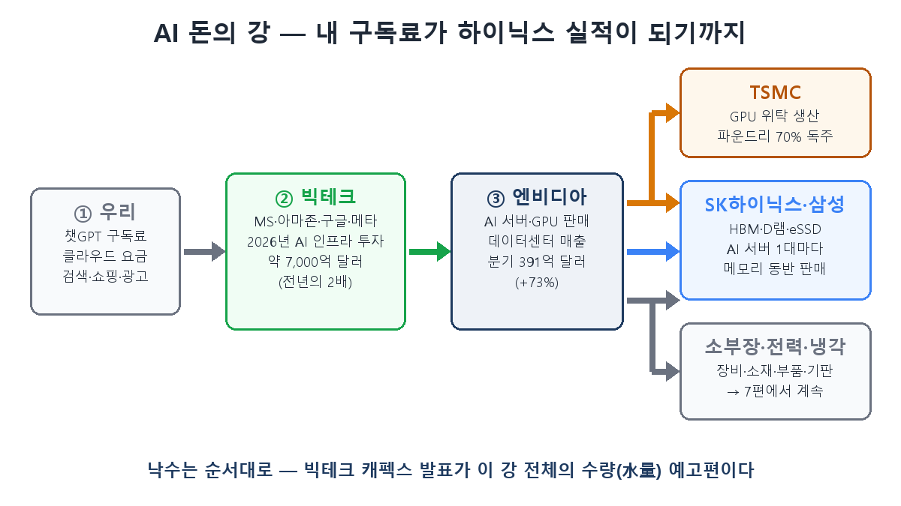
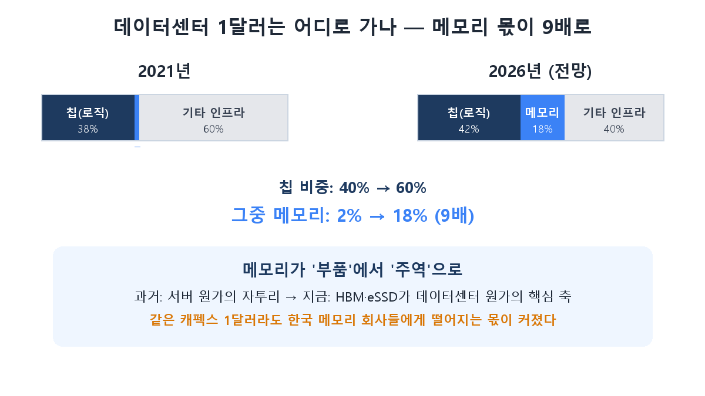

여러분이 매달 내는 챗GPT 구독료 몇만 원. 그 돈이 어디로 흘러가는지 따라가 본 적 있나요? 오늘은 그 돈의 여정을 추적합니다. 결론부터 말하면, 그 돈의 일부는 돌고 돌아 **경기도 이천의 SK하이닉스 공장**까지 흘러갑니다. 1~5편에서 배운 조각들(HBM, 3파전, 사업 구조, 사이클, 산업 지도)이 오늘 하나의 지도로 연결됩니다. 이 강의 흐름을 알면, "AI 관련주"라는 모호한 말 대신 **누가 몇 번째로 물을 받는지**가 보입니다.

## 강의 발원지 — 우리, 그리고 빅테크

돈의 강은 우리에게서 시작합니다. 챗GPT 구독료, 기업들이 내는 클라우드 요금, 검색과 쇼핑에 붙는 광고비. 이 돈을 받은 마이크로소프트·아마존·구글·메타 같은 빅테크가 "AI 수요가 폭발하니 데이터센터를 더 짓자"며 설비투자(캐펙스)를 집행합니다.

그 규모가 상상을 초월합니다. **2026년 한 해에만 주요 하이퍼스케일러의 AI 인프라 투자가 약 7,000억 달러(약 1,000조 원)** — 전년의 거의 두 배입니다. 아마존 혼자 2,000억 달러, 구글 1,800억 달러 수준. 4편에서 "AI 인프라 투자가 꺾이면 사이클도 꺾인다"고 했는데, 그래서 분기마다 나오는 **빅테크 캐펙스 발표가 이 강 전체의 수량 예고편**입니다.

## 첫 번째 수문 — 엔비디아

빅테크가 데이터센터를 지으면 그 안을 채울 AI 서버가 필요하고, 그 심장인 GPU는 사실상 엔비디아 독점입니다. 그래서 캐펙스의 가장 큰 물줄기가 엔비디아로 먼저 흘러듭니다. 엔비디아의 데이터센터 매출은 분기 391억 달러, 1년 전보다 73% 늘었습니다.

여기서 5편의 지도가 등장합니다. 엔비디아는 **설계만 하는 팹리스**죠. 받은 돈을 자기 손에만 쥐고 있을 수 없습니다. 칩을 실제로 만들려면 두 곳에 돈을 나눠야 합니다.

## 두 번째 수문 — TSMC와 한국 메모리

- **TSMC**: GPU 본체를 위탁 생산합니다. 파운드리 70% 독주(5편)의 결과로, 엔비디아 물줄기의 큰 몫이 대만으로 흘러갑니다.
- **SK하이닉스·삼성전자·마이크론**: GPU 옆에 반드시 붙는 HBM(1편), 그리고 서버의 D램과 eSSD(5편)가 여기서 나옵니다. **AI 서버가 한 대 팔릴 때마다 메모리가 자동으로 동반 판매**되는 구조 — 1편에서 본 'AI 시대의 쌀'이 바로 이 지점입니다.

그런데 이 물줄기의 굵기가 달라지고 있다는 게 오늘의 핵심입니다.

**데이터센터에 들어가는 돈 중 메모리의 몫이 2021년 2%에서 2026년 18%로, 9배가 됐습니다.** 예전의 메모리는 서버 원가의 자투리였는데, HBM과 eSSD가 비싸지고 많이 실리면서 데이터센터 원가의 핵심 축이 된 겁니다. 같은 캐펙스 1달러라도 한국 회사들에게 떨어지는 몫이 커졌다는 뜻 — 하이닉스 영업이익이 삼성 전체를 추월(3편)한 배경에는 이 구조 변화가 있습니다.

## 세 번째 수문 — 소부장, 전력, 냉각

강은 여기서 끝나지 않습니다. 하이닉스가 HBM을 증산하려면 장비를 사야 하고(TC본더 같은 패키징 장비), 소재와 부품을 조달해야 하며, 칩을 얹을 기판도 필요합니다. 데이터센터 자체도 전력기기와 냉각 설비를 빨아들이죠. 이 **세 번째 물줄기의 수혜 지도(소부장)**는 다음 7편에서 종목 레벨로 자세히 다룹니다.

## 투자자의 관전 포인트

- **낙수에는 순서가 있다**: 빅테크 캐펙스 발표 → 엔비디아 실적 → 메모리 계약 → 소부장 수주. 상류의 신호가 하류의 실적을 몇 분기 먼저 예고합니다. 하류 종목을 보면서 상류 지표를 체크하는 게 순서입니다.
- **강의 원류를 의심하는 것이 리스크 관리**: 이 모든 흐름의 전제는 "빅테크가 계속 돈을 쓴다"입니다. AI 수익화가 기대에 못 미쳐 캐펙스가 꺾이는 순간, 강 전체의 수량이 줄어듭니다. 4편의 "이번엔 다르다" 논쟁과 같은 문제죠.
- **몫의 변화가 주가의 변화**: 메모리 비중 2%→18%처럼, 강물의 총량만이 아니라 **각 수문이 가져가는 비율의 변화**가 종목 선택의 근거가 됩니다.

## 정리

- AI 돈의 강: **우리(구독료) → 빅테크(캐펙스 7,000억 달러) → 엔비디아(GPU) → TSMC + 한국 메모리(HBM) → 소부장·전력·냉각**.
- 데이터센터 1달러 중 **메모리의 몫이 5년 만에 2%에서 18%로 9배** — 메모리가 부품에서 주역으로 올라선 것이 이번 사이클의 구조적 특징입니다.
- 낙수에는 순서가 있으니 **상류 지표(캐펙스·엔비디아 실적)로 하류(메모리·소부장)를 예측**하고, 강의 원류(AI 수익화)가 마르는지 늘 의심하세요.

다음 7편은 세 번째 수문의 각론입니다. **한미반도체·리노공업은 왜 하이닉스와 같이 움직이나 — 소부장 지도**를 그립니다.

> ⚠️ 이 글은 공부한 내용을 정리한 것으로, 특정 종목의 매수·매도 추천이 아닙니다. 투자 판단과 책임은 본인에게 있습니다.
