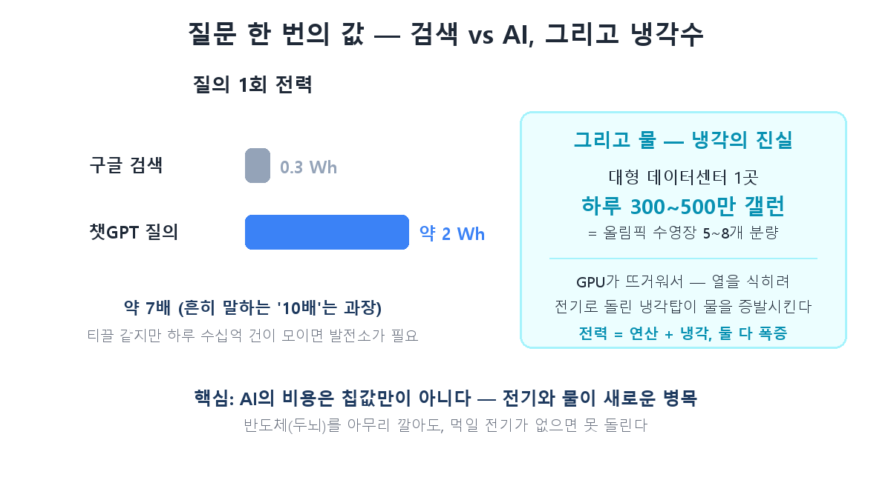
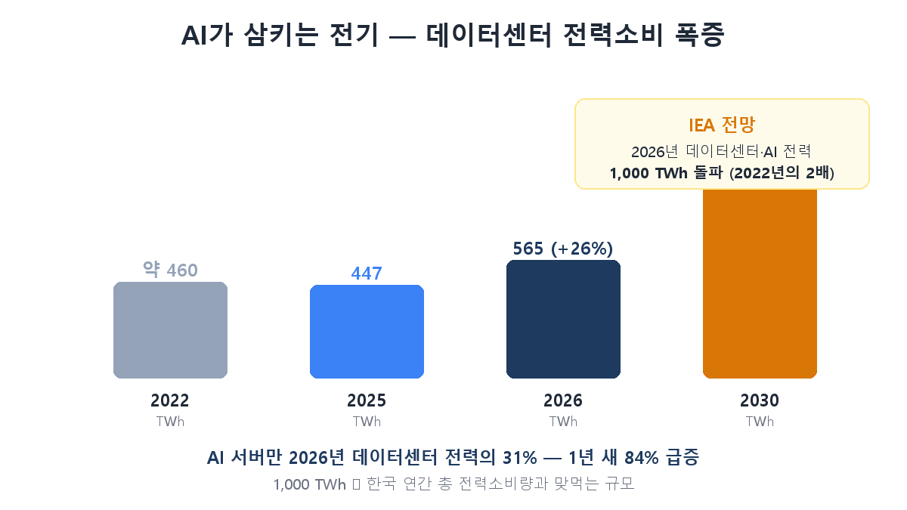

全10回の[AI半導体投資の教科書](/ja/p/what-is-hbm/)を締めくくる中で、繰り返し出てきた言葉があります。「AIの本当のボトルネックはもう半導体ではなく**電力**だ」。第8回ではメタがデータセンターに自前のガス発電所を付けると述べ、番外編では「建てたのに埋まらないのではなく、電力がなくて建てられない」と言いました。その伏線をここで回収します。半導体が「AIの頭脳」だったなら、この新シリーズの主役は**その頭脳を養う電気**です。

第1回は問題の定義です。データセンター電力難とは一体何で、なぜ原発株・電線株・変圧器株が半導体並みに熱いテーマになったのか——数字で感覚をつかみます。

## 質問一つの本当の値段

まず小さいところから。あなたがChatGPTに質問を一つ投げます。その一回で電気はどれだけ要るでしょうか？

ChatGPTの質問1回は約2Wh（ワット時）、Google検索1回は約0.3Wh——およそ**7倍**の差です。よく「10倍」と言われますがそれは誇張で、最近のデータでは7倍程度です。1回だけ見れば塵です。問題はこれが**1日に数十億件**積み上がること、そしてAIが検索を置き換えながらその7倍の質問が急増していることです。

電気だけではありません。GPUは動くと熱くなります。その熱を冷やすため、大型データセンター1ヶ所が**1日300～500万ガロンの水**（オリンピックプール5～8個分）を冷却に使います。冷却塔を回すのも電気です。つまりデータセンターの電力は**演算に使う電気＋冷やすのに使う電気**、その両方が急増します。

## で、どれだけ食べるのか — 国一つ分

小さな質問が集まると、規模は恐ろしくなります。

市場調査機関ガートナーによれば、世界のデータセンター電力消費は2025年の447TWhから2026年には565TWhへ、**1年だけで26%急増**します。うちAIサーバーがデータセンター電力の31%を占め、AIサーバー電力だけで1年で84%増えます。国際エネルギー機関（IEA）は、データセンター・AI関連電力が2026年に**1,000TWhを超え2022年の2倍**になると見ています。

1,000TWhと言われてもピンと来ませんよね。おおよそ**韓国が1年間に使う全電力**に匹敵する規模です。AIデータセンターという新しい「仮想国家」が地球に一つ現れ、韓国一国分の電気を吸い始めた——そう考えればいい。国内だけを見ても、3年後にはデータセンター電力需要が原発1基を丸ごと投入すべき水準に達するという見通しが出ています。

## なぜこれが「投資テーマ」になったのか

ここで半導体シリーズの論理がそのまま続きます。第6回で描いた「AIお金の川」を覚えていますか？ ビッグテックCapEx → NVIDIA → ハイニックスへと流れたあの川。**その川にはもう一つ支流がありました。**データセンターを建てるにはGPUを買うだけでなく、それを回す**電気を引いてこなければ**なりません。発電所、送電線、変圧器、冷却設備——これらすべてが新たに必要になったのです。

問題は、電気が半導体のように速く増えないこと。GPUは工場で数ヶ月で刷れますが、発電所1基には数年、原発には10年もかかります。送電線1本敷くのも許認可で数年です。**需要（AI）は爆発するのに供給（電力）は鈍い**——この不均衡こそ投資機会が生まれる地点です。第4回で見た半導体サイクルの「豚サイクル」論理が、電力にもそっくり当てはまります。

だからお金が集まる先は3方向です。

- **発電**：24時間安定的に大量供給できる電気が必要 → 原発（特にSMR）が再注目。（第2回）
- **送り届ける**：電気をデータセンターまで運ぶ設備 → 変圧器・電線・電力網。HD現代エレクトリック・暁星重工業のような重電株が半導体並みに上がった理由です。（第3回）
- **冷却**：熱を冷やす新たなボトルネック → 液浸冷却など。（第8回）

## まとめ

- AIは電気を食べて育ちます。ChatGPTの質問1回がGoogle検索の**約7倍**の電力、大型データセンター1ヶ所が**1日数百万ガロンの冷却水**を使います。コストはチップ代だけではありません。
- 規模は国一つ分——データセンター・AI電力が2026年**1,000TWh（韓国の年間電力に匹敵）**、2030年にはさらに急増。AIサーバー電力だけで1年で84%増。
- テーマの本質は不均衡です——**AI需要は爆発、電力供給は鈍い。**お金は発電（原発・SMR）・送配（変圧器・電線）・冷却の3方向に流れます。

このシリーズはその3方向を一つずつ追います。次回・第2回は最も熱い発電側——**なぜ突然、原発、それもSMRがAI受益株になったのか**を掘り下げます。

> ⚠️ この記事は学んだ内容の整理であり、特定銘柄の売買を推奨するものではありません。投資判断とその責任はご自身にあります。
