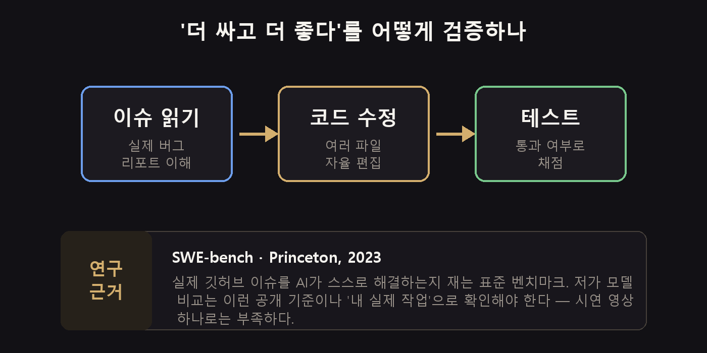
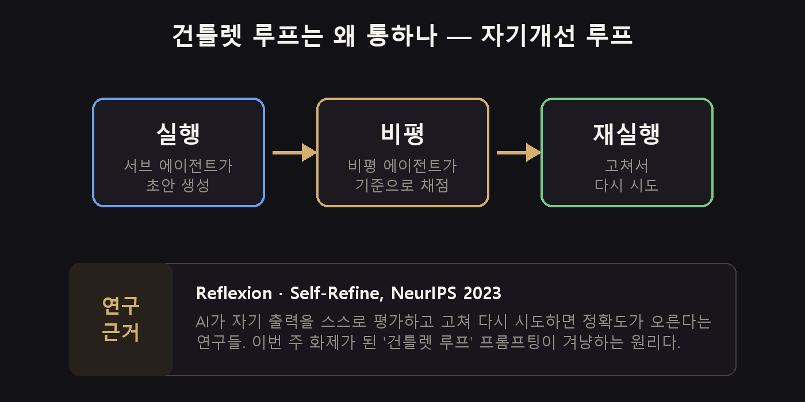
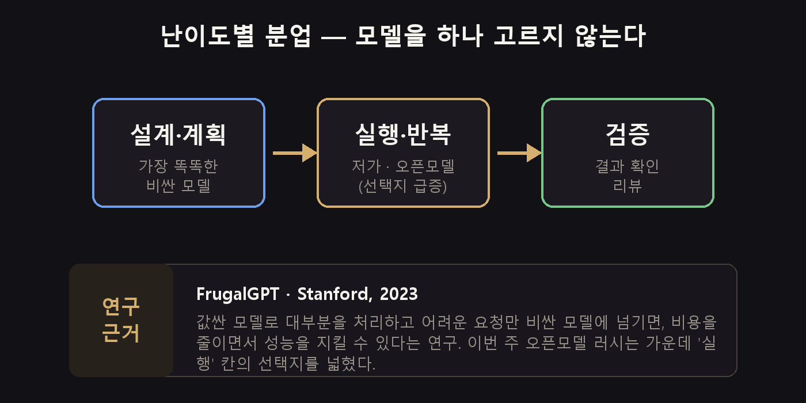

我的笔记本每天晚上 11 点会自动跑一个脚本。它把当天新上传的 AI 相关 YouTube 视频扒一遍,只挑播放量高的做成摘要。早上一边喝咖啡一边翻这份摘要,是我最近的固定节目。

这次我把过去一周的攒在一起看,感觉有点不对劲。平时这个时候,满屏都是“这个模型有多聪明”,可这一周几乎没人谈性能。大家都只盯着**价目表**。

## 三句话总结

- 价格崩了。中国的开源模型(Kimi K3、Qwen 3.8、DeepSeek V4)和 Meta 的 Muse Code 挤在同一周里砸了下来。
- 但“便宜 100 倍”是有条件的。Meta 那个套餐,**代价是把你的代码交出去当训练数据**。
- 智能体开始有记忆了。休息的时候自己整理,还能把记忆带着在不同工具之间搬家。

## 这一周大家只聊价格

播放量最高的那条视频,标题本身就说明了一切:*中国推出了比 Fable 5 更强、便宜 100 倍的 AI*。17 万播放。

Moonshot 的 **Kimi K3** 是一个 2.8 万亿参数的开源模型。有位测评者让它做一款 3D 对战游戏,结果说是比 Claude Fable 5 便宜了大约 3.3 倍就搞定了。

我自己每周都在更新[用 AI 做游戏](/zh/p/ai-game-lab-build-8/)这个系列,所以看到这一段真的坐不住。做游戏是那种「不成就一直重跑」的活,模型单价会原封不动地变成压力。「要不再跑一次?」——话到嘴边又缩回去的次数,我数不过来。

Meta 则发布了一个叫 **Muse Code** 的终端编码智能体,目前是 beta。用 `/effort` 调它思考的深度,用 `/model` 换底层模型,说实话跟 Claude Code 几乎一模一样。

真正引爆话题的是价格。用贡献者档位的话,每 100 万个缓存输入 token 的费用从 0.15 美元掉到 **0.002 美元**。

这意味着什么呢?意味着那些「太贵所以一直没试过」的事情,现在可以试了。把整个代码库通读一遍、给几百个 PR 分类、不成功就一直重构下去——都行。要是你有因为成本被搁置的点子,现在值得翻出来重新看看。

## 但“便宜 100 倍”我不敢照单全收

这里得停一下。那个价格是带条件的。

贡献者档位之所以便宜,是因为**你要把开发数据交出去**。个人玩票项目倒无所谓,可一旦涉及公司代码或者客户信息,这笔账就完全是另一回事了。不能拿同一把尺子量。

公平地补一句:那条以“便宜 100 倍”做标题的视频,其实也点到了这个条件,说 Meta 明确写了「使用贡献者模型时,内容可能被用于产品改进」。只是这种细节,光看标题的人很容易漏掉,所以我再写一遍。

评价也是分裂的。做 Muse Code 测评的那位一边认可速度和价格,一边说“还称不上完美”,顺手点了幻觉的问题。Kimi K3 也一样,就看了一场演示就下高低判断,还太早了。

测评者们倒是有一句口径一致的话:别看跑分,**拿自己手头真实的活亲手跑一遍**。

顺带一提,衡量编码智能体实力的公开标尺其实早就有了。就是普林斯顿 2023 年放出来的 **SWE-bench**,它看的是 AI 能不能自己解决真实的 GitHub issue。比起营销文案,还是这种标尺、或者干脆用自己的工作来验证更靠谱。

## AI 开始睡觉了

除了价格,还有一件事挺扎眼:记忆和自主性。

Andrej Karpathy 指出过 AI 的一个软肋:**它只在收到提示词的时候才学习**。人在睡觉的时候大脑还会把一天的东西归档,AI 没有这一环。Anthropic 就是从这里入手,加了一个叫 **Dreaming** 的功能——在空闲时回顾过去的会话、整理记忆。目前还只对企业客户开放。

还有个实验,是让 Claude Opus 5 独自赚 9 天钱。前期一通瞎折腾,最后做了一款 3D 滑雪游戏拿到了奖金。从 55 美元起步,变成了 87 美元。金额是挺可爱,但重点在于「自主运营真的转起来了」。

有意思的是,AI 挑的赚钱方式是**做游戏**。大概因为这是那种做得短、马上就能拿到反馈的领域吧。这让我想起自己在[游戏实验室第 1 篇](/zh/p/ai-game-lab-build-1/)里问过的那句「用 AI 做游戏赚钱,真的行得通吗?」,感觉有点微妙。

一个叫 **Gauntlet Loop** 的提示词技巧也很火。主智能体拉起好几个子智能体,再配一个专门负责挑刺的角色,一直循环到满足标准为止。

这个也是有根的。属于 **Reflexion、Self-Refine**(NeurIPS 2023)这一脉的研究,已经验证过:让 AI 自己评估自己的产出、改完再来一遍,准确率会上升。

不过介绍这套做法的人自己也说了,别一上来就全交给它。要在方向已经大致定下来之后,拿它来**打磨**,效果才好。

## 这周捞到的东西

只挑马上就能上手的。

**用网关来换模型。** 工具不动,只换后面接的模型。OpenRouter 就是装个 CLI、注册账号、接上 API key,完事。DeepSeek、GLM 这类开源模型就挂到了 Claude Code 后面。

**把故障切换配好。** 在 OmniRoute 里可以把多个模型绑成一组,设优先级或者轮询。一个模型撞到额度上限,它会自动切到下一个,活不会断。

当然也可以干脆在自己电脑上跑。我以前在[用游戏本跑属于自己的 LLM](/zh/p/llama-cpp-local-llm/)里整理过,而这一周开源模型这么一涌出来,这个选项变得现实多了。

**把文档喂成技能。** 给 Hermes 智能体的 `/learn` 命令传一个文件路径,它就会永久记住那份内容。把公司文档或者业务手册放进去一次,换了会话也还在,不用每次都重新贴文件。

**让记忆在工具之间共用。** 接上 Walrus Memory,ChatGPT 和 Claude 就共用同一份记忆。每换一个工具就要把背景重讲一遍的那种浪费,没了。

**语音别当苦力,当指挥。** 有个技巧是:别直接让 ChatGPT 语音干活,而是说「开个线程去处理这个」,把活丢给别的线程。语音模型本身是个轻量货,重活转出去结果更好。

## 如果只留一条,就是这个

从这里开始就不是这周的新闻了,而是半年后依然成立的事。

模型不是挑一个,而是**按任务难度分着用**。

| 阶段 | 做什么 | 用什么模型 |
|---|---|---|
| 设计、规划 | 架构、梳理需求 | 最聪明的贵模型 |
| 执行、迭代 | 写代码、转换、整理 | 低价、开源模型 |
| 验证 | 确认结果、评审 | 中档 |

这不是随口造的流行语。学界管它叫**模型级联**,2023 年斯坦福的 **FrugalGPT** 研究是代表作。大意是:用便宜模型处理绝大部分,只把难的转给贵模型,成本降下来的同时性能还能守住。

这一周变的,其实只是这张表中间那一格。能拿来做「执行」的选项突然宽了一大截。原则本身一点没变。

## 阴影也得一起看

OpenAI Astra 的发布推迟了。原因是在自家安全标准里,网络安全那一项踩到了「灾难级」。意思是,它有能力在没有人介入的情况下造出零日攻击。

投资圈的泡沫争论也变大了。逻辑是这样的:如果开源模型和低价竞争铺开,那么此前默认成立的基础设施需求预期,可能是被高估了。

有个频道特别提醒:要小心**杰文斯悖论**(“变便宜了,总用量反而会涨”)被不加批判地到处传播的时候。越是听着有道理的逻辑,越容易在没人验证的情况下被反复复读。这句话我以前也挺喜欢的,听完有点心虚。

## 剩下的简单说

- 免费用户的默认模型换成了 **GPT-5.6 Luna**。
- **Gemini Notebook 2.0** 能从资料里直接生成幻灯片,甚至短视频。
- Claude Code 的五个插件火了一圈:Omni Route、Claude-mem、Headroom、Claude Code Setup、Task Observer。
- **Claude Design** 加上了动态图形,但后端和线上 URL 依然没有。它没法直接接到真实服务上,还是当原型工具看比较合适。
- 金融科技公司 **Ramp** 把智能体接进了开发全流程,说是把 CI 时间缩短到了三分之一。诀窍有点出乎意料:不是告诉它「怎么做」,而是**只下达「要达成什么」这一件事**。

## 这周就做这一件事

去接一个网关试试。OpenRouter 也行,OmniRoute 也行,就在你现在用的工具后面挂一个开源模型。

目的不是省钱,而是让自己处在**随时能换的状态**。下次这盘棋再被掀翻的时候(一定还会掀),只有准备好的人换得动。

有已经换到开源模型的朋友吗?我现在主力还是 Claude Code,不过看完这一周,觉得也该慢慢开始试了。挺想听听用过的人的感受。

---

*我每周会翻几十条 YouTube 上的 AI 视频,只挑成气候的那些,把它们翻译成「我的工作会有什么变化」,再补上研究依据和一层夸张过滤器。这一期看的是 2026 年 8 月 4 日至 10 日播放量前 42 条。性能和价格的数字都是各视频里自己主张的值,我没能亲自验证,所以把条件和反面意见一并写进了正文。作为研究引用的 FrugalGPT、SWE-bench、Reflexion 都是公开发表的论文*。

**来源视频**
- [China Just Dropped an AI 100x Cheaper That Beats Claude Fable 5](https://www.youtube.com/watch?v=A-2WKQxhI_8) — Vaibhav Sisinty
- [Meta's Claude Code clone is INSANELY cheap](https://www.youtube.com/watch?v=-Gj0-EIyx6g) — Theo
- [Kimi Code colocou o Claude Code pra chorar](https://www.youtube.com/watch?v=KHRNed37LvA) — mano deyvin
- [Affordable Claude Code in 3 steps](https://www.youtube.com/watch?v=fXSwktXhAOM) — Abhishek Veeramalla
- [Give ChatGPT and Claude the Same Memory](https://www.youtube.com/watch?v=NClayXM8pU0) — Nate Herk
- [Hermes AI Just Learned to Read Books](https://www.youtube.com/watch?v=0sDKQMO23xE) — Julian Goldie SEO
- [This NEW Claude Prompting Technique (gauntlet-loop)](https://www.youtube.com/watch?v=BNjzXcEXmg4) — Jay E RoboNuggets
- [I Let Claude Opus 5 Run a Business Alone for 9 Days](https://www.youtube.com/watch?v=vOK0Cdbk-Ps) — Ben Awad
- [Andrej Karpathy Just Fixed Claude Code's Biggest Weakness](https://www.youtube.com/watch?v=jI4ZVB_MPhU) — Dream Labs AI
- [OpenAI's Model Got Too Dangerous So They Locked It Up](https://www.youtube.com/watch?v=mH70ny2LcX4) — Universe of AI
