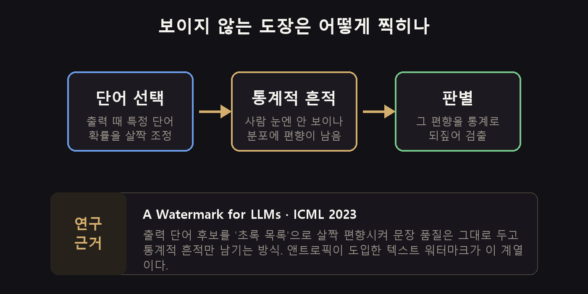
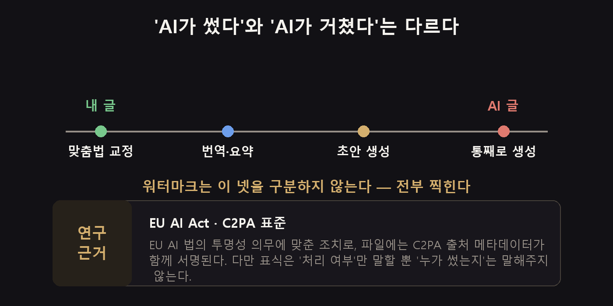
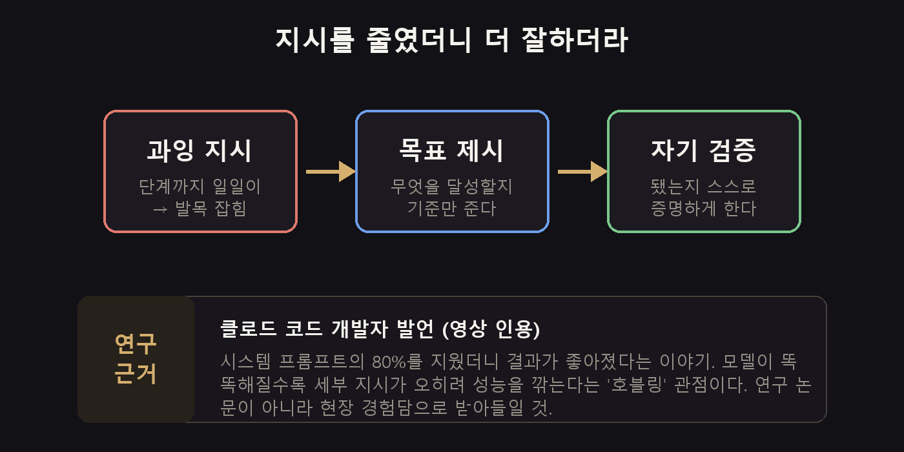

[上周](/zh/p/ai-trend-2026-08-w2/)满屏都是价格的话题，这周的气氛却完全变了。我翻着笔记本每晚爬回来的视频列表，排在第一的是这个：**“美国人已经对 AI 转过身去。”** 22 万次播放。

一周之内，话题就从钱跳到了信任。

## 三句话总结

- Claude 生成的**所有文本都开始被打上看不见的水印**。这是为了应对 EU AI Act。
- 但这个标记说的不是“AI 写的”，而**只是“经过了 AI”**。哪怕只改个错别字也照样盖。
- 另一边则有人说，**指令给得越少，结果反而越好**。提示词的常识正在被推翻。

## Claude 写的东西会被盖上章

Anthropic 从 8 月 2 日开始，给 Claude 生成的文本和文件加上了水印。这是对着 EU AI Act 的透明度义务做的动作。

两种方式同时进行。文本里嵌的是肉眼看不见的统计标记，文件上附的则是一层叫 **C2PA** 的来源元数据签名。

原理还挺有意思的。

AI 在挑下一个词的时候，会把某些候选词的概率抬高那么一点点。人读起来完全察觉不到，可句子一长，那点偏置就能被统计抓出来。这是 2023 年 ICML 上那篇 **“A Watermark for Large Language Models”** 论文提出的做法，这次落地的也是同一路子。

也就是说，句子质量原封不动，只留下痕迹。挺聪明的。

## 问题是它不区分“写了”和“经过了”

这才是真正要紧的地方。

我自己写好的文章丢给 Claude，**哪怕只让它改个错别字**，水印也一样会附上去。翻译、摘要也是同理。这个标记只说明“这段文本经过了 AI”，至于是谁写的，它一个字都没说。

在学校或公司这种对“有没有用 AI”很敏感的场合，这就变得棘手了。整篇初稿都让 AI 生成的人，和只改了几个错字的人，戴的是同一个标记。

> **那对我来说意味着什么？**
> 如果是要交出去的文件，**提前写清楚 AI 参与到了哪一步会更安全**。等标记被检测出来之后再解释，远不如一开始就注明“只用来翻译”来得省心。

然后不出所料，去水印工具已经陆续挂上 GitHub 了。矛与盾的戏码开场了。不过与其费劲去捅破它，**说明了再用**大概最终还是更轻松。

还有一点。这只在用 Claude 这类商用模型时才成立。[在我笔记本上跑的开源模型](/zh/p/llama-cpp-local-llm/)是没有这种标记的。要处理敏感文件的话，这也是个选项。

## 大众其实已经在转身了

这周播放量最高的视频就是《美国人已经对 AI 转过身去》。在这个领域，22 万次是压倒性的数字。

内容挺沉重的。岗位减少、数据中心的电力和水消耗、版权侵权。说的是 AI 的采用率在涨，信任度却一路往下掉。

还有一支调子相近的视频，标题叫《等一下，我问问 ChatGPT》，讲的是依赖 AI 之后**批判性思维的退化**。心理学上把这叫作**认知卸载**。跟用惯了计算器心算就变差是一个道理，只是这回退化的是判断力，性质就不太一样了。

再加上监控方面的担忧。ChatGPT 桌面应用加了**记录电脑活动**的功能。它会学习你在做什么，然后帮你代劳重复操作，可反过来说，也就是一直盯着你的屏幕。某个播客里的几位嘉宾建议**只在工作专用的电脑上打开**。我也是同样的想法。

## 这周捞到的东西

**先写清楚 AI 的使用范围。** 如果是要交出去的文件，就在最下面留一行，比如“翻译和校对使用了 AI”。在水印成为默认的时代，这是最便宜的保险。

**敏感文件交给本地模型。** 既不会被打水印，数据也不会外流。

**电脑活动记录功能要分设备。** 要开就只在工作专用设备上开，个人设备别开。

**Claude Code 里多了 `/design`。** 流程是先出几版设计稿、选定之后再开始写代码。做完之后才发现“这不是我要的”、然后整个推翻重来的情况会少很多。

**在项目文件夹里放三份文档。** 这是某支视频介绍的做法，还挺好用。一份写工作方式，一份写现在什么最重要，一份写判断成果好坏的标准。这三份摆着，AI 自己就能抓住上下文。

## 如果只留一条 —— 少给点指令

从这里开始就不是本周新闻了，而是能放得比较久的话。

据说 Claude Code 的开发者讲过这么一句：**把系统提示词删掉 80% 之后，结果反而更好了。**

意思是，模型越聪明，那些事无巨细的步骤指令反而越会绊住它的脚。业界把这个叫作 **hobbling(束缚)**，字面意思就是把脚绑起来。

那到底该给什么呢？两样东西。

1. **要达成的是什么**（而不是该怎么做）
2. **怎么证明它已经做完了**

上周出来的 Ramp 案例说的正是同一件事。不下“该怎么做”的指令，只说“要达成什么”，结果把 CI 时间压到了三分之一。等于连着两周得出了同一个结论。

老实说我一直是反着来的。结果不理想就再往上加指令，看完这周的内容，我觉得该把提示词清一遍试试了。

## 需要说明一下

这周的标题都挺猛的。比如 **“GPT-6 Astra 把 Claude 碾碎了”** 这一类。

看内容，说的是 Astra 解出了 10 道未解决的数学题，还用 Lean 4 这个证明检查器做了机器验证。这确实是了不起的成果。

不过同一周里，**Claude 在黎曼猜想上也有进展**。据说它把满足条件的零点比例下界，从人类此前做到的 41.6% 提到了 67.2%。虽然没把猜想本身解开，但这是有意义的改进。

所以比起“碾碎了”这种标题，**两边都在数学上往前推进**才更接近事实。而且几支视频的共同观察是，Astra 看起来是研究系统，而不是面向消费者的产品。眼下还不是我们能拿来用的东西。

降价也在继续。OpenAI 最多降了 80%，免费网关的消息也又冒了出来。[上周的走势](/zh/p/ai-trend-2026-08-w2/)就这么延续着。

## 其余的简单说说

- **谷歌 Pixel 11 / Pixel Watch 5** 发布。加了端侧 AI 和离线 Gemini，还有血压、胰岛素抵抗的趋势检测。
- **Gemini** 多了一个把图片水印**去掉**的功能。一边在加一边在拆，画面挺微妙的。
- **MiniMax H3** 在开源视频生成里拿到了不错的口碑。能在本地跑是它的强项。
- **“无限”正在消失**。以 Suno 为首，那些打着“无限”旗号的 AI 服务一个接一个加上了用量限制。
- **Claude Fable 5.1** 即将发布的爆料传了一圈。

## 这周就做这一件事

**在用了 AI 的文档里留一行字。** 写成“本文的翻译和校对使用了 AI”就够了。

水印成了默认之后，想藏的那一方只会越来越累。先说清楚，事情就到此为止了。我自己也在犹豫，要不要在这个博客上加这么一行。

你觉得到哪一步为止还算“我写的”？改错别字可以，生成初稿就不行了吗？这条线我到现在也没画出来。

---

*每周我会翻几十支 YouTube 上的 AI 视频，只挑出真正成势的那些，换算成“我的工作会有什么变化”，再补上研究依据和一层夸大过滤。这一期看的是 2026 年 8 月 12～19 日播放量靠前的视频。性能和数字都是各支视频里主张的值，我没能亲自验证，所以有反驳的地方我也一并写上了。作为水印原理引用的 ICML 2023 论文，以及 C2PA 和 EU AI Act，都是公开资料。*

**来源视频**
- [Americans Have Turned Against AI](https://www.youtube.com/watch?v=14Uc2WCSPiw) — The Infographics Show
- [🚨 이제 AI로 글 쓰면 다 걸립니다](https://www.youtube.com/watch?v=8OKKeF86O5c) — 조코딩 JoCoding
- [Claude Is Hiding Watermarks in Your AI Text](https://www.youtube.com/watch?v=rR2QW5WQ3aE) — Kyle Balmer
- ["Wait, let me ask ChatGPT"](https://www.youtube.com/watch?v=3wy5cOBxYno) — Bryony Claire
- [Casey Newton on ChatGPT's New Feature](https://www.youtube.com/watch?v=altkJOZPK3g) — Pod Save America
- [I Deleted All My Claude Skills... And Claude Got Smarter](https://www.youtube.com/watch?v=XNQBCRcwXV4) — Nate Herk
- [Claude Code New Features, Explained](https://www.youtube.com/watch?v=SkY-tR9kf-k) — Greg Isenberg
- [리만 가설에 도전한 클로드의 놀라운 결과](https://www.youtube.com/watch?v=-raeMYTV1lg) — 조코딩 JoCoding
- [GPT-6 Astra: OpenAI's Next Model Just Destroyed Claude AI](https://www.youtube.com/watch?v=Elwg-3Ql8u0) — AI Master
- [Probé Claude Code Design y es...](https://www.youtube.com/watch?v=4s-CA76dROQ) — midudev
