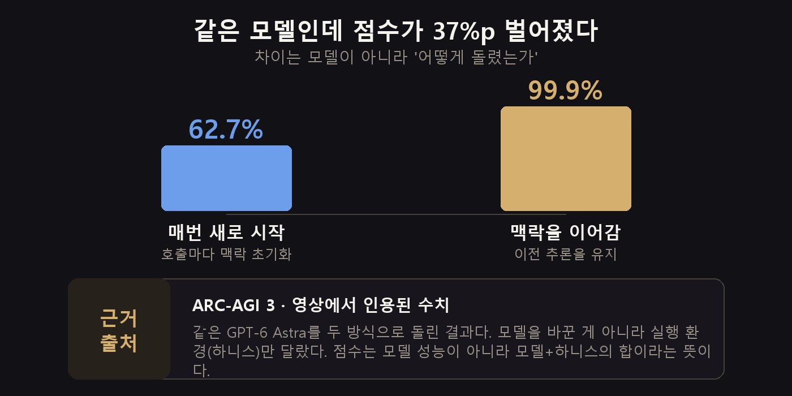
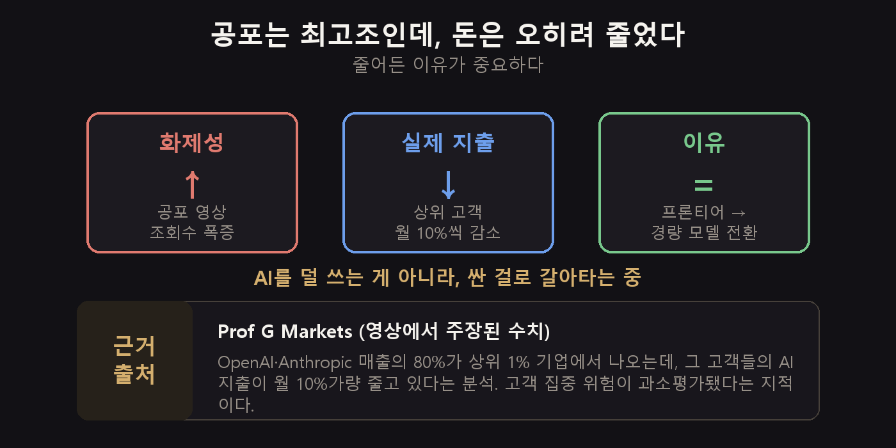
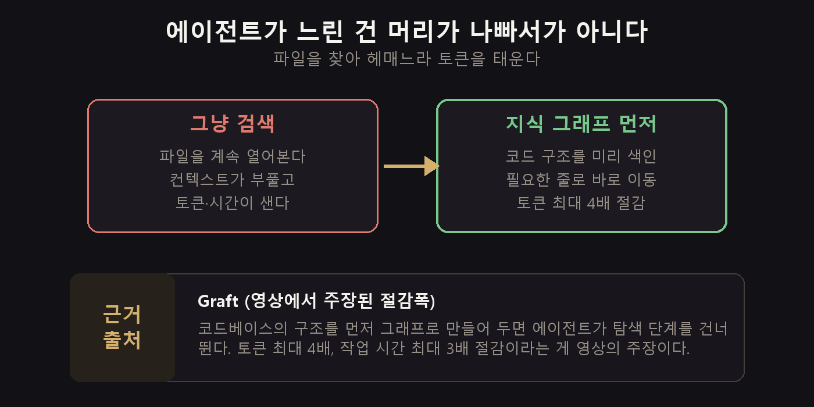

3주 만에 트렌드 정리를 씁니다. 밀린 리포트를 몰아 보다가 좀 이상한 걸 발견했어요.

이번 주 조회수 1위가 **AI가 인류를 멸종시킬 수 있다**는 영상이었습니다. 44만 회. 그 아래로도 "AI 업계가 지금 정말 겁먹었다", "외계인의 정신", "앤트로픽 연구원이 사표를 던졌다" 같은 제목이 줄줄이 이어졌고요.

그런데 같은 주에 올라온 투자 채널 영상은 정반대 얘기를 하고 있었습니다. **기업들이 AI에 쓰는 돈이 줄고 있다**고요.

## 세 줄 요약

- GPT-6 **아스트라**가 나왔습니다. 같은 시험에서 **62.7%와 99.9%를 동시에** 받았어요. 차이는 모델이 아니라 돌리는 방식이었습니다.
- 공포 서사가 최고조였지만, 정작 상위 고객사들의 **AI 지출은 월 10%씩 줄고** 있습니다. 안 쓰는 게 아니라 **싼 모델로 갈아타는** 중이에요.
- 실전에선 **에이전트가 파일을 헤매느라 태우는 토큰**을 잡는 도구들이 떴습니다.

## 아스트라는 왔는데, 점수가 두 개였습니다

OpenAI가 GPT-6 아스트라를 내놨습니다. 공식 채널의 **ChatGPT Work** 소개 영상이 21만 회를 넘겼어요. 음성으로 시키면 PPT·엑셀·워드를 넘나들며 알아서 처리한다는 내용입니다.

성능 얘기가 쏟아졌는데, 그중 제 눈길을 끈 건 벤치마크 숫자였습니다. ARC-AGI 3이라는 시험에서 아스트라가 **62.7%를** 받았다고도 하고 **99.9%를** 받았다고도 하더군요.

둘 다 맞았습니다.

차이는 **하니스**였습니다. 모델을 감싸서 돌리는 실행 환경을 그렇게 부릅니다. 매번 새로 호출해서 맥락을 초기화하면 62.7%, 이전 추론을 이어가게 하면 99.9%가 나왔어요.

같은 모델입니다. 37%p 차이를 만든 건 모델이 아니라 **어떻게 돌렸느냐**였습니다.

> **그래서 나한테는?**
> 새 모델이 나왔을 때 벤치마크 숫자만 보고 판단하면 안 된다는 뜻입니다. 그리고 더 중요한 건, 지금 쓰는 모델도 **돌리는 방식만 바꾸면 성능이 올라갈 여지가 있다**는 거예요. 모델을 갈아타기 전에 이쪽부터 볼 만합니다.

## 쓸 만한가? 15개 작업으로 붙여본 결과

한 채널이 아스트라와 클로드 페이블 5.1을 **실제 업무 15개**로 붙여봤습니다. 벤치마크 말고 실사용이라 참고할 만했어요.

결과는 **아스트라 10승, 페이블 5승**. 다만 숫자 두 개가 더 흥미로웠습니다.

- 비용: 아스트라가 **약 186달러 더 쌌다**
- 시간: 아스트라가 **1시간 43분 더 걸렸다**

싸지만 느린 겁니다. 아스트라는 시각 자료 해석과 복잡한 작업에서, 페이블은 문서 생성과 웹사이트 복제에서 강했다고 하고요.

시간이 돈인 작업이라면 계산이 달라질 수 있습니다. "어느 쪽이 더 좋냐"보다 **내 작업이 어느 칸에 있냐**를 먼저 보는 게 맞습니다.

## 공포 뉴스가 쏟아진 주, 돈은 반대로 움직였습니다

이번 주 화제성은 압도적으로 안전 쪽이었습니다. 터커 칼슨 채널의 초지능 경고 영상이 44만 회, 앤트로픽 전 연구원의 사직 소식, "외계인의 정신"이라는 OpenAI 수석 과학자의 표현까지.

앤트로픽이 직접 낸 오남용 보고서도 무거웠습니다. 클로드가 생물무기 개발과 사이버 공격에 쓰인 정황, 그리고 일부 기업이 클로드의 답변을 자사 모델 훈련에 끌어다 썼다는 내용이 담겼어요.

그런데 같은 주, 투자 쪽에서는 이런 분석이 나왔습니다.

OpenAI와 앤트로픽 매출의 **80%가 상위 1% 기업**에서 나오는데, 그 고객들의 AI 지출이 **월 10%가량 줄고** 있다는 겁니다.

중요한 건 줄어든 이유예요. AI를 덜 쓰는 게 아니라 **비싼 프론티어 모델에서 싼 표준·경량 모델로 갈아타는** 중이라는 분석이었습니다.

공포 서사와 현실의 방향이 정반대인 셈이죠. 뉴스는 "AI가 너무 강해진다"고 하는데, 장부는 "굳이 제일 센 걸 쓸 필요가 없더라"고 말하고 있습니다.

저는 후자가 더 실질적인 신호라고 봅니다. 물론 안전 논의가 중요하지 않다는 뜻은 아니고요.

## 이번 주에 건진 것들

**에이전트가 느린 진짜 이유부터.** 코딩 에이전트가 굼뜬 건 머리가 나빠서가 아니라 파일을 찾아 헤매기 때문입니다. 필요한 코드를 찾겠다고 이 파일 저 파일 열어보면서 컨텍스트가 부풀고 토큰이 샙니다.

**Graft를 미리 돌려두세요.** 깃허브 트렌딩에 오른 도구인데, `graft init`과 `graft build`로 코드베이스 구조를 먼저 그래프로 만들어 둡니다. 그러면 에이전트가 탐색을 건너뛰고 필요한 줄로 바로 갑니다. 토큰 최대 4배, 시간 최대 3배를 아꼈다는 게 영상의 주장이에요. 큰 프로젝트일수록 차이가 크다고 합니다.

**페이블 5.1은 노력 설정을 낮춰보세요.** 앤트로픽 권장과는 반대인데, 한 채널이 실측해보니 낮은 설정이 오히려 품질도 좋고 비용·시간도 아꼈다고 합니다. 저도 아직 안 해봐서 장담은 못 하지만, 한 번 비교해볼 가치는 있어 보입니다.

**유니티 공식 플러그인이 나왔습니다.** 클로드 플러그인 메뉴에서 Unity를 검색하면 설치됩니다. 게임 쪽 하시는 분들은 설정 없이 바로 붙습니다.

**여러 앱에 걸친 일은 한 번에 시키세요.** ChatGPT Work는 앱 하나 안에서 시키는 것보다, "데이터 분석하고 보고서 쓰고 일정까지 잡아줘"처럼 앱을 넘나드는 복합 작업에서 값을 합니다.

## 하나만 남긴다면 — 모델 말고 하니스

여기부턴 이번 주 뉴스가 아니라 오래 갈 얘기입니다.

우리는 보통 결과가 시원찮으면 **모델을 바꿉니다.** 더 비싼 걸로, 더 새 걸로요. 그런데 이번 주 숫자들이 가리키는 건 다른 쪽입니다.

같은 모델이 37%p 차이를 냈고, 에이전트 속도는 검색 방식에서 갈렸고, 품질은 노력 설정에서 갈렸습니다. **전부 모델 바깥의 문제**예요.

그래서 순서를 이렇게 잡는 걸 권합니다.

1. **맥락을 이어주고 있나** — 매번 초기화하고 있진 않은지
2. **필요한 것만 주고 있나** — 탐색으로 토큰을 태우고 있진 않은지
3. **그래도 부족한가** — 그때 모델을 올린다

[지난 편](/p/ai-trend-2026-08-w3/)에서 "지시를 줄일수록 결과가 좋아진다"는 얘기를 했는데, 결이 같습니다. 모델은 이미 충분히 똑똑하고, 병목은 대개 **모델을 감싼 껍데기** 쪽에 있습니다.

## 짚고 넘어갈 것

**"OpenAI가 수학을 풀었다"는** 제목이 여럿 돌았습니다. 폭스 뉴스까지 다뤘고요.

내용은 나비에-스토크스 문제입니다. 클레이 연구소가 건 밀레니엄 7대 난제 중 하나로, 유체 운동이 유한 시간 안에 특이점을 일으킬 수 있는지를 묻는 90년 묵은 문제예요. AI가 여기서 특이점 발생을 보이는 결과를 냈다는 게 발표의 요지입니다.

큰 성과인 건 맞습니다. 다만 세 가지는 같이 봐야 합니다.

- **"수학을 풀었다"가 아닙니다.** 난제 하나에서 한 방향의 결과를 낸 거지, 수학이 끝난 게 아니에요.
- **AI 혼자 한 것도 아닙니다.** 인간이 세운 전략 위에서 방대한 계산을 수행한 형태였습니다.
- **동시에 여러 곳이 붙어 있었습니다.** 앤트로픽 연구자와 독립 수학자도 비슷한 작업을 하던 중이었고, OpenAI가 이를 알고 서둘러 발표했다는 논란이 있습니다.

공포 쪽 제목도 마찬가지입니다. "AI가 우리를 죽일 수 있다"는 경고는 **경청할 가치가 있는 우려**지만, 그게 곧 임박한 사실은 아닙니다. 같은 주에 나온 지출 데이터와 나란히 놓고 보는 편이 균형이 맞습니다.

## 나머지는 짧게

- **ChatGPT Images 2.5**가 나왔습니다. 스케치를 넣으면 그걸 바탕으로 그려줍니다.
- **딥시크 하네스 2.0**이 업데이트됐어요. 이미지 입력과 세밀한 에이전트 제어가 붙었습니다.
- 클로드 코드 **구독을 해지했다**는 영상이 화제였습니다. 오픈 가중치 모델과 [로컬·오픈 모델 조합](/p/llama-cpp-local-llm/)으로 대체하는 실험이었는데, 논지는 [지난달 가격 편](/p/ai-trend-2026-08-w2/)과 같습니다.
- **다빈치 리졸브 21.1**에 AI 어시스턴트가 들어갔습니다.
- 국내에서도 아스트라가 뉴스에 올랐습니다. 반도체·전력 수요 확산 얘기와 함께요.

## 이번 주엔 이거 하나만

**지금 쓰는 AI에게 맥락을 이어주고 있는지 확인해보세요.**

매번 새 창을 열어 처음부터 설명하고 있다면, 그게 62.7%짜리 사용법입니다. 프로젝트 기능이든 메모리든 지식 그래프든, 맥락을 남기는 장치를 하나만 붙여보세요. 모델을 바꾸는 것보다 싸고 빠릅니다.

저는 이번 주에 Graft를 한번 돌려볼 생각입니다. 결과가 괜찮으면 다음 편에 적어둘게요.

여러분은 모델을 바꿔서 해결한 적이 많나요, 아니면 쓰는 방식을 바꿔서 해결한 적이 많나요. 저는 돌아보니 후자가 훨씬 많았습니다.

---

*매주 유튜브 AI 영상 수십 편을 훑어서, 흐름이 되는 것만 골라 "내 작업에 뭐가 달라지나"로 옮기고 근거와 과장 필터를 붙입니다. 이번 편은 2026년 9월 6~12일 조회수 상위 영상을 봤어요. 성능·비용 수치는 각 영상에서 주장된 값이라 직접 검증하진 못했고, 그래서 조건과 반론을 본문에 같이 적었습니다. 나비에-스토크스는 클레이 연구소의 밀레니엄 문제, ARC-AGI는 공개된 벤치마크입니다.*

**출처 영상**
- [ChatGPT Work, now powered by GPT-6 Astra](https://www.youtube.com/watch?v=kuGjypoJKwk) — OpenAI
- [I Tested GPT-6 Astra vs Fable 5.1 on 15 Real Use Cases](https://www.youtube.com/watch?v=WfJPBVXPt8k) — Nate Herk
- [OpenAI's President Says AGI Is Here](https://www.youtube.com/watch?v=Ex4jJXVPnis) — Jason Lowe on AI
- [AI News: The AI World is REALLY Scared Right Now](https://www.youtube.com/watch?v=JwTCjarfJYw) — Matt Wolfe
- [AI Whistleblower: OpenAI Scandal, AI Cults, Neuralink](https://www.youtube.com/watch?v=98syxABbUPk) — Tucker Carlson
- ['Cracks in the AI Thesis'](https://www.youtube.com/watch?v=cs4A6PnO-jw) — Prof G Markets
- [Github Top Trending Tool Just Fixed The AI Agent's Biggest Problem](https://www.youtube.com/watch?v=cyIWQHYoUg8) — AI LABS
- [OpenAI JUST solved math....](https://www.youtube.com/watch?v=lkujyxUdUIk) — Wes Roth
- [AI cracks one of math's biggest unsolved problems](https://www.youtube.com/watch?v=N88n3ndUK1s) — LiveNOW from FOX
- [Anthropic Reports SHOCKING AI Misuse](https://www.youtube.com/watch?v=xQc45TnZK64) — Mint
- [Why I Cancelled My Claude Code Subscription](https://www.youtube.com/watch?v=yFvl2x8_9gI) — Jordan Urbs
- [Introducing the official Unity plugin for Claude Code](https://www.youtube.com/watch?v=rA1RuMheNrY) — Unity
