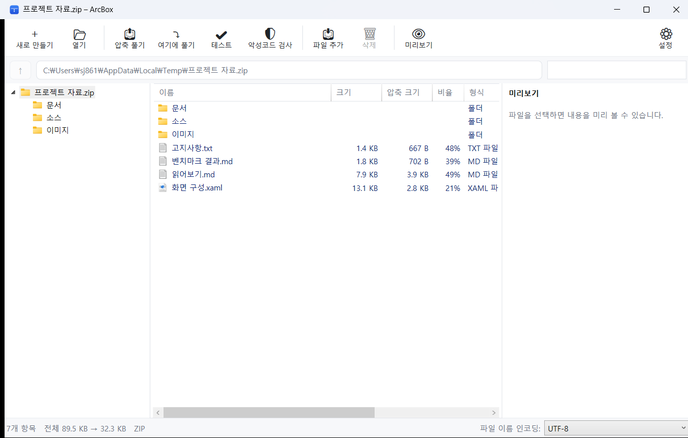
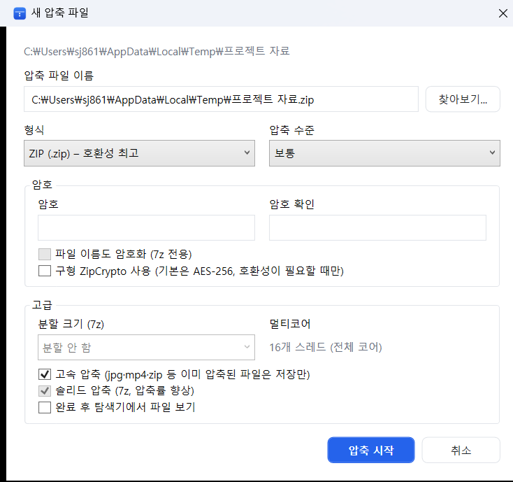

몇 년째 잘 쓰던 무료 압축 프로그램이 있었다. 어느 날부터 압축을 풀 때마다 광고가 뜨기 시작했다.

오늘따라 이게 유독 귀찮고 걸리적거리게 느껴졌다. 유료판을 사면 광고가 없어지는 건 알지만, 압축 푸는 데 돈을 내자니 그것도 내키지 않았다.

요즘 AI가 워낙 뛰어나니, 그냥 한번 만들어보기로 했다.

## ArcBox

**광고가 전혀 없는 무료 압축 프로그램**이다. Windows용이고, C#/WPF와 .NET 10으로 만들었다.

https://github.com/junstellar/ArcBox-free-zip-archiver

- 광고 없음
- 번들 설치 없음 (다른 프로그램 끼워팔기 안 함)
- 결제 유도 없음, 기능 제한 없음
- 소스 전체 공개 (Apache-2.0)

쓰고 싶은 분은 그냥 가져다 쓰시면 된다. 출처 표시만 지키면 회사에서 쓰든 고쳐서 쓰든 상관없다.

## 어떻게 생겼나



탐색기와 비슷하게 생겼다. 왼쪽에 폴더 트리, 가운데에 파일 목록, 오른쪽에 미리보기가 있다. 목록에는 원래 크기와 압축된 크기, 압축률이 같이 나온다.

위쪽 버튼들이 하는 일은 이름 그대로다. **압축 풀기**는 위치를 고르는 창을 띄우고, **여기에 풀기**는 압축 파일이 있는 폴더에 바로 푼다. 파일이 여러 개면 압축 파일 이름으로 폴더를 하나 만들어 그 안에 푸는 것이 기본이라, 압축을 풀었더니 바탕화면에 파일 수십 개가 쏟아지는 일은 없다.

**테스트**는 압축 파일이 깨지지 않았는지 확인하고, **악성코드 검사**는 풀지 않고 내용만 백신에 넘겨 본다. 창에 파일을 끌어다 놓으면 기존 압축 파일에 그대로 추가된다.

아래쪽 상태 줄의 **파일 이름 인코딩**을 바꾸면 목록이 즉시 다시 그려진다. 오래된 압축 파일에서 이름이 깨져 보일 때 쓴다.

### 압축할 때



압축할 파일을 골라 오른쪽 클릭하면 나오는 창이다. 형식과 압축 수준을 고르고, 필요하면 암호를 건다. 기본이 **AES-256**이고, 오래된 프로그램과 주고받아야 할 때만 구형 ZipCrypto를 쓰면 된다. 7z은 파일 이름까지 암호화할 수 있다.

**멀티코어**는 따로 고를 것 없이 항상 전체 코어를 쓴다. 위 화면에서는 16개다.

**고속 압축**은 jpg·mp4·zip처럼 이미 압축된 파일을 다시 누르지 않고 그냥 담는 기능이다. 눌러봐야 크기는 그대로인데 시간만 걸리기 때문이다. 기본으로 켜져 있고, 확장자 목록은 설정에서 고칠 수 있다.

## 뭐가 되나

| | 압축 | 해제 |
|---|---|---|
| ZIP (AES-256, ZIP64, 파일명 인코딩 자동 감지) | ✔ | ✔ |
| 7z (LZMA2, 솔리드, 헤더 암호화, 분할 볼륨) | ✔ | ✔ |
| TAR, TAR.GZ, TAR.BZ2, TAR.XZ, TAR.ZST | ✔ | ✔ |
| GZ, BZ2, XZ, ZST | ✔ | ✔ |
| RAR, CAB, ISO, WIM, ARJ, LZH, CPIO, RPM, DEB, DMG, VHD, MSI 등 | – | ✔ |

압축 20여 종을 풀고, 주요 포맷은 압축도 된다.

## 속도는 신경 써서 만들었다

압축 프로그램에서 제일 중요한 건 결국 속도라고 생각해서 여기에 시간을 많이 썼다.

**zip 압축은 파일을 1 MB 블록으로 잘라 모든 CPU 코어에서 동시에 압축한다.** 보통 압축 프로그램은 파일 여러 개를 동시에 처리할 뿐, 큰 파일 하나는 한 코어로만 압축한다. 그래서 200 MB짜리 파일 몇 개를 압축하면 코어가 남아돌아도 느리다. ArcBox는 파일 하나를 블록으로 쪼개 전 코어에 뿌린다. (pigz라는 리눅스 도구가 쓰는 방식이다.)

**푸는 것도 병렬로 한다.** ZIP은 워커 스레드가 항목을 나눠 동시에 풀고, 7z 같은 건 압축 해제와 디스크 쓰기를 별도 스레드로 분리했다.

### 측정 결과

말로만 빠르다고 하면 의미가 없으니 재봤다. 쓰던 그 프로그램과 같은 조건에서 나란히 돌린 결과다.

**데이터** 8,004개 파일, 878 MiB. 텍스트 파일 8,000개에 200 MB짜리 이진 파일 4개를 섞었다. 작은 파일만 쓰면 파일 하나당 드는 비용만 보이고, 큰 파일만 쓰면 순수 처리량만 보여서 둘 다 넣었다.

**방법** 예열 1회를 먼저 돌리고 버린 뒤, 3회 측정해서 중앙값을 썼다. 푼 결과는 파일 수와 총 바이트를 원본과 대조해서 덜 풀고 빨리 끝난 경우를 걸렀다.

| | ArcBox | 반디집 |
|---|---:|---:|
| **ZIP 압축** | **1.98초** | 3.88초 |
| ZIP 해제 — ArcBox가 만든 파일 | **3.69초** | 4.62초 |
| ZIP 해제 — 반디집이 만든 파일 | **3.63초** | 4.40초 |
| **7z 해제** | **4.24초** | 5.03초 |

압축 결과 크기는 619 MB 대 619.8 MB로 거의 같다. **속도를 얻으려고 압축률을 버린 게 아니라는 뜻이다.**

세 번째 줄이 개인적으로는 제일 마음에 든다. 자기가 만든 파일을 자기가 잘 푸는 건 자랑이 아니라서, **상대가 만든 zip을 양쪽이 각각 푸는 항목**을 따로 넣었다. 남의 파일을 풀어도 결과는 같았다.

악성코드 검사 설정별로도 따로 쟀다.

| 검사 설정 | ZIP 해제 | 7z 해제 |
|---|---:|---:|
| 위험 형식만 (기본값) | 3.69초 | 4.24초 |
| 검사 끔 | 3.74초 | 4.15초 |
| 모든 파일 검사 | 5.32초 | 6.16초 |

기본값과 검사를 끈 것의 차이가 거의 없다. 위험한 확장자만 골라 앞부분만 보기 때문이다. 모든 파일을 검사하면 느려지지만, 그건 선택하는 사람만 감수하면 된다.

### 밝혀둘 것

- **측정 환경** Intel Xeon 6517P (16코어 32스레드), 64 GB RAM, Windows 11. **코어가 적은 PC에서는 병렬화 이득이 줄어든다.** 노트북에서 이 차이가 그대로 나오진 않을 것이다.
- **비교 대상의 에디션을 결과에 기록해두지 않았다.** 무료판은 압축 스레드가 16개로 제한되는데 측정 환경이 32스레드였으니, 압축 항목은 내 쪽에 유리했을 수 있다. 해제 항목은 이 제한과 무관하다.
- **파일 캐시가 더운 상태다.** 반복 측정이라 원본이 메모리에 올라가 있다. 디스크가 느린 환경이라면 차이가 좁혀진다.
- PC 한 대에서 잰 결과다.

측정에 쓴 스크립트와 원본 결과(csv, md)를 저장소 [`bench/`](https://github.com/junstellar/ArcBox-free-zip-archiver/tree/main/bench) 폴더에 그대로 넣어뒀다. 명령 두 줄이면 각자 PC에서 다시 잴 수 있다.

## 그 외 챙긴 것들

**악성코드 검사를 해준다.** Windows에 설치된 백신(Defender 등)을 그대로 불러다가, 압축을 **풀기 전에** 내용을 검사하고 걸리면 저장하지 않는다. 기본은 exe·dll·스크립트·매크로 문서 같은 위험 형식만 검사해서 체감 속도 저하가 거의 없다. 설정에서 끄거나 전체 검사로 바꿀 수 있다.

**압축 파일을 다시 안 풀고 수정할 수 있다.** ZIP과 7z은 파일 추가·삭제·이름 바꾸기가 된다. 창에 끌어다 놓거나 F2, Delete로 된다.

**이미 압축된 파일은 다시 안 누른다.** jpg·mp4·zip·docx처럼 이미 압축된 파일은 저장만 해서 시간을 아낀다. 확장자 목록은 설정에서 고칠 수 있다.

**명령줄 도구도 같이 들어 있다.**

```
arcboxc a photos.zip D:\photos          # 압축
arcboxc x download.zip -o D:\out        # 해제
arcboxc a backup.7z D:\docs -p secret   # 암호 걸어서
arcboxc scan download.zip               # 풀지 않고 백신 검사
```

**Windows 11 우클릭 메뉴에 들어간다.** "추가 옵션 표시"를 거치지 않고 맨 위 메뉴에 바로 뜬다. 설치할 때 체크하면 되고, 원하지 않으면 빼도 된다.

## 받는 곳

**다운로드** — https://github.com/junstellar/ArcBox-free-zip-archiver/releases/latest

설치 파일(`ArcBox-0.1.0-setup.exe`) 하나만 받아서 실행하면 된다. 소스는 [저장소](https://github.com/junstellar/ArcBox-free-zip-archiver)에 있다. .NET 같은 걸 따로 깔 필요 없고, **관리자 권한도 필요 없다.** 내 계정 폴더에만 설치된다.

미리 알아두실 것 두 가지.

**하나.** 유료 코드 서명 인증서가 없어서 처음 실행하면 "Windows에서 PC를 보호했습니다" 경고가 뜬다. **추가 정보 → 실행**을 누르면 된다. 인증서가 연간 수십만 원이라 개인 무료 프로젝트에는 부담이 커서 못 샀다. 소스가 전부 공개돼 있으니 미심쩍으면 직접 빌드해서 쓰셔도 된다.

**둘.** 64비트 Windows 전용이다. Windows 10과 11 모두 된다.

## 마지막으로

혼자 만든 첫 공개 버전(0.1.0)이라 부족한 데가 있을 것이다. 안 되는 게 있거나 이런 기능이 있으면 좋겠다 싶은 게 있으면 GitHub 이슈로 남겨주시면 고맙겠다.

암호 관리자, 손상된 압축 파일 복구, ALZ·EGG 해제는 아직 안 된다. 필요하다는 분이 있으면 붙여볼 생각이다.

광고 없는 압축 프로그램이 필요하셨던 분들께 도움이 되면 좋겠다.

