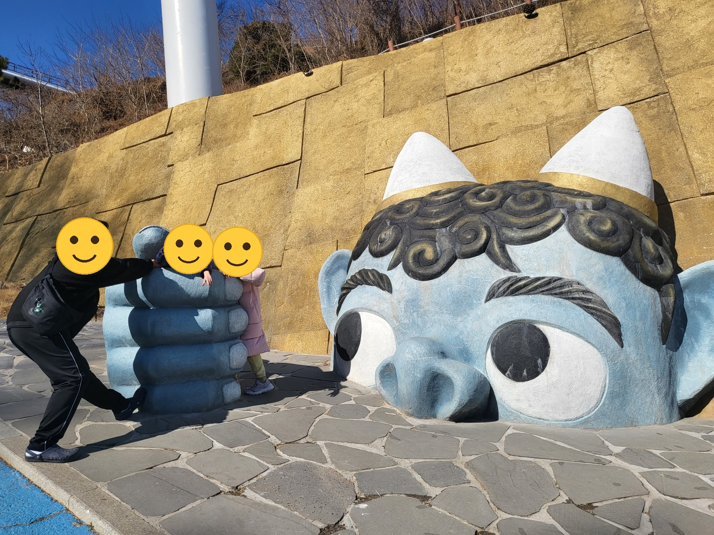
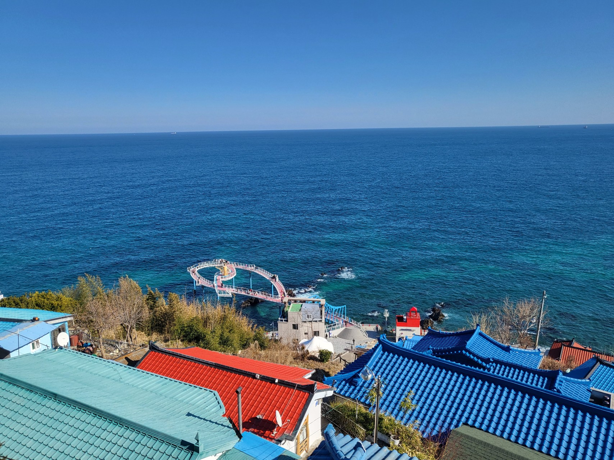

---
title: "对民宿失望的那天，我决定开始露营"
description: "一次东海之行，却被破旧的民宿扫了兴。一句'这笔钱不如买顶帐篷'，露营就这样开始了。这是露营分类的第一篇文章。"
slug: "camping-start"
date: 2026-06-30T12:00:00+09:00
draft: true
image: "sunrise.jpg"
categories: []
tags: []
---
build:
  list: never

这是露营分类的第一篇文章，所以先聊聊我当初是怎么决定开始露营的吧。

那是2023年2月。为了看日出，一家人在东海订了民宿过去。预订时的照片真的很好看，可一推开房门，房间比照片旧多了，打扫也很敷衍。尤其看了床底之后有点吃惊：满是灰尘、垃圾，还有霉斑。花了不少钱，住的却是这样的房间，心里挺不是滋味的。

不过旅行本身真的很好。鬼怪谷看点很多，从论谷潭路俯瞰的东海也格外开阔清爽。在墨湖港吃的枪乌贼生鱼片也非常美味。

第二天清晨，我们也顺利看到了此行要看的日出。

旅行回来后，我忽然冒出一个念头：“这笔钱，还不如直接买顶帐篷？” 用一次住民宿的费用把装备置办齐了，往后就能比住民宿便宜得多，还能去更多地方、跑得更勤。那就是开始。

往后这个博客里，我会一点点写下开始露营之后学到的东西，以及亲身经历后才明白的那些细节。比如装备该按什么顺序买才不后悔、新手常犯哪些错误、去过的营地到底怎么样等等。希望能给正犹豫要不要尝试露营的朋友们，带来哪怕一点点帮助。
