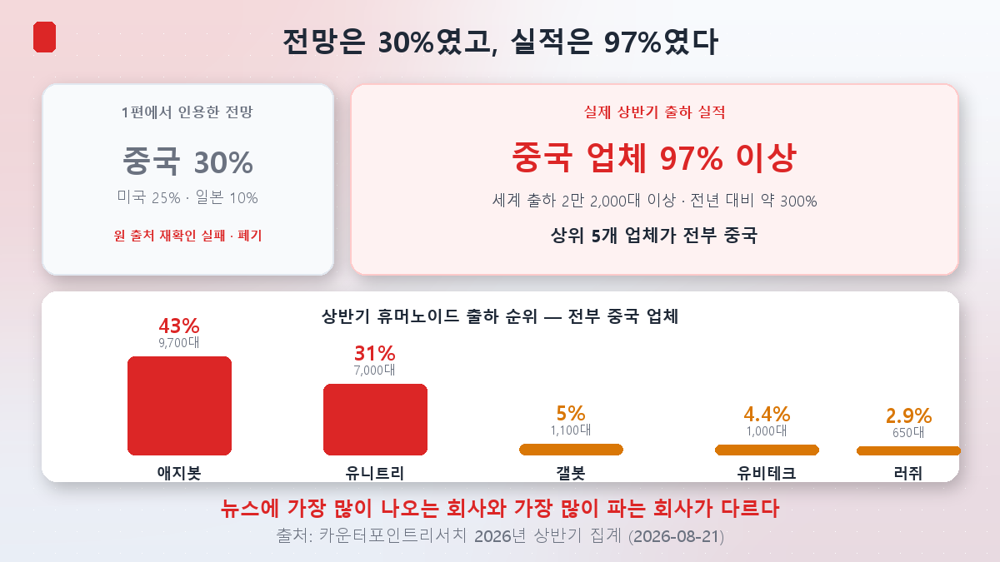
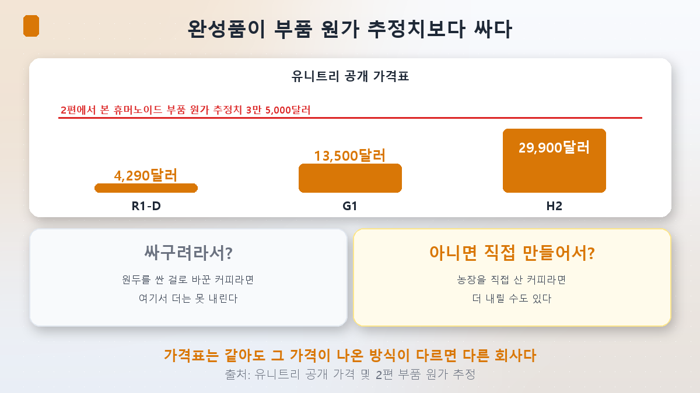
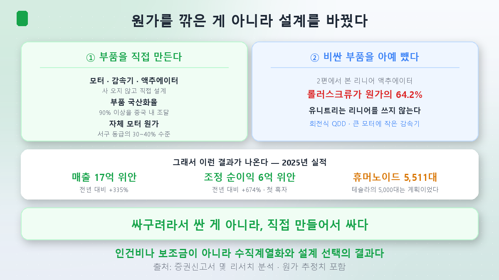
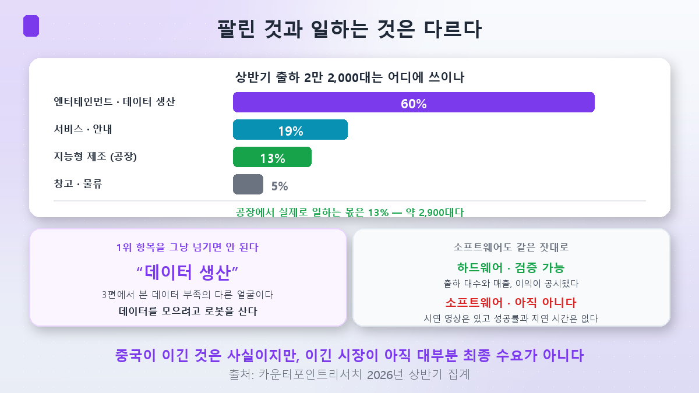
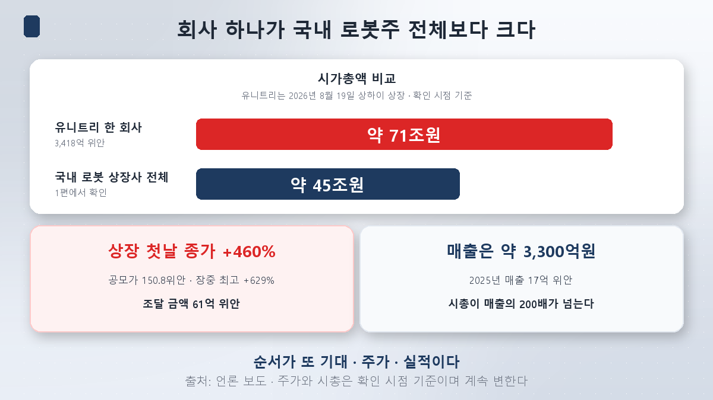

같은 5,000원짜리 커피가 두 종류 있습니다.

하나는 **원두를 싼 걸로 바꿔서** 5,000원입니다. 다른 하나는 **농장을 직접 사서** 5,000원입니다. 가격표는 같지만 완전히 다른 회사입니다. 앞의 회사는 여기서 더 못 내리고, 뒤의 회사는 더 내릴 수 있습니다.

[1편](/p/what-is-physical-ai/)에서 이번 편을 이렇게 예고했습니다.

> **중국 점유율 30% 전망이 정말 가격 때문인지 확인해 보겠다. 다만 "중국은 싸구려"로 결론 내지 말 것.**

확인해 봤더니 **결론을 내기 전에 질문부터 고쳐야 했습니다.**

## 30%가 아니었습니다

먼저 숫자부터 갱신하겠습니다. 1편에서 저는 시장조사업체 전망이라며 **중국 30% / 미국 25% / 일본 10%**를 인용했습니다.

**실제 출하 실적은 이렇습니다.**

카운터포인트리서치가 2026년 8월 21일 발표한 상반기 집계입니다.

| 순위 | 업체 | 국적 | 상반기 출하량 | 점유율 |
|---|---|---|---|---|
| 1 | **애지봇** | 중국 | **약 9,700대** | **43%** |
| 2 | **유니트리** | 중국 | **7,000대 이상** | **31%** |
| 3 | 갤봇 | 중국 | 1,100대 이상 | 약 5% |
| 4 | 유비테크 | 중국 | 1,000대 | 4.4% |
| 5 | 러쥐로보틱스 | 중국 | 650대 | 2.9% |

세계 상반기 출하량은 **2만 2,000대 이상**으로 전년 대비 약 300% 늘었고, 연간으로는 5만 대를 넘길 것으로 전망됩니다. 그리고 **상위 5개가 전부 중국 업체**입니다. 국내 보도 기준 중국 업체의 상반기 출하 점유율은 **97% 이상**입니다.

**30%는 앞으로의 목표가 아니라 이미 한참 지나간 숫자였습니다.**

> 여기서 정직하게 적어두겠습니다. 1편에서 인용한 "중국 30% / 미국 25% / 일본 10%"는 이번에 원 출처를 다시 확인하지 못했고, 실제 출하 집계와 크게 어긋납니다. **전망을 인용할 때조차 실적을 함께 확인해야 한다**는 이 시리즈의 원칙이 저에게 먼저 적용된 사례입니다. 앞으로 이 수치는 쓰지 않겠습니다.

그리고 하나 더. **1위는 유니트리가 아닙니다.** 뉴스에 가장 많이 나오는 회사와 가장 많이 파는 회사가 다릅니다. 애지봇이 9,700대로 유니트리보다 앞섭니다.

## 그래서 얼마인가

이제 원래 질문입니다. 가격 때문일까요.

유니트리의 공개 가격표입니다.

| 모델 | 가격 |
|---|---|
| **R1-D** | **4,290달러부터** (약 600만원대) |
| **G1** | **1만 3,500달러** |
| **H2** | **2만 9,900달러** |

[2편](/p/robot-parts-cost/)에서 확인한 휴머노이드 한 대의 **부품 원가 추정치가 약 3만 5,000달러**였습니다.

**유니트리는 그 추정 원가보다 싸게 완성품을 팝니다.** G1은 그 절반도 안 됩니다.

여기서 보통 이런 결론이 나옵니다. "역시 싸구려구나." 또는 "적자 보면서 밀어내는구나."

**둘 다 틀렸습니다.**

## 유니트리는 흑자입니다

증권신고서에 나온 숫자입니다.

| 항목 | 2024년 | 2025년 | 증감 |
|---|---|---|---|
| 매출 | 3억 9,277만 위안 | **17억 위안** | **+335%** |
| 조정 순이익 | — | **6억 위안** | **+674%** |
| 휴머노이드 출하 | — | **5,511대** | — |

**2025년이 첫 흑자 해였습니다.** 매출의 51.5%가 휴머노이드에서 나왔고, 해외 매출 비중이 약 44%입니다.

싸게 팔면서 돈을 벌고 있습니다. 그럼 어떻게 이게 가능할까요.

## 부품을 직접 만듭니다

여기서 [2편](/p/robot-parts-cost/)과 정면으로 만납니다.

2편에서 우리는 관절 감속기가 일본 두 회사의 과점(하모닉 70%, RV 60%)이고, 한국의 감속기 **국산화율은 35.8%**라고 확인했습니다. 그리고 이렇게 적었습니다. "진입장벽은 낮지 않다. 다만 이미 뚫리는 중이다."

**유니트리가 그 '뚫리는 중'의 실체입니다.**

| 유니트리의 방식 | 내용 |
|---|---|
| **부품 자체 개발** | 모터·감속기·액추에이터·라이다를 직접 설계하고 만든다 |
| **부품 국산화율** | **90% 이상**을 중국 내에서 조달 |
| **자체 모터 원가** | 서구권 동급 제품의 **30~40% 수준**이라는 분석 |

사 오지 않고 만듭니다. 앞의 커피 비유에서 **농장을 직접 산 쪽**입니다.

### 그리고 가장 비싼 부품을 아예 뺐습니다

이게 이번 편에서 제가 가장 놀란 대목입니다.

2편에서 리니어(직선) 액추에이터의 원가 구성을 봤습니다. **롤러스크류 하나가 64.2%**였습니다. 가장 비싼 부품이었죠.

**유니트리는 리니어를 안 씁니다.** 대신 회전 방식인 **QDD(준직접구동)** 액추에이터를 씁니다. 큰 모터에 작은 감속기를 붙이는 구조로, 업계 주류인 작은 모터 + 큰 감속기와 반대입니다.

참고로 **테슬라 옵티머스는 비싼 리니어 액추에이터를 씁니다.**

> **원가를 깎은 게 아니라, 비싼 부품이 필요 없는 쪽으로 설계를 바꿨습니다.**

이건 인건비나 보조금 이야기가 아닙니다. **설계 선택**입니다. 그래서 "싸구려"라는 말이 설명하지 못합니다.

한 리서치는 G1의 부품 원가를 **8,976달러**, 매출총이익률을 **67%**로 추정했습니다. 추정치이고 구성에 따라 달라지지만, 방향은 위 숫자들과 어긋나지 않습니다.

## 여기서 멈추면 반쪽입니다

지금까지만 보면 "중국이 이겼다"로 끝납니다. **그런데 같은 카운터포인트 자료에 이 이야기를 뒤집는 항목이 있습니다.**

상반기에 출하된 2만 2,000대가 **어디에 쓰이는지**를 보면 이렇습니다.

| 용도 | 비중 |
|---|---|
| **엔터테인먼트·데이터 생산** | **60% 이상** |
| 서비스·안내 | 19% |
| **지능형 제조(공장)** | **13%** |
| 창고·물류 | 5% |

**공장에서 실제로 일하는 몫은 13%입니다.** 2만 2,000대 중 약 2,900대입니다.

그리고 1위 항목인 "**데이터 생산**"을 그냥 넘기면 안 됩니다. [3편](/p/nvidia-robot-brain/)에서 로봇의 진짜 병목이 데이터라고 확인했습니다. 그 데이터를 모으려면 로봇을 움직여야 하고, 그래서 **로봇을 사는 겁니다.**

> 즉 출하량의 상당 부분은 **최종 수요가 아니라 학습 데이터를 만들기 위한 장비**입니다.

이건 산업이 준비 단계라는 뜻이기도 하고, 동시에 **출하량 숫자를 실제 수요로 읽으면 안 된다**는 뜻이기도 합니다. 유니트리도 2024년까지는 휴머노이드가 전량 연구·교육·소비자용이었고, 최근에야 니오·지리 조립 라인 같은 실제 현장으로 넘어가는 중입니다.

**팔린 것과 일하는 것은 다릅니다.** 이 시리즈에서 계속 지켜온 구분이 여기에도 그대로 적용됩니다.

### 소프트웨어 쪽도 같은 잣대로

유니트리는 두뇌도 자체 개발하고 있습니다. UnifoLM 계열 모델을 잇달아 공개했고, 최근에는 원격 조종 없이 자율로 격투 동작을 한다는 모델까지 내놨습니다.

다만 이 시리즈의 원칙을 여기에도 적용해야 합니다. **논문도, 성공률도, 지연 시간도, 벤치마크도 공개되지 않았습니다.** 시연 영상은 있는데 검증할 숫자가 없습니다.

| | 검증 가능한가 |
|---|---|
| 하드웨어 | **가능** — 출하 대수, 매출, 이익이 공시됐다 |
| 소프트웨어 | **아직 아니다** — 영상은 있고 지표는 없다 |

**하드웨어는 실적 칸에, 소프트웨어는 아직 시연 칸에 적어야 합니다.**

## 그런데 주가는 또 앞서 갔습니다

유니트리는 2026년 8월 19일 상하이 증시에 상장했습니다.

| 항목 | 수치 |
|---|---|
| 공모가 | 150.8위안 |
| 상장 첫날 종가 | **+460%** (장중 최고 +629%) |
| 시가총액 | **3,418억 위안 ≈ 71조원** |
| 조달 금액 | 61억 위안 ≈ 1조 2,600억원 |

여기서 국내 투자자가 반드시 봐야 할 대비가 나옵니다.

> **유니트리 한 회사의 시총(약 71조원)이, [1편](/p/what-is-physical-ai/)에서 본 국내 로봇 상장사 전체 시총 합계(약 45조원)보다 큽니다.**

그런데 유니트리의 2025년 매출은 17억 위안, 약 3,300억원입니다. **시총이 매출의 200배가 넘습니다.** 1편에서 정리한 순서가 여기서도 그대로 반복됩니다. **기대 → 주가 → 실적.**

국내 증권가 반응도 나왔습니다. 하나증권 김성래 연구원은 이번 상장이 **"양산과 인도가 가능한 순수 휴머노이드 제조사에 붙은 세계 최고 수준의 밸류에이션 프리미엄"**이라고 평가하면서, **"실제 양산·출하 능력이 확인되면"** 국내 기업에도 비슷한 프리미엄이 붙을 수 있다고 봤습니다.

저 조건절이 핵심입니다. **"확인되면"** 입니다.

## 한국은 어디에 서 있나

2편, 3편, 4편을 겹쳐 놓으면 그림이 선명해집니다.

| | 누가 쥐고 있나 | 한국은 |
|---|---|---|
| 두뇌 | 미국 (엔비디아) | GR00T 도입해 쓰는 쪽 |
| 관절·부품 | 일본 (감속기 70%/60%) | **국산화율 35.8%** |
| 몸값·양산 | **중국 (출하 97%, 부품 국산화율 90%+)** | 레인보우로보틱스 연매출 **341억원** |

레인보우로보틱스의 연매출은 유니트리의 **10분의 1 수준**입니다.

한 국내 매체는 이 구도를 **"중국의 근육과 미국의 두뇌 사이"**라고 표현했습니다. 그리고 한국이 기댈 곳으로 세 가지를 꼽았습니다. ①제조 현장 데이터(한국은 제조업 근로자 1만 명당 로봇 1,000대 이상으로 세계 최상위) ②고정밀 부품 ③플랫폼 협업.

이 진단이 맞는지, 시총 45조원이 실제로 무엇에 붙은 값인지는 **5편**에서 종목 단위로 따져보겠습니다.

## 가설 채점

> **중국 점유율 30%는 가격 때문일 것이다.**

- **질문이 낡았습니다**: 30%는 전망이었고, 상반기 실적은 중국 업체가 **97% 이상**, 상위 5개가 전부 중국이었습니다. 1편에서 제가 인용한 전망치는 실적과 크게 어긋났고, 그 수치는 폐기합니다.
- **가격 때문인 건 맞습니다. 다만 이유가 반대입니다**: 싸구려라서 싼 게 아니라 **부품을 직접 만들어서** 쌉니다. 국산화율 90% 이상, 자체 모터 원가는 서구 동급의 30~40% 수준. 그러면서 **2025년 첫 흑자**(순이익 6억 위안, +674%)입니다.
- **예상하지 못한 것 ①**: 2편에서 본 **가장 비싼 부품(롤러스크류 64.2%)을 설계에서 아예 뺐습니다.** 리니어 대신 회전식 QDD입니다. 원가 절감이 아니라 설계 선택이었습니다.
- **예상하지 못한 것 ②**: 뉴스의 주인공과 1위가 다릅니다. **애지봇 43% > 유니트리 31%.**
- **예상하지 못한 것 ③(가장 중요)**: 출하량의 **60% 이상이 엔터테인먼트·데이터 생산용**이고 공장 투입은 **13%**입니다. 중국이 이긴 것은 사실이지만, **이긴 시장이 아직 대부분 최종 수요가 아닙니다.**

**"중국은 싸구려"라는 결론을 내지 말라던 예방주사가 맞았습니다.** 다만 반대편으로 넘어가 "중국이 다 가져갔다"고 하는 것도 똑같이 성급합니다. 팔린 대수와 일하는 대수를 나눠 봐야 합니다.

## 정리

- **중국 30%는 전망이었고, 상반기 실적은 그보다 훨씬 큽니다.** 카운터포인트리서치 집계로 상반기 세계 출하 **2만 2,000대 이상**(전년비 약 300%), 상위 5개가 전부 중국 업체입니다. **1위는 애지봇 43%, 유니트리는 31%로 2위**입니다.
- **유니트리 가격표는 R1-D 4,290달러, G1 1만 3,500달러, H2 2만 9,900달러**입니다. 2편에서 본 부품 원가 추정치 3만 5,000달러보다 싸게 완성품을 팝니다.
- **그런데 흑자입니다.** 2025년 매출 17억 위안(+335%), 조정 순이익 6억 위안(+674%)으로 첫 흑자, 휴머노이드 출하 5,511대. 참고로 테슬라의 옵티머스 "연내 5,000대"는 **계획**이었습니다.
- **비결은 수직계열화입니다.** 모터·감속기·액추에이터를 직접 만들고 부품의 90% 이상을 중국 내에서 조달합니다. 자체 모터 원가는 서구 동급의 30~40% 수준이라는 분석이 있습니다.
- **결정적으로 설계가 다릅니다.** 2편의 최고가 부품인 롤러스크류가 들어가는 리니어 액추에이터 대신 **회전식 QDD**를 씁니다. 테슬라는 비싼 리니어를 씁니다. 원가를 깎은 게 아니라 비싼 부품이 필요 없게 만들었습니다.
- **다만 팔린 것과 일하는 것은 다릅니다.** 상반기 출하량의 **60% 이상이 엔터테인먼트·데이터 생산용**, 공장 투입은 **13%**(약 2,900대)입니다. "데이터 생산"은 3편에서 본 데이터 부족의 다른 얼굴입니다.
- **소프트웨어는 아직 검증 칸에 못 넣습니다.** 유니트리도 자체 모델을 내놓고 있지만 논문·성공률·지연 시간·벤치마크가 공개되지 않았습니다.
- **주가는 또 앞서 갔습니다.** 상장 첫날 종가 **+460%**, 시총 **약 71조원**으로 **국내 로봇 상장사 전체 합계 45조원보다 큽니다.** 매출은 약 3,300억원입니다.

다음 편에서는 이 시리즈에서 가장 미뤄둔 질문을 다룹니다. **한국 로봇주, 무엇을 사는 것인가.** 두뇌는 미국, 관절은 일본, 양산은 중국이 쥐고 있다면 국내 상장사 시총 45조원은 무엇에 붙은 값인지, 완성품과 부품 중 어디에 몰려 있는지 종목 단위로 확인하겠습니다.

> ⚠️ 이 글은 개인 학습 정리이며 특정 종목이나 투자 방식에 대한 권유가 아닙니다. 출하량과 점유율은 카운터포인트리서치 등 조사기관 집계로, 무엇을 휴머노이드로 분류하는지에 따라 달라지며 기관별로 수치가 다를 수 있습니다. 유니트리 실적은 증권신고서 및 언론 보도 기준이고, 부품 원가와 매출총이익률은 **제3자 추정치**로 실제와 다를 수 있습니다. 가격은 공개 정가 기준이며 관세·세금·배송비가 더해지면 실제 결제 금액은 올라갑니다. 주가와 시가총액은 확인 시점 기준이며 특히 상장 직후 종목은 변동성이 극심합니다. 언급한 기업명은 산업 구조를 설명하기 위한 예시이고 매수·매도 의견이 아닙니다. 해외 상장 종목은 환율·규제·정보 접근성에서 국내 종목과 다른 위험이 있습니다. 달러·위안 금액의 원화 환산은 보도 시점 환율 기준이라 현재와 다를 수 있습니다. 투자 판단과 그 결과는 본인의 몫입니다.
