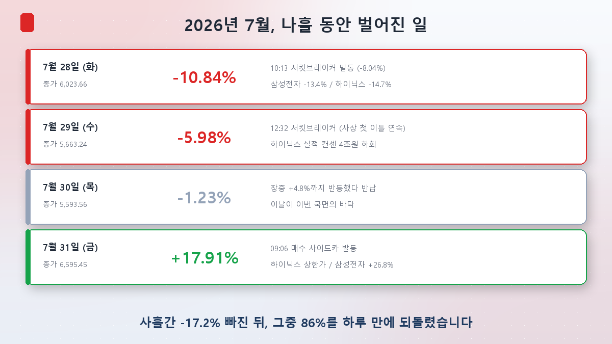
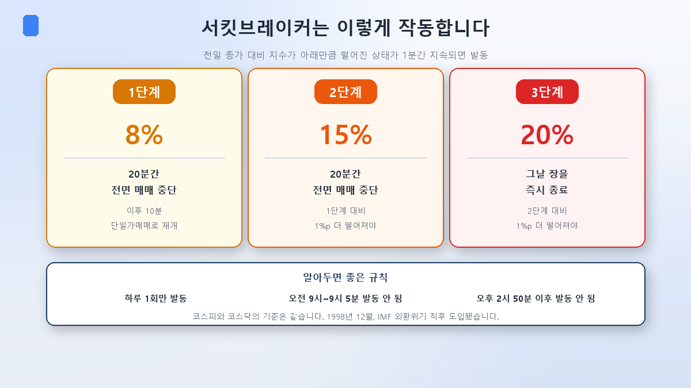
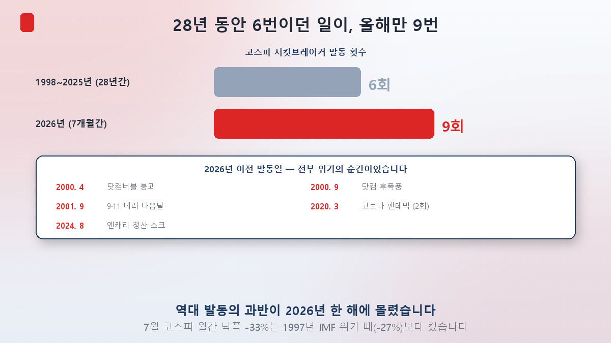
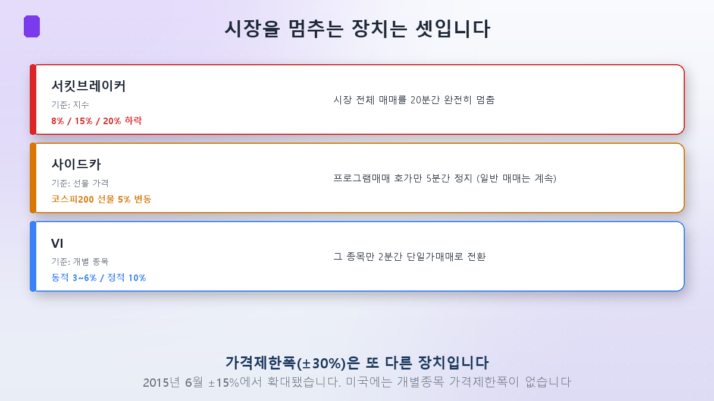

[第1篇](/zh/p/what-is-kospi-index/)讲了指数是什么，[第2篇](/zh/p/index-concentration-trap/)看到两只股票占了指数的60%。

今天来看这套结构真正引爆的那几天：**2026年7月的最后一周**。

## 四天里发生了什么

**7月28日（周二）。**一开盘就崩了。上午**10点13分**，综指跌至−8.04%，**熔断**触发，交易停了20分钟。重开后跌得更深，收盘**−10.84%**（6,023.66）。三星电子跌13.4%，SK海力士跌14.7%。

扳机是前一天在中国扣下的。**中国长鑫存储（CXMT）7月27日在上海上市**，首日较发行价暴涨465%，市值一举达到3.3万亿元人民币（约700万亿韩元）。市场把这读作对韩国存储霸主地位的正面挑战。

**7月29日（周三）。**这次是开盘前，SK海力士的业绩出来了。二季度营业利润**60.5426万亿韩元**——比市场共识（63.6594万亿）低了近4万亿。上午9点的电话会上，公司以美国ADR发行的监管限制为由，对股东回报和业绩指引都没有给出明确说法。

中午**12点32分**，综指再次熔断。这是**史上首次连续两天**触发，创业板同步连续两天停牌也是第一次。当天波动率指数（VKOSPI）盘中冲到**97.99**，创历史新高。

**7月30日（周四）。**盘中一度反弹4.8%，随后悉数回吐，收跌1.23%。事后看，这天就是本轮的**底部**。

**7月31日（周五）。**接着，记录朝反方向诞生了。开盘六分钟后的**9点06分**触发买入方向的sidecar，综指收涨**17.91%（1,001.89点）**报6,595.45——**这是1980年编制指数以来涨幅与点数涨幅的双料历史最高**。SK海力士在下午2点10分前后封上**涨停**（+29.95%），这是2015年涨跌幅放宽到±30%之后的首次涨停。三星电子也涨了26.81%。

是什么扭转了局面？前一夜美国的**微软**发布财报：Azure单季营收首次突破1,000亿美元，增速加快到43%。**Alphabet**反而上调了资本开支指引。"AI投资是不是要熄火"的恐惧，一夜之间被推翻。

三天跌掉17.2%的指数，**一天就收回了其中的86%**。

## 熔断到底是怎么回事

这个词在新闻里天天出现，可真正知道规则的人不多。

当指数较前一日收盘下跌到某个幅度，**并持续一分钟**，熔断触发。

- **一级（−8%）**：全市场停牌20分钟，之后10分钟以集合竞价方式恢复
- **二级（−15%）**：再停20分钟。但还需比一级触发时再低1个百分点
- **三级（−20%）**：当日直接收市。同样需比二级再低1个百分点

有几条值得记住的规则：**一天只能触发一次**；上午9:00–9:05以及**下午2:50之后不会触发**——临近收盘再停已无意义。综指与创业板采用同一套阈值。

这套制度是**1998年12月**、亚洲金融危机之后引入的。

## 可是，这个频率正常吗

本篇最关键的数字来了。

**从1998年到2025年的28年里，熔断一共只触发过6次。**而**2026年一年就触发了9次**。截至7月底累计15次，过半集中在今年。

看看以前的日子是什么日子：2000年4月互联网泡沫破裂、2000年9月余波、2001年9月的9·11次日、2020年3月新冠疫情（两次）、2024年8月日元套息平仓冲击。**每一次都是那个时代的标志性危机。**

这样的事，今年发生了九次。7月综指单月跌幅−33%，比1997年亚洲金融危机时（−27%）还大；同月标普500跌1.7%、纳斯达克跌6.7%、日经225跌11.6%，只有韩国抖得这么厉害。

第2篇提过那两只股票的相关系数是0.82。当它们合起来超过指数一半，一条半导体新闻就能让整个市场动8%。**频繁熔断不是原因，是症状。**

## 那sidecar和VI又是什么

让市场刹车的装置不止熔断一种。把三个分清楚，看新闻会顺畅得多。

- **熔断**以**指数**为准，让全市场交易完全停下。
- **sidecar**以**期货价格**为准。KOSPI200期货波动5%就触发，但停的只是**程序化交易的报价，5分钟**。普通投资者照常交易。7月31日暴涨那天早上触发的就是它。顺带一提，sidecar**在上涨方向也会触发**。
- **VI（波动缓和装置）**以**个股**为准。某只股票剧烈波动时，只有那一只转为2分钟集合竞价。

此外还有**涨跌幅限制**——单日能涨跌的上限，韩国是±30%。原本是±15%，**2015年6月**才放宽。7月31日SK海力士摸到的"涨停"，就是这个+30%的天花板。

值得一提的是：**美国对个股没有单日涨跌幅限制。**一天翻几倍或者腰斩，制度上都不拦。刹车的方式，各国并不相同。

## 停下来真的有用吗 — 反面的说法

这里要提醒一句。"熔断能救市"并不是定论，学界争了将近三十年。

**支持方**的理由很直接：急跌时强制喘口气，切断恐慌性抛售，让投资者有时间重新判断信息。

**反对方**的说法更有意思，它有个名字叫**"磁吸效应（magnet effect）"**。当指数逼近−8%，投资者反而会**加快抛售**——怕停牌之后被困住卖不掉。结果价格像被磁铁吸住一样，更快地被拽向那个阈值。

这不只是理论。**中国在2016年1月1日引入了熔断机制。**1月4日首日就触发；1月7日开盘不到30分钟再次触发，全天提前收市。在"熔断反而助长抛售"的批评声中，中国监管层**在1月8日、也就是推出四天后暂停了该机制**。这至今仍是磁吸效应最常被引用的实例。

## 那一周留下了什么

留下的不只是纪录。

融资余额从6月底的38.6万亿韩元降到7月31日的**28.9350万亿韩元**，减少约10万亿——借钱投资的资金少了四分之一。其中有主动偿还，但相当一部分是**强制平仓**：担保不足，券商自动卖出。7月全月强制平仓约8,000亿韩元规模，**仅7月31日一天就有1,220亿韩元**。也就是说，**在暴涨的那一天，仍有人被强制卖出。**

今年累计强制清算规模已超过4万亿韩元，上半年个人再生申请达81,723件，同比增加13.2%。

## 投资者视角 — 四点

**① 熔断是结果，不是预警。**它一触发，就意味着已经跌了8%。与其想"熔断了就抄底"，不如问这个市场为什么变得这么容易熔断。

**② 三天的暴跌和一天的暴涨同源。**两只股票占了半个指数，那它就会双向剧烈摆动。享受暴涨的同时，波动的代价也一并到来。

**③ 杠杆在这种行情里最先死。**指数最终一天收回86%，可如果你在那之前被强制平仓，这份回补与你无关。能扛住，和把自己设计成扛得住，是两回事。

**④ 制度是缓冲垫，不是盾牌。**正如中国的例子，用来止跌的装置也可能招来抛售。因为有安全网就多冒险，顺序是反的。

## 小结

- **7月最后一周出现了双向纪录。**7月28日−10.84%（熔断），29日−5.98%（史上首次连续两天），31日**+17.91%，46年来最大涨幅**——一天收回三日跌幅的86%。
- **熔断分−8%/−15%/−20%三级**，分别是停20分钟、再停20分钟、当日收市。sidecar在期货波动5%时暂停程序化交易报价5分钟，VI把个股转成2分钟集合竞价。
- **28年6次，今年一年9次。**频繁停牌是集中度的症状，不是原因。而且刹车未必总有用——中国推出四天就收回了。

下一篇[第4篇]是这个系列里我最想写的一篇：**散户为什么在暴跌时买杠杆，却在史上最大涨幅那天卖出？**7月31日，个人净卖出8.2739万亿韩元，外资则以7.2414万亿韩元创下史上最大净买入。

> ⚠️ 本文仅为个人学习整理，不构成任何证券的买卖建议。所引数值为当时情况，随时可能改变。投资决策及责任由本人承担。
