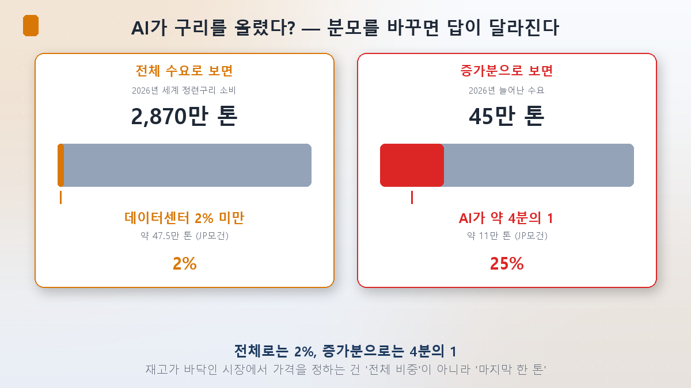
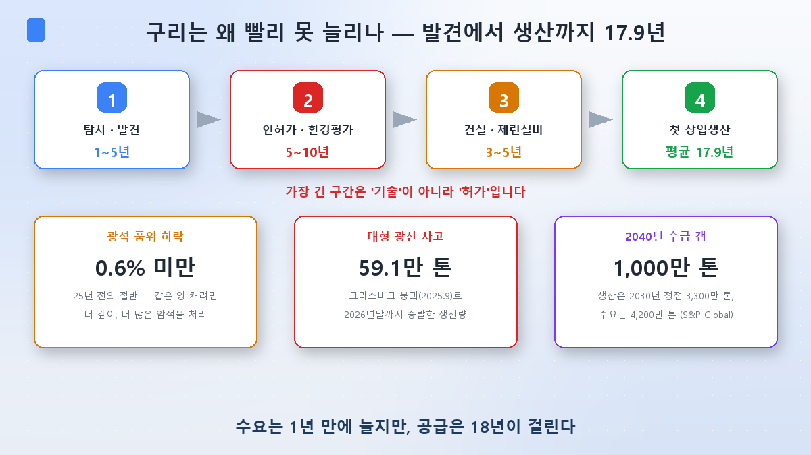
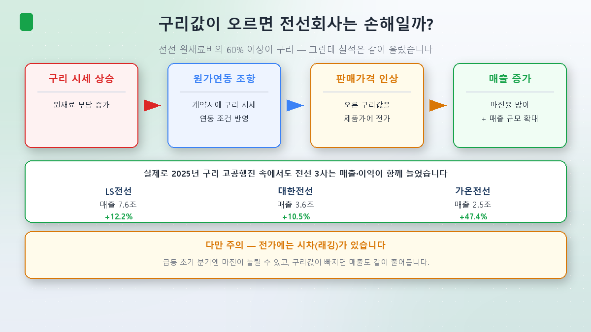
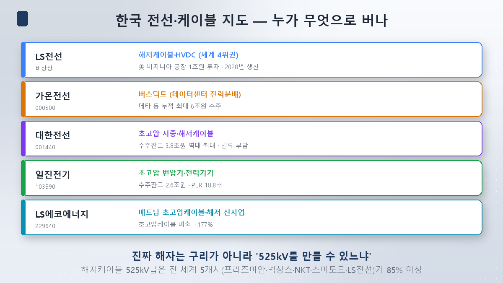

在[第6篇](/zh/p/power-money-river/)里，我画了电力的钱分成发电、输电、配电、冷却四支的三角洲。今天我们下到这条河的**最底层**。正如芯片系列第7篇讲零部件材料设备，电力也有它的那一层，而头号代表就是**铜**。

最近到处都在说"AI把铜推上去了"。铜确实在今年1月29日于伦敦金属交易所(LME)飙至每吨**14,527美元**，刷新历史最高价，单日涨幅是2008年金融危机以来最大。如今回落到13,300~13,600美元区间。

可把数字拆开看，我发现了一件怪事。

## 反转之一 — 数据中心用掉的铜还不到2%

2026年全球精炼铜消费量约**2,870万吨**。其中数据中心用掉的量，按摩根大通估算约**47.5万吨**——**不到全球的2%**。连国际能源署(IEA)也认为，要到2030年数据中心的占比才会达到2%左右。

一个只占总需求2%的东西，怎么把价格推上历史高位？听起来不成立，可**换个分母**，答案就出来了。

2026年铜需求同比增加约**45万吨**（增幅1.6%）。而这个增量里，AI数据中心贡献了约**11万吨**。占总量是2%，可**按新增的部分看就是四分之一**。

还有一记重拳。国际铜业研究组织(ICSG)预计2026年铜市将短缺约**15万吨**。AI新造出来的11万吨需求，几乎等于今年整个供给缺口的规模。

大宗商品市场的道理就在这里。**当库存见底时，定价的不是总占比，而是最后那一吨。**一百个人的餐厅只有99把椅子，定价的是最后到的那个人。数据中心正在扮演最后那个人。

## 而供给要等18年

需求这边是这样，供给为什么跟不上？一座铜矿从**发现到首次商业生产平均要17.9年**。

有意思的是，**最长的一段不是技术，而是审批**。勘探发现1~5年，建设3~5年，可光是许可和环评就要5~10年。砸多少钱都压缩不了这一段。[第3篇](/zh/p/transformer-supercycle/)里我说变压器3~5年交期是瓶颈，铜比那长得多。

再叠加三件事。

- **矿石品位下滑**：平均品位已跌破**0.6%**，只有25年前的一半。要采到同样多的铜，就得挖得更深、处理多得多的岩石。
- **重大事故**：世界级大矿印尼格拉斯伯格2025年9月因坍塌停产。到2026年底蒸发的产量达**59.1万吨**，完全恢复推迟到2028年。
- **长期缺口**：标普全球预测全球铜产量将在**2030年见顶于3,300万吨**后回落，而需求到2040年增至4,200万吨，**缺口1,000万吨**。

## 不过，专家们的判断完全相反

只看到这里，会觉得铜只能涨。可把各机构的预测摆在一起，连方向都是分裂的。

| 机构 | 2026年供需 |
|---|---|
| ICSG（国际铜业研究组织） | **短缺**15万吨 |
| 摩根大通 | **短缺**33万吨 |
| 摩根士丹利 | **短缺**60万吨 |
| **高盛** | **过剩**16万吨 |

只有高盛独家看**过剩**。其逻辑是中国需求比预想的弱，新项目加冶炼产能足以避免出现真正的实物短缺。因此它认为铜难以长期站上每吨11,000美元——比当前价格低约20%。

谨慎派的依据也不轻。**铝替代**是代表：铝的导电率只有铜的61%，但重量只有三分之一，价格便宜得多。布线改用铝可减少5~15%的用铜量，价格暴涨时确实有厂商开始转换。此外**废铜（回收）供给增加**也起到缓冲——价格一高，仓库里睡觉的金属就流向市场。

我的判断是：铜的长期短缺是结构性的（矿山18年这个数字没法谈判），但短期价格已经把这份预期消化了不少。从1月高点14,527美元回落到如今的13,300美元一线，本身就是市场喘了一口气的痕迹。

## 反转之二 — 电线股其实不是在押注铜

到这里，多数人接下来的念头是：*"铜涨了？那买电线股啊。"*

可这条因果链和你想的不一样。**铜占电线原材料成本的60%以上**。按常识，原料涨价电线厂该受损才对。实际呢？

韩国电线业在合同里写入**成本联动（escalation）条款**：铜价上涨，涨幅就反映到售价上。所以铜价一跳，利润率被守住，**营收规模反而变大**。2025年铜价高歌猛进期间，LS电线营收7.6万亿韩元（+12.2%）、大韩电线3.6万亿（+10.5%）、加温电线2.5万亿（+47.4%），三家全都增长，就是这个结果。

当然不是白拿。转嫁存在**时滞（lagging）**，暴涨初期的季度利润率可能被压；反过来铜价回落，营收也会跟着缩。

关键在这儿：**买电线股不等于押注铜价。**铜基本是穿透过去的项目，真正拉开差距的是**卖什么（产品结构）和积压了多少（在手订单）**。

## 那该看什么 — 韩国电线地图

- **LS电线**：海底电缆与HVDC全球前四。正在美国弗吉尼亚州投资约1万亿韩元建设世界最大规模的海底电缆厂，目标2027年下半年竣工、2028年一季度商业投产。**但它是非上市公司**，无法直接投资，通常通过上市关联公司（LS、LS产电、加温电线、LS生态能源）间接持有。
- **加温电线**：LS电线子公司，生产**母线槽（busduct）**——数据中心内部配电用的粗电力干线。已从包括Meta在内的科技巨头累计拿下最高6万亿韩元订单，是这一组里与AI关联最直接的一家。
- **大韩电线**：超高压地下与海底电缆。2026年一季度营收1.0834万亿韩元（+26.6%），营业利润604亿韩元（+122.9%），在手订单3.8273万亿韩元创历史新高。但估值压力大（见下文）。
- **一进电机**：以超高压变压器与电力设备为主，在手订单约2.6万亿韩元。
- **LS生态能源**：越南生产基地。2026年一季度超高压电缆营收暴增**177%**。

而这个市场**真正的护城河不是铜，是技术门槛**。全球能做525kV超高压HVDC海底电缆的只有五家——普睿司曼（意大利）、耐克森（法国）、NKT（丹麦）、住友（日本）和LS电线——这五家拿走市场85%以上。海底电缆市场预计从2025年的200亿美元增至2030年的338亿美元，年增约11%。铜谁都买得到，525kV却不是谁都做得了。

## 投资者视角 — 四点

**① 别看着铜的走势去买电线股。**铜基本是穿透项，照着铜的K线交易电线股，是把因果搞反了。

**② 要看的是产品结构。**同样叫"电线公司"，普通电线和525kV海底电缆的利润率完全不同。高附加值占比上升的公司才会赢。

**③ 估值分化极端。**大韩电线2026年预期PER高达**133倍**、PBR6倍，券商都直言是负担；而一进电机PER仅**18.8倍**，低于同业均值（30~33倍）。同一个题材内部，价格差这么多。[第4篇](/zh/p/power-supercycle-or-bubble/)提出的问题——估值是不是跑到利润前面去了——必须逐只去问。

**④ 扩产完工时点 = 业绩时点。**LS电线弗吉尼亚厂目标2028年一季度，大韩电线唐津海底二厂目标2027年投产。今天积压的订单要到那时才变成营收，意味着预期与业绩之间有近两年的时差。

## 小结

- **数据中心用掉的铜不到全球需求的2%。**价格仍然上涨，是因为AI创造了2026年需求**增量的四分之一**（约11万吨），而这与今年整个15万吨的缺口规模相当。库存见底时，最后一吨定价。
- **供给要等18年。**从发现到投产平均17.9年，其中光审批就5~10年，再叠加品位下滑与格拉斯伯格事故（蒸发59.1万吨）。但高盛独家预测过剩，铝替代与废铜增加也是实打实的反方论据。
- **电线股不是押注铜。**成本联动条款让铜基本穿透过去。真正的动力是**产品结构（525kV海底电缆、母线槽）与在手订单**，真正的护城河是全球仅五家跨得过的**技术门槛**。

下一篇[第8篇]，我们要处理这个系列一直往后拖的最后一支——**冷却**。GPU吐出的热怎么散掉，为什么浸没式冷却被点名为下一个瓶颈。

> ⚠️ 本文仅为个人学习整理，不构成任何证券的买卖建议。所引数值与展望为当时情况，随时可能改变。投资决策及责任由本人承担。
