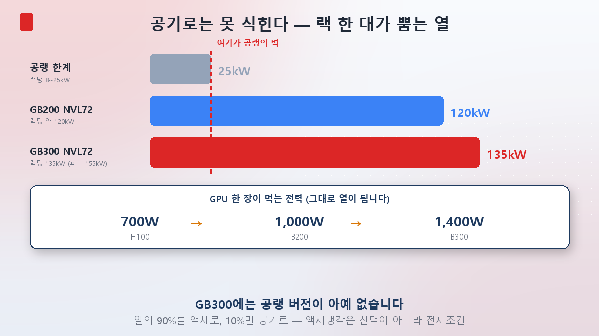
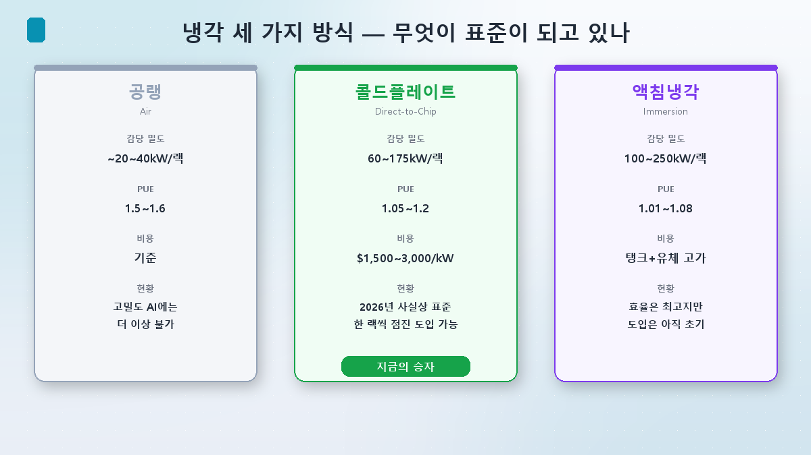
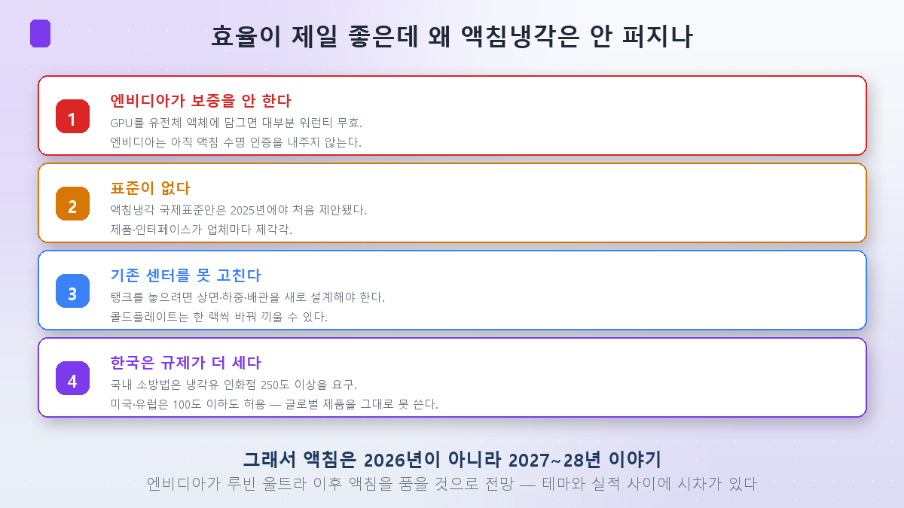
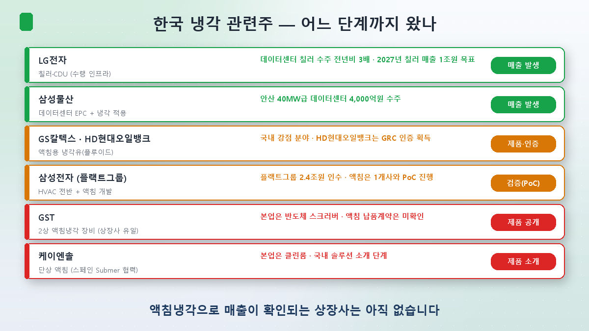

[第1回](/ja/p/ai-power-hunger/)でAI電力難を発電・伝達・冷却の3方向に分け、[第5回](/ja/p/power-value-chain-map/)と[第6回](/ja/p/power-money-river/)では「冷却は第8回で別途」と先送りしてきました。今日がその第8回です。

これまでの回が電気を**入れる**話だったなら、今日は**出す**話です。データセンターに入った電気はほぼ100%が熱に変わります。135kWを食うラックは、135kWのヒーターでもあります。その熱を抜けなければサーバーは止まります。

## 空冷はすでに壁にぶつかりました

数字を二つ並べるだけで話は終わります。

空気で冷やせるラックの限界はおよそ**8〜25kW**です。特殊設計をしても30〜40kWが熱力学的な天井とされます。ところがエヌビディアの**GB300 NVL72ラックは135kW**(ピーク155kW)を吐きます。壁の**5倍**を超えます。

だから結論は明快です。**GB300には空冷バージョンが存在しません。**熱の90%を液体で抜き、10%だけを空気で処理する構成が既定値です。液体冷却は「より効率的な選択肢」ではなく、**製品が強制する前提条件**になりました。

チップ単位で見るとさらに鮮明です。H100が700Wだったのに、B200は1,000W、B300は**1,400W**。GPU一枚が電気毛布一枚ほどの熱を出します。[第6回](/ja/p/power-money-river/)でラック密度が8kWから120kWへ跳ねたと書きましたが、その数字の裏面がこの熱です。

## 方式は三つ、ところが勝者は予想と違います

冷却方式は大きく三つです。

**空冷**は見たとおり高密度AIにはもう答えになりません。PUE(電力使用効率、1に近いほど良い)も1.5〜1.6台と悪い。

**コールドプレート(Direct-to-Chip)**はチップの上に水が流れる金属板を貼り、熱を直接受け取る方式です。ラック当たり60〜175kWに対応し、PUEは1.05〜1.2まで下がります。

**液浸冷却(Immersion)**はサーバーを丸ごと電気を通さない誘電体液体に沈める方式です。ラック当たり100〜250kW、PUEは**1.01〜1.08**と三つの中で最良です。

ならば液浸が勝つはずですが、現実は違います。**2026年現在の事実上の標準はコールドプレート**で、液浸の世界のデータセンター導入率はまだ**5%未満**です。

## 効率が一番いいのに、なぜ液浸は広がらないのか

ここが今回いちばん重要な箇所だと思います。

**① エヌビディアが保証しません。**これが決定的です。GPUを誘電体液体に沈めると**大半の保証が無効**になります。エヌビディアは液浸冷却に対する寿命認証をまだ出していません。数億ウォン相当のGPUを保証なしで液体に沈める運用者はいません。付け加えると、インテルはShell・スーパーマイクロ・Submerと組んでXeon向けに保証が維持される単相液浸ソリューションをすでに出しています — 技術的に不可能だからではない、ということです。

**② 標準がありません。**液浸冷却の国際標準案は2025年になってようやく初めて提案されました。タンクも流体もインターフェースも事業者ごとにばらばらです。

**③ 既存センターを改修しにくい。**タンクを置くには床面・荷重・配管を設計し直す必要があります。対してコールドプレートはラック単位で一つずつ入れ替えられます。この「漸進的導入が可能」という点が実戦で勝負を分けました。

**④ 韓国は規制がもう一枚あります。**国内の消防法・危険物安全管理法は冷却油の引火点を**250度以上**と要求しますが、米国・欧州は100度以下も許容します。グローバル標準製品をそのまま持ち込めない構造です。

総合すると、液浸冷却は**2026年ではなく2027〜28年の話**と見るのが妥当です。市場はエヌビディアがルビン・ウルトラ世代以降に液浸を取り込むと見ています。

## では韓国銘柄はどこまで来ているのか

ここで投資家にとって重要な問いが出ます。「液浸冷却関連株」としてが上がった銘柄は、実際に稼いでいるのでしょうか。

私が調べた範囲での結論はこうです。**液浸冷却そのもので有意な売上が確認できる韓国の上場企業は、まだありません。**

- **LG電子**はこの中で実際にお金が回っているのが確認できる側です。ただし液浸ではなく**チラー・CDU(冷却水分配装置)**などの水冷インフラです。データセンター向けチラー受注が前年比3倍に増え、2027年にチラー事業の売上1兆ウォンを目標にしています。
- **サムスン物産**は安山の40MW級データセンターを4,000億ウォンで受注しました。ただしこれは設計・施工(EPC)の一括受注で、冷却だけを切り出した売上ではありません。
- **GSカルテックス・HD現代オイルバンク**は液浸用の**冷却油(フルード)**を作ります。製油会社の潤滑基油技術がそのまま生きる分野で、韓国が実際に強みを持つ領域です。
- **サムスン電子**は欧州最大のHVAC企業フレクトグループを2.4兆ウォンで買収しましたが、液浸はまだ1社とPoC(概念実証)を進める段階です。
- **GST**は韓国の上場企業で唯一、2相液浸冷却装置の技術を持ちます。ただし最近の好業績は本業である半導体スクラバーによるもので、液浸の納品契約は確認されていません。
- **ケイエンソル**は世界首位のSubmerと協力し、国内にソリューションを紹介する段階です。

## 投資家の視点 — 四つの段階で確認する

テーマと実績を切り分けるのに使える基準があります。冷却関連株を見るとき、次の**四段階**のどこまで来ているかを確認することです。

| 段階 | 確認すること |
|---|---|
| 1 | 製品・容量を公開したか |
| 2 | 外部顧客と実証(PoC)をしたか |
| 3 | **有償の納品契約を開示したか** |
| 4 | **リピート発注が入っているか** |

MOUとサンプル供給は1〜2段階です。事業になるのは3段階からで、投資に足る実績は4段階で出ます。国内の液浸関連銘柄の大半はまだ1〜2段階にあります。

これに三点を付け加えます。

**① いまお金になるのは液浸ではなく水冷です。**コールドプレート・チラー・CDUが実際に発注の出る領域です。[第7回](/ja/p/copper-cable-ai/)で「銅の相場で電線株を買うな」と述べたのと同じ構造です。**テーマの名前と売上が立つ場所が違います。**

**② 韓国の本当の強みは冷却油かもしれません。**タンクとシステムはSubmer・GRCなど海外企業の技術を導入する構造ですが、冷却油は製油会社が自社技術で認証まで取りました。

**③ トリガーはエヌビディアです。**液浸関連株の実績がいつ付くかは、結局エヌビディアがいつ液浸の保証を開くかにかかっています。企業のIRより、エヌビディアの冷却認証方針を見るほうが早い。

## そして水の問題が残ります

冷却には電気だけでなく**水**もかかります。米国データセンターの直接の水使用量は2023年の174億ガロンから2028年には380〜730億ガロンへ増える見通しです。すでに20以上の州でデータセンターの規制・モラトリアム議論が起きており、2026年第1四半期だけで1,300億ドル規模のプロジェクトが遅延・撤回されました。

[第4回](/ja/p/power-supercycle-or-bubble/)で「米国データセンターは計画量に対して実際の着工が少ない」と述べた理由の一つがここにあります。電力の次の関門が水であり、だからこそ無水(waterless)・閉ループ冷却が新しい話題として浮上しています。

## まとめ

- **液体冷却はもう選択ではありません。**空冷の限界はラック当たり25kW、GB300は135kWを吐きます。エヌビディアがそもそも空冷版を作りません。
- **ところが勝者は液浸ではなくコールドプレートです。**液浸は効率(PUE 1.01〜1.08)が最良なのに導入率は5%未満。エヌビディア未保証、標準の不在、改修の難しさ、韓国では引火点規制が重なりました。液浸は2027〜28年の話です。
- **国内で液浸の売上が確認できる上場企業はまだありません。**お金はチラー・CDU(LG電子)と冷却油(製油会社)で先に立ちます。銘柄を見るときは製品公開 → 実証 → **有償契約の開示** → **リピート発注**の四段階のどこかを確認してください。

次回・第9回では、ここまでに出てきた銘柄を一枚の盤に集めます。**韓国電力株の地形図** — 発電から冷却まで、それぞれの銘柄がどこに立ち、何で区別されるのかを整理します。

> ⚠️ この記事は学んだ内容の整理であり、特定銘柄の売買を推奨するものではありません。引用した数値と見通しは当時のものでありいつでも変わり得ます。投資判断とその責任はご自身にあります。
