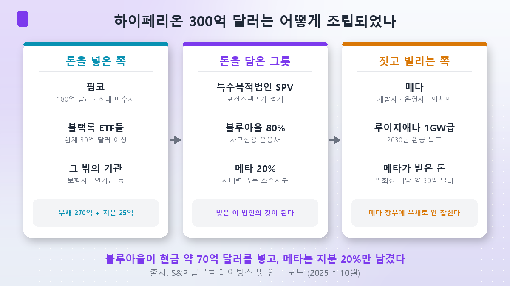
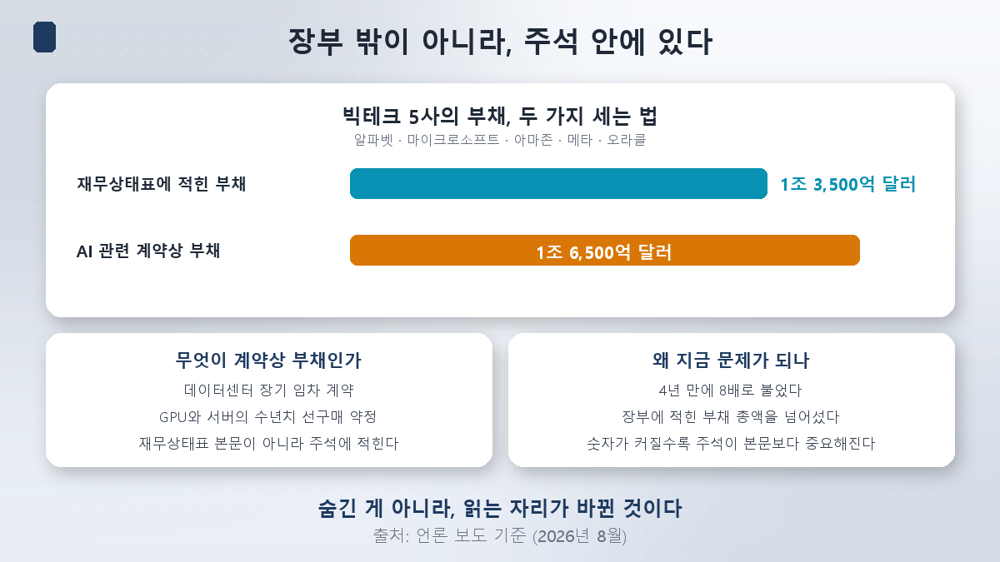
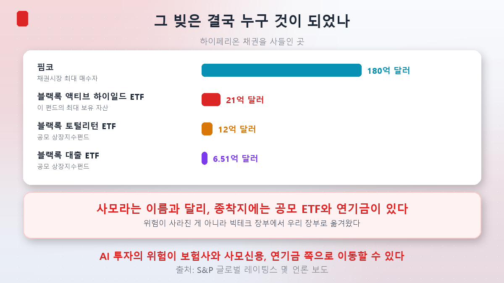
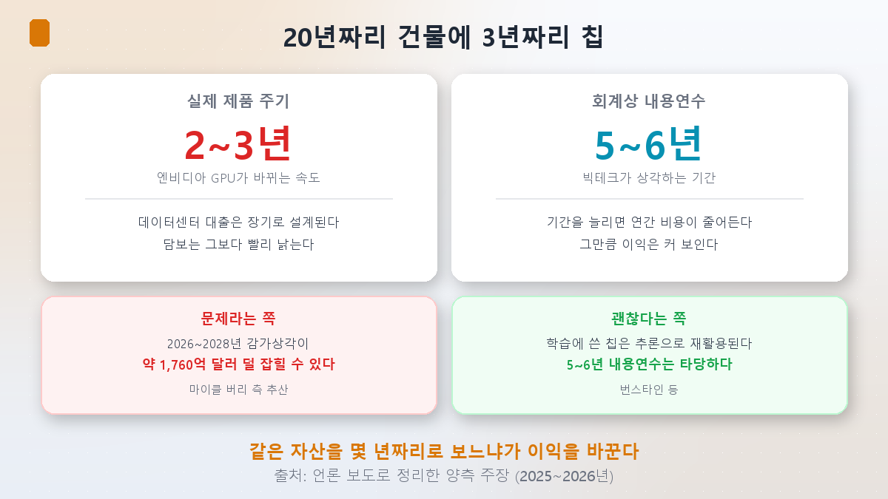

[第1篇](/zh/p/why-bigtech-borrows/)里看了钱进来的三扇门：公司债、增发，以及**账本之外**。今天只挖第三扇。

## 「我名下一笔贷款都没有」

假设你想盖一栋楼，需要三千亿。从银行借，那就是你的债。所以你换个做法。

你和一群投资者一起成立一家**新公司**。你只拿**20%**的股权，剩下80%归投资者。这家公司去银行借三千亿把楼盖起来。竣工之后，你以**承租人**的身份搬进去，签二十年长租。

现在问题来了：**那三千亿是谁的债？**

法律上是那家公司的债。它不会出现在你的财务报表里。因为你只有20%，甚至不需要把那家公司并进你的合并报表。你只是**租客**而已。

而这就是Meta此刻在路易斯安那州做的事。

## 300亿美元的解剖图

Meta正在路易斯安那州里奇兰教区兴建一座1吉瓦级的数据中心，名叫**Hyperion**，目标2030年竣工。投进去的钱是**300亿美元**。

把结构拆开来看是这样的。

| 要素 | 内容 |
|---|---|
| 设计 | 摩根士丹利以**特殊目的公司（SPV）**的形式主导 |
| 筹措 | **债务270亿美元＋股权25亿美元** |
| 股权 | **蓝猫头鹰资本80%／Meta 20%**（标普全球评级） |
| Meta的角色 | 开发者·运营者·**承租人** |
| 现金流向 | 蓝猫头鹰投入现金约70亿美元，**Meta收到约30亿美元的一次性分红** |

**特殊目的公司（SPV）**是为了单独一个项目而设立的壳公司：一座电厂、一条收费公路、一座数据中心。项目结束就清算。由这家公司去借钱，并且只用它自己的资产承担责任。

这里值得盯住的数字是**20%**。持股到这个水平，就不会被认定为**控制**这家公司。不构成控制，就不必并入合并报表，债务自然也不会跟过来。

然后请再看最后一行。**Meta一边盖数据中心，一边反而收到了30亿美元现金。**想想第1篇里的处境——一家自由现金流已经枯竭的公司——这一行就把这个结构的吸引力解释完了。

## 可是「账本之外」这个说法准确吗

这里我得检验自己在第1篇里用过的措辞。我写的是「这笔债务不会出现在Meta的账上」。**这个说法并不准确。**

Alphabet、微软、亚马逊、Meta和甲骨文五家的**AI相关合约义务**合计达到**1.65万亿美元**，**四年间增长了8倍**。

这个数字有多重，要放在旁边那个数字边上才看得出来。同样这五家公司**资产负债表上记录的实际负债总额是1.35万亿美元**。**合约义务已经超过了账面负债。**

所谓合约义务，指的是这类东西：

- 承诺租用数据中心二十年的**长期租赁合约**
- 预先买下数年份GPU和服务器的**预购协议**

这些不写在资产负债表正文里，但**写在附注里**。也就是说，没有藏起来，**只是阅读的位置变了**。

所以准确的说法不是「账本之外」，而是**「正文之外，附注之中」**。问题在于，这个数字如今已经比正文还大。不读附注，就等于看不见这家公司的一半。

## 那么这笔债去哪儿了

这是本篇的核心。

我准备这一篇时，本打算掂量一个问题：这是在掩盖风险，还是本来就是基础设施的筹资方式？可看着资料，**我发现问题本身问错了。**

债务既没有被藏起来，也没有消失。**它只是搬到了别人的账本上。**问题是那个「别人」是谁。

买家名单如下。

| 买方 | 规模 | 性质 |
|---|---|---|
| **品浩（PIMCO）** | **180亿美元** | 债券市场最大买家 |
| **贝莱德主动型高收益ETF** | **21亿美元** | **该基金的第一大持仓** |
| 贝莱德总回报ETF | 约12亿美元 | 公募上市交易基金 |
| 贝莱德贷款ETF | 约6.51亿美元 | 公募上市交易基金 |

贝莱德旗下的ETF一共装进了**超过30亿美元**的这批项目债券。而其中一只里，这个头寸已经成了**该基金持有资产中最大的一项**。

**私募信贷（private credit）**这个名字，听上去像是钱只在少数机构之间打转。可顺着终点找过去，那里站着的是**公募上市交易基金**。ETF只要有证券账户，谁都能买。

韩国经济新闻也提出了同样的观察：AI投资的风险**可能正从科技巨头转移到保险公司、私募信贷和养老金那一侧。**

归结成一句话：**风险没有消失，它从科技巨头的账本搬到了我们的账本上。**

## 这是安然吗

这个问题躲不掉——安然当年也用SPV。不过这里需要把天平摆正。

**先看不一样的地方。**

- 安然是**隐瞒**。它用Chewco、Raptors这类实体藏起负债、虚增利润。而Hyperion是**公开披露的结构**。标普全球评级公布了股权比例，连哪只ETF装了多少都查得到。我能写出这篇文章，靠的就是这一点。
- 安然的资产有相当一部分是**虚构的**。Hyperion是一座真在盖的1吉瓦建筑。

**而且SPV本身并不是什么稀奇东西。**

项目融资和SPV从二十世纪后期起，就是建设大型基础设施的**标准做法**。电厂、收费公路、通信网、输油管道都是这么盖起来的。数据中心建成后能从机柜租金、电费和运营服务里产生现金流，所以REITs、基础设施基金和养老金现在把它们当作**基础设施资产**来配置。

**韩国做的是完全一样的事。**国内数据中心也是用PFV（项目金融投资公司）来建、用REITs来退出。只是名字不同，语法一样。

规模也要看。摩根士丹利估计，到2028年全球数据中心建设需要**1.5万亿美元**，其中**私募信贷可以供给一半以上、约8,000亿美元**，其余是公司债2,000亿、证券化产品1,500亿。韩国银行纽约事务所也分析称，今年科技巨头AI资本支出中**约40%将通过私募信贷**筹措。

美国私募信贷市场的规模大约是**1.3万亿美元**。金融稳定理事会（FSB）按2024年末口径估计为1.5万亿至2万亿美元。

**所以这是一个产业，不是一场骗局。**问题只在于，这个产业在短短几年里长得太快了。

## 真正的风险在别处

如果不是安然式的隐瞒，那该看什么？两件事。

### 其一，期限对不上

数据中心贷款是按长期设计的，建筑能用二十年。可装在里面的**英伟达GPU，产品周期是2到3年**。抵押物比贷款老得快得多。

于是折旧的争论就来了。**折旧**是把长期使用资产的价值分摊到使用年限里计入费用的会计处理，分摊的年限叫**折旧年限**。

《大空头》里的迈克尔·伯里提出了质疑：科技巨头把2到3年周期的芯片**按5到6年来折旧**。年限拉长，每年计入的费用就变少，利润看上去自然就更大。

算术很简单。微软如果把一年600亿美元的设备按六年折旧，年费用是100亿美元；改成三年就是**200亿美元**。同一批设备，利润相差100亿。伯里一方估算，这种做法可能让**2026至2028年的折旧少计约1,760亿美元**。

**反驳同样有力。**伯恩斯坦等机构认为5到6年是合理的：AI芯片在训练用途结束后往往**被改作推理使用**，而且还承担训练之外的工作负载。现实中旧一代GPU很多不是报废，而是转去做别的任务。

谁对谁错还没有定论。但至少要知道一件事：**把同一批资产看成几年期的，利润就会相差数百亿美元。**

### 其二，监管跟不上这个速度

适用于私募信贷的资本规则，是按一个**更小、更常规的市场**来设计的。而这个市场现在投出去的钱，投向的是**单一租户使用、技术上快速贬值**的设施。性质不一样。

法律那边也开始有信号。美国的律师事务所已经在发布提示AI数据中心融资**诉讼风险**的报告。部分交易是以**平均约11%的浮动利率**筹措的，还款从2026年1月开始。

## 落到普通投资者身上的地方

**第一，你可能已经持有了。**如果你手上有全球高收益债券ETF或海外债券型基金，里面很可能就装着数据中心项目债。在贝莱德的主动型高收益ETF里，这只债券是**第一大持仓**。建议查一查自己所持产品的持仓明细。

**第二，同样的结构在国内也在运转。**韩国的数据中心PF同样是用PFV来建、用REITs来回收。建筑公司和券商的相关敞口到底有多大，是另一个值得单独算的问题。

**第三，这些钱最终会碰到利率。**无论流向私募信贷还是公司债，资金都出自同一个市场。顺带一提：**2026年发行的、期限在15年以上的美国投资级公司债中，有40%由AI相关企业发出。**这个数字放在**第3篇**正式处理。不过第3篇我打算从相反的方向来验：真的是AI把利率推上去的吗？

## 小结

- **Hyperion 300亿美元的结构**：摩根士丹利以SPV设计，债务270亿＋股权25亿，**蓝猫头鹰80%／Meta 20%**。Meta是开发者、运营者兼承租人，而且**反过来收到了约30亿美元的一次性分红**。
- **「账本之外」是个不准确的说法。**五大科技巨头的**AI相关合约义务达1.65万亿美元**，四年增长8倍，**已经超过其1.35万亿美元的账面负债总额**。它在附注里而不在正文里，但并没有消失。
- **风险搬到了别的账本上。**品浩买了**180亿美元**，贝莱德的ETF买了**超过30亿美元**，其中一只ETF里它已是**第一大持仓**。名字叫「私募」，终点却站着公募ETF和养老金。
- **这不是安然。**安然是隐瞒，资产也有虚构成分。这是公开披露的结构，而且实物真的在盖。SPV和项目融资本就是建电厂、建通信网的标准方法，韩国的数据中心也用PFV和REITs做同一件事。
- **真正的争点是期限错配。**建筑二十年，GPU两三年，会计年限五到六年。伯里一方认为2026至2028年折旧**少计约1,760亿美元**，伯恩斯坦等以推理再利用来反驳。尚无定论。

下一篇要换个方向。到目前为止，我是带着**「AI企业的负债推高了利率」**这个前提开始这个系列的。第3篇我要**站在怀疑的一边**来检验这个前提。美国银行认为，公司债与住房抵押贷款证券只解释了今年10年期收益率上行中的**约0.3个百分点**。那么剩下的，是被什么推上去的呢？

> ⚠️ 本文仅为个人学习整理，不构成对任何个股、基金或投资方式的建议。文中的融资结构与持仓规模均为核对时点（2026年8月25日）的披露、评级机构资料与报道口径，基金持仓会随时变动。请务必以管理人的最新资料自行核实自己所持产品的持仓明细。关于折旧年限的双方主张仍是尚未有结论的争论，本文不支持其中任何一方。投资决策及其后果由本人承担。
