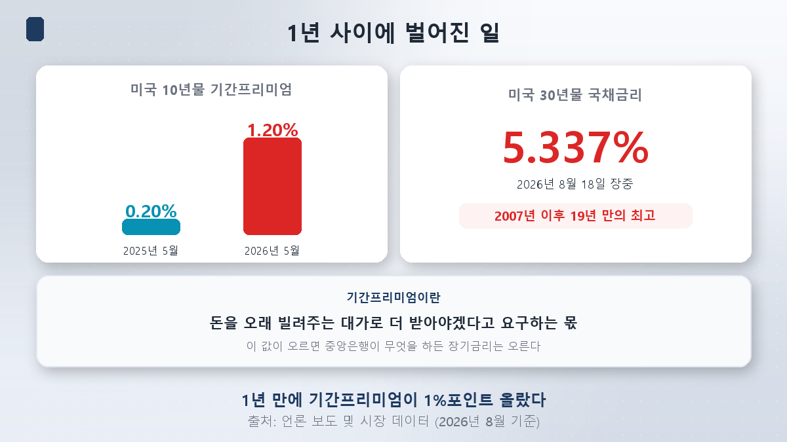
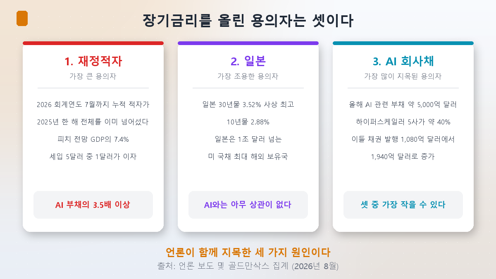
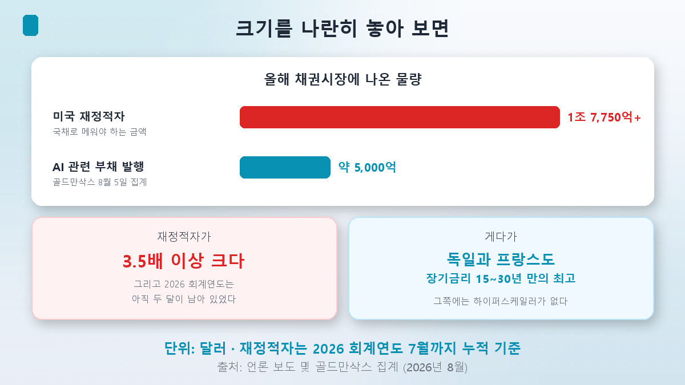
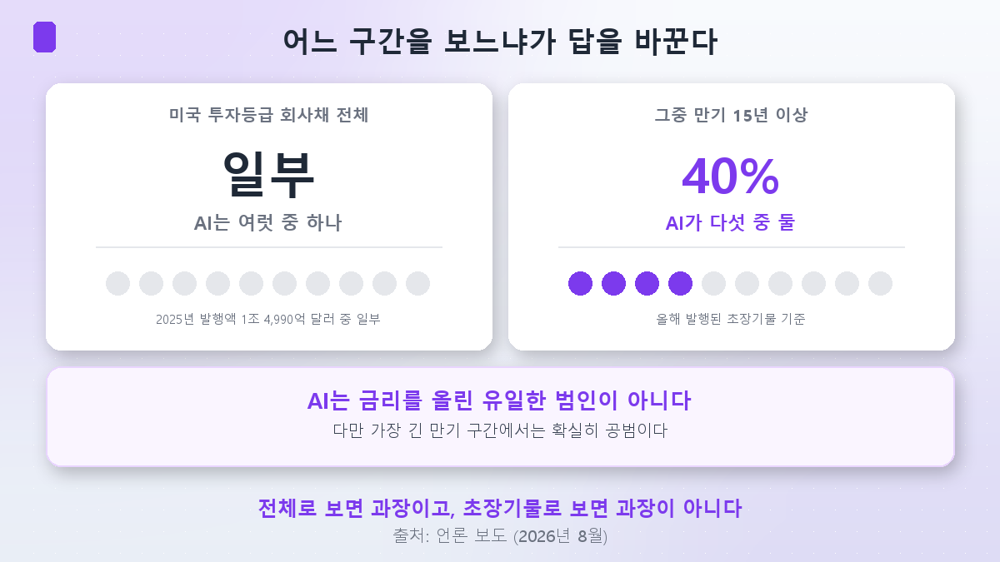

まず白状します。

[セクターローテーション第4回](/ja/p/is-bio-a-rate-play/)で私は、AI企業が米国の投資適格債市場の2.4%から16.4%に増えたという数字を紹介し、報道がこれを**「逆向きのクラウディングアウト」**と呼んでいると書きました。政府が企業を押しのけるのではなく、企業が国債を押しのけるという意味です。このシリーズは、その連結が惜しくて始まりました。

**今回はその前提を疑ってみます。**

## 昨夜、うちが停電しました

ちょうど数日前、隣の家が大型エアコンを新しく入れたところでした。自然とこう考えます。*あの家のせいか。*

ところが朝に出てみると、**町全体が停電していました。** 隣のエアコンは一瞬で有力容疑者から、数ある負荷のひとつに降格します。電気を多く使ったのは事実です。ただ、それだけでは説明がつきません。

今回はその朝の散歩の話です。

## まず、何が起きたのか

8月17日、**米国の30年国債利回りが年5.31%**をつけました。翌日には日中に**5.337%**まで上昇。**2007年以来、19年ぶりの高水準**です。

ここで押さえておきたい概念がひとつあります。**ターム・プレミアム**です。

> **ターム・プレミアム**＝お金を長く貸す見返りとして、もっともらわなければ困る、と要求する上乗せ分。
> 10年後に何が起きるかわからないので、その不確実性のぶんだけ上乗せをくれ、ということです。

この値が重要なのは、**中央銀行が何をしようと、これが上がれば長期金利は上がる**からです。FRBが利下げしても長期金利が下がらない現象は、ここから生まれます。

そしてこの値が、**2025年5月の0.2%から2026年5月には1.20%**になりました。1年で**1%ポイント**です。

問いはこうなります。**誰がこれを押し上げたのか。**

## 容疑者は三人です

報道をまとめると、超長期の国債利回りを押し上げた原因として挙げられるのは、おおむね三つです。

### 容疑者1 — 米国の財政赤字

いちばん大きく、いちばん古い容疑者です。

**2026会計年度の7月までの累計財政赤字が、2025会計年度の1年分（1兆7,750億ドル）をすでに超えました。** 会計年度がまだ2か月残っている時点でです。フィッチは2026〜2027年の米財政赤字を**GDPの7.4%**と見込んでいます。

赤字は国債を発行して埋めます。国債の供給が増えれば価格は下がり、利回りは上がります。そして利回りが上がれば利払い負担が増え、赤字はさらに膨らみます。**歳入5ドルのうち1ドルが利払いに出ていく**という計算も出ました。

### 容疑者2 — 日本

もっとも静かで、もっとも興味深い容疑者です。

**日本の30年国債利回りが3.52%と過去最高**をつけました。10年債も2.88%です。長らく金利がゼロに張り付いていた国での出来事です。

これがなぜ米国の金利と関係するのか。**日本は1兆ドルを超える米国債を持つ最大の海外保有国**だからです。

日本の機関投資家の立場で考えてみてください。自国の国債が0%台のときは、為替ヘッジのコストを払ってでも米国債を買うほうがましでした。ところが**自国の30年債が3.5%を出すなら**、わざわざ為替リスクを負って太平洋を渡る理由は薄くなります。

そこに**円キャリートレード**の問題が重なります。低い金利で円を借りて他国の高利回り資産を買う取引ですが、日本の金利が上がるとこの取引が巻き戻され、世界中の資産が売られます。

**そしてこの容疑者はAIとまったく関係がありません。**

### 容疑者3 — AI社債

もっとも多く名指しされた容疑者です。

ゴールドマン・サックスが8月5日に集計した**今年のAI関連の債務発行額は約5,000億ドル**です。このうちアマゾン・アルファベット・メタ・マイクロソフト・オラクルといったハイパースケーラーが約40%を占めます。これらの企業のグローバル債券発行額は、**昨年の1,080億ドルから今年は1,940億ドル**に増えました。

数字だけ見れば確かに大きい。ただ、大きさは別の数字の隣に置いてはじめてわかります。

## 大きさを並べてみると

| 項目 | 規模 |
|---|---|
| 米国の財政赤字（2026会計年度7月まで累計） | **1兆7,750億ドル超** |
| 今年のAI関連の債務発行（8月5日時点） | **約5,000億ドル** |

**財政赤字のほうが3.5倍以上大きい。** しかも赤字のほうはまだ2か月残っていました。

もちろんこの比較は完璧ではありません。集計時点も違いますし、赤字を埋める国債がすべて超長期債というわけでもありません。ただ方向ははっきりしています。**債券市場でいちばん場所を取っている発行体は、いまも米国政府です。**

## 決定的なアリバイ

ただ、本当に決定的な証拠は規模ではありませんでした。

**同じ時期に、ドイツとフランスの長期国債利回りも15〜30年ぶりの高水準を更新しました。**

ドイツにハイパースケーラーはありません。フランスにもありません。これらの国の債券市場でデータセンター社債が国債を押しのけているわけでもありません。それなのに長期金利は、米国と同じ方向に、同じ時期に上がりました。

**町全体が停電していたのです。**

これはAI社債では説明できません。先進国全般の財政拡大、インフレ懸念、そして**「長期債はもう安全ではない」という認識そのものの変化**で説明すべき現象です。ここに中東の緊張による原油高と関税政策が物価圧力を加え、日本銀行の政策転換がターム・プレミアムを押し上げました。

## だからといってAIが無罪ではありません

ここで終えれば片手落ちです。逆方向にも検証しなければなりません。

**今年発行された残存15年以上の米国投資適格社債の40%を、AI関連企業が占めました。**

この数字の前では先ほどの論理が揺らぎます。社債市場全体で見ればAIは数ある発行体のひとつですが、**もっとも長い年限の区分では5社のうち2社**です。参考までに、米国の投資適格社債の発行額は2025年に1兆4,990億ドルで、史上2番目の規模でした。

なぜよりによって超長期債なのか。データセンターは20年、30年を見据えて建てる資産だからです。短く借りて長く使えば満期のたびに借り換えが必要になるので、最初から長く借ります。[第2回](/ja/p/datacenters-off-the-books/)で見た満期の不一致問題の裏側です。

そして超長期の国債を買う投資家と、超長期の社債を買う投資家は**同じ人たち**です。年金と保険会社ですね。30年の負債を負っているので30年の資産を買います。この狭い市場にAI社債が押し寄せれば、**そこでは実際に場所の取り合いが起きます。**

## つまり結論は

セクターローテーション第4回で私が書いた表現を、こう直すべきだと思います。

> **AI社債は金利を上げた唯一の犯人ではありません。三人のうちのひとりで、おそらくいちばん小さい。**
> **ただし、もっとも長い年限の区分では確実に共犯です。**

「どこを見るか」が答えを変える、というのが今回の結論です。10年債全体の上昇分で見ればAIのせいというのは誇張です。30年社債の発行窓口で見れば誇張ではありません。

ひとつ付け加えると、セクターローテーション第4回で引用した**「社債と住宅ローン担保証券が10年債の上昇分のうち約0.3%ポイントを説明する」**というバンク・オブ・アメリカの推計は、今回の取材では再確認できませんでした。ですから今回の論証はその数字に寄りかからず、直接確認した数字だけで組み立てています。

## 韓国の投資家に届く地点

**ここで韓国の話が居心地悪くなります。** 韓国の国債30年物は8月に**4.751%**と過去最高をつけました。

ところが韓国にもハイパースケーラーはありません。国内の債券市場でAI社債が国債を押しのけているわけでもありません。では、なぜ韓国の金利は上がったのでしょうか。

同じ論理を当てはめれば、答えは二つに一つです。**米国の金利がそのまま伝わってきたのか、それとも国内固有の要因があるのか。** **第5回**でこれを検討します。米国の長期金利が本当に韓国までそのまま届くのか、それとも財政や需給といった国内事情のほうが大きいのかを。

その前に**第4回**では、このシリーズでもっとも論争的な地点に入ります。エヌビディアの残存価値保証と循環金融です。1999年に通信機器メーカーがやっていたベンダーファイナンスと同じ構造なのか、それともその喩えが怠慢なのかを検討します。

## まとめ

- **米30年債が8月18日の日中に5.337%と、2007年以来19年ぶりの高水準**をつけました。10年債のターム・プレミアムは**1年で0.2%から1.20%**に上がりました。
- **容疑者は三人です。** ①米国の財政赤字 ②日本の金利上昇と海外需要の後退 ③AI社債。報道が並べて挙げた組み合わせです。
- **大きさで見れば財政赤字が圧倒的です。** 2026会計年度7月までの累計赤字がすでに**1兆7,750億ドルを超え**、AI関連の債務発行は**約5,000億ドル**。3.5倍以上の差です。
- **決定的なアリバイはドイツとフランスです。** ハイパースケーラーのないこれらの国の長期金利も**15〜30年ぶりの高水準**をつけました。町全体が停電していたわけです。
- **それでも無罪ではありません。** **残存15年以上の米投資適格社債の40%がAI関連企業**です。年金と保険が買うこの狭い超長期市場では、実際に場所の取り合いが起きています。
- **結論：AIは唯一の犯人ではなく三人のうちのひとりで、おそらくいちばん小さい。ただし、もっとも長い年限では確実に共犯です。**

> ⚠️ この記事は個人の学習メモであり、特定の銘柄や投資手法を勧めるものではありません。本文の金利と発行規模は確認時点（2026年8月26日）の市場データと報道に基づくもので、常に変動します。財政赤字と社債発行額は集計基準と期間が異なるため直接比較には限界があり、規模の方向を見るための参考としてのみ示しています。金利変動の要因分解は機関によって推計が異なる領域で、本文は特定の機関のモデルに従っていません。ドル金額は為替変動を考慮して円換算を省略しています。投資判断とその結果はご自身の責任です。
