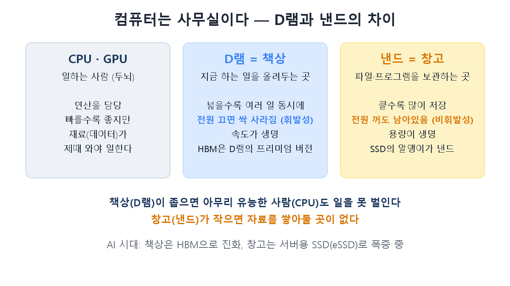
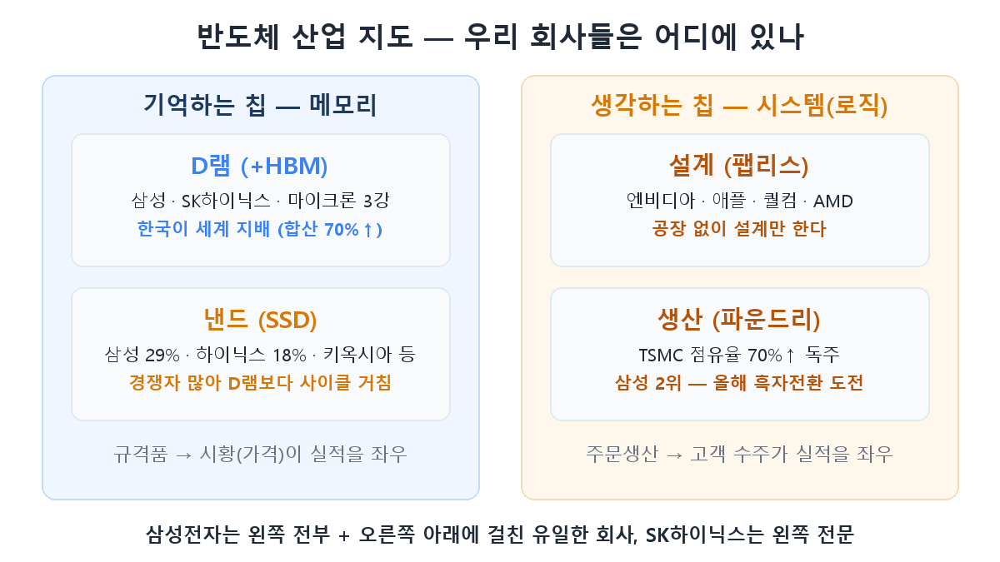

Something odd runs through semiconductor headlines these days: "DRAM prices soar," "NAND shortage," "Samsung foundry chases its first profit." All the same industry — yet one part is popping champagne while another is just escaping losses. **Why are they worlds apart?** Today is the fundamentals installment of this series. With this one map in your head, you'll instantly know, for any chip headline, "who is this good news for?"

## Chips come in two camps — those that remember, and those that think

The world's semiconductors split into two camps: chips that **remember** data (memory) and chips that **think** with data (system/logic). DRAM and NAND belong to memory; Nvidia's GPUs and your phone's processor belong to logic. And a foundry isn't a chip at all — it's the **factory business that builds logic chips for others.** Let's take them one by one.

## DRAM = the desk, NAND = the warehouse

Think of a computer as an office and it all clicks.

- **DRAM is the desk** — the workspace where current tasks are spread out. A bigger desk means more work in parallel, but **switch off the power and everything vanishes** (volatile). Speed is everything, and HBM from part 1 is this desk stacked into a high-rise premium version.
- **NAND is the warehouse** — where files and programs are stored. **It keeps everything even with the power off** (non-volatile). Capacity is everything, and NAND is what's inside every SSD.

The investment texture differs too. More companies make NAND (Samsung 29%, SK hynix 18%, Kioxia 14%…), so price competition is rougher and the cycle wilder than DRAM's. Right now, though, AI servers need warehouses for training data — **enterprise SSDs (eSSD)** — and the NAND market has tripled in a year. The boom that started at the desk (HBM) has spread to the warehouse.

## Foundry = a factory that builds chips from someone else's blueprints

The thinking-chip camp runs on division of labor. Nvidia, Apple, and Qualcomm **only design** chips — they own no fabs (fabless). The **foundry is the contract factory** that manufactures from their blueprints. Taiwan's TSMC dominates with over 70% share; Samsung chases in second place.

Memory and foundry make money in fundamentally different ways. Memory is a commodity — **market prices drive earnings**. Foundry is build-to-order — **customer wins drive earnings**. It's a business of cutting-edge process technology and customer trust, brutally hard for a latecomer to crack. That's the context for Samsung's foundry, long loss-making, recovering to 80%+ utilization this year and pushing for its first profit.

## Where do our companies sit on this map?

- **SK hynix**: all-in on the left (memory) — the "specialty shop" from part 3.
- **Samsung Electronics**: the only company in the world spanning the entire left side (No.1 in DRAM and NAND) plus the bottom right (No.2 foundry). That breadth is part 3's "department store" — and why it can't fully capture a memory boom.
- Korea **rules memory** (70%+ combined DRAM share) but the thinking-chip camp belongs to TSMC and Nvidia. "Semiconductor powerhouse" really means "memory powerhouse."

## A headline cheat sheet

| Headline | Who benefits |
|---|---|
| "DRAM contract prices surge" | Straight to Samsung/hynix memory profits (hynix most) |
| "eSSD/NAND boom" | All three NAND leaders, by share |
| "TSMC record earnings" | Foundry dominance reconfirmed — pressure on Samsung |
| "Samsung foundry wins major order" | Samsung's non-memory re-rating story |
| "HBM expansion squeezes commodity DRAM" | Part 4's boom-squeezing-boom dynamic |

## Recap

- Semiconductors split into **remembering (DRAM/NAND) vs thinking (design/foundry)** camps — with fundamentally different profit engines.
- **DRAM is the desk (volatile, speed), NAND the warehouse (non-volatile, capacity)** — in the AI era the desk evolved into HBM and the warehouse into eSSD, both booming.
- **Foundry is contract manufacturing** — TSMC's 70% reign with Samsung chasing profitability; an order-driven business, unlike price-driven memory.

From part 6 we move to applications: following the money from Nvidia through hynix and beyond — **the AI chip value chain and the equipment/materials players.**

> ⚠️ This post is a summary of my own learning, not a recommendation to buy or sell any security. Investment decisions and responsibility are your own.
