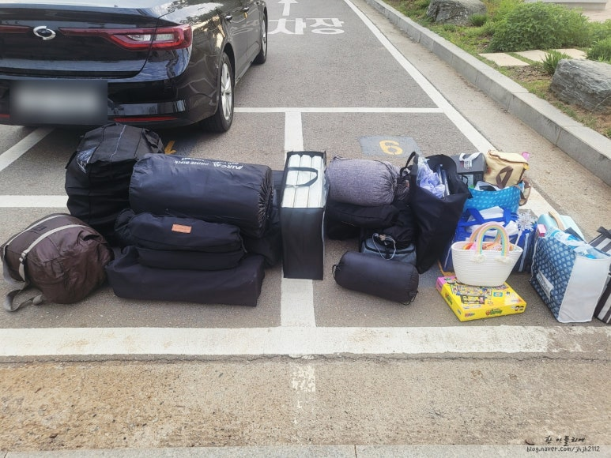
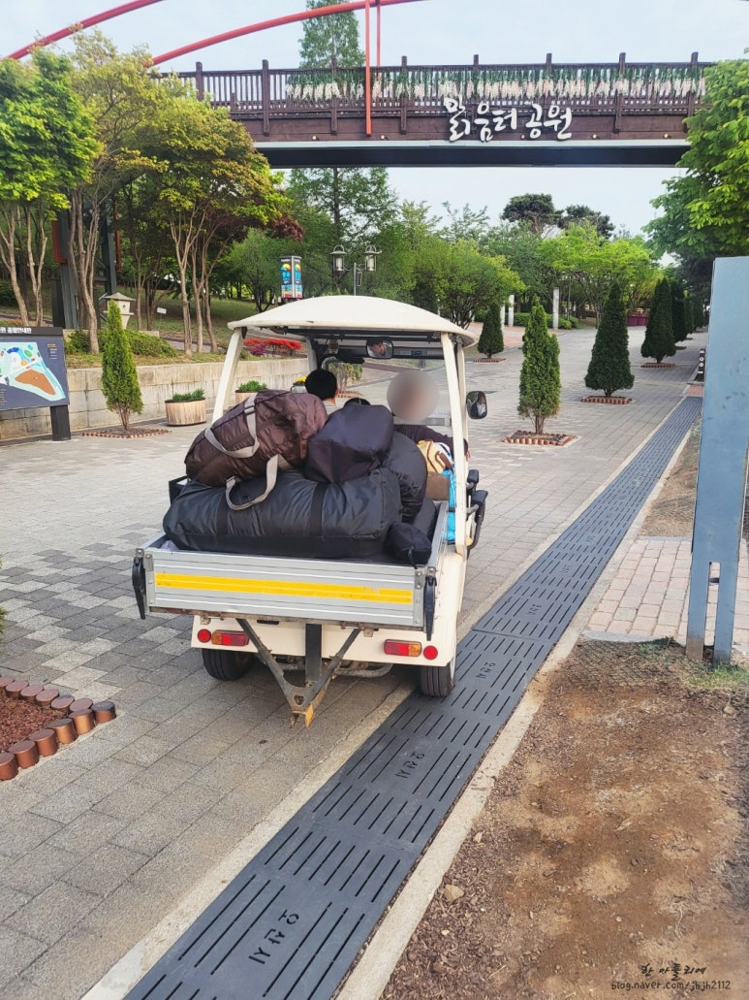
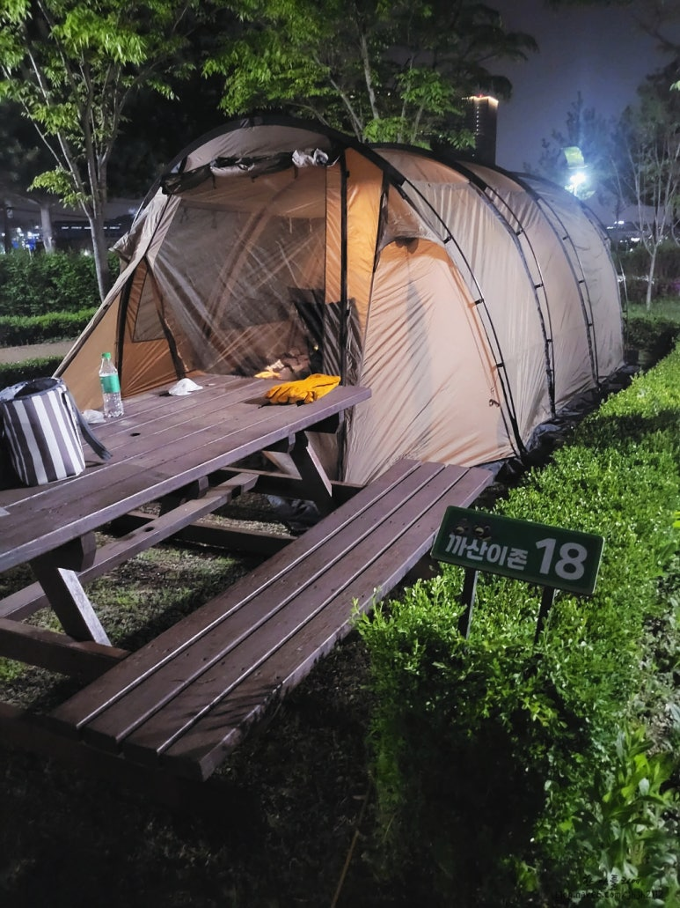
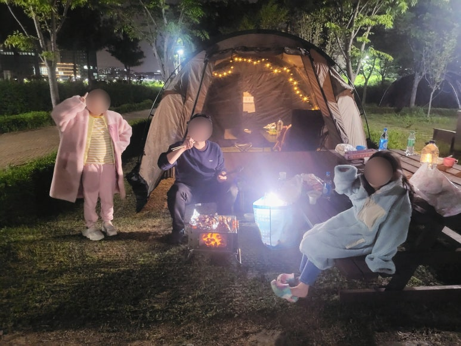
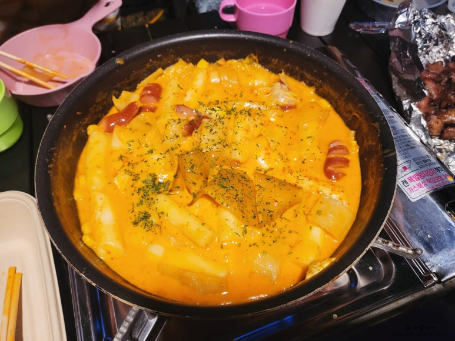
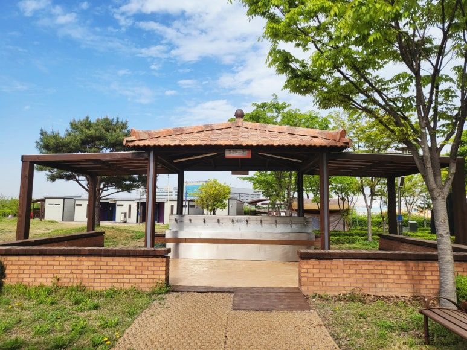
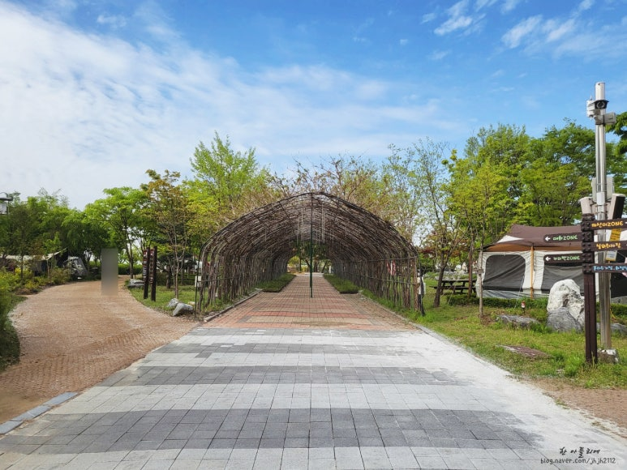
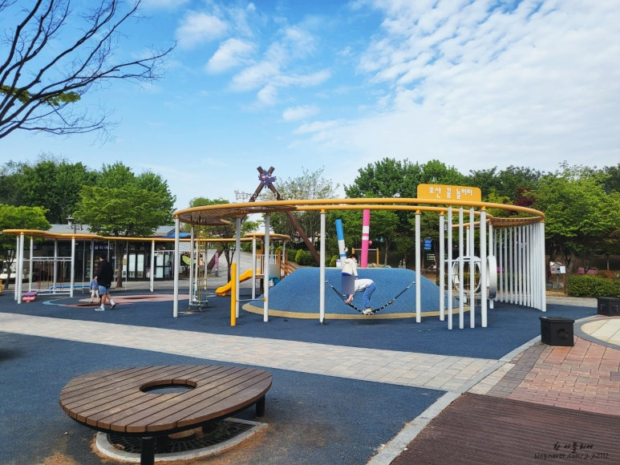
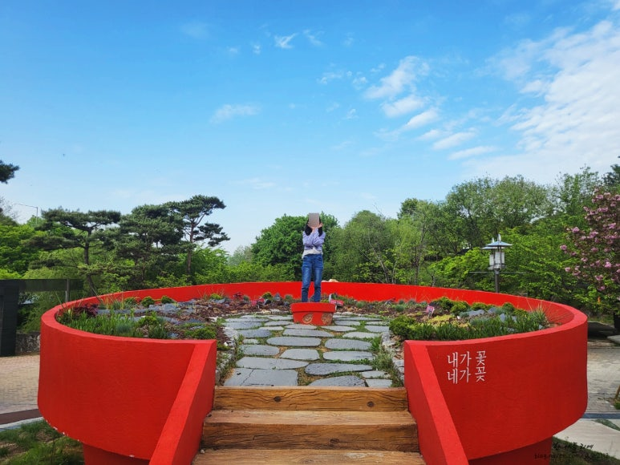
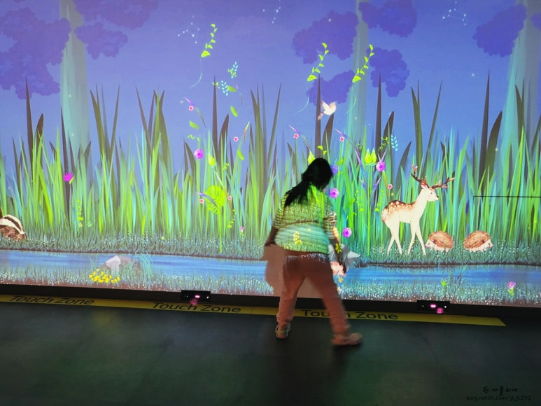

在[上一篇文章](/zh/p/camping-start/)里,我讲了我们决定开始露营的缘由。今天就来说说那次真正的第一次露营。2023年4月,我带着11岁和9岁的两个女儿,去了位于京畿道乌山市的**清爽园(맑음터)公园露营地**,周五到周六住了一晚。

虽然下了"这些钱还不如买顶帐篷"的决心,但说实话顾虑还是特别多。车是轿车、孩子还小、感觉会很累、感觉会很花钱……就这样找着各种借口一直犹豫。

就在我反复纠结的时候,孩子们说想去露营,而且不知不觉间发现全家人都在看露营主题的YouTube视频。看到这一幕,我心想:"趁还不晚,开始吧!"就这么下了决心。

决定去露营之后,我做的第一件事就是搞清楚"所以到底要买什么?"。翻遍YouTube和博客之后,新手入门的必备品最终归纳为五样:

1. **帐篷**
2. **地面工程**(垫子·寝具)
3. **桌椅**
4. **营灯**
5. **炉具·炊具**

清单本身很简单,问题在于每一样"买哪种"。我们家的情况是:轿车露营、全家新手、一家四口。于是定下了三条购买标准:**①什么都要体积小;②要简单到新手也能上手;③家里现成的能替代的就不买。**

**帐篷** — 最大的开销,所以标准执行得最严格:轻、体积小、好搭。按这三条一筛,茫茫多的帐篷一下子就剩没几款了,最后去实体店看了实物,定了KOVEA的幽灵幻影。强烈建议去看搭好的实物,而不是只看网上的照片——尤其是颜色,实物和照片完全是两回事。

**地面工程** — 越查越发现"露营满意度的一半在睡眠"这种说法特别多,所以这里没省钱。据说挡不住地面的寒气,露营就成了受罪。我们准备了泡沫垫+自充气垫,春秋季再加电热毯。事实证明,4月的夜里孩子们能睡得暖和,全靠电热毯。缺点是垫子类无法压缩,是唯一不得不放弃标准①的品类。

**桌椅** — 按**折叠后的体积**挑,而不是展开后的大小。能不能塞进轿车后备箱,对我们来说是绝对标准。

**营灯** — 因为是第一次,只买了一盏够亮的。事后证明这个选择没错,不过太阳落山后露营地比想象中黑得多——只是没料到会黑到看不清肉熟没熟。

**炉具·炊具** — 这是标准③执行得最彻底的品类。什么户外锅具、露营炊具一概没买,直接带上家里的平底锅、汤锅和卡式炉。只为柴火烤肉的浪漫,添了一个焚火台。

串灯、天幕这些"氛围感"装备也很心动,但不是必备品,先搁置了。去过几次,自然就知道我们家需要什么。一开始就置办齐全只会徒增行李、闲置装备——前辈露营者们的这句话,我们决定信一回。

就算这么克制着买,轿车露营最大的担忧还是行李。虽然尽量挑了体积小的,但电热垫、泡沫垫这类垫子根本没法压缩,自充气垫也占了不少地方。一家四口,行李不可能少,好在最后全部装进去了。

在清爽园公园露营地,从停车场入口给露营地打电话,请他们打开道闸并派推车,推车就会来把行李送到营位。只是推车比想象中小,行李只能放在脚下、抱在手里,像玩俄罗斯方块一样叠着,一路提心吊胆生怕掉下来。

我们的营位是Kkasaizone 18号。周五下班后直接出发,到达时已经傍晚6点左右。目标是天黑前把帐篷搭好!

选幽灵幻影的理由之一就是"新手也能轻松搭建",还记得吧?但我们毕竟是新手。连地钉该钉在哪里都不知道,明明在YouTube上认真学过"让KOVEA字样朝后钉地钉就行",结果看错了KOVEA字样……钉完才发现前后反了,只好把地钉全拔出来重新钉。而且一开始为什么要把地钉钉得那么深那么牢啊(哭)。就这样折腾了大约一小时才把帐篷搭好,整理完内部,太阳早就下山了。

颜色本来想买卡其色,但孩子们在KOVEA东滩店看到实物后说更喜欢棕褐色,只好买了棕褐色。不过搭起来一看,棕褐色还挺漂亮的。

帐篷搭好后孩子们也喊饿了,我们就从露营的浪漫——柴火烤肉开始。一开始很兴奋,可天越来越黑,连肉烤没烤熟都看不清了。本来梦想着悠闲的露营,结果光顾着给孩子们递烤肉,与其说悠闲,不如说是精疲力尽的一天。

第二轮吃的是女儿在学校烹饪探究课上学做的玫瑰酱炒年糕。之后实在太累,开着电热毯全家倒头就睡,第一晚就这样结束了。4月的夜晚空气还有些凉,多亏电热毯,孩子们说睡得很暖和;大人睡在两边,倒是没睡踏实。

第二天早上我们在露营地里转了转。卫生间、炊事区、垃圾分类站都很干净,热水也很给力。

我们预约了退营推车,又早早去小卖部买垃圾袋,结果都过了开门时间门还没开……最后没买到垃圾袋,在工作人员的帮助下勉强收拾好离场。这一点有些遗憾。

孩子们在小卖部前的游乐场玩了好久,园里到处都是拍照点,我们也拍了很多照片。

我们还顺路去了旁边的**乌山生态馆(Ecorium)**,展览本身没有想象中丰富,不过门口就有免费自行车租赁。本来很想骑……但实在太累,直接回家了。

露营地离家只有30分钟车程,让第一次露营毫无负担;周边还有很多适合孩子的玩乐设施,非常适合带娃前往。虽然是连一根地钉都钉不利索的第一次露营,但第一次,总是让人心动的,不是吗?

**清爽园公园露营地** — 京畿道乌山市乌山川路52
