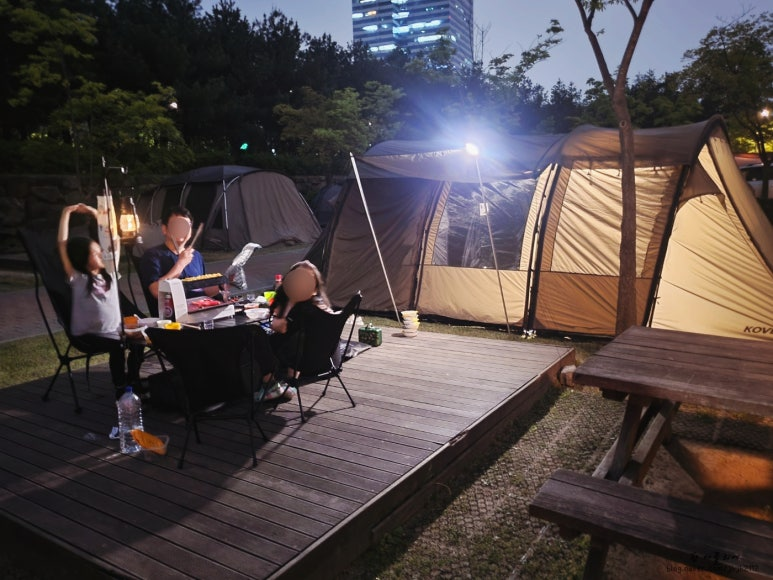
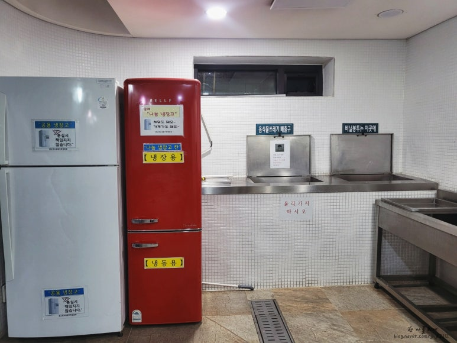
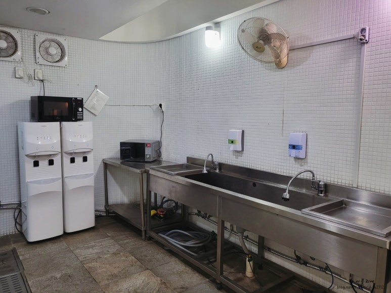
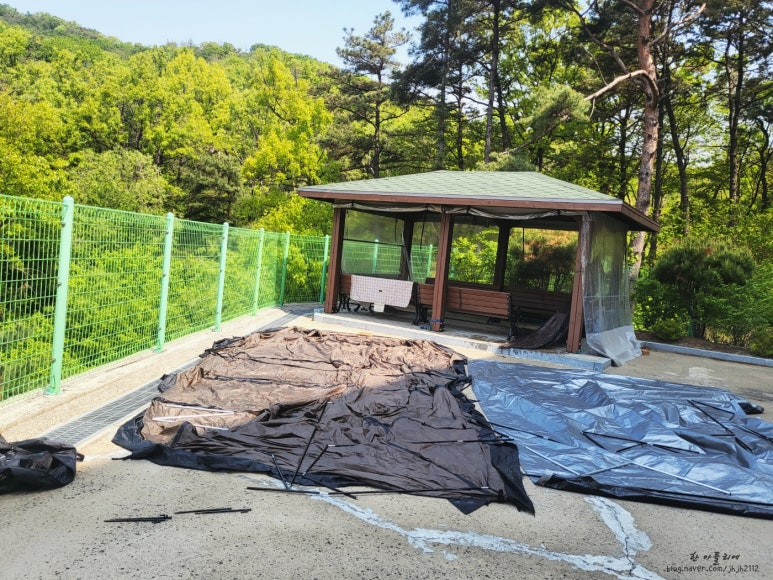
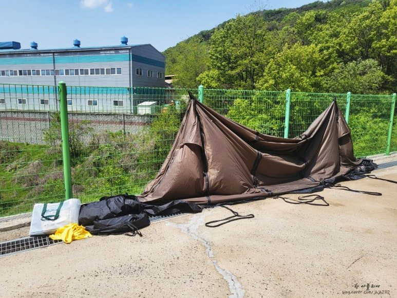

---
build:
  list: never
title: "第二次露营就遇上第一场雨 — 水原光教湖水公园家庭露营地"
description: "城市里的下班露营:水原光教湖水公园家庭露营地测评。第二次露营就遇上雨中露营,冒雨撤营,还有第一次晾帐篷的记录。"
slug: "gwanggyo-lake-camping"
date: 2026-07-05T10:10:00+09:00
draft: true
image: "camp-night.jpg"
categories: []
tags: []
---

[第一次露营](/zh/p/first-camping-malgeumteo/)之后仅仅一周,我们家就出发去了第二次露营。这次是水原光教湖水公园里的**光教湖水公园家庭露营地**汽车营位,同样是周五下班出发、住一晚的"下班露营"。

才露营到第二次,全家人就彻底迷上了。神奇的是,一到营地开始搭帐篷,工作中攒下的压力就全忘了,满脑子只有搭帐篷这一件事。而最棒的,是能和家人安安静静地好好聊天。

选这个露营地的理由很简单:老公的公司就在光教,下班露营没有比这更合适的地方了。于是订了周五到周六……可偏偏赶得不巧,那周的周三到周五他被安排了出差。

原本的计划是这样的:老公下班先去把帐篷搭好,我们作为后发部队悠闲地到达、悠闲地吃饭、悠闲地享受。结果变成了他刚出差回来,大家手忙脚乱地收拾行李出发,全员筋疲力尽地抵达营地。

不过,帐篷一搭好、美食一入口,疲惫就全忘了。露营的魅力不就在这儿吗?

这正是光教湖水公园露营地的魅力:帐篷后面就是光教新城的高楼灯光,名副其实的城市露营。和大自然里的露营地相比,别有一番风味。

可是吃完饭钻进帐篷,雨就淅淅沥沥地下了起来。才第二次露营,就遇上了雨中露营。

因为下雨手忙脚乱,设施没拍到几张,不过炊事区配有冰箱、微波炉、饮水机,一点也不觉得不便。有公用冰箱,连保温箱都不用太操心。

淋浴间只有老公用了。虽然听说有点窄,但我们去的时候正好刚翻新完,管理所长还特意推荐说"很干净、水也很足,一定要去用"。

第二天早上,开始了雨中撤营。第一次雨中露营,连雨衣都没有,淋着雨把湿帐篷硬塞进车里,狼狈到家。

而雨中露营真正的作业,是回家之后才开始的。湿帐篷放着不管会发霉,必须晾干——可住在公寓,哪有地方晾帐篷呢?最后周日在老公公司旁的空地上,悄悄地(?)把帐篷晾干了。这活儿也不轻松啊。

第一次雨中露营学到两件事:不管天气预报怎么说,雨衣都要常备;湿帐篷去哪儿晾,要在撤营之前就想好。

尽管下了雨,依然玩得很开心。而这个露营地最大的优点,就是位于市区、随时都能来。希望下次露营别再下雨了。

**光教湖水公园家庭露营地** — 京畿道水原市灵通区光教湖水路57
