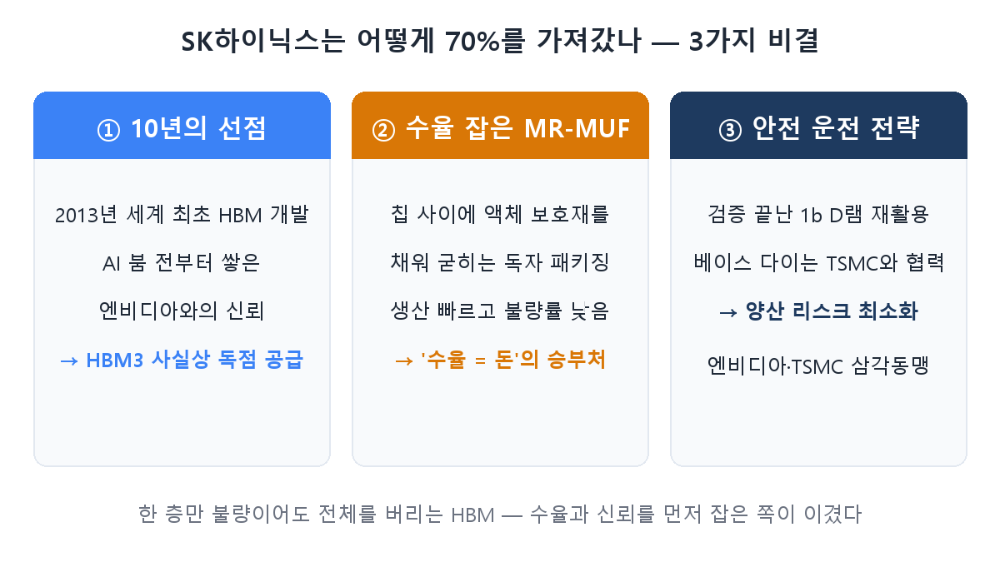
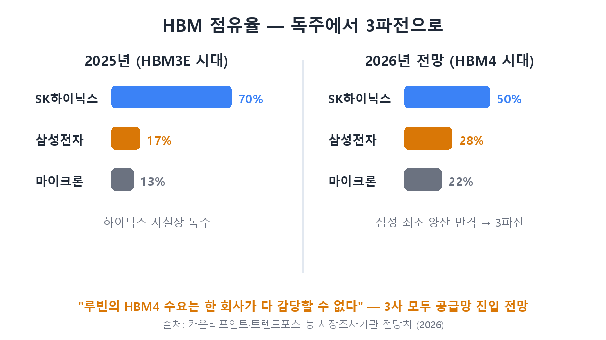

[第1回](/ja/p/what-is-hbm/)では、HBMとは何か、なぜ「AI時代の米」なのかを整理しました。でも一つ疑問が残りますよね。作れる会社はSKハイニックス・サムスン電子・マイクロンと3社もあるのに、**なぜハイニックスだけが独り勝ちしたのか？** 一時はシェア70%。メモリ万年2位だった会社がどうやってこの市場を独占し、そして今——その構図がなぜ揺らいでいるのか。今日はこの勝負の内幕です。

## 70%という数字はどこから来たのか

市場調査機関の集計では、2025年のHBM市場でSKハイニックスのシェアは約70%に達しました。サムスン電子とマイクロンが残りを分け合う、事実上の独走体制です。ハイニックスの株価がサムスン電子より早く、急激に上がった背景であり、強気の目標株価の根拠となった数字です。この独走は偶然ではなく、**3つの秘訣**が積み重なった結果でした。

## 秘訣① 10年早く始めた同盟

第1回で見たように、HBMを世界で初めて開発したのは2013年のSKハイニックスです。問題は、当時はAIブームのはるか前で、**買ってくれる人がほとんどいなかった**こと。サムスン電子が「市場が小さい」と力を抜いた間、ハイニックスはこの不人気分野を黙々と掘り続け、NVIDIAとの協力関係を築きました。

そして2022年、ChatGPTが世界をひっくり返すと状況は一変します。NVIDIAのAIチップに載せるHBM3を、期日どおり品質どおり供給できる会社は事実上ハイニックスだけでした。半導体の顧客認証（クオリフィケーション）は通過に数ヶ月から1年かかる関門で、**先に信頼を築いた会社を後から追い抜くのは至難の業です。**10年の先行投資が独占的地位となって返ってきたのです。

## 秘訣② 歩留まりを制したMR-MUF

第1回で「HBMは1層でも不良なら全体を廃棄、だから歩留まりを制した会社だけが儲かる」と言いましたね。ハイニックスがその歩留まりを制した武器が、**MR-MUF**という独自のパッケージング工法です。チップを積んだ後、チップの隙間に液状の保護材を注入して一気に固める方式で、競合が使っていたフィルム方式に比べ放熱性が良く、生産が速く、不良率が低いのが特徴です。

同じHBMを作っても、ハイニックスは売れる良品が多く取れる構造——これが業績格差の直接の原因でした。

## 秘訣③ 「安全運転」戦略と三角同盟

次世代HBM4でのハイニックスの選択も注目に値します。DRAM層はすでに完全に検証済みの既存プロセス（1b）を再利用して量産リスクを抑え、最下層の**ベースダイはファウンドリー首位のTSMCと協力**して作ることにしました。HBM4からは顧客ごとに機能をカスタム設計する需要が大きくなるため、それをロジックプロセスの最強者に任せたわけです。NVIDIA-TSMC-ハイニックスと続く「AI三角同盟」と呼ばれる構図です。

## しかし構図が揺らぐ — サムスンの反撃

ここまでが独走の秘訣だとすれば、ここからが投資家にとってより重要な部分です。**今年初め、サムスン電子がHBM4を世界で初めて量産し、NVIDIAへの供給を勝ち取りました。**AMDへの供給も始まっています。スペックも攻撃的です。要求速度（10Gbps）を大きく上回る11.7Gbpsに、一世代先のDRAMプロセス（1c）と4ナノのベースダイ。ハイニックスの「検証済みプロセス」戦略とは正反対の「最新プロセスで正面突破」が、今回は通用したのです。

市場見通しも変わりました。2026年のHBMシェアはハイニックス50%、サムスン電子28%、マイクロン22%程度と、独走から**三つ巴**に再編されるというのが市場調査機関の見方です。ただし押さえておくべき点——NVIDIAの次世代プラットフォーム「Rubin」のHBM4需要が非常に大きく、**1社では物量をまかなえない**というのが大方の見方です。シェア競争が激化するだけで、誰かのパイが消えるゲームではないということです。

## 投資家の注目ポイント

- **ハイニックス**: 独走プレミアムが株価に織り込まれている分、シェア低下のスピードが焦点。ただ50%でも依然圧倒的な首位であり、歩留まり（＝収益性）の優位が維持されるかが核心チェックポイントです。
- **サムスン電子**: HBMでの劣勢が株価のディスカウント要因だった分、HBM4の反撃が実際の物量と業績につながれば再評価の余地があります。
- **市場全体**: 競争激化≠市場縮小。Rubin発の需要自体が拡大する局面なので、3社とも売上を伸ばしながらシェアだけ再配分されるシナリオも十分あり得ます。

## まとめ

- ハイニックスの70%は、**10年の先行（NVIDIAの信頼）＋MR-MUFの歩留まり＋安全運転戦略**の積み重ねでした。
- 今年サムスン電子が**HBM4世界初量産・供給**で反撃に成功し、市場は独走から三つ巴へ再編されつつあります。
- Rubin発の需要でパイ自体が拡大する局面——シェア変化のスピードと各社の歩留まりが今後の注目ポイントです。

次回・第3回では、両社の体格差、つまり**サムスン電子とSKハイニックスの事業構造がどう違うのか**を解剖します。

> ⚠️ この記事は学んだ内容の整理であり、特定銘柄の売買を推奨するものではありません。投資判断とその責任はご自身にあります。
