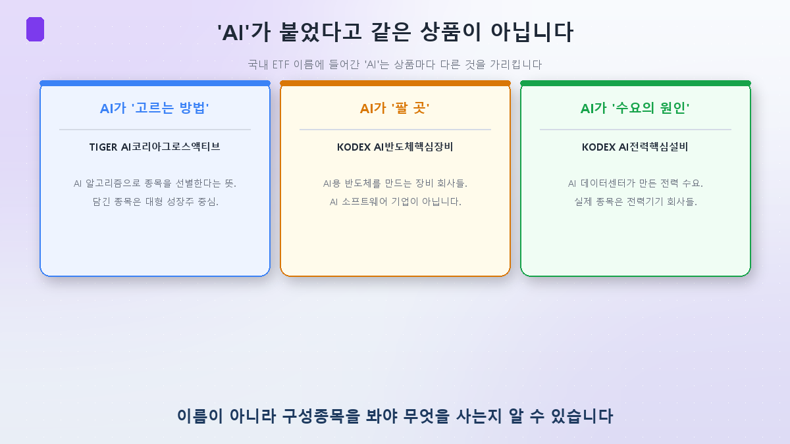
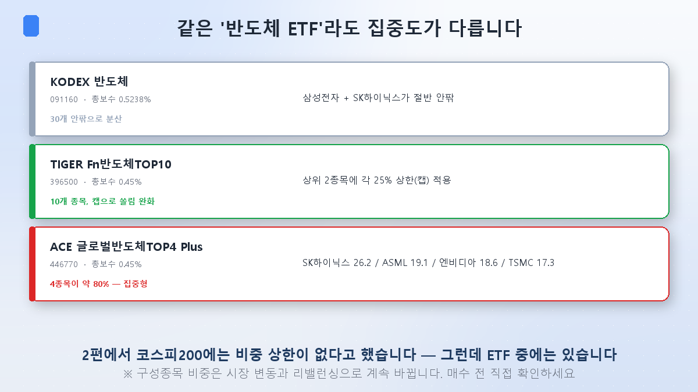
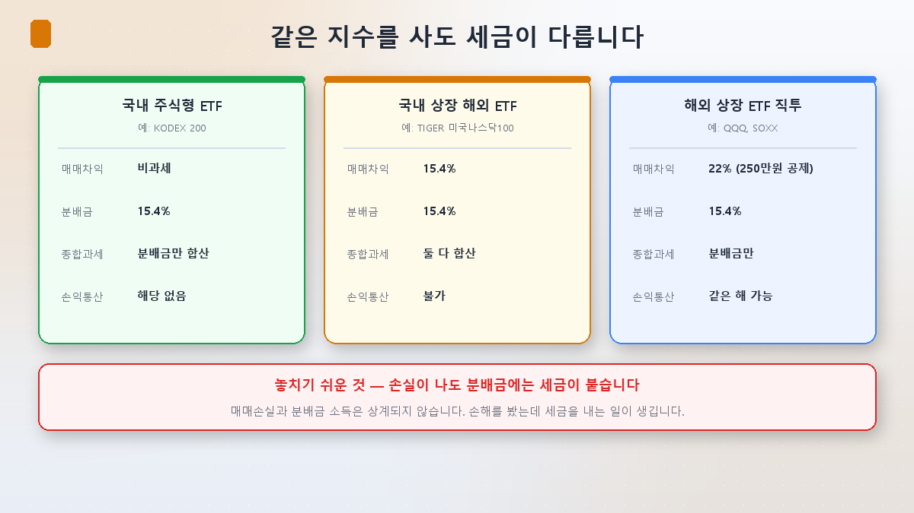
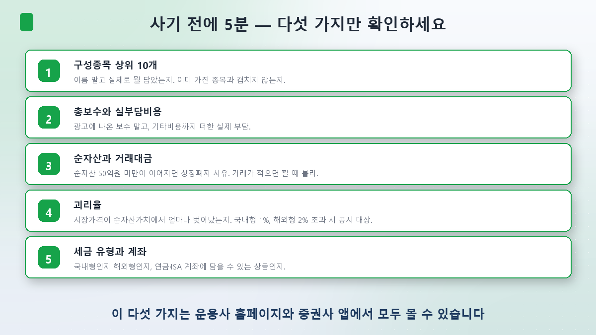

[4편](/p/leverage-etf-trap/)까지 "이렇게 하면 안 된다"는 이야기를 했습니다. 이번 편은 방향을 바꿉니다. **그럼 어떻게 골라야 하나.**

미리 말씀드리면, 저는 "이 ETF를 사세요"라고 쓰지 않을 겁니다. 그 대신 **상품을 열어보는 법**을 정리하겠습니다. 구성종목 비중은 매일 바뀌기 때문에, 오늘 제가 적은 숫자보다 여러분이 직접 확인하는 습관이 훨씬 오래갑니다.

## 먼저, 'AI'라는 이름을 믿지 마세요

국내에 'AI'가 붙은 ETF가 많습니다. 그런데 그 AI가 가리키는 대상이 상품마다 다릅니다.

- **AI가 '고르는 방법'인 경우** — TIGER AI코리아그로스액티브는 AI 알고리즘으로 종목을 선별한다는 뜻입니다. 담긴 종목 자체는 대형 성장주 중심이고요.
- **AI가 '팔 곳'인 경우** — KODEX AI반도체핵심장비는 AI용 반도체를 만드는 **장비 회사들**입니다. AI 소프트웨어 기업이 아닙니다.
- **AI가 '수요를 만든 원인'인 경우** — KODEX AI전력핵심설비는 AI 데이터센터가 유발한 전력 수요가 테마이고, 실제 종목은 전력기기 회사들입니다. ([AI 전력 교과서](/p/ai-power-hunger/)에서 다룬 그 회사들이죠.)

셋 다 'AI ETF'인데 안에 든 게 완전히 다릅니다. **이름은 마케팅이고, 구성종목이 실체입니다.**

## 같은 '반도체 ETF'도 구조가 다릅니다

한 걸음 더 들어가 보죠. 이름이 비슷해도 집중도가 크게 다릅니다.

- **KODEX 반도체(091160)** — 총보수 연 0.5238%. 30개 안팎 종목에 분산돼 있지만 삼성전자와 SK하이닉스가 절반 안팎을 차지합니다.
- **TIGER Fn반도체TOP10(396500)** — 총보수 연 0.45%. 10개 종목인데, 추종하는 FnGuide 지수가 **상위 2종목에 각 25% 상한(캡)** 을 둡니다.
- **ACE 글로벌반도체TOP4 Plus(446770)** — 총보수 연 0.45%. SK하이닉스·ASML·엔비디아·TSMC 네 종목이 **약 80%** 입니다. 메모리·장비·GPU·파운드리 각 대표를 하나씩 담은 집중형이죠.

여기서 [2편](/p/index-concentration-trap/)이 떠오릅니다. **코스피200에는 비중 상한이 없다**고 했었죠. 그런데 **개별 ETF 중에는 상한을 둔 상품이 있습니다.** 쏠림이 부담스럽다면, 지수 자체를 바꿀 수는 없어도 캡이 적용된 상품을 고르는 선택지는 있다는 뜻입니다.

**다만 캡이 완벽한 방어막은 아닙니다.** 캡은 분기 리밸런싱 때 맞추는 것이라, 그 사이 시총이 급변하면 일시적으로 상한을 넘길 수 있습니다.

그리고 꼭 기억하실 것 — **위 숫자는 제가 확인한 시점의 값입니다.** 구성종목 비중은 주가와 리밸런싱에 따라 계속 바뀝니다. 사기 전에 직접 보세요.

## 반도체 ETF를 따로 사는 게 의미가 있을까

1·2편에서 코스피 자체가 이미 AI 반도체에 절반 이상 걸려 있다고 했습니다. 그럼 반도체 ETF를 또 사는 건 무슨 의미일까요?

정직하게 말하면 **겹칩니다.** 코스피200 ETF를 들고 있는데 국내 반도체 ETF를 더 사면, 같은 두 종목의 비중만 더 키우는 셈일 수 있습니다.

의미가 생기는 경우는 이런 쪽입니다.
- **국내 반도체 소부장까지 담고 싶을 때** — 한미반도체·리노공업처럼 코스피200 비중이 작은 회사들이 반도체 ETF에는 더 크게 들어갑니다.
- **글로벌로 넓히고 싶을 때** — ASML·엔비디아·TSMC는 코스피200에 없습니다. 글로벌 반도체 ETF는 이걸 담습니다.
- **캡이 적용된 상품으로 쏠림을 줄이고 싶을 때** — 위에서 본 경우죠.

반대로 **"AI가 유망하니까 반도체 ETF도 하나 사두자"** 는 접근이라면, 이미 갖고 있는 것과 얼마나 겹치는지부터 확인하시는 게 순서입니다.

## 세금 — 여기가 수익률보다 클 수 있습니다

의외로 가장 많이 놓치는 부분입니다. **같은 지수를 사도 어디서 사느냐에 따라 세금 구조가 완전히 다릅니다.**

| | 국내 주식형 ETF | 국내 상장 해외 ETF | 해외 상장 ETF 직투 |
|---|---|---|---|
| 예시 | KODEX 200 | TIGER 미국나스닥100 | QQQ, SOXX |
| 매매차익 | **비과세** | 15.4% | 22%, 연 250만원 공제 |
| 분배금 | 15.4% | 15.4% | 15.4% |
| 금융소득종합과세 | 분배금만 합산 | **매매차익까지 합산** | 분배금만 (양도세는 분류과세) |
| 손익통산 | 해당 없음 | **불가** | 같은 해 안에서 **가능** |

몇 가지 실질적인 함의가 있습니다.

**① 소액이면 해외 직투가 유리할 수 있습니다.** 연 250만원 기본공제가 있어서, 차익이 그 안에 들어오면 세금이 0입니다.

**② 금액이 커지면 계산이 뒤집힙니다.** 250만원을 넘는 순간 22%가 붙는데, 국내 상장 해외 ETF는 15.4%입니다. 세율만 보면 후자가 낮죠.

**③ 그런데 금융소득이 많으면 다시 뒤집힙니다.** 국내 상장 해외 ETF는 매매차익까지 금융소득종합과세에 합산됩니다. 연 금융소득이 2,000만원을 넘으면 누진세율이 붙어 최고 49.5%까지 갈 수 있습니다. 반면 해외 직투의 양도소득은 분류과세라 종합과세에 섞이지 않습니다.

**④ 손익통산 차이가 큽니다.** 해외 직투는 같은 해에 A에서 손해, B에서 이익이 났으면 상계해서 세금을 계산합니다. 국내 상장 해외 ETF는 종목별로 따로 과세돼 상계가 안 됩니다.

그리고 가장 아픈 것 하나. **손실이 나도 분배금에는 세금이 붙습니다.** 매매손실과 분배금 소득은 상계되지 않거든요. 계좌는 마이너스인데 세금은 내는 상황이 실제로 생깁니다.

## 계좌를 바꾸면 세금이 바뀝니다

같은 상품이라도 **어느 계좌에서 사느냐**가 세후 수익을 바꿉니다.

- **연금저축·IRP**: 계좌 안에서는 과세가 미뤄지고(과세이연), 연금으로 받을 때 3.3~5.5%만 냅니다. 단 **레버리지·인버스 ETF는 아예 매수가 안 됩니다.** 그리고 IRP는 위험자산을 최대 70%까지만 담을 수 있습니다(연금저축펀드는 100% 가능).
- **ISA**: 계좌 내 손익을 통산한 뒤 과세하기 때문에, 위에서 본 "손익통산 불가" 문제를 완화해줍니다.

참고로 **2026년 8월 3일 발표된 세제개편안**에 ISA 개편이 담겼습니다. 국내 주식·주식형 펀드에 투자하는 **'생산적금융 ISA'** 를 신설해 이자·배당소득을 전액 비과세하고, 청년 가입자에게는 납입금의 10%를 소득공제한다는 내용입니다. 기존 일반 ISA는 연 납입한도 2,000만원을 유지하되 계약기간을 총 5년으로 제한하고 한도 이월 제도는 폐지합니다.

다만 이건 **아직 개편안이고 국회 통과 절차가 남았습니다.** 시행 예정 시점도 2027년 1월 이후 신규 가입분부터입니다. 확정 전까지는 참고만 하시는 게 좋겠습니다.

## 사기 전에 5분 — 다섯 가지

**① 구성종목 상위 10개.** 이름 말고 실제로 뭘 담았는지. 그리고 **이미 가진 종목과 얼마나 겹치는지.**

**② 총보수와 실부담비용.** 광고에 나오는 보수는 운용보수 중심입니다. 기타비용과 매매수수료까지 더한 실부담이 실제로 내는 돈이고, 해외자산을 담는 상품일수록 둘의 격차가 벌어지는 경향이 있습니다.

**③ 순자산과 거래대금.** 상장 1년이 지난 ETF의 순자산이 **50억원 미만**으로 떨어져 다음 반기말까지 해소되지 않으면 상장폐지 사유가 됩니다. 거래가 적으면 팔 때 불리한 가격에 팔게 되고요. (참고로 ETF는 상장폐지돼도 순자산가치 기준으로 정산되니 주식처럼 휴지가 되진 않습니다.)

**④ 괴리율.** 시장가격이 순자산가치에서 얼마나 벗어났는지입니다. 한국거래소는 국내형 1%, 해외형 2%를 넘으면 공시하도록 하고 있습니다. 추적오차와는 다른 개념인데, **괴리율은 "지금 이 가격이 제값인가"**, **추적오차는 "이 상품이 지수를 잘 따라가는가"** 입니다.

**⑤ 세금 유형과 계좌.** 국내형인지 해외형인지, 그리고 연금계좌나 ISA에 담을 수 있는 상품인지.

## 지난달이 남긴 교훈 하나

2026년 7월, 국내 상장 ETF **891개(전체의 78.3%)가 하락**했습니다. 반도체 테마 ETF들이 특히 심해서 −36~38%대가 속출했고, 하위권은 전부 단일종목 레버리지였습니다(최하위 −68.7%).

그런데 같은 달 미국에서는 반대 장면이 있었습니다. 반도체 ETF **SOXX가 −22.1%로 2002년 이후 최악의 월간 성적**을 냈는데도, **7월 한 달 69억 달러가 순유입**됐습니다. 사상 최대였습니다.

같은 하락장에서 한쪽은 강제청산되고 한쪽은 사 모았습니다. 차이는 종목 선택이 아니라 **어떻게 들고 있었느냐**였습니다.

## 정리

- **이름을 믿지 마세요.** 'AI'가 붙어도 그게 알고리즘인지, 최종 수요처인지, 수요를 만든 원인인지 제각각입니다. 구성종목이 실체입니다.
- **같은 반도체 ETF도 구조가 다릅니다.** 삼전+하이닉스가 절반인 상품, 상위 2종목에 25% 캡을 둔 상품, 4종목이 80%인 집중형이 다 있습니다. 코스피200엔 없는 **비중 상한이 일부 ETF엔 있습니다.**
- **세금이 수익률만큼 중요합니다.** 국내 주식형은 매매차익 비과세, 국내 상장 해외형은 15.4%에 종합과세 합산, 해외 직투는 22%에 250만원 공제와 손익통산. 금액과 다른 금융소득에 따라 유불리가 뒤집힙니다.

다음 [6편]은 이 시리즈의 마지막입니다. **AI 시대의 지수 읽는 법** — 코스피 전망이 어떻게 만들어지는지, 그리고 그 숫자의 상당 부분이 왜 반도체 이익인지 정리하며 마치겠습니다.

> ⚠️ 이 글은 공부한 내용을 정리한 것으로, 특정 상품의 매수·매도 추천이 아닙니다. 본문의 보수·구성종목 비중은 확인 시점 기준이며 계속 바뀝니다. 세제는 개인의 소득 구조에 따라 결과가 달라지므로 중요한 결정 전에는 전문가나 국세청 자료로 확인하시기 바랍니다. 투자 판단과 책임은 본인에게 있습니다.
