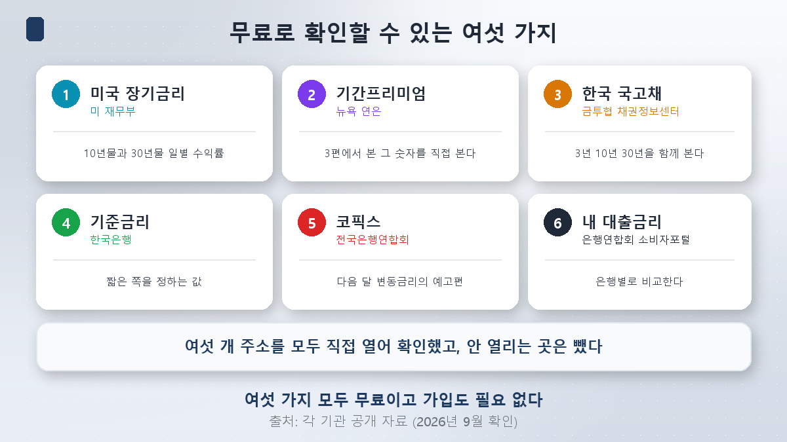
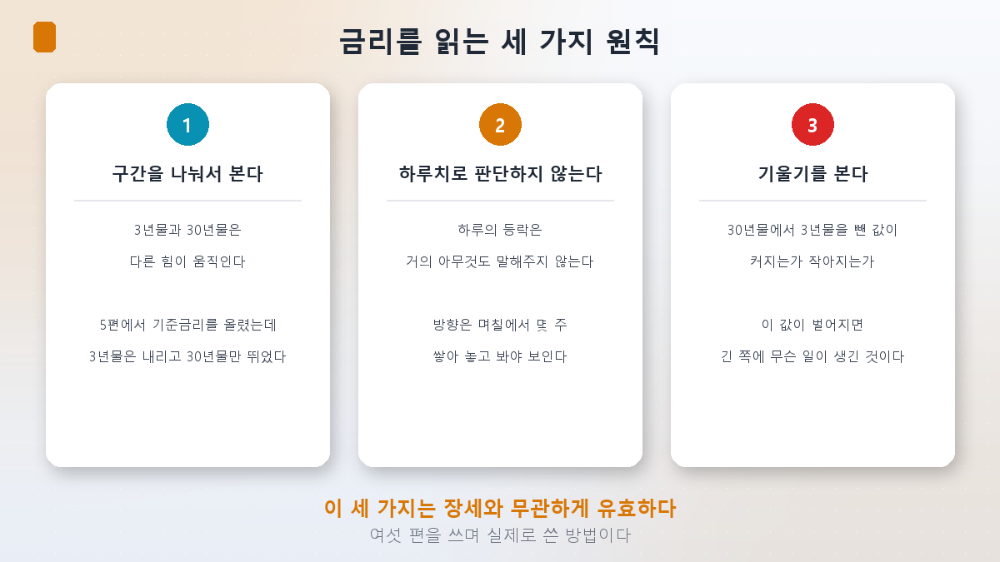
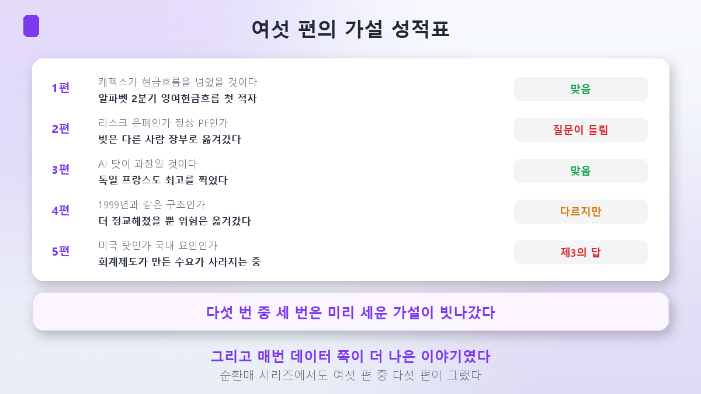
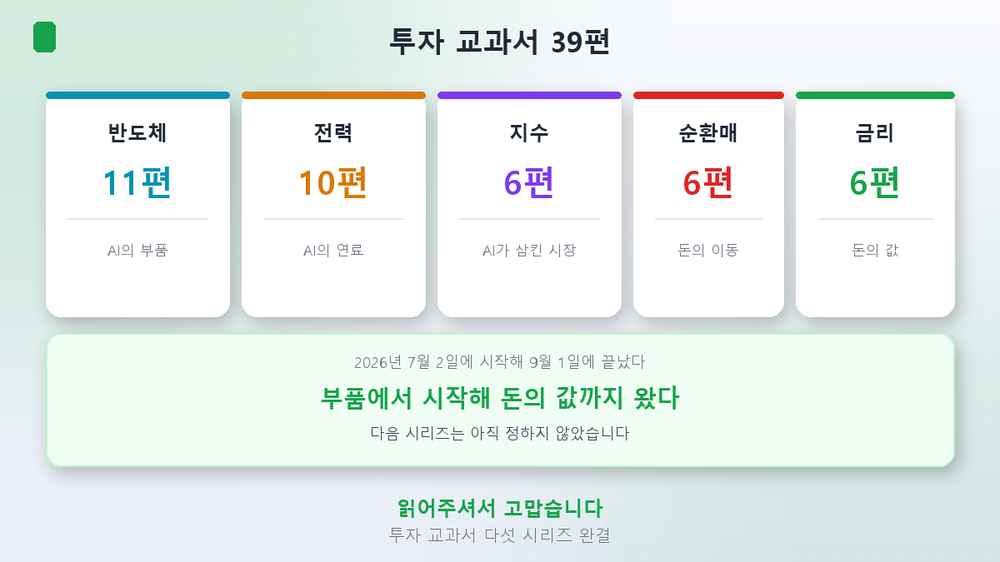

系列的最后一篇。

五篇里看了相当多的数字：自由现金流、期限溢价、残值担保、曲线正常化。可有一件事一直搁在我心里。

**那些数字里，你自己能查到的有几个？**

把报道里的数字照抄下来，和自己打开来看，是两回事。所以这一篇是一份**通讯录**。下面的网址我全部亲自打开确认过，**打不开的就删掉了。**

## 免费就能查到的六样

| 查什么 | 在哪 | 网址 |
|---|---|---|
| 美国国债收益率曲线 | 美国财政部 | [home.treasury.gov](https://home.treasury.gov/resource-center/data-chart-center/interest-rates/TextView?type=daily_treasury_yield_curve) |
| 期限溢价（ACM） | 纽约联储 | [newyorkfed.org](https://www.newyorkfed.org/research/data_indicators/term-premia-tabs) |
| 韩国国债各期限收益率 | 金融投资协会 债券信息中心 | [kofiabond.or.kr](https://www.kofiabond.or.kr/) |
| 基准利率历史 | 韩国央行 | [bok.or.kr](https://www.bok.or.kr/portal/singl/baseRate/list.do?dataSeCd=01&menuNo=200643) |
| COFIX | 全国银行联合会 | [portal.kfb.or.kr](https://portal.kfb.or.kr/fingoods/cofix.php) |
| 各银行房贷利率比较 | 银行联合会消费者门户 | [portal.kfb.or.kr](https://portal.kfb.or.kr/compare/loan_household_new.php) |

六个**全都免费，也不需要注册。**

### ① 美国国债收益率曲线

第3篇里那个5.337%就在这里。美国财政部**每个交易日**公布，从1个月期到30年期一应俱全。整条曲线在同一屏上，后面那条「按区间拆开看」的原则可以直接套用。

### ② 期限溢价 — 第3篇里的那个数字

就是第3篇里**从0.2%升到1.20%**的那个值。纽约联储用ACM（Adrian-Crump-Moench）模型估算并公布。

要注意，这是**模型估算值**，不是市场上直接成交的价格，各机构算出来的数并不相同。所以看**方向**比看绝对水平更稳妥。

### ③ 韩国国债各期限收益率

第5篇的核心就在这里。金融投资协会的债券信息中心可以把3年、10年、30年放在一起看。**放在同一屏上看，这一点很重要**——正如第5篇所示，只看其中一条会得出相反的结论。

韩国央行的经济统计系统**[ECOS](https://ecos.bok.or.kr/)**也能按时间序列取数。

### ④ 基准利率历史

韩国央行以表格形式公布历次基准利率变动，8月27日上调至3.00%也记录在内。它是**决定短端的那个值**，和③放在一起看，「哪一段归央行管」就一目了然。

### ⑤ COFIX

第5篇里说的**下个月浮动利率的预告片**。全国银行联合会每月公示。本月COFIX上行，次月的浮动利率房贷就会跟上。如果你有房贷，这是六个里最实用的一个。

### ⑥ 各银行房贷利率比较

银行联合会消费者门户可以比较各家银行的房贷利率。不过上面显示的是**平均值**，实际利率取决于个人信用与产品，最终条件请向相应银行确认。

### 另外 — 自己所持产品的持仓明细

[第2篇](/zh/p/datacenters-off-the-books/)里我们看到，贝莱德一只高收益ETF的第一大持仓是数据中心项目债。如果你持有海外债券型基金或ETF，建议去**管理人网站打开持仓明细**看一眼。这一项没有放进表里，因为没法指定单一网址——每只产品的管理人都不同。

## 读利率的三条原则

知道网址还不够，不知道怎么读也没用。写这六篇时实际用过的方法有三条。

### 1. 按区间拆开看

这个系列里用得最多的方法。

- **第3篇**：放在整个公司债市场里，AI只是众多发行人之一；可在**15年以上的期限区间里，它占40%**。
- **第5篇**：基准利率上调之后，3年期**-5bp**，30年期**+25bp**。

同一个国家的国债，按期限却朝相反方向走。**「利率涨了」这句话，如果不说是哪一段，就只对了一半。**

### 2. 不用一天的数据下判断

[板块轮动第6篇](/zh/p/how-to-read-rotation/)里也说过同样的话。一天的涨跌几乎什么都说明不了。要把几天到几周叠起来，方向才看得见。

8月19日综指跌5.80%、第二天反弹，如果分开各自解读，两次都会读错。

### 3. 看斜率

把**30年期减去3年期**的值记下来。这个差扩大（陡峭化），说明长端出了事；收窄（平坦化），说明动的是短端。

第5篇里韩国的情形正是陡峭化。而它的原因不是韩国央行，而是**保险公司需求的变化**。若不看斜率，多半就停在「央行加了息，所以利率涨了」。

## 哪些可以不管

- **每日的利率新闻。**理由如上。
- **「这次不一样」式的断言。**正如第4篇所示，相同点和不同点永远同时存在。
- **一个总额数字。**第4篇里，循环融资的规模从700亿到7,500亿美元都有。**一个不知道口径的大数字，不是信息。**

## 六篇的假设成绩单

开这个系列时，我把每篇的假设先写进了计划书。结果是这样的。

| 篇 | 事先写下的假设 | 结果 |
|---|---|---|
| 第1篇 | 资本支出已经超过经营现金流 | **对** — Alphabet上市以来第一次自由现金流赤字 |
| 第2篇 | 是掩盖风险，还是正常的项目融资 | **问题问错了** — 债务搬到了别人的账本上 |
| 第3篇 | 「怪AI」大概是夸大 | **对** — 没有超大规模云厂商的德国、法国也创了新高 |
| 第4篇 | 和1999年的供应商融资是同一个结构吗 | **不同，但** — 只是更精巧，风险照样搬了家 |
| 第5篇 | 是美国的锅，还是国内因素 | **第三个答案** — 会计制度造出来的需求正在消失 |

**五次里有三次，事先立的假设落空了。**在板块轮动系列里是六次中的五次。

而且每一次，**数据给出的版本都是更好的故事。**如果第2篇停在「掩盖还是正常」，品浩和贝莱德ETF那一段就不会出现；如果第5篇只去找财政赤字，保险公司和IFRS 17就看不见了。

当一个听上去很合理的解释先冒出来时，用数字去验一验。多半是错的。**而在它出错的地方，往往有更有意思的东西。**

## 小结

- **六个网址就能自己核实这个系列的数字。**美国财政部（收益率曲线）、纽约联储（期限溢价）、金融投资协会（各期限国债收益率）、韩国央行（基准利率）、银行联合会（COFIX与利率比较）。全部免费。
- **期限溢价是模型估算值**，各机构不同。看**方向**，别盯绝对水平。
- **三条读法**：按区间拆开看；不用一天的数据下判断；看**斜率**（30年期减3年期）。
- **可以不管的**：每日利率新闻、「这次不一样」的断言，以及**不知道口径的大数字**。
- **有房贷的话，只看COFIX一个也够。**它是六个里最实用的。
- **持有海外债券类产品的话，打开持仓明细看一次。**第2篇里那只债券可能就在里面。

## 最后 — 39篇收官

这一篇一发，第五个系列就结束了。

[半导体11篇](/zh/p/what-is-hbm/)看的是AI的**零件**，[电力10篇](/zh/p/ai-power-hunger/)是**燃料**，[指数6篇](/zh/p/what-is-kospi-index/)是被AI吞下的**市场**，[板块轮动6篇](/zh/p/what-is-sector-rotation/)是**钱的移动**。而这次的利率6篇，是**钱的价格**。加起来39篇。

回头看，顺序是自然而然的：从零件到燃料，到市场，到资金流向，最后到钱的价格。这并不是一开始就规划好的。**每一次，都是上一个系列没能解释完、留下来的那一点，成了下一个系列的题目。**这个利率系列，也是从板块轮动第4篇的一个脚注开始的。

下一个系列还没定。多半会是这六篇里没能讲完的其中一件事。

谢谢你读完。

> ⚠️ 本文仅为个人学习整理，不构成对任何个股、基金或投资方式的建议。文中列出的网址在核对时点（2026年9月1日）均确认可正常访问，但机构可能会调整网址与菜单结构。期限溢价并非市场成交价格，而是模型估算值，各机构数值不同。银行联合会公示的贷款利率为平均值，实际适用利率因个人信用与产品差异很大，务必向相应金融机构核实。文中的读法只是我写这六篇时使用的方法，并非经过验证的投资技法。投资决策及其后果由本人承担。
