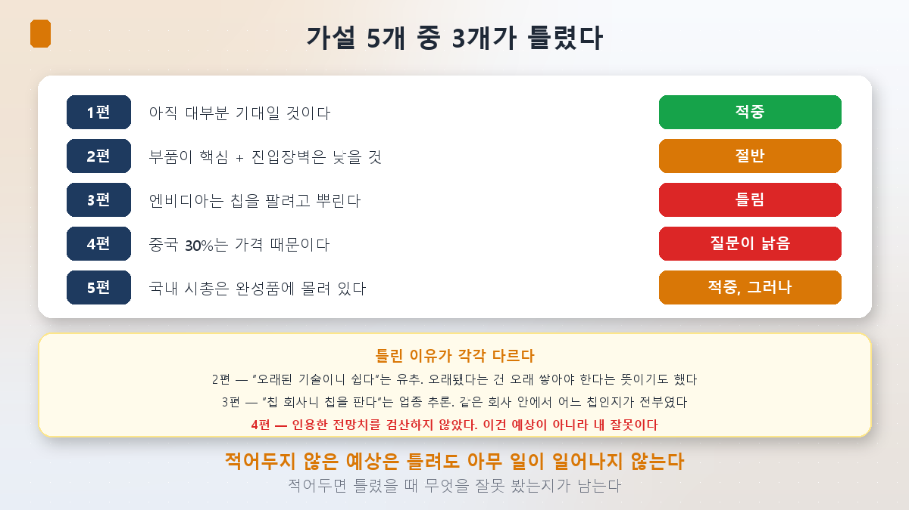
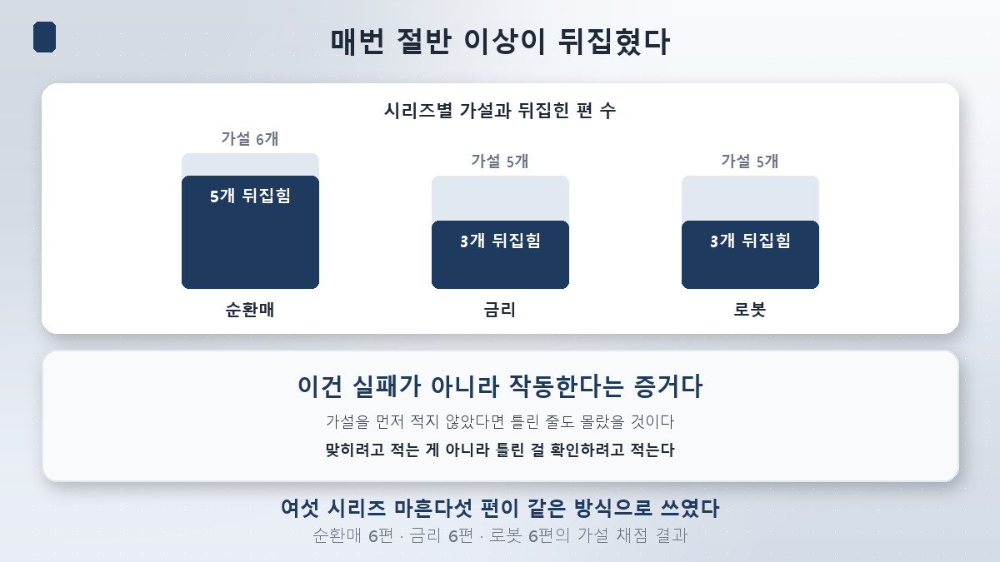
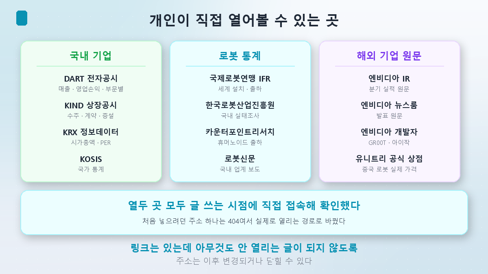
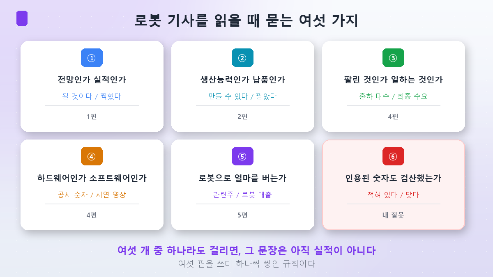

시험을 보고 나면 두 가지를 할 수 있습니다. 점수만 보고 덮거나, **틀린 문제를 펴 놓고 왜 틀렸는지 보거나.**

이 시리즈를 시작하면서 편마다 가설을 먼저 적어두고 시작했습니다. 맞히려고 적은 게 아니라 **틀린 걸 확인하려고** 적었습니다. 이번 완결편에서 그 답안지를 펴겠습니다.

**결론부터 말씀드리면, 5개 중 3개가 틀렸습니다. 그리고 그중 하나는 제 잘못이었습니다.**

## 답안지

| 편 | 세웠던 가설 | 결과 |
|---|---|---|
| **1편** | 로봇은 아직 대부분 기대이고 실적은 뒤에 있을 것이다 | **적중** |
| **2편** | 부품이 핵심일 것이다 + 다만 진입장벽이 낮을 수 있다 | **절반** |
| **3편** | 엔비디아는 칩을 팔려고 두뇌를 뿌릴 것이다 | **틀림** |
| **4편** | 중국 점유율 30%는 가격 때문일 것이다 | **질문이 낡았음** |
| **5편** | 국내 시총은 완성품에 몰려 있을 것이다 | **적중, 그러나** |

하나씩 펴 보겠습니다.

### 1편 — 적중

**기대가 실적보다 앞서 있다**는 예상은 맞았습니다. 전망 쪽에는 출하 5만 대와 옵티머스 5,000대가 있었고, 실적 쪽에는 [테라다인 로보틱스의 분기 매출 약 1억 달러](/p/what-is-physical-ai/)가 있었습니다. 순서는 **기대 → 주가 → 실적**이었습니다.

다만 이 적중에는 뒤끝이 있습니다. **같은 편에서 제가 인용한 전망 수치 하나가 나중에 틀린 것으로 드러났습니다.** 4편에서 다시 다루겠습니다.

### 2편 — 절반

**"완성품 말고 부품"이라는 반도체 문법이 로봇에도 통한다**는 앞부분은 맞았습니다. 관절이 부품 원가의 30~50%, 그 안에서 [롤러스크류 하나가 64.2%](/p/robot-parts-cost/)였습니다.

**"진입장벽이 낮을 수 있다"는 뒷부분은 틀렸습니다.** 하모닉드라이브시스템즈 약 70%, 나브테스코 약 60%의 일본 과점이었습니다. **금속 가공이라 쉬운 게 아니라, 금속 가공이라 어려웠습니다.**

> 틀린 이유: **"기계 부품 = 오래된 기술 = 쉽다"고 유추했습니다.** 오래됐다는 것은 그만큼 오래 쌓아야 한다는 뜻이기도 한데 그쪽을 보지 않았습니다.

### 3편 — 틀림

**"칩을 팔려고"**는 숫자와 맞지 않았습니다. 엔비디아 자동차 부문은 한 분기 6억 400만 달러로 [전체의 약 0.9%](/p/nvidia-robot-brain/)였고, 이제는 별도로 공시조차 하지 않습니다.

진짜 답은 **데이터센터**였습니다. 로봇에 없는 건 모델이 아니라 데이터이고, 그 데이터는 GPU로 만들어야 합니다.

> 틀린 이유: **"칩 회사니까 칩을 팔겠지"라고 업종으로 추론했습니다.** 실제로는 같은 회사 안에서도 **어느 칩**인지가 전부였습니다. 업종이 아니라 매출 항목을 봤어야 했습니다.

### 4편 — 질문이 낡았고, 제 인용이 틀렸습니다

이번 시리즈에서 가장 뼈아픈 대목입니다.

1편에서 저는 시장조사업체 전망이라며 **중국 30% / 미국 25% / 일본 10%**를 인용했습니다. 4편을 쓰면서 확인해 보니 상반기 실제 출하는 **중국 업체가 97% 이상**이었고, [상위 5개가 전부 중국 업체](/p/china-humanoid-price/)였습니다.

**전망이 빗나간 게 아니라, 제가 출처를 다시 확인하지 않고 인용한 것이 문제였습니다.** 4편에서 그 수치를 폐기한다고 적었습니다.

> 틀린 이유: **인용은 검증이 아닙니다.** 어딘가에 적혀 있다는 것과 그 숫자가 맞다는 것은 다릅니다. 1편에서 "전망과 실적을 섞지 말자"고 선언해 놓고, 정작 그 전망 자체를 검산하지 않았습니다.

가격에 대한 가설도 절반만 맞았습니다. **싸긴 싼데 이유가 반대**였습니다. 싸구려라서 싼 게 아니라 **부품을 직접 만들어서** 쌌고, 그러면서 흑자였습니다.

### 5편 — 적중, 그러나 방향이 반대

**시총이 완성품에 몰려 있다**는 예상은 맞았습니다. 그런데 실적을 옆에 놓자 그림이 뒤집혔습니다. 에스피지는 두산로보틱스보다 [매출 10배에 흑자인데 시총은 절반 이하](/p/korea-robot-stocks/)였습니다.

**맞힌 것보다 맞힌 뒤에 본 것이 더 중요했던 편**입니다.

## 성적표를 어떻게 읽을까

앞선 시리즈들과 나란히 놓으면 이렇습니다.

| 시리즈 | 가설 | 뒤집힌 편 |
|---|---|---|
| 순환매 | 6개 | **5개** |
| 금리 | 5개 | **3개** |
| **로봇** | **5개** | **3개** |

**절반 이상이 계속 틀립니다.** 그런데 이게 이 방식의 실패가 아니라 **작동하는 증거**라고 생각합니다. 가설을 적지 않았다면 틀린 줄도 몰랐을 테니까요.

> 적어두지 않은 예상은 틀려도 아무 일이 일어나지 않습니다. 적어두면 틀렸을 때 **무엇을 잘못 봤는지**가 남습니다.

## 그래서, 어디서 확인하나

이번 시리즈에서 쓴 숫자들은 전부 개인이 직접 열어볼 수 있는 곳에 있습니다. **아래 주소는 글을 쓰는 시점에 하나씩 직접 접속해 열리는 것만 남겼습니다.**

### 국내 기업 — 실적과 시총

| 확인할 것 | 어디서 | 주소 |
|---|---|---|
| 매출·영업손익·사업부문 | **전자공시시스템(DART)** | [dart.fss.or.kr](https://dart.fss.or.kr/) |
| 수시공시(수주·계약·증설) | **KIND 상장공시시스템** | [kind.krx.co.kr](https://kind.krx.co.kr/) |
| 시가총액·PER·업종 통계 | **KRX 정보데이터시스템** | [data.krx.co.kr](https://data.krx.co.kr/) |
| 국가 통계 | **KOSIS 국가통계포털** | [kosis.kr](https://kosis.kr/) |

**5편에서 쓴 두산로보틱스 매출 330억원과 영업손실 595억원, 에스피지 매출 3,417억원과 영업이익 179억원은 전부 DART에서 원문을 볼 수 있습니다.** 언론 보도를 한 번 더 확인하고 싶을 때 가장 먼저 열 곳입니다.

### 로봇 산업 통계

| 확인할 것 | 어디서 | 주소 |
|---|---|---|
| 세계 로봇 설치·출하 통계 | **국제로봇연맹(IFR)** | [ifr.org/ifr-press-releases](https://ifr.org/ifr-press-releases) · [무료 자료](https://ifr.org/free-downloads) |
| 국내 로봇산업 실태조사 | **한국로봇산업진흥원** | [kiria.org](https://www.kiria.org/portal/policysut/portalPlcyInquiry.do) |
| 휴머노이드 출하 집계 | **카운터포인트리서치** | [korea.counterpointresearch.com](https://korea.counterpointresearch.com/) |
| 국내 업계 보도 | **로봇신문** | [irobotnews.com](https://www.irobotnews.com/) |

### 해외 기업 — 원문으로 확인

| 확인할 것 | 어디서 | 주소 |
|---|---|---|
| 엔비디아 분기 실적 원문 | **엔비디아 IR** | [investor.nvidia.com](https://investor.nvidia.com/financial-info/financial-results/default.aspx) |
| 엔비디아 발표 원문 | **엔비디아 뉴스룸** | [nvidianews.nvidia.com](https://nvidianews.nvidia.com/news) |
| GR00T·아이작 플랫폼 | **엔비디아 개발자** | [developer.nvidia.com/isaac/gr00t](https://developer.nvidia.com/isaac/gr00t) |
| 중국 로봇 실제 판매가 | **유니트리 공식 상점** | [shop.unitree.com](https://shop.unitree.com/) |

**3편에서 쓴 "자동차 부문 6억 400만 달러"와 "데이터센터 890억 달러"는 엔비디아 IR 페이지의 실적 발표 원문에 그대로 있습니다.** 기사에서 본 숫자가 의심스러우면 여기서 대조하면 됩니다.

**4편의 유니트리 가격도 마찬가지입니다.** 기사를 거치지 않고 회사 상점에서 직접 확인할 수 있는 몇 안 되는 숫자입니다.

> 참고로 처음에 넣으려던 한국로봇산업진흥원 통계 페이지 주소 하나는 **접속해 보니 404였습니다.** 그래서 실제로 열리는 경로로 바꿨습니다. 이런 확인을 거치지 않으면, 링크는 있는데 아무것도 안 열리는 글이 됩니다.

## 문장 하나를 5초에 가르는 법

여섯 편을 쓰면서 규칙이 하나씩 쌓였습니다. 로봇 기사를 볼 때 이 순서로 물으시면 됩니다.

### ① 전망인가, 실적인가 (1편)

| 단계 | 신호가 되는 말 | 확실함 |
|---|---|---|
| 전망 | 될 것이다 · 전망이다 | 낮음 |
| 계획 | 하겠다 · 추진한다 · 목표다 | ↓ |
| 수주 | 계약했다 · 공급하기로 했다 | ↓ |
| **실적** | **매출이 얼마였다 · 분기에 찍혔다** | **높음** |

### ② 생산능력인가, 납품 실적인가 (2편)

**"연간 50만 개 라인"은 만들 수 있다는 뜻이지 팔았다는 뜻이 아닙니다.** 로봇 부품 기사에서 이 둘이 가장 자주 섞입니다. 라인 증설 발표는 ①번 표의 **계획** 칸입니다.

### ③ 팔린 것인가, 일하는 것인가 (4편)

상반기 휴머노이드 출하량의 **60% 이상이 엔터테인먼트와 데이터 생산용**이었고 공장 투입은 13%였습니다. **출하 대수는 최종 수요가 아닙니다.**

### ④ 하드웨어인가, 소프트웨어인가 (4편)

하드웨어는 출하 대수와 매출로 검증됩니다. 소프트웨어는 **시연 영상은 있는데 성공률과 지연 시간이 없는** 경우가 많습니다. 같은 회사 발표라도 두 개를 다른 칸에 적어야 합니다.

### ⑤ 그 회사는 로봇으로 얼마를 버는가 (5편)

**로봇 매출을 따로 공시하지 않는 회사도 있고, 아예 상장돼 있지 않은 회사도 있습니다.** "로봇 관련주"라는 말과 "로봇으로 돈을 버는 회사"는 다릅니다. DART의 사업보고서에서 부문별 매출을 보면 확인됩니다.

### ⑥ 인용된 숫자도 검산했는가 (4편, 제가 틀린 것)

**기사에 숫자가 적혀 있다는 것은 그 숫자가 맞다는 뜻이 아닙니다.** 특히 전망치는 원 출처와 발표 시점을 확인해야 합니다. 저는 이걸 건너뛰었다가 두 편 뒤에 정정해야 했습니다.

## 여섯 시리즈가 남긴 것

이 글로 **투자 교과서 여섯 번째 시리즈가 끝납니다.** [반도체](/p/what-is-hbm/)에서 AI의 부품을, 전력에서 연료를, 지수에서 시장을, 순환매에서 돈의 이동을, [금리](/p/how-to-read-rates/)에서 돈의 값을, 그리고 이번에 **AI의 몸**을 봤습니다.

매번 앞 시리즈에서 설명하지 못하고 남긴 것이 다음 주제가 됐습니다. 이번에도 남은 게 있습니다.

**3편에서 로봇 이야기를 끝까지 따라갔더니 데이터센터로 돌아왔습니다.** 두뇌를 굴리는 연산, 데이터를 만드는 시뮬레이션이 전부 거기 있었습니다. 그리고 [금리 시리즈](/p/why-bigtech-borrows/)에서 본 캐펙스도 거기였습니다.

그렇다면 **그 데이터센터를 실제로 짓는 일**은 누가 하고 무엇으로 채우는가. 땅과 전력과 냉각과 건설은 어떻게 굴러가는가. 이건 다음 기회에 보겠습니다.

## 정리

- **여섯 편의 가설 5개 중 3개가 뒤집혔습니다.** 1편 적중, 2편 절반, **3편 틀림**, **4편 질문 자체가 낡음**, 5편은 맞혔지만 실적이 정반대였습니다.
- **틀린 이유가 각각 다릅니다.** 2편은 "오래된 기술이니 쉽다"는 유추, 3편은 "칩 회사니 칩을 판다"는 업종 추론, **4편은 인용한 전망치를 검산하지 않은 제 잘못**이었습니다.
- **앞선 시리즈도 비슷합니다.** 순환매 6개 중 5개, 금리 5개 중 3개가 뒤집혔습니다. 가설을 적어두지 않았다면 틀린 줄도 몰랐을 겁니다.
- **국내 기업 숫자는 DART·KIND·KRX 정보데이터시스템에서** 원문으로 확인할 수 있습니다. 5편에서 쓴 매출과 영업손익이 전부 여기 있습니다.
- **로봇 산업 통계는 국제로봇연맹(IFR), 한국로봇산업진흥원, 카운터포인트리서치**에서 볼 수 있습니다.
- **해외 기업은 원문이 더 빠릅니다.** 엔비디아 실적은 IR 페이지에, 유니트리 가격은 공식 상점에 그대로 있습니다.
- **읽을 때 여섯 가지를 물으십시오.** ①전망인가 실적인가 ②생산능력인가 납품 실적인가 ③팔린 것인가 일하는 것인가 ④하드웨어인가 소프트웨어인가 ⑤그 회사는 로봇으로 얼마를 버는가 ⑥**인용된 숫자도 검산했는가.**

여섯 번째 시리즈를 여기서 닫습니다. 읽어주셔서 고맙습니다. **틀린 걸 틀렸다고 적는 글이 결국 제일 쓸모 있었다**는 게 마흔다섯 편을 쓰고 남은 생각입니다.

> ⚠️ 이 글은 개인 학습 정리이며 특정 종목이나 투자 방식에 대한 권유가 아닙니다. 본문에 적은 주소는 작성 시점에 접속을 확인한 것이며 이후 변경되거나 닫힐 수 있습니다. 각 기관의 통계는 분류 기준과 집계 시점이 서로 달라 숫자가 일치하지 않을 수 있고, 공시 자료도 결산 기준과 연결 범위에 따라 해석이 달라집니다. 언급한 기업명은 산업 구조를 설명하기 위한 예시이며 매수·매도 의견이 아닙니다. 로봇 관련주는 변동성이 특히 크고 적자 기업이 다수 포함돼 있습니다. 투자 판단과 그 결과는 본인의 몫입니다.
