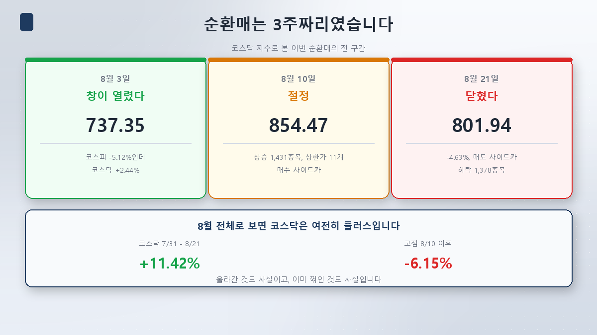
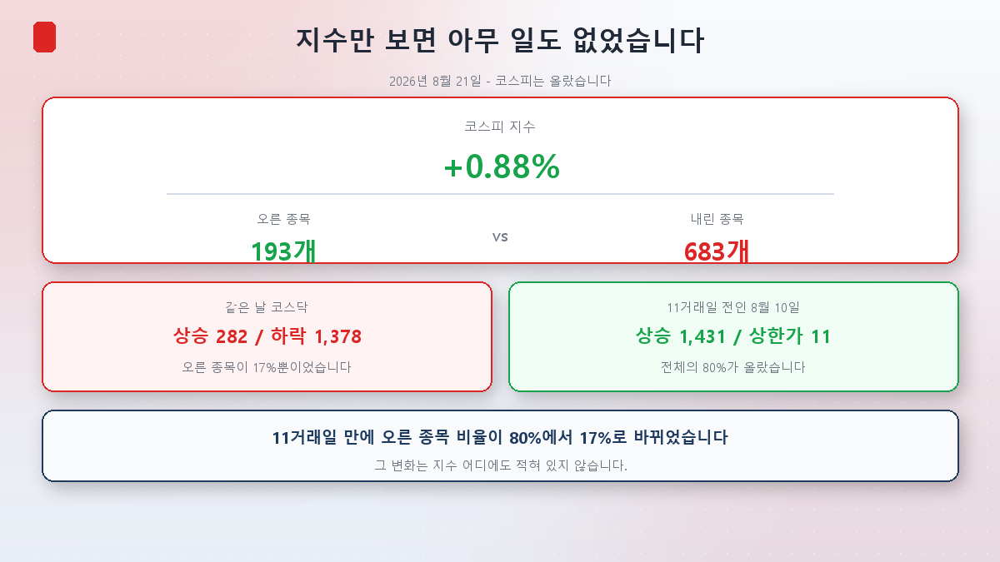
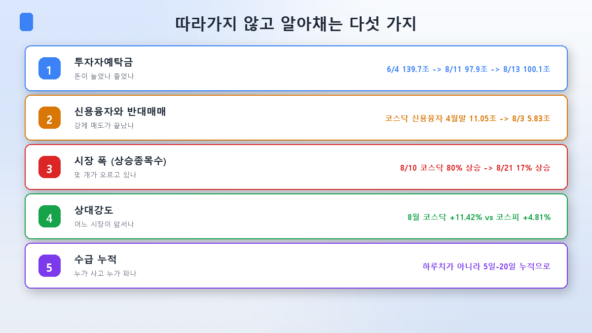
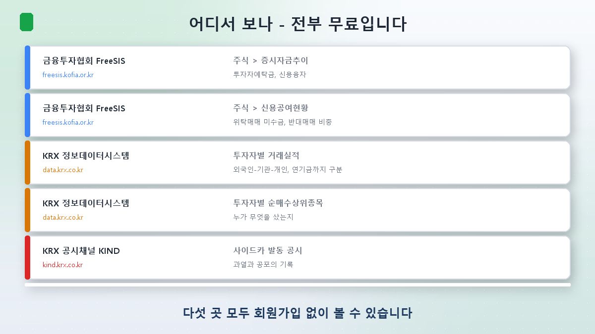
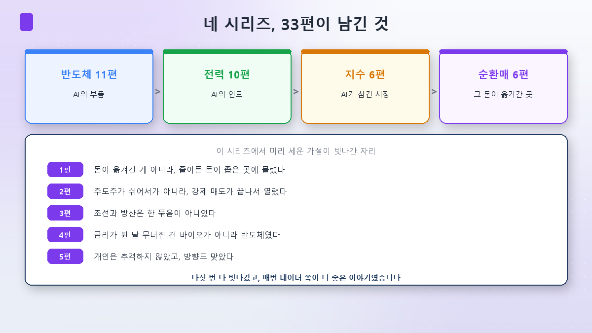

シリーズ最終回です。

[第1回](/ja/p/what-is-sector-rotation/)を書いたのが8月12日でした。あのときは循環物色の真っ最中でした。ところがこの記事を書いているいま、**その循環物色はすでに終わっています。**

## 循環物色は3週間でした

| | コスダック | 何があったか |
|---|---|---|
| 8月3日 | 737.35 | コスピ-5.12%なのにコスダック+2.44%。**窓が開きました** |
| 8月10日 | **854.47** | 上昇1,431銘柄、ストップ高11、買いサイドカー。**頂点** |
| 8月21日 | **801.94** | -4.63%、売りサイドカー、下落1,378銘柄。**閉じました** |

8月21日のコスダックは824.05で始まり場中795.57まで押され、**午前10時5分に売りサイドカー**が発動しました。この日に崩れたのは、まさにこのシリーズが扱ってきた業種でした。

- 防衛 — ハンファエアロスペース **-7.03%**
- バイオ — アルテオジェン -5.60%、ABLバイオ -5.09%
- 二次電池 — エコプロBM -4.91%、LGエネルギーソリューション -4.05%
- 造船 — HD現代重工業 -4.73%
- ロボット — レインボーロボティクス -3.92%

一方でサムスン電子は**+3.87%**、SKハイニックスは+2.31%でした。

ここで[第3回](/ja/p/why-shipbuilding-defense-rise/)の結論を自分で試す必要があります。造船と防衛は別々のエンジンで動くと述べました。ところがこの日は**一緒に下げました。**矛盾でしょうか。

いいえ。[第2回](/ja/p/when-the-leader-rests/)で見たあの性質です。**資金が抜けていく局面では銘柄間の相関が上がります。**普段はそれぞれのエンジンで走りますが、お金が出ていくときは一緒に出ていきます。原因も[第4回](/ja/p/is-bio-a-rate-play/)で見たそれでした。米国の長期金利と原油が同時に上がって割引率の負担が増し、前日の急騰に対する利益確定が重なりました。

ただし**8月全体で見ればコスダックはまだプラス**です。7月31日の719.76から8月21日の801.94へ**+11.42%**。同じ期間のコスピは+4.81%でした。上がったのも事実で、高値(8月10日)比で**-6.15%**とすでに折れているのも事実です。

## ところが指数だけを見れば何も起きていませんでした

この回が必要な理由は、8月21日の一日にすべて入っています。

この日**コスピは+0.88%上げました。**見出しだけなら静かな一日です。

ところがこの日、コスピで**上がった銘柄は193、下がった銘柄は683**でした。下げた銘柄が上げた銘柄の**3.5倍**です。指数が上がったのはサムスン電子とSKハイニックスが牽引したからです。

コスダックは上昇282、下落**1,378**。上がった銘柄が**17%**だけでした。

そしてわずか**11営業日前の8月10日**、コスダックは上昇銘柄が1,431と**全体の80%**を超え、ストップ高だけで11ありました。

**11営業日で上がった銘柄の比率が80%から17%に変わりました。**その変化は指数のどこにも書かれていません。指数は時価総額加重なので、大きな銘柄が牽引すれば残りが全部下げても上がります([指数第1回](/ja/p/what-is-kospi-index/)で扱ったあの構造です)。

**循環物色を指数で確認しようとすると、始まりも終わりも取り逃します。**

## だから見るべき五つ

このシリーズ六回で実際に答えをくれた指標だけを絞りました。

### ① 投資家預託金 — お金が増えたか減ったか

証券口座で買いを待っているお金です。**指数が上がるときにこの数字も増えていれば新しいお金が入ったということで、減っているのに指数だけ上がるなら、残ったお金が狭い場所に集まったということです。**

第1回の発見がまさにこれでした。6月4日の139.7兆ウォン(過去最大)から8月11日の97.9兆ウォンへ。**30%近く減ったのにコスダックは19%上がりました。**その後8月13日に100.1兆ウォン、8月18日に104.8兆ウォンまで回復しています。

### ② 信用融資と追証売り — 強制売りが終わったか

借りて買ったお金です。[第2回](/ja/p/when-the-leader-rests/)で、循環物色の窓が開いた本当の条件がここでした。コスダックの信用融資が4月末の11兆500億ウォンから8月3日の5兆8,300億ウォンへ半分以下に減りました。**強制的に売られる玉が消えてはじめて、市場が銘柄を選びはじめました。**

一緒に見るべきなのが**追証売りの比率**です。金融投資協会が委託売買未収金とともに毎日公表しており、実務では**5%を超えると投げ売りのサイン**と見ます。7月30〜31日にそれぞれ8.6%、7.1%まで跳ね、その二日がまさにサーキットブレーカーの発動日でした。

**なお信用融資は再び増えています。**7月31日に28.9兆ウォンまで減ったあと、8月20日時点で31兆8,938億ウォンまで戻りました。窓が開いた条件が巻き戻っているということです。

### ③ 市場の広がり — 何銘柄が上がっているか

上で見たあの数字です。上昇銘柄数と下落銘柄数。これを20日分累積して比率にしたのが**ADR(騰落レシオ)**です。

> ADR = 20日間の上昇銘柄数合計 ÷ 下落銘柄数合計 × 100
> 100% = 均衡 · **120%以上 = 過熱** · **70%以下 = 底値圏**

ただしこの閾値は学術的に検証された基準というより、長く使われてきた**実務慣行**です。数字そのものより**方向**を見るほうが安全です。指数は動かないのに上昇銘柄数が増えているなら下で何かが動いており、指数は上がるのに上昇銘柄数が減っているなら、その上昇が数銘柄に依存しているということです。

### ④ 相対強度 — どちらの市場が先行しているか

コスピとコスダックのどちらが、大型株と中小型株のどちらが先行しているか。計算は単純で、同じ期間の収益率を並べるだけです。

8月はコスダック**+11.42%** vs コスピ**+4.81%**でコスダックが先行しました。ところが[第2回](/ja/p/when-the-leader-rests/)で見たとおり、今年全体では正反対でした。1〜7月にコスピが上がってコスダックが下げた日が132営業日中32日(24%)で、**コスダック発足以降で過去最高**でした。

参考までに、コスピの大型株は時価総額上位100銘柄、中型株はその次の200銘柄、小型株はさらに次の514銘柄で構成され、年2回(3月・9月の先物オプション満期の翌日)定期変更されます。

### ⑤ 需給 — 誰が買い誰が売っているか

最もよく見られ、最もよく読み違えられる指標です。**一日分だけを見て判断すること**が代表的な誤りです。

実際に8月、外国人は一日で3兆ウォンを買い、翌週には4兆ウォンを売りました。一日分では何も分かりません。**5日・20日の累積で見てください。**

そして**その他法人**という項目も見ておく価値があります。機関でも外国人でも個人でもない一般法人で、自社株買いや上場直後の大量売却のような**ファンダメンタルズと無関係な需給**がここに現れます。8月21日にもその他法人が1兆ウォン超を買い越しましたが、SKハイニックスの自社株買いの影響でした。

## どこで見るか

すべて無料で、会員登録も要りません。

| どこ | アドレス | メニュー | 何を |
|---|---|---|---|
| 金融投資協会 FreeSIS | freesis.kofia.or.kr | 株式 → 証市資金推移 | 投資家預託金、信用融資 |
| 金融投資協会 FreeSIS | freesis.kofia.or.kr | 株式 → 信用供与現況 | 委託売買未収金、追証売り比率 |
| KRX 情報データシステム | data.krx.co.kr | 投資者別売買実績 | 外国人・機関・個人、年金まで区分 |
| KRX 情報データシステム | data.krx.co.kr | 投資者別純買越上位銘柄 | 誰が何を買ったか |
| KRX 公示チャネル KIND | kind.krx.co.kr | サイドカー発動公示 | 過熱と恐怖の記録 |

上昇・下落銘柄数とADRは証券会社のHTS・MTSでたいてい提供されます。ボラティリティ指数(VKOSPI)も一緒に見るとよく、通常20%台は安定、**30%以上は警戒**局面と読みます。7月29日にはこの指数が場中97.99まで上がりました。

## 「確認したらもう遅いのでは」

もっともな反論で、半分は当たっています。

ただしこのシリーズ六回で確認したのは、**循環物色を先回りして当てようとした人たちも、おおむね外していた**という事実です。7月に大半の証券会社が造船・防衛を次の主導株に挙げましたが、8月にいちばん上がったのはバイオで、そのバイオも3週間で折れました。

ですからこのシリーズを終えるにあたって残したいのは、予測ではなくこういう順序です。

1. **指数ではなく市場の広がりを先に見ます。**何銘柄が上がっているかのほうが指数より正直です。
2. **総量を確認します。**預託金が増えているか減っているかで、同じ上昇がまったく違う意味になります。
3. **一度に全部買いません。**確認が遅れる問題は予測で解くのではなく、**分割**で解くのが正しいです。[第5回](/ja/p/why-retail-took-the-other-side/)で見たとおり、方向より回転率と道具が成果を分けました。

チェスリー投資諮問のパク・セイク代表の原則が一つ、ここで役に立ちます。**下落の原因が企業の競争力の毀損でないなら分割買いが有効で、ファンダメンタルズ自体が揺らいだのなら損切りが正しい**というものです。判断すべきは「どれだけ下げたか」ではなく「なぜ下げたか」です。

## では、いまはどのあたりか

正直に申し上げると**まだ分かりません。**見方が割れています。

LS証券のヨム・スンファン理事は**「下半期は半導体の偏りの強度が緩み、市場の温もりがさまざまな業種へ広がるだろう」**として循環物色の継続に重きを置きます。大信証券は市場が**「低評価・低ボラティリティ相場から業績敏感相場へ転換中」**と見ています。

一方、サムスン証券のシン・スンジン投資情報チーム長の診断は第1回の発見とぴたりと重なります。

> **「個人の資金力が限られているため、半導体の主導株とコスダック指数はデカップリングせざるを得ない」**

お金が限られていれば、一方が上がるときもう一方は取り残されます。第1回で「減ったお金が狭い場所に集まった」と書いたのと同じ話です。

今週は確認すべきものが二つあります。**8月27日未明のエヌビディア決算**(市場コンセンサスは売上919億ドル)と、**同じ日の韓国銀行金融通貨委員会**です。7月に政策金利を2.50%から2.75%へ引き上げたあとの初会合です。

## まとめ

- **今回の循環物色は3週間でした。**8月3日に開き、8月10日に頂点を打ち、8月21日に閉じました。コスダックは8月全体で+11.42%ですが、高値比では-6.15%です。
- **指数は市場を隠します。**8月21日のコスピは+0.88%でしたが683銘柄が下げ、コスダックは上がった銘柄が17%だけでした。11営業日前は80%でした。
- **五つだけ見れば十分です。**投資家預託金、信用融資と追証売り、市場の広がり、相対強度、需給の累積。すべて無料で見られます。
- **需給を一日分で読まないでください。**5日・20日の累積で見るべきです。外国人は一週に3兆を買い、翌週に4兆を売りました。
- **確認が遅れる問題は、予測より分割で解くほうがましです。**先回りしようとした人たちもおおむね外していました。

## 最後に — 33回を終えて

この記事で四つ目のシリーズが終わります。[半導体11回](/ja/p/what-is-hbm/)でAIの**部品**を、[電力10回](/ja/p/ai-power-hunger/)で**燃料**を、[指数6回](/ja/p/what-is-kospi-index/)でAIが飲み込んだ**市場**を、そして循環物色6回で**そのお金が移った先**を見ました。全部で33回になりました。

このシリーズで個人的にいちばん面白かったのは、**あらかじめ立てた仮説が五回とも外れた**という点です。

- **第1回** — お金が移ったのではなく、減ったお金が狭い場所に集まりました。
- **第2回** — 主導株が休んだからではなく、強制売りが終わったから窓が開きました。
- **第3回** — 造船と防衛はそもそも一つの括りではありませんでした。
- **第4回** — 金利が跳ねた日に崩れたのはバイオではなく半導体でした。
- **第5回** — 個人は追随しておらず、方向も合っていました。

そして毎回、**データのほうが私の書こうとしていたものより良い話**でした。これがこのシリーズを書いて学んだことのうち、いちばん役に立つものだと思います。もっともらしい説明が先に浮かんだら、それが正しいか数字で確かめてみること。たいていは外れていて、外れた場所にもっと面白いものがありました。

33回、お付き合いいただきありがとうございました。

> ⚠️ この記事は学んだ内容の整理であり、特定の銘柄や売買手法を推奨するものではありません。本文の指数・需給・残高の数値は確認時点(2026年8月23日、市場データは8月21日終値基準)のもので、変わり続けます。ADRの閾値と追証売り比率の基準は学術的に検証された数値ではなく実務慣行です。投資判断とその責任はご自身にあります。
