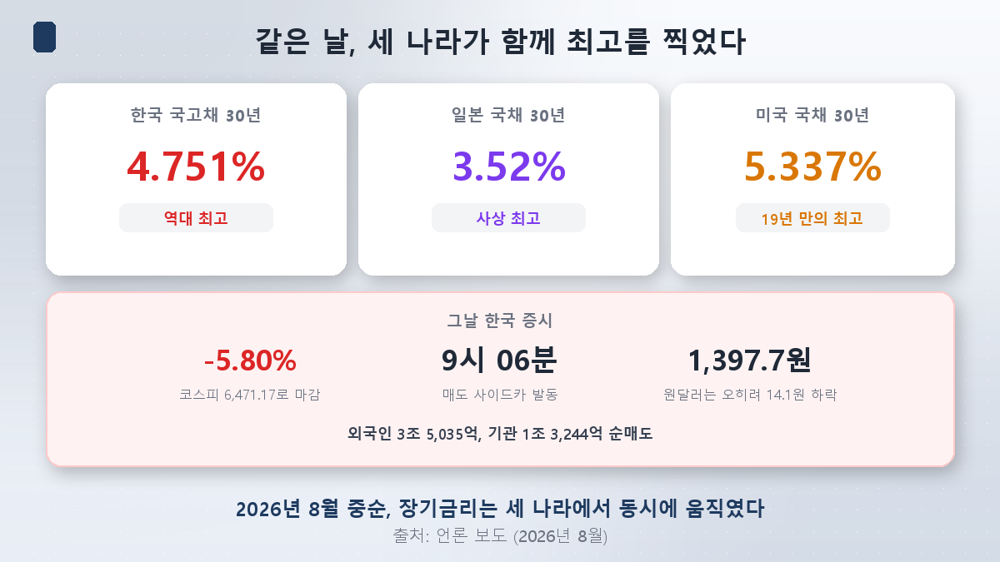
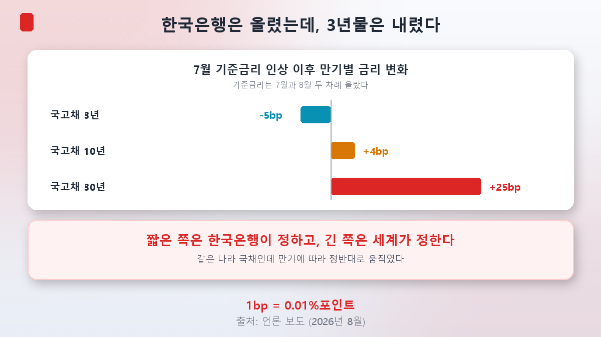
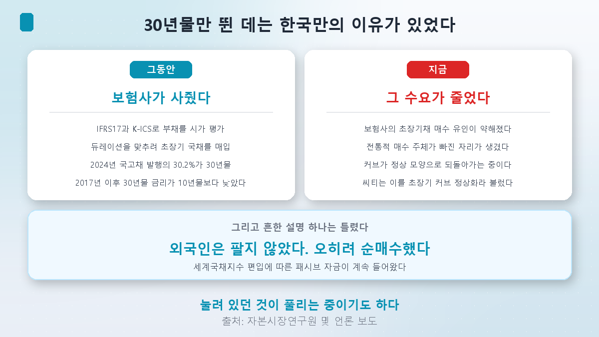
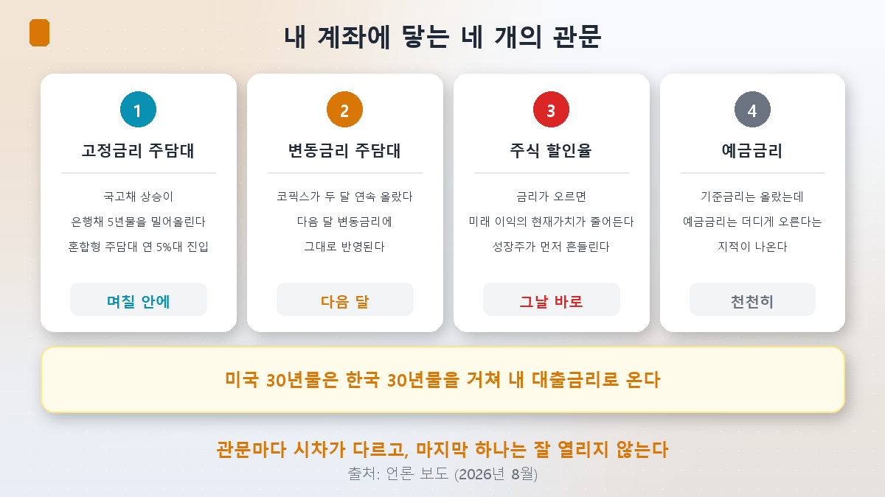

[第3篇](/zh/p/did-ai-really-raise-rates/)是这样收尾的：**整条街都是黑的。**并且留下了一道题。

> 韩国30年期国债收益率创下历史新高，可**韩国并没有超大规模云厂商**。那我们的利率为什么会涨？

先说答案：**整条街确实停电了，而我们家的电闸也确实有问题。**只不过那个问题所在的位置，和我预想的完全不同。

## 同一天，三个国家一起创下新高

韩国30年期国债收益率触及**4.751%**、创下历史新高的那一天，日本30年期也以**3.52%**创下历史最高，美国30年期则触及**5.337%**、为十九年来最高。**是同一天。**

几天后，这股冲击传到了韩国股市。8月19日，综指下跌**398.66点（5.80%）**，收于**6,471.17**。开盘仅6分钟就触发了**卖方熔断保护**，外资净卖出3.5万亿韩元，机构净卖出1.32万亿韩元。媒体给出的标题是**「美国利率冲击」**。

只看到这里，答案似乎已经有了：美国的利率原样传导过来了。

可那天有一处不对劲。**韩元反而走强，美元兑韩元下跌14.1韩元至1,397.7。**风险资产被抛售时通常韩元会走弱，那天却相反。第二天综指反弹，靠的也是韩元走强和电子板块的资金面改善。

这是一个信号：事情没那么简单。

## 决定性的线索 — 按期限分化了

我把第3篇学到的方法照搬过来：**按区间拆开看。**

7月中旬韩国央行加息之后，国债收益率是这样走的。

| 期限 | 变化 |
|---|---|
| 国债3年 | **-5bp**（下行） |
| 国债10年 | +4bp |
| 国债30年 | **+25bp** |

**央行加了息，3年期收益率反而下行了。**而只有30年期跳了25个基点。1个基点是0.01个百分点。

这并不意味着货币政策失灵，而是意味着**管辖范围本来就不同。**

> **短端由韩国央行决定，长端由世界决定。**

基准利率直接牵动最短端的利率，这份影响能传导到3年期。但一条望向三十年后的收益率，决定它的不是韩国央行，而是**全球的期限溢价**——第3篇里那个。

所以「美国利率是不是传导过来了」这个问题只对了一半。**不是传导过来的，它本来就是同一个市场。**

## 那么，为什么偏偏是30年期涨得这么多

这是本篇最出乎我意料的地方。

如果要找国内因素，我原以为会是**财政赤字或国债发行量**——第3篇里美国就是这样。可真正的原因在别处。

### 一直以来，30年期是保险公司在买

随着**IFRS 17**（新国际会计准则）和**K-ICS**（新偿付能力制度）的实施，保险公司开始对保险负债进行**公允价值计量**。保险合同的期限非常长，资产也必须拉长，估值损益才不会大幅波动。这叫**久期匹配**。

于是保险公司大量买入超长期国债。规模是这样的：

- **2024年国债发行量的30.2%是30年期。**
- 把2014年末与2024年末相比，国债余额增量中**约一半（47.9%）、291万亿韩元是30年期。**

结果，韩国债券市场出现了一件全球范围内都少见的事：**2017年以来，30年期收益率一直低于10年期。**

通常借得越久，拿到的越多——这就是第3篇里的期限溢价。可韩国是反过来的。**当一类买家是「不得不买」时，价格就会扭曲。**

### 现在这份需求减少了

保险公司买入超长期债券的动力已经不如从前。传统买家退出留下的位置上，发行量照旧涌出。收益率于是上行。

花旗把这个现象称作**「超长端曲线的正常化」**——被压住的东西正在回到本来的位置。

所以这样表述才准确：**韩国30年期创下新高，也有一部分原因是它此前一直被压得异常低。**美国的新高和韩国的新高名字相同，性质却不同：美国是本来没有的溢价冒了出来，韩国则是**被压住的溢价正在释放。**

### 而且，一个常见的说法是错的

利率上行时，人们通常会说**「是外资在卖」**。这次不是。

**外资反而在净买入韩元债券**，包括30年期创下新高的那天。原因是韩国被纳入**世界国债指数（WGBI）**后，被动资金持续流入。

不过分析师也指出，即便外资流入，**韩元债券市场的供需结构本身依然脆弱。**买家原本集中于一类（保险公司），这类买家退场后，新进来的钱并不容易补上那个缺口。

顺带一提，这一阶段还出现了**「债券义警」**这个说法——指那些认为政府财政过于宽松时，通过抛售国债推高收益率来施压政府的债券投资者，这个词最早出现在1990年代的克林顿政府时期。

## 与此同时，韩国央行加了息

8月27日，金融货币委员会将基准利率从**2.75%上调至3.00%**，为继7月之后的**连续第二次加息**，七名委员中有六人赞成。

同时公布的预测更值得注意。

| 项目 | 此前 | 本次 |
|---|---|---|
| 今年GDP增速预测 | 2.6% | **3.3%** |
| 居民消费价格涨幅预测 | 2.7% | 2.7%（维持） |

增速预测一口气上调了**0.7个百分点**。这被解读为要在物价跳升之前先出手，而公布的点阵图中，21个点里的最高值是**3.5%**。

也就是说，韩国的货币政策目前处在**紧缩周期**里。不过如上所述，这主要是短端的事。

## 那它是怎么走到我账户里的

### 1. 固定利率房贷 — 几天之内

混合型（固定）房贷的基准是**银行债5年期**，而这条收益率跟着国债走。它近期急涨，把**混合型房贷利率推进了5%区间。**

**美国30年期 → 韩国国债 → 银行债5年期 → 我的贷款利率。**这条链条就是本篇的标题。

### 2. 浮动利率房贷 — 下个月

浮动利率的基准是**COFIX**，它是国内八家银行融资成本的加权平均；它上行，次月的浮动利率房贷就跟着上行。按新发放额计算的COFIX已经**连续两个月上涨。**

### 3. 股票的折现率 — 当天

最快的一道关口。利率上行，未来利润的现值就变小，而那些靠遥远未来利润定价的成长股会最先动摇。8月19日综指5.80%的暴跌走的正是这条路径。[指数系列第6篇](/zh/p/reading-index-ai-era/)里讲过的折现率与市盈率的关系，在这里真实地起作用。

### 4. 存款利率 — 慢慢来

基准利率涨了，可**存款利率被指相对滞后**。贷款利率上行的速度和存款利率上行的速度并不一样。四道关口里，只有这一道不太容易打开。

## 回答第3篇留下的问题

> **是美国利率原样传导过来，还是另有国内因素？**

**两者都有，但要分开看。**

- **短端（3年期）**：属韩国央行管辖。事实是加了息，它反而跌了5个基点。
- **长端（30年期）**：由全球期限溢价决定。韩国、日本、美国在同一天创下新高就是证据。
- **在此之上还有一个只属于韩国的理由**：保险公司需求造成的扭曲正在消解。所以只有30年期跳了25个基点。

第3篇里我写道「AI是三个凶手之一，很可能是最小的那个」。到了韩国，**AI的份额还要再小一些。**推高我们30年期收益率的最大力量，既不是AI公司债，也不是外资撤离，而是**一项会计制度所创造的需求正在消失的过程。**

## 小结

- **同一天，韩国（4.751%）、日本（3.52%）、美国（5.337%）的30年期一起创下新高。**几天后综指暴跌5.80%收于6,471.17，开盘6分钟触发熔断保护。
- **按期限分化了。**7月加息之后，3年期**-5bp**、10年期+4bp、30年期**+25bp**。**短端归央行，长端归世界。**
- **30年期单独跳高，有一个只属于韩国的理由。**IFRS 17与K-ICS实施后，保险公司大量买入超长期国债，以至于**2017年以来30年期收益率低于10年期**。这份需求正在减少，曲线正在回归正常——花旗称之为「超长端曲线的正常化」。
- **「外资在卖」是错的。**外资反而净买入，WGBI被动资金仍在流入；不过供需结构本身被指脆弱。
- **8月27日，韩国央行把基准利率上调至3.00%**，为连续第二次加息，并将增速预测从2.6%大幅上调至**3.3%**。
- **它通过四道关口抵达你的账户**：固定利率房贷（银行债5年期，已进5%区间）、浮动利率房贷（COFIX连涨两月）、股票折现率（当天）、以及存款利率（慢慢来）。

下一篇是最后一篇。五篇里看了一大堆数字，我会把**其中个人自己就能点开核实的那些**整理出来。会像[板块轮动第6篇](/zh/p/how-to-read-rotation/)那样，逐个亲自核对网址，打不开的就删掉。

> ⚠️ 本文仅为个人学习整理，不构成对任何个股或投资方式的建议。文中的利率、指数与汇率均为核对时点（2026年8月30日）的市场数据与报道口径，会持续变动。各期限的利率变化是特定基准日之间的比较，取不同区间数值也会不同。保险公司需求与超长端利率之间的关系，是多家机构给出的解读，并非唯一解释。贷款利率因个人信用与产品差异很大，自身条件请向相应金融机构核实。投资决策及其后果由本人承担。
