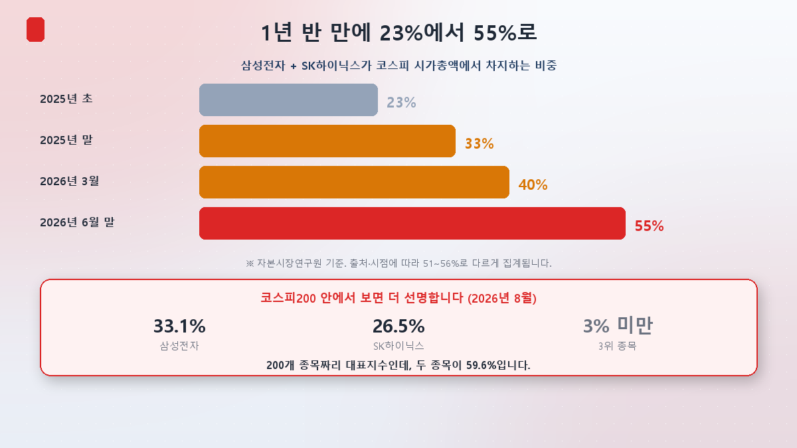
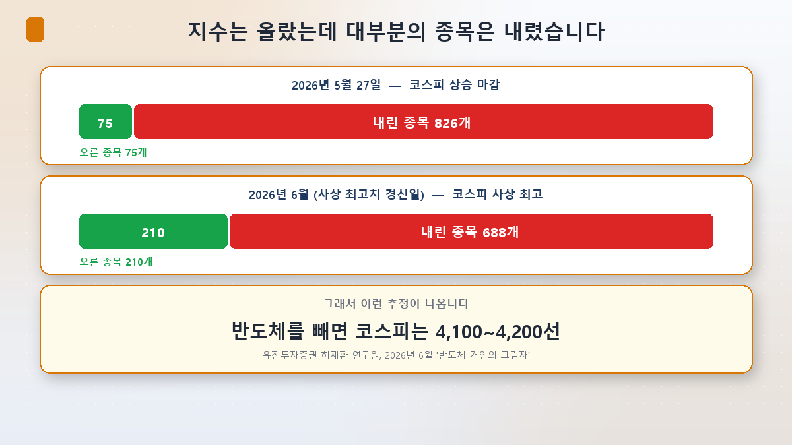
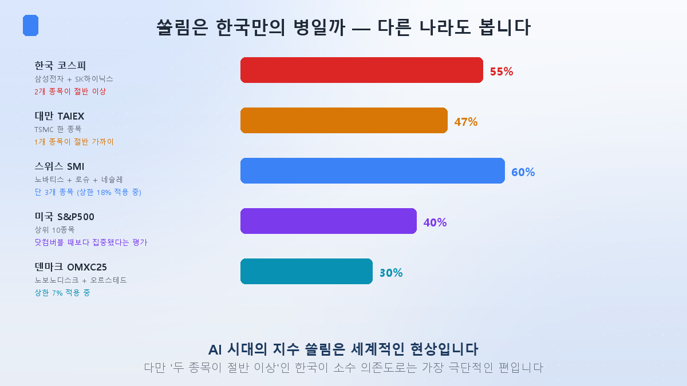
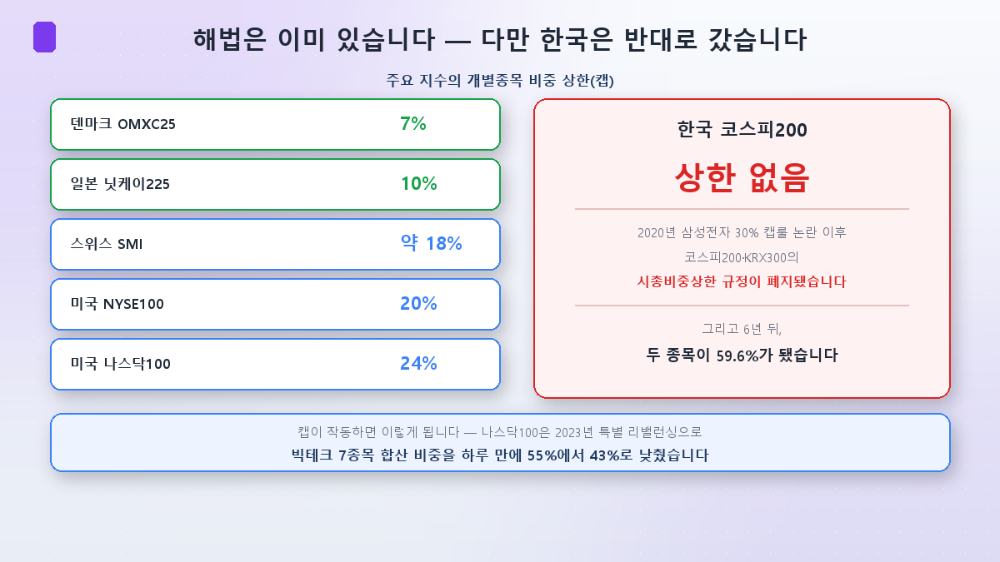

[第1篇](/zh/p/what-is-kospi-index/)里我们看到，指数是"一元一票"。所以买韩国综指并不是分散，实际上是对AI半导体的一次集中押注。

今天来看这种集中**走到了哪一步**，以及**别的国家怎么处理它**。先说一句：最后那一段让我相当意外。

## 可怕的是速度

先看数字。

按韩国资本市场研究院的口径，三星电子与SK海力士占综指市值的比重，从**2025年初的23%升到2026年6月底的55%**——一年半翻了一倍多。（不同来源和时点在51%~56%之间，但方向一致。）

**放进KOSPI200看更刺眼。**截至2026年8月，三星电子33.1%、SK海力士26.5%，合计**59.6%**。而排第三的股票占比还不到3%。一个由200只股票构成的代表指数，实际上由两只决定。

## "指数涨了，我的股票却跌了"是怎么回事

第1篇说过，指数与体感的落差是结构性的，不是错觉。证据就摆在数字里。

- **2026年5月27日**：综指收涨，可上涨**75只**、下跌**826只**，相差11倍。
- **2026年6月、指数刷新历史新高的那天**：上涨210只，下跌**688只**。

指数创新高，市场上大多数股票却在跌。这正是市值加权制造的错觉。

于是出现了这样一个估算。韩国Eugene投资证券研究员许在焕在2026年6月的《半导体巨人的阴影》报告中认为，**剔除半导体后综指仅相当于4,100~4,200点**。半导体的市值占比一年内从25%跳到54.6%，他预计半导体将占综指全部营业利润的60%~70%。

有意思的是估值。综指未来12个月的预期市盈率是8.1倍，看着便宜；可**剔除半导体后升到11倍**，高于疫情后的均值10.4倍。换句话说，"韩国股市便宜"这句话本身，也可能是半导体造出来的错觉。

## 副作用已经出现

集中并非只是理论上的担忧。

据资本市场研究院分析，2026年上半年综指的日收益率波动率为**3.6%，是前一年（1.4%）的两倍多**。其中3月和6月分别为4.8%和4.7%，**高于疫情暴跌期的2020年3月（4.2%）**。仅上半年就启动了85次市场稳定措施、13次熔断。

原因很清楚：两只股票的日收益率**相关系数高达0.82**，几乎是一体在动。当两只近乎同步的股票占据指数一半以上，存储行业只要有一点风吹草动，整个指数就会剧烈摆动。

资本市场研究院首席研究委员金俊锡这样概括：**"在少数股票占指数比重过大的情况下，机构获利了结与个人追涨相互碰撞，会把很小的冲击放大成全市场的波动。"**

顺带一提，国民年金的国内股票组合中，这两只也超过55%。这不只是散户的问题。

## 可这只是韩国的病吗

这里需要拉回平衡。在把集中度归因于所谓"韩国折价"之前，先看看别人。

- **台湾**：台积电一只就占加权指数的44%~47%。
- **瑞士**：诺华、罗氏、雀巢三只合计超过60%。
- **美国**：标普500前十大占37%~43%，有观点认为**比互联网泡沫顶峰时更集中**——当年是32只股票占据一半市值，如今只要24只。
- **丹麦**：诺和诺德与沃旭合计接近30%。

也就是说，**AI时代的指数集中是一个全球现象**。但程度有别。台湾是"一只接近一半"，韩国是**"两只超过一半"**，就少数依赖度而言，韩国属于最极端的一档。

丹麦的案例可以当警钟读。2025年诺和诺德股价下跌48%，丹麦代表指数OMXC25成为全球发达市场表现最差的基准。一只股票拖垮了一个国家的指数。

## 让我意外的地方 — 解法早就有，韩国却反着走

这是本篇最出乎我意料的部分。

全球主要指数大多设有**个股权重上限（cap）**。丹麦OMXC25是7%，日本日经225是10%，瑞士SMI约18%，美国NYSE100是20%，纳斯达克100是24%。

上限是真的管用。纳斯达克100在2023年做过一次**特别再平衡**，把七只科技巨头的合计权重**一天之内从55%压到43%**。

**可KOSPI200没有权重上限。**

而且不是本来就没有。2020年三星电子权重变大时曾有过"30%上限规则"之争，此后KOSPI200与KRX300的**市值权重上限规定被废除了**，理由是放宽基金运作监管。

六年过去，这两只股票占到了KOSPI200的59.6%。

台湾其实也走在同一方向。台积电太大之后，监管反而把基金的单一个股上限从10%**上调到25%**。守不住上限，就把上限放开。世界分成了两派，而韩国和台湾站在同一边。

## 反面的说法也要听

"集中是个问题"并非全场一致。

**KB证券研究员李恩泽**认为主导股集中是自然现象，反而**"集中开始瓦解的时点才是泡沫破裂的前兆"**。1929年、1972年的漂亮50、2000年的互联网泡沫，当时的主导股同样有着极快的利润增长——与今天的半导体相似。

牛津大学蒙戈·威尔逊教授指出，三星与海力士的业绩已不被当作单一公司新闻，而是被读作**全球AI投资与芯片需求的信号**，因此它们左右指数是自然的。高盛也称"是盈利在拉动亚洲股市"，视其为基本面驱动。

那改用**等权重指数**不就行了？也没那么简单。美国的等权重标普500 ETF（RSP）2024年涨12.78%，远逊于市值加权指数的21.45%；2025年是11.20%对15.54%。在集中行情里，等权重是吃亏的。它的换手率还是市值加权的五倍以上，交易成本更高。

**我的判断是：**集中本身并不等于见顶信号，业绩支撑也是真的。但正如许在焕的表述——**"集中本身不是利空，但并不健康。"**而本篇的核心在于：缓解这种不健康的工具，别国都留着，韩国却把它取消了。

## 投资者视角 — 四点

**① 先确认自己持有的是指数还是两只股票。**如果持有KOSPI200 ETF，其中约六成是三星电子和SK海力士。若又单独加买了这两只，实际敞口会大得多。

**② 记住0.82这个相关系数。**两只几乎同步，分开买并不能带来多少分散效果。

**③ 对"韩国便宜"打个问号。**8.1倍的预期市盈率是半导体做出来的。剔掉半导体是11倍，高于疫情后均值。

**④ 盯住指数编制规则会不会变。**券商界已在讨论给KOSPI200加权重上限。一旦落地，再平衡过程会同时出现大盘股卖出与中小盘股买入。指数规则变更本身就是一次资金面事件。

## 小结

- **集中的速度很陡。**三星电子+SK海力士占综指市值比重从2025年初的23%升至2026年6月底的55%，在KOSPI200中更是**59.6%**。第三名不到3%。
- **错觉是可以量化的。**综指上涨那天有826只股票在跌；剔除半导体，指数被估在4,100一线。波动率已高于疫情暴跌期。
- **集中是全球现象，应对方式却分道扬镳。**丹麦7%、日经10%、瑞士18%、纳斯达克100是24%，大多设了权重上限。**KOSPI200没有上限，连2020年曾有过的规定也已废除。**

下一篇[第3篇]，我们看这套结构真正引爆的那一周：**2026年7月，一周之内−8%、−8%、+17.9%**——史上首次连续两天熔断，与史上首次涨停，发生在同一个五天里。

> ⚠️ 本文仅为个人学习整理，不构成任何证券的买卖建议。所引数值与专家观点为当时情况，随时可能改变。投资决策及责任由本人承担。
