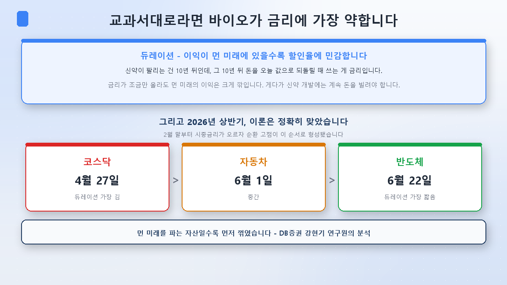
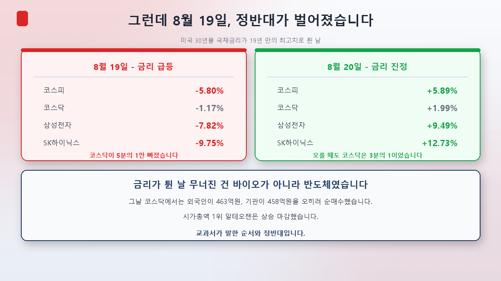
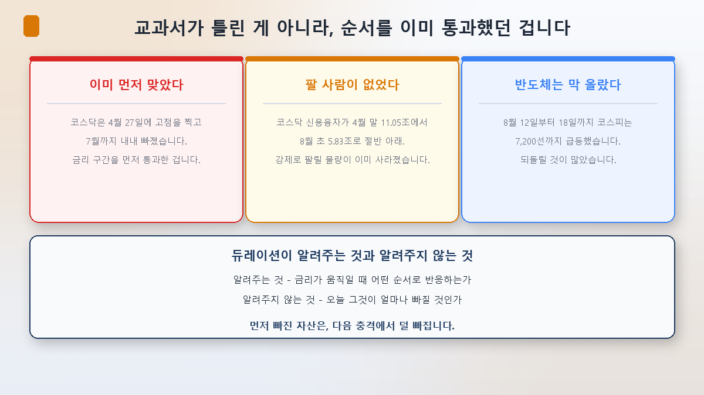
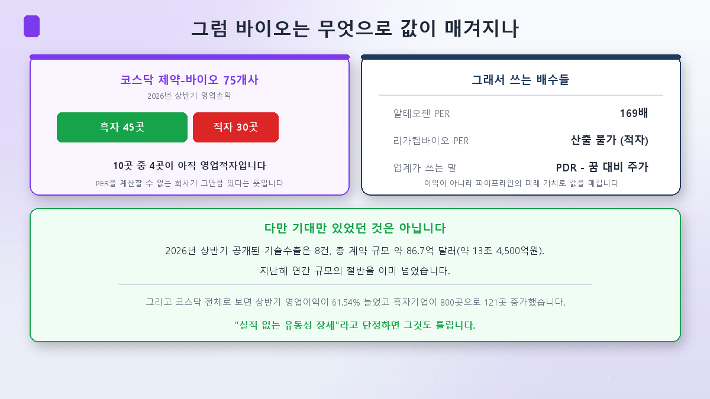
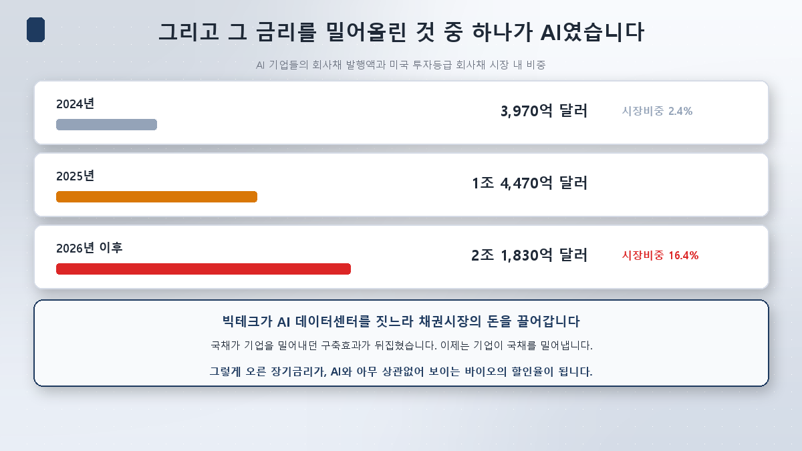

[3편](/p/why-shipbuilding-defense-rise/)에서 조선과 방산을 봤습니다. 하나는 AI로 가는 통로가 열렸고, 하나는 AI와 무관한 땅에 서 있었죠.

이번엔 8월 코스닥 랠리의 진짜 주인공 차례입니다. **바이오**입니다. 코스닥150 헬스케어 지수는 7월 31일부터 8월 10일까지 **34.66%** 올랐습니다. 같은 기간 코스닥 전체가 18.72%였으니 거의 두 배 속도였죠.

바이오에는 오래된 공식이 하나 붙어 있습니다. **"바이오는 금리의 함수다."** 그런데 지난 이틀이 그 공식을 정면으로 시험했고, 결과가 예상과 달랐습니다.

## 교과서부터 — 왜 바이오가 금리에 약하다고 하나

**듀레이션**이라는 개념입니다. 원래는 채권 용어인데 주식에도 씁니다.

신약 하나가 팔리기까지 10년이 걸린다고 해봅시다. 그 10년 뒤의 돈을 오늘 값으로 되돌릴 때 쓰는 게 금리입니다. **먼 미래일수록 할인이 크게 먹힙니다.** 금리가 조금만 올라도 10년 뒤 이익의 현재가치는 크게 깎이죠. 반면 올해 당장 버는 회사는 덜 깎입니다.

여기에 하나 더 있습니다. DB증권 강현기 연구원의 설명입니다.

> **"제약·바이오 기업은 신약 개발 과정에서 대규모 자금 조달이 필요한 만큼 금리 상승 시 자금조달 비용 부담이 커진다"**

미래 이익은 더 깎이는데, 그때까지 버틸 돈은 더 비싸집니다. 이중으로 불리한 겁니다.

**그리고 올해 상반기, 이 이론은 정확히 맞았습니다.** 2월 말부터 시중금리가 오르기 시작하자 순환 고점이 이 순서로 형성됐습니다.

| 순환 고점 | 시점 |
|---|---|
| 코스닥 | 4월 27일 |
| 자동차 | 6월 1일 |
| 반도체 | 6월 22일 |

**먼 미래를 파는 자산일수록 먼저 꺾였습니다.** 교과서 그대로였죠.

## 그런데 8월 19일, 정반대가 벌어졌습니다

지난주 미국 30년물 국채금리가 **5.3%대**로 튀었습니다. 19년 만의 최고치입니다. 한국도 국고채 30년물이 4.751%로 역대 최고를 찍었고요.

교과서대로면 바이오와 코스닥이 가장 크게 맞아야 합니다. 결과는 이랬습니다.

**8월 19일 (금리 급등)**

| | 등락률 |
|---|---|
| 코스피 | **-5.80%** (6,471.17) |
| 코스닥 | **-1.17%** (824.46) |
| 삼성전자 | -7.82% |
| SK하이닉스 | -9.75% |

장 초반 코스피는 6% 넘게 빠지며 **올해 25번째 매도 사이드카**가 걸렸습니다. 그런데 **코스닥은 코스피의 5분의 1만 빠졌습니다.**

더 이상한 건 수급입니다. 그날 코스닥에서 **외국인은 463억원, 기관은 458억원을 오히려 순매수**했습니다. 시가총액 1위 알테오젠은 상승 마감했고요.

다음 날도 대칭이었습니다. **8월 20일**, 미 재무부의 국채 바이백 확대와 SK하이닉스의 40조원 자사주 소각 발표로 금리가 진정되자 코스피는 **+5.89%**(6,852.58) 급반등했고, 코스닥은 **+1.99%**(840.89)에 그쳤습니다. 오전 9시 57분에는 매수 사이드카가 걸렸습니다. 전날 매도 사이드카가 걸린 지 하루 만이었죠.

**빠질 때도 오를 때도, 금리에 크게 반응한 건 바이오가 아니라 반도체였습니다.**

## 왜 뒤집혔을까

여기서 결론을 "교과서가 틀렸다"로 내면 편합니다. 그런데 자료를 더 보면 그게 아닙니다.

**첫째, 코스닥은 이미 먼저 맞았습니다.** 위의 표가 그 증거입니다. 코스닥 고점은 4월 27일이었고, 그 뒤 7월까지 계속 빠졌습니다. 7월 한 달에만 -21.44%였죠([2편](/p/when-the-leader-rests/)). **금리 구간을 먼저 통과해버린 겁니다.**

**둘째, 팔 사람이 없었습니다.** 2편에서 본 그 숫자입니다. 코스닥 신용융자가 4월 말 11조 500억원에서 8월 초 5조 8,300억원으로 절반 아래(-47.2%)로 줄었습니다. 강제로 팔릴 물량이 이미 소진된 상태였죠.

**셋째, 반도체는 막 올랐습니다.** 8월 12일부터 18일까지 코스피는 7,200선까지 급등했습니다. 되돌릴 것이 많았던 쪽은 코스닥이 아니라 반도체였습니다.

그러니까 이렇게 정리됩니다.

> **듀레이션이 알려주는 것** — 금리가 움직일 때 어떤 순서로 반응하는가
> **듀레이션이 알려주지 않는 것** — 오늘 그것이 얼마나 빠질 것인가

**먼저 빠진 자산은 다음 충격에서 덜 빠집니다.** 이건 교과서를 부정하는 게 아니라 교과서를 한 번 더 적용한 결과입니다. 실제로 강현기 연구원도 같은 논리로 다음을 봤습니다. 금리가 진정되면 반등도 그 역순으로 온다는 것이죠. 그래서 8월 11일 시점에 그는 **"이제부터는 코스닥보다 자동차와 반도체 업종의 주가 재반등 여부를 살펴야 한다"**고 했습니다. 8월 12일 이후 실제로 반도체가 지수를 끌었으니, 이 판단은 맞았습니다.

## 그럼 바이오는 무엇으로 값이 매겨지나

금리가 아니라면 무엇일까요. 여기서 바이오의 특수성이 나옵니다.

**코스닥 제약·바이오 75개사의 2026년 상반기 실적을 보면, 45곳이 영업흑자, 30곳이 영업적자입니다.** 10곳 중 4곳이 아직 적자라는 뜻이고, **그 회사들은 PER을 계산할 수 없습니다.**

계산이 되는 곳도 숫자가 특이합니다. 알테오젠의 PER은 **169배**입니다(8월 14일 기준, 코스닥 시총 1위). 시가총액 5조원대인 리가켐바이오는 적자라 PER이 산출되지 않고요.

그래서 이 업종에는 **PDR**이라는 말까지 있습니다. Price to Dream Ratio, 꿈 대비 주가. 농담처럼 들리지만 실제로 쓰입니다. 현재 이익이 아니라 개발 중인 파이프라인의 미래 가치로 값을 매긴다는 뜻이죠.

**다만 여기서 "그러니까 기대뿐인 랠리"라고 단정하면, 그것도 틀립니다.**

2026년 상반기에 공개된 기술수출이 **8건, 총 계약 규모 약 86.7억 달러(약 13조 4,500억원)**입니다. 지난해 연간 규모의 절반을 이미 넘었습니다. 아리바이오가 중국 푸싱제약에 알츠하이머 치료제를 47억 달러에 넘긴 건이 가장 컸고, 알테오젠도 1월 GSK 자회사에 2.85억 달러, 3월 바이오젠에 5.79억 달러 계약을 맺었습니다. 알테오젠의 1분기 영업이익률은 54.9%였고요.

코스닥 전체로 봐도 그렇습니다. 상반기 영업이익이 **9조 4,279억원으로 61.54% 늘었고**, 흑자 기업이 800곳으로 121곳 증가했습니다.

**실적은 실제로 좋아졌습니다. 다만 그게 8월에 오른 종목들의 이유였는지는 별개입니다.**

## 재료가 있었던 곳과 없었던 곳

8월에 오른 바이오주를 하나씩 열어보면 성격이 갈립니다.

- **알테오젠** — 명확한 개별 재료가 있었습니다. 8월 7일 블랙록이 지분 **5.03%(269만 4,448주)** 보유를 공시했고(직전 4.98%에서 하루 새 넘어서며 공시 의무 발생, 목적은 단순투자), 그날 두 자릿수로 급등하며 코스닥 전체를 끌었습니다.
- **나머지 대부분** — 8월에 한정된 새 재료를 찾기 어려웠습니다. HLB는 리보세라닙의 FDA 재신청이 7월에 있었지만 8월 중 승인 소식은 없었고, 오히려 8월 19일 급락장에서 -2.43%로 알테오젠보다 부진했습니다. 에이비엘바이오와 리가켐바이오도 8월 신규 대형 계약은 확인되지 않았습니다.

즉 **한 종목의 재료가 업종 전체를 끌어올린 구조**에 가깝습니다. 여기에 [지수 4편](/p/leverage-etf-trap/)에서 다룬 단일종목 레버리지 ETF 규제로 갈 곳을 잃은 자금이 코스닥 현물로 옮겨온 것이 겹쳤고요.

한 가지 더 짚어둘 게 있습니다. 8월에 오른 종목 중에는 불과 넉 달 전 공시 신뢰 문제로 크게 흔들렸던 회사도 있습니다. 삼천당제약은 3월 말 한국거래소로부터 **불성실공시법인으로 지정**됐고, 이 사안을 계기로 금융감독원이 제약·바이오 공시 개선 작업에 들어갔습니다. **재료성 뉴스에 크게 움직이는 업종일수록, 그 뉴스의 신뢰도까지 함께 봐야 한다**는 뜻입니다.

## 그리고 그 금리를 밀어올린 것 중 하나가 AI였습니다

마지막으로, 이번 편에서 제가 가장 흥미롭게 본 연결입니다.

8월에 장기금리를 밀어올린 원인은 여럿입니다. 미국 재정적자 확대(의회예산국이 연간 전망을 2조 1,000억 달러로 상향), 중동발 유가 상승, 일본 국채금리 급등의 전이. 그런데 여기에 하나가 더 있습니다.

**AI 기업들의 회사채 발행입니다.**

아마존·메타·엔비디아·오라클·알파벳 같은 기업의 회사채 발행액이 2024년 3,970억 달러에서 2025년 1조 4,470억 달러로 늘었고, 2026년 들어서만 **2조 1,830억 달러**입니다. 미국 투자등급 회사채 시장에서 이들이 차지하는 비중은 **2.4%에서 16.4%**로 뛰었습니다.

뱅크오브아메리카는 AI 관련 차입이 장기 국채 수요를 밀어내고 있다고 봤습니다. 회사채와 주택저당증권이 올해 10년물 금리 상승분 중 약 0.3%포인트를 설명한다는 분석입니다. 언론은 이걸 **"뒤집힌 구축효과"**라고 불렀습니다. 원래는 정부가 돈을 빌려 기업을 밀어내는 게 구축효과인데, 지금은 기업이 국채를 밀어내고 있다는 겁니다.

**AI 데이터센터를 짓느라 빌린 돈이 장기금리를 올리고, 그 금리가 AI와 아무 상관없어 보이는 바이오의 할인율이 됩니다.**

3편에서 조선은 AI와 직접 연결됐고 방산은 무관하다고 했습니다. 여기에 바이오를 놓으면 그림이 완성됩니다.

| | AI와의 관계 |
|---|---|
| 조선 | **직접 연결** — 데이터센터에 발전설비를 판다 |
| 방산 | **무관** — 지정학이 전부다 |
| 바이오 | **간접 연결** — AI가 밀어올린 금리가 할인율이 된다 |

"AI 아닌 것들"이라는 묶음이 왜 성립하지 않는지, 이제 세 가지 방식으로 확인된 셈입니다.

## 정리

- **바이오는 금리에 민감한 게 맞습니다.** 이익이 먼 미래에 있고 그때까지 계속 돈을 빌려야 하니, 이중으로 불리합니다. 올해 상반기 순환 고점이 코스닥(4/27) → 자동차(6/1) → 반도체(6/22) 순으로 형성된 것이 그 증거입니다.
- **그런데 8월 19일에는 정반대였습니다.** 금리가 19년 만의 최고치로 튄 날 코스피는 -5.80%, 코스닥은 -1.17%였고, 코스닥에서는 외국인과 기관이 오히려 순매수했습니다.
- **교과서가 틀린 게 아니라 순서를 이미 통과한 겁니다.** 코스닥은 4월에 먼저 꺾였고, 신용융자가 절반 아래로 줄어 팔릴 물량도 남아 있지 않았습니다. **먼저 빠진 자산은 다음 충격에서 덜 빠집니다.**
- **바이오의 값은 이익으로 매겨지지 않습니다.** 75개사 중 30곳이 영업적자라 PER 자체가 계산되지 않고, 업계는 PDR이라는 말까지 씁니다. 다만 상반기 기술수출 8건·86.7억 달러는 실제로 있었던 성과입니다.
- **그리고 그 금리를 밀어올린 것 중 하나가 AI였습니다.** AI 기업 회사채가 미국 투자등급 시장의 16.4%를 차지하며 국채 수요를 밀어내고 있습니다.

다음 [5편]은 이 시리즈의 킬러편입니다. **개인은 왜 또 반대편에 섰나.** 8월 10일 코스닥이 7% 폭등하던 날 개인은 6,729억원을 팔았고, 8월 19일 코스피가 5.8% 무너지던 날에는 5조 6,403억원을 샀습니다. 그리고 다음 날 반등하자 2조원 넘게 팔았죠. 같은 패턴이 왜 반복되는지 정리하겠습니다.

> ⚠️ 이 글은 공부한 내용을 정리한 것으로, 특정 종목이나 업종의 매수·매도 추천이 아닙니다. 본문의 지수·수급·실적·밸류에이션 수치는 확인 시점(2026년 8월 20일) 기준이며 계속 바뀝니다. 이틀치 시장 움직임은 추세의 증거가 되기 어렵다는 점도 함께 감안해 주세요. 개별 종목은 원리를 설명하기 위한 예시로만 언급했습니다. 투자 판단과 책임은 본인에게 있습니다.
