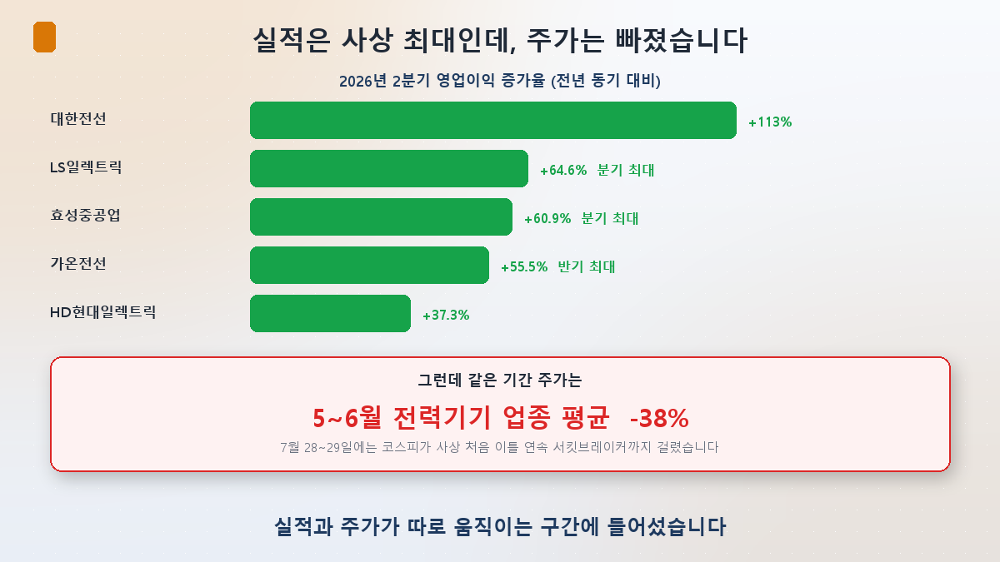
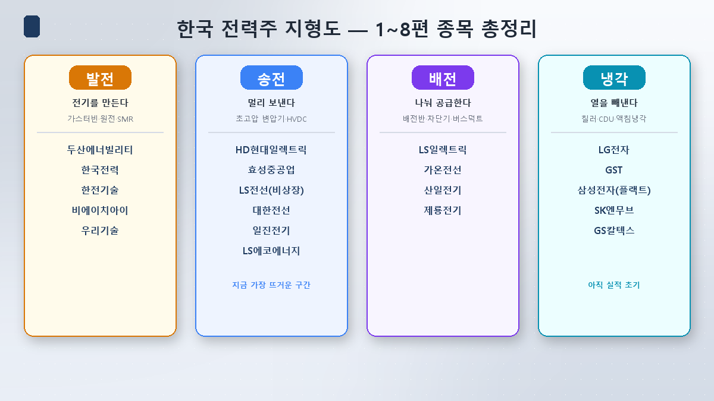
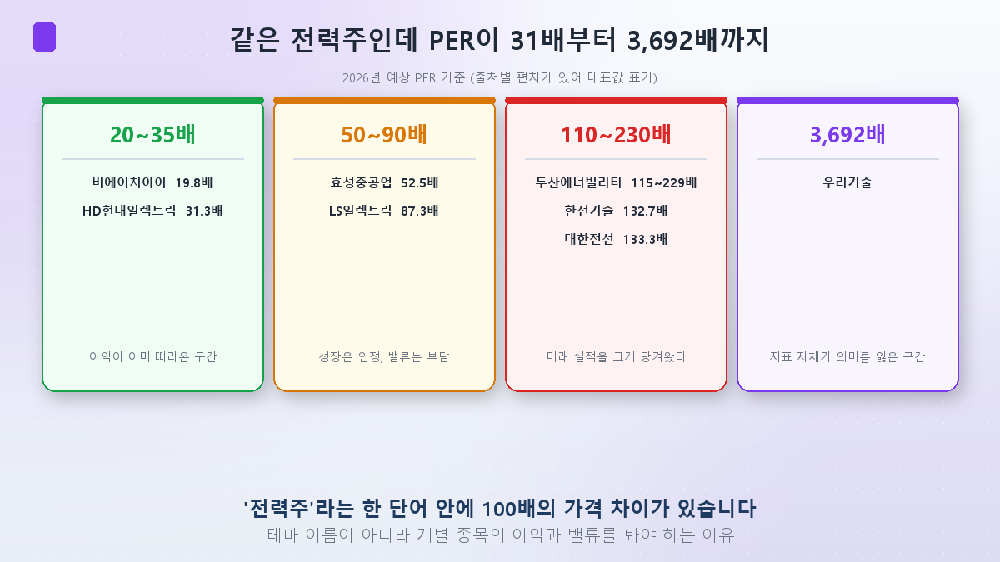
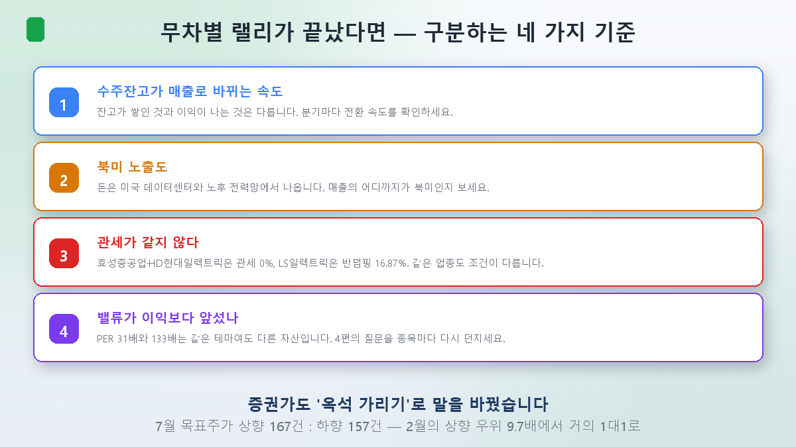

From [Episode 1](/en/p/ai-power-hunger/) through [Episode 8](/en/p/datacenter-cooling/), this series has produced a lot of company names. Today we put them all on one board.

And the market picked this moment to turn over. **On July 28 and 29, the KOSPI tripped circuit breakers on two consecutive days for the first time in its history** — down 8.04% at 10:13 a.m. on the 28th, down 8.17% at 12:33 p.m. on the 29th. It was also the first time both the KOSPI and KOSDAQ halted on back-to-back days. Some 865 trillion won of market value vanished in two sessions.

The cause wasn't power; it was semiconductors. China's CXMT listed successfully in Shanghai, sharpening the competitive threat, and SK Hynix missed consensus while offering neither a shareholder return policy nor clear guidance on its call. The structure I described in semiconductor [Episode 8](/en/p/kospi-semiconductor/) — half the KOSPI riding on two chip names — ran in reverse this time.

Power stocks got hit alongside. But that context is exactly when **a map becomes necessary.** When everything rises together you don't need one; after everything falls together, you have to sort what holds up from what doesn't.

## First, the earnings were record highs

A falling share price and a company failing to earn are different things. Q2 2026 results say the opposite.

- **Hyosung Heavy**: operating profit of 264.3 billion won (+60.9%) — **a record quarter.** Q2 new orders of 3.32 trillion won (+51%), first-half orders of 7.50 trillion won approaching all of last year. Backlog 17.5 trillion won (+63%).
- **LS Electric**: operating profit 178.5 billion won (+64.6%) — **a record quarter.** Backlog 7 trillion won.
- **HD Hyundai Electric**: operating profit 287 billion won (+37.3%); Q2 new orders $1.44 billion (+44.6%).
- **Taihan Cable**: operating profit 60.8 billion won (+113%). Note that a separate 173.3 billion won derivatives valuation loss hurt net income.
- **Gaon Cable**: operating profit 36.1 billion won (+55.5%) — a record half.

Yet over the same stretch the sector corrected roughly **−38%** across May and June. NH Investment & Securities analyst Lee Min-jae noted domestic power equipment stocks were "down an average of 38% versus a month ago," and Yuanta Securities analyst Son Hyun-jung framed it as **"not a cyclical peak-out, but profit-taking after a first-half surge combined with a rotation of flows within the AI theme."**

In [Episode 4](/en/p/power-supercycle-or-bubble/) I concluded that both the supercycle and the bubble were real, with valuation running ahead of earnings. This correction was that valuation being partly given back.

## The map — every name from Episodes 1–8

Now the map itself: the generation → transmission → distribution structure from [Episode 5](/en/p/power-value-chain-map/), plus cooling from [Episode 8](/en/p/datacenter-cooling/).

- **Generation (making it)**: Doosan Enerbility, KEPCO, KEPCO E&C, BHI, Woori Technology. Doosan posted Q2 operating profit of 314.3 billion won (+16%) with 7.1 trillion won of first-half new orders. The "announcements are SMR, earnings are gas turbines" pattern from [Episode 2](/en/p/smr-nuclear-ai/) still holds.
- **Transmission (sending it far)**: HD Hyundai Electric, Hyosung Heavy, LS Cable (unlisted), Taihan Cable, Iljin Electric, LS Eco Energy. The protagonists of [Episodes 3](/en/p/transformer-supercycle/) and [7](/en/p/copper-cable-ai/), and **where the most money is currently flowing.**
- **Distribution (splitting it up)**: LS Electric, Gaon Cable, Sanil Electric, Jeryong Electric. Daishin Securities analyst Heo Min-ho argues **"the distribution market is larger than transmission, so whether it expands is an important variable for future growth."**
- **Cooling (taking heat out)**: LG Electronics, GST, Samsung Electronics (FläktGroup), SK Enmove, GS Caltex. As Episode 8 showed, still an early-revenue zone.

## The core point — "power stocks" is not one thing

Laying valuations over the map produced the most striking finding of this episode.

Within the same "power stock" label, P/E ratios span **31x to 3,692x.**

- **HD Hyundai Electric at 31.3x** — earnings have caught up. The lowest multiple among the big three transmission names, and the usual basis for "undervalued relative to results" arguments.
- **Hyosung Heavy 52.5x / LS Electric 87.3x** — growth acknowledged, valuation a burden. Macquarie singled out LS Electric, calling the price excessive relative to fundamentals and cutting it from neutral to **sell.**
- **Doosan Enerbility, KEPCO E&C, Taihan Cable at 110–230x** — future earnings pulled far forward. Taihan's 133.3x forward P/E is explicitly called a burden by brokerages.
- **Woori Technology at 3,692x** — so little actual profit that the metric loses meaning. The company posted an operating loss in 2025, yet ran from about 3,800 won in January to the 20,000s by March.

Returns diverged too. As of late April, year-to-date: HD Hyundai Electric **+194.4%**, LS Electric **+108.1%**, Hyosung Heavy **+67.7%** — nearly a threefold spread inside the same "big three."

**There is a 100x price difference inside the single phrase "AI power stock."** That's why buying the theme means buying without knowing what you bought.

## So how do you sort them — four tests

Brokerages changed their frame in late May, from an indiscriminate rally to **"separating the wheat from the chaff."** In July, target-price revisions ran 167 upgrades to 157 downgrades — near parity. In February, upgrades had outnumbered downgrades 9.7 to 1.

**① How fast backlog converts to revenue.** A backlog piling up is not the same as profit arriving. As noted in [Episode 7](/en/p/copper-cable-ai/), LS Cable's Virginia plant targets 2028 and Taihan's second Dangjin plant 2027 — nearly a two-year gap between expectation and results. Check the conversion pace every quarter.

**② North American exposure.** The money comes from US data centers and an aging grid. LS Securities analyst Sung Jong-hwa framed it explicitly: **"the strength of each company's rebound will differ according to its earnings growth and its exposure to the North American market."**

**③ Tariffs are not equal.** This matters more than you'd expect. Hyosung Heavy and HD Hyundai Electric face **0%** (exempt), while LS Electric was assigned a **16.87% antidumping duty.** Large-transformer tariffs were also cut from 25% to 15% temporarily, with renewal an open question. Same industry, same theme, different terms.

**④ Has valuation run ahead of earnings?** The question from Episode 4, now asked stock by stock. A 31x and a 133x are different assets even under one theme.

## Both sides, side by side

**The bull case.** KB Securities analyst Jung Hye-jung raised LS Electric's target from 240,000 to 280,000 won, saying **"Big Tech orders are likely to become recurring contracts, further strengthening the mid- to long-term growth base."** Q2 new orders from North American Big Tech and data centers alone were about 800 billion won. US transformer lead times stretching from about a year to three or four is also cited as a structural advantage.

**The cautious case.** J.P. Morgan argued the industry cycle and the share price must be judged separately, and Macquarie, as noted, has LS Electric at sell. Cited risks include North American data center construction delays and Chinese vendors routing in through third countries. Cracks are already visible among smaller names: Jeryong Electric's Q1 2026 revenue fell 30.9% and operating profit 63.4%, hit by competition, tariffs and fixed costs from pre-emptive investment.

My own read: **the cycle has not broken.** Q2 proved that, and backlogs run four to five years. But **not every power stock shares that cycle equally.** The correction gave back valuation and flows, not fundamentals — and the four tests above are what determine who survives the giveback.

## Summary

- **Earnings and prices split apart.** Hyosung Heavy and LS Electric posted record quarterly profits, yet the sector fell about 38% in May–June and July closed with the first-ever back-to-back circuit breakers. The trigger was a semiconductor shock and profit-taking, not power fundamentals.
- **The map has four zones.** Generation (Doosan, KEPCO E&C) → transmission (HD Hyundai Electric, Hyosung, the cable trio) → distribution (LS Electric, Gaon Cable) → cooling (LG Electronics, GST). Transmission is hottest; cooling is earliest.
- **Don't buy it as one block.** Inside the same theme, P/Es run from 31x to 3,692x and year-to-date returns from +67% to +194%. Sort by **backlog conversion speed, North American exposure, tariff terms, and the distance between valuation and earnings.**

[Episode 10] closes the series. We'll dig into the word that kept appearing today — **order backlog** — and how to actually read a power company's earnings and orders. Just as semiconductor [Episode 10](/en/p/reading-earnings/) covered reading results, this will be the power-sector version.

> ⚠️ This post organizes what I've studied and is not a buy/sell recommendation for any security. Cited figures, price targets and expert views reflect a point in time and can change. Investment decisions and their consequences are your own.
