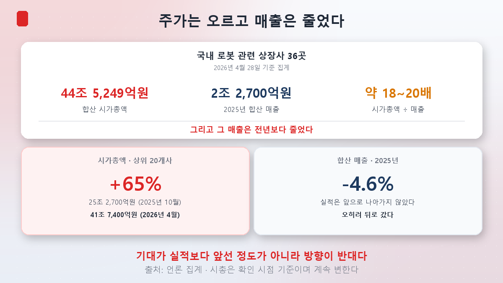
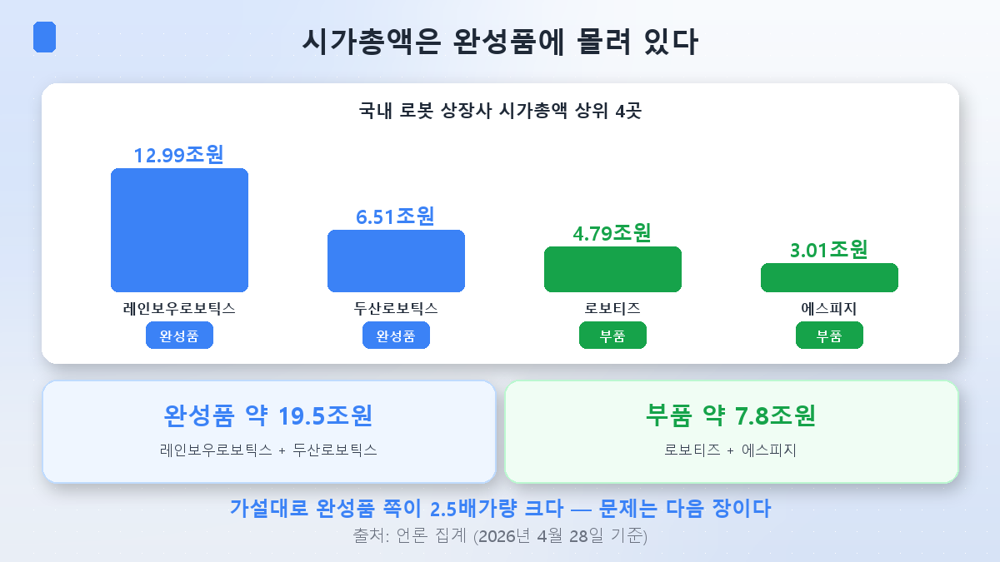
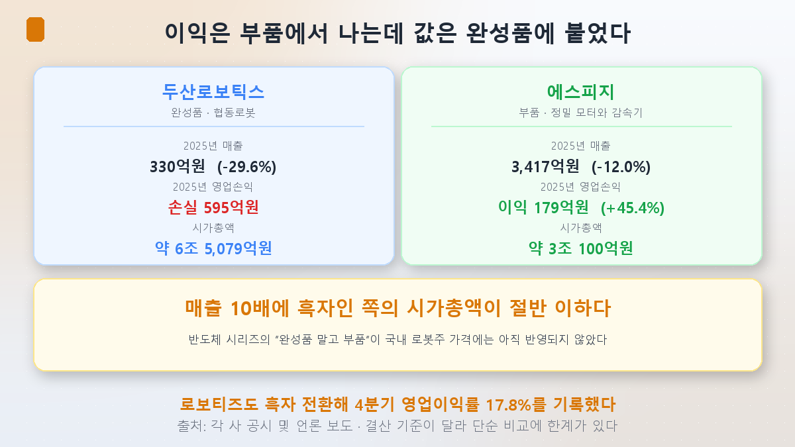
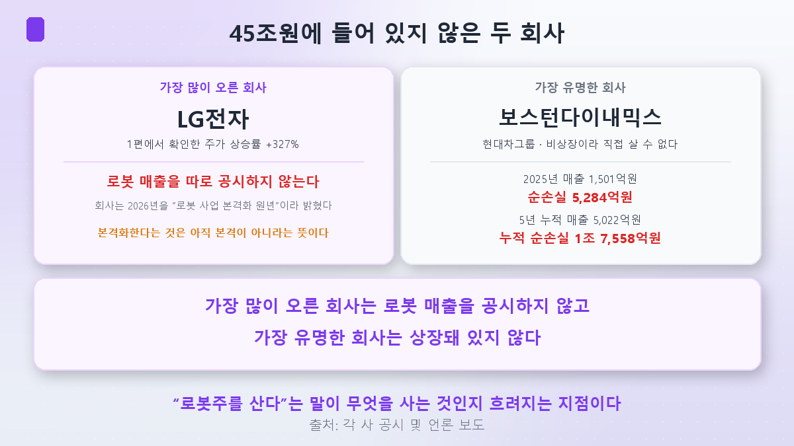
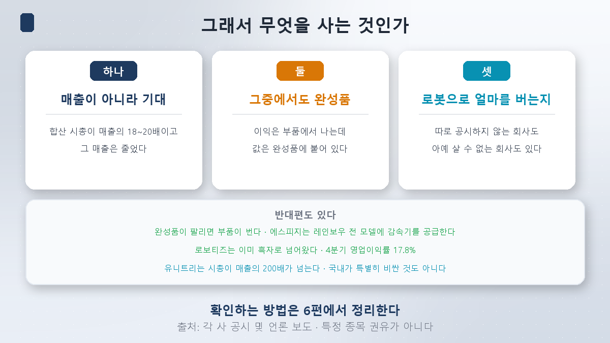

동네에 새 식당이 하나 열립니다. 참여하는 방법이 둘 있습니다.

**식당 지분을 사거나, 그 식당에 그릇을 납품하는 회사 지분을 사거나.** 손님이 늘면 둘 다 좋습니다. 그런데 식당은 망할 수 있고, 그릇 회사는 옆 식당에도 팝니다.

앞의 세 편에서 확인한 것을 겹쳐 놓으면 이렇습니다.

| 로봇의 구성 | 누가 쥐고 있나 |
|---|---|
| 두뇌 | 미국 — 엔비디아 ([3편](/p/nvidia-robot-brain/)) |
| 관절 | 일본 — 감속기 70%/60%, 한국 국산화율 35.8% ([2편](/p/robot-parts-cost/)) |
| 양산 | 중국 — 상반기 출하 97%, 부품 국산화율 90%+ ([4편](/p/china-humanoid-price/)) |

그렇다면 [1편](/p/what-is-physical-ai/)에서 본 **국내 로봇 상장사 시총 45조원은 무엇에 붙은 값**일까요. 이번 편은 그 질문 하나만 봅니다.

**결론부터 말씀드리면, 제 가설은 맞았습니다. 그런데 맞은 방식이 예상보다 훨씬 불편했습니다.**

## 45조원의 실체

2026년 4월 28일 기준 집계입니다.

| 항목 | 수치 |
|---|---|
| 국내 로봇 관련 상장사 | **36곳** |
| 합산 시가총액 | **약 44조 5,249억원** |
| 2025년 합산 매출 | **약 2조 2,700억원** |
| 시총 / 매출 | **약 18~20배** |

그리고 여기에 이번 편에서 가장 중요한 숫자가 붙습니다.

> **그 매출은 전년보다 4.6% 줄었습니다.**

같은 기간 시총은 어떻게 됐을까요. 상위 20개사 기준으로 **2025년 10월 25조 2,700억원 → 2026년 4월 41조 7,400억원, 6개월 만에 +65%**입니다.

**주가는 65% 올랐고, 매출은 4.6% 줄었습니다.** 방향이 반대입니다.

[1편](/p/what-is-physical-ai/)에서 정리한 순서를 다시 적어야겠습니다. **기대 → 주가 → 실적.** 실적이 뒤에 있는 정도가 아니라, 지금은 **반대편으로 가고 있습니다.**

## 시총은 어디에 붙어 있나

이제 가설을 검증하겠습니다. 계획서에 적어둔 가설은 **"시총이 완성품에 몰려 있을 것"**이었습니다.

| 순위 | 기업 | 구분 | 시가총액 |
|---|---|---|---|
| 1 | **레인보우로보틱스** | 완성품(휴머노이드·협동로봇) | **약 12조 9,979억원** |
| 2 | **두산로보틱스** | 완성품(협동로봇) | **약 6조 5,079억원** |
| 3 | 로보티즈 | **부품**(액추에이터) | 약 4조 7,900억원 |
| 4 | 에스피지 | **부품**(정밀 모터·감속기) | 약 3조 100억원 |

**완성품 두 곳이 약 19.5조원, 부품 두 곳이 약 7.8조원.** 가설대로 완성품 쪽이 2.5배가량 큽니다.

여기까지는 예상한 그림입니다. **문제는 실적을 옆에 놓았을 때입니다.**

## 실적을 옆에 놓으면 뒤집힙니다

2025년 결산 기준입니다.

| 기업 | 구분 | 2025년 매출 | 2025년 영업손익 | 시가총액 |
|---|---|---|---|---|
| **두산로보틱스** | 완성품 | **330억원** (전년비 **-29.6%**) | **영업손실 595억원** | 약 6조 5,079억원 |
| **에스피지** | 부품 | **3,417억원** (전년비 -12.0%) | **영업이익 179억원** (+45.4%) | 약 3조 100억원 |

한 줄로 정리하면 이렇습니다.

> **에스피지는 두산로보틱스보다 매출이 10배 많고 흑자인데, 시가총액은 절반 이하입니다.**

두산로보틱스는 **영업손실이 매출의 1.8배**입니다. 시총은 매출의 약 197배입니다.

레인보우로보틱스도 비슷합니다. 2025년 매출은 76.4% 늘었지만 **영업손실은 계속됐고**, 2026년 1분기에도 매출이 두 배 넘게 늘면서 **적자 폭이 오히려 커졌습니다.** 삼성전자향 매출이 104억원으로 전년의 7.2배가 됐다는 점은 분명한 진전이지만, 아직 이익으로는 넘어오지 않았습니다.

반대로 부품 쪽에서는 넘어온 사례가 나오고 있습니다. **로보티즈는 흑자 전환에 성공**했고, 2025년 4분기 매출 116억원에 **영업이익 21억원, 영업이익률 17.8%**를 기록했습니다.

### 그래서 반도체 문법이 여기서는 안 통합니다

[반도체 시리즈](/p/what-is-hbm/)에서 우리는 **"완성품 말고 부품을 보라"**는 문법을 얻었습니다. 스마트폰보다 HBM이 나은 투자였으니까요.

[2편](/p/robot-parts-cost/)에서 확인했듯 로봇에서도 **값은 부품에서 결정**됩니다. 관절이 부품 원가의 30~50%였습니다. [4편](/p/china-humanoid-price/)에서 본 유니트리가 흑자를 낸 비결도 **부품을 직접 만든 것**이었습니다.

**그런데 국내 로봇주의 가격표는 그 반대로 붙어 있습니다.** 이익을 내는 쪽은 부품이고, 값이 붙은 쪽은 완성품입니다.

이게 이번 편에서 가장 중요한 발견입니다.

## 게다가 두 회사는 이 45조원에 없습니다

여기서 한 번 더 뒤집힙니다.

**1편에서 주가가 가장 많이 오른 회사는 LG전자(+327%)였습니다.** 그런데 LG전자는 **로봇 매출을 따로 공시하지 않습니다.** 로봇은 회사가 내건 4대 미래 전략사업 중 하나이고, 2026년을 "로봇 사업 본격화 원년"이라고 밝혔습니다. **본격화한다는 것은 아직 본격이 아니라는 뜻입니다.**

**그리고 한국에서 가장 유명한 로봇 회사는 아예 상장돼 있지 않습니다.** 현대차그룹의 보스턴다이내믹스입니다.

| 보스턴다이내믹스 | 수치 |
|---|---|
| 2025년 매출 | **1,501억원** |
| 2025년 순손실 | **5,284억원** |
| 2021~2025년 누적 매출 | 5,022억원 |
| 2021~2025년 누적 순손실 | **1조 7,558억원** |

**5년간 매출의 3.5배를 손실로 냈습니다.** 그리고 비상장이라 개인이 직접 살 수 없습니다.

정리하면 이렇게 됩니다.

> **가장 많이 오른 회사는 로봇 매출을 공시하지 않고, 가장 유명한 회사는 상장돼 있지 않습니다.**

"로봇주를 산다"는 말이 실제로 무엇을 사는 것인지가 여기서 흐려집니다.

## 반대편도 정직하게

지금까지만 읽으면 "국내 로봇주는 거품"이라는 결론이 자연스럽습니다. **그 결론은 이 시리즈에서 계속 경계해 온 종류의 결론입니다.** 반대 근거를 네 가지 적겠습니다.

**첫째, 완성품의 적자가 곧 산업의 실패는 아닙니다.** 에스피지는 **레인보우로보틱스 전 모델에 감속기를 100% 공급**하는 것으로 알려져 있습니다. 완성품이 팔리면 부품이 법니다. 앞의 식당 비유 그대로입니다. 식당이 아직 적자여도 그릇은 팔립니다.

**둘째, 이미 실적으로 넘어온 사례가 있습니다.** 로보티즈의 영업이익률 17.8%는 기대가 아니라 찍힌 숫자입니다.

**셋째, 한국이 특별히 비싼 것도 아닙니다.** [4편](/p/china-humanoid-price/)에서 본 유니트리는 시총 약 71조원에 매출 약 3,300억원으로 **200배가 넘습니다.** 국내 로봇주의 18~20배는 그보다 훨씬 낮습니다.

**넷째, 다른 잣대를 대야 한다는 반론이 있습니다.** 유진투자증권 이승우 연구원은 지금 주가가 **"제조업 지표가 아니라 AI 인프라 확장을 반영"**하며, 시장이 실적보다 앞서 산업 구조 전환을 가격에 반영하고 있다고 봤습니다. KB증권 김동원 연구원은 **액추에이터·모터 등 부품이 가장 높은 부가가치를 가져갈 가능성**을 짚었습니다.

**두 번째 견해는 이번 편의 데이터와 방향이 같습니다.** 부품이 이익을 내고 있으니까요.

## 그래서 무엇을 사는 것인가

이번 편의 답을 정리하면 세 가지입니다.

**하나. 매출이 아니라 기대를 사는 것입니다.** 36곳 합산 시총은 매출의 18~20배이고, 그 매출은 줄었습니다. 이건 좋고 나쁨의 판단이 아니라 **지금 값이 무엇에 붙어 있는지에 대한 사실**입니다.

**둘. 그중에서도 완성품을 더 비싸게 사고 있습니다.** 이익은 부품에서 나오는데 값은 완성품에 붙어 있습니다. 반도체에서 쓰던 문법이 아직 가격에 반영되지 않았습니다.

**셋. 종목이 실제로 로봇으로 얼마를 버는지는 확인이 필요합니다.** LG전자처럼 로봇 매출을 따로 공시하지 않는 경우가 있고, 보스턴다이내믹스처럼 아예 살 수 없는 경우도 있습니다.

**확인하는 방법은 6편에서 정리하겠습니다.** 개인이 직접 열어볼 수 있는 자료로 이 세 가지를 어떻게 검증하는지, 다음 편이 그 이야기입니다.

## 가설 채점

> **국내 시총 45조원이 완성품에 몰려 있을 것이다.**

- **맞았습니다**: 시총 1·2위가 완성품(레인보우 약 13조, 두산로보틱스 약 6.5조 = 19.5조), 3·4위가 부품(로보티즈 약 4.8조, 에스피지 약 3조 = 7.8조)입니다.
- **예상하지 못한 것 ①(가장 중요)**: 실적이 **정확히 반대**였습니다. 에스피지는 두산로보틱스보다 **매출 10배에 흑자**인데 시총은 절반 이하입니다. 반도체 시리즈의 "부품을 보라"가 **국내 로봇주 가격에는 반영돼 있지 않습니다.**
- **예상하지 못한 것 ②**: 합산 매출이 **줄었습니다**(-4.6%). 같은 기간 상위 20개 시총은 **+65%**입니다. 기대가 실적보다 앞선 정도가 아니라 반대 방향입니다.
- **예상하지 못한 것 ③**: 가장 많이 오른 LG전자는 **로봇 매출을 따로 공시하지 않고**, 가장 유명한 보스턴다이내믹스는 **비상장**입니다. 5년 누적 순손실이 매출의 3.5배입니다.

앞선 네 편에서 두뇌·관절·양산을 각각 다른 나라가 쥐고 있다고 확인했습니다. 그리고 이번 편에서 **국내 값은 그 어느 것도 아닌 완성품에 붙어 있다**는 걸 봤습니다. 이 간격이 좁혀질지 벌어질지는 지금 단정할 수 없습니다. **다만 간격이 있다는 사실은 확인 가능한 숫자로 남아 있습니다.**

## 정리

- **국내 로봇 관련 상장사 36곳의 시총은 약 44조 5,249억원**(2026년 4월 28일 기준), 2025년 합산 매출은 **약 2조 2,700억원**으로 **시총이 매출의 18~20배**입니다.
- **그 매출은 전년보다 4.6% 줄었습니다.** 반면 상위 20개사 시총은 6개월 만에 25조 2,700억원 → 41조 7,400억원으로 **+65%**입니다. **주가와 매출이 반대로 움직였습니다.**
- **시총은 완성품에 몰려 있습니다.** 1위 레인보우로보틱스 약 13조원, 2위 두산로보틱스 약 6.5조원, 3위 로보티즈 약 4.8조원, 4위 에스피지 약 3조원입니다.
- **그런데 이익은 부품에서 납니다.** 두산로보틱스는 2025년 매출 **330억원(-29.6%)에 영업손실 595억원**, 에스피지는 매출 **3,417억원에 영업이익 179억원(+45.4%)**입니다. **매출 10배·흑자인 쪽의 시총이 절반 이하**입니다. 로보티즈도 흑자 전환해 4분기 영업이익률 17.8%를 기록했습니다.
- **1편에서 +327% 오른 LG전자는 로봇 매출을 따로 공시하지 않습니다.** 회사는 2026년을 "로봇 사업 본격화 원년"이라고 밝혔습니다.
- **보스턴다이내믹스는 비상장입니다.** 2025년 매출 1,501억원에 순손실 5,284억원, 5년 누적으로는 매출 5,022억원에 순손실 **1조 7,558억원**입니다.
- **반대편도 있습니다.** 에스피지는 레인보우로보틱스 전 모델에 감속기를 공급하는 것으로 알려져 완성품이 팔리면 부품이 법니다. 유니트리의 시총/매출은 200배가 넘어 국내가 특별히 비싼 것도 아닙니다. 지금 주가를 제조업 지표가 아닌 AI 인프라 확장으로 봐야 한다는 견해도 있습니다.

다음 편이 **완결편**입니다. **로봇을 읽는 법.** 이번 편에서 쓴 숫자들을 개인이 직접 어디서 확인하는지, 전망과 실적을 가르는 체크리스트가 실제로 어떻게 작동하는지 정리하겠습니다. 그리고 이 시리즈에서 세운 가설이 몇 개나 맞았는지 성적표도 공개하겠습니다. **4편에서 제 인용이 틀렸던 것까지 포함해서요.**

> ⚠️ 이 글은 개인 학습 정리이며 특정 종목이나 투자 방식에 대한 권유가 아닙니다. 언급한 모든 기업명은 산업 구조와 가격 형성 방식을 설명하기 위한 예시이며 **매수·매도 의견이 아닙니다.** 시가총액은 2026년 4월 28일 등 특정 시점 집계 기준이고 주가는 매일 변합니다. 실적은 각 사 공시 및 언론 보도 기준이며, 회사마다 결산 기준과 연결 범위가 달라 단순 비교에 한계가 있습니다. "로봇 관련 상장사 36곳"은 집계 기관의 분류 기준에 따른 것으로 기관마다 대상 종목이 다릅니다. 시총/매출 배수는 기업 가치 평가의 한 가지 참고 지표일 뿐이며 그 자체로 고평가·저평가를 결정하지 않습니다. 로봇 관련주는 변동성이 특히 크고 적자 기업이 다수 포함돼 있습니다. 투자 판단과 그 결과는 본인의 몫입니다.
