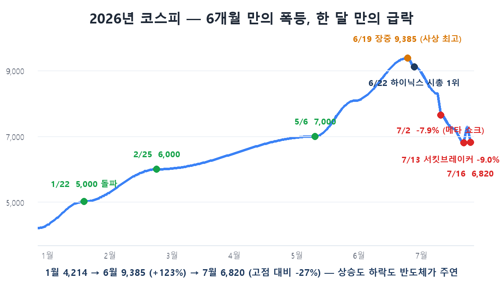
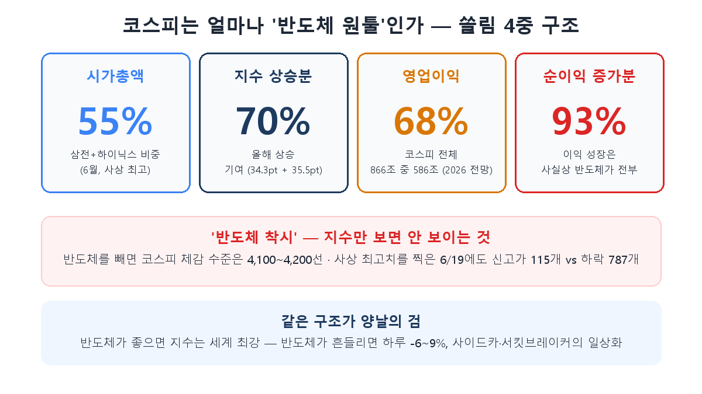

When I planned this series, part 8's working title was "The KOSPI 5,000 Era?" By the time I sat down to write it, that title had become an antique. KOSPI broke 5,000 on January 22, then hit an all-time intraday high of 9,385.59 on June 19 — up 123% from New Year. And today, as I write this (July 16), the index closed at 6,820.60 with a circuit breaker. That's -27% from the peak.

A six-month melt-up and a one-month plunge. The key to this rollercoaster is the subject of this whole series: **semiconductors**. This is not a piece that calls the index level — nobody can. Instead, let's dissect **why KOSPI is structurally built to move this way.**

## Anatomy of the rally — two stocks did almost all of it

About 70% of KOSPI's first-half gains came from just two stocks, Samsung Electronics and SK hynix (contributing 34.3pt and 35.5pt respectively). Their combined market-cap weight climbed from 34% in January to a record 54.76% in June; on June 19, those two names took 53.6% of the day's total KOSPI buying.

The concentration had a basis. The supercycle from part 4 was materializing in numbers: on street estimates for 2026, of KOSPI's total operating profit of ₩866T, Samsung (₩335T) and hynix (₩251T) account for ₩586T — **68%**. More dramatic still: 93% of KOSPI's net-profit *growth* is semiconductors. Put plainly, Korea's listed-company earnings growth this year was essentially all chips. That's the bull case's spine — the market-cap concentration mirrored a profit concentration, not a mania.

Add the Commercial Act reform and Value-up program lifting the Korea discount (KOSPI PBR from 0.9x to 2.6x), plus the political narrative of the "KOSPI 5,000" campaign pledge actually coming true. And one fascinating paradox: foreigners net-sold a record ₩150T in the first half — over 90% of it in those same two stocks — and the index still doubled. Domestic retail, institutions, and value-up re-rating flows absorbed it all. Bulls read that as depth of demand; skeptics read it as absorption reaching its limit.

## Anatomy of the fall — the top rang several bells

In hindsight, signals stacked up from late June. The interesting figure here is Lee Jae-man, head of global investment analysis at Hana Securities, whose May report proposed a model: "the moment SK hynix's market cap overtakes Samsung's is the top." On June 22, hynix actually claimed the No.1 spot for the first time in 25 years and 7 months — and the market rolled over almost exactly there. The report is now traded around like a pilgrimage site.

What followed was not one cause but a **chain**. July 2: Meta's cloud-entry announcement read as an "AI compute oversupply?" signal, -7.9% (the very news our [extra installment](/en/p/money-river-check/) covered). July 6: Morgan Stanley declared the "narrow semiconductor-led rally in its final phase" and recommended trimming Samsung, hynix, and Micron — earning the nickname "the chip grim reaper" — compounded by Hormuz geopolitics, -5.4%. July 13: circuit breaker, -9.0%. Today: -6.4% again. In July, there have been only three trading days without a sidecar or circuit breaker.

Structural amplifiers deepened the drops: margin loans at a record ₩38.5T, and single-stock leveraged ETFs on Samsung/hynix dumping rebalancing flows into the decline. The VKOSPI volatility index hit 97.99 in late June — the highest since records began in 2009, near 2008 crisis levels. Chips drove the rally, chips triggered the fall, and leverage made the fall bigger.

## The two faces of concentration — start by knowing the 'semiconductor illusion'

The most practical concept for individual investors here is the **'semiconductor illusion.'** Strip out chips, and analyses put KOSPI's effective level at just 4,100–4,200. Even on the record June 19, only 115 stocks hit new highs while 787 declined. That's why "the index is at 9,000 but my account is flat" was the season's most common complaint — it wasn't the market rising, it was two stocks.

The structure cuts both ways. In part 3 we called hynix "the cycle's amplifier"; now **KOSPI itself has become an amplifier of the semiconductor cycle.** When chips are strong, this index is the world's strongest; when chips wobble, -6~9% days become routine. The US frets about Magnificent-7 concentration — KOSPI's two-stock 55% is a far more extreme dosage.

## The experts are split precisely down the middle

I've rarely seen the street this cleanly divided.

**The bulls.** Nomura's Chang-won Chung, co-head of Asia research, points to a "triple supercycle" — HBM, commodity DRAM, and NAND turning up together — and calls for KOSPI 10,000–11,000. Korea Investment & Securities' Kim Dae-jun raised his ceiling to 11,000. JP Morgan called the correction a "buying opportunity," citing capacity constrained through 2028 — exactly part 4's logic. Even Lee Jae-man, who called the top, keeps his long-term 11,000 target and labels this an "excessive price correction."

**The cautious.** Morgan Stanley declared an earnings peak-out and recommended cutting chip exposure. Daishin Securities' Lee Kyoung-min called the crash itself "clear undershooting" while attributing it to doubts about the AI narrative plus valuation payback plus leverage liquidation — not broken fundamentals. And the fact that today's trigger was Warren Buffett's AI-bubble warning shows this is a global AI-investment debate, not a Korean one.

My synthesis: both camps agree that semiconductor profits *are* KOSPI now. What divides them is the bet on how long those profits last — which loops straight back to part 4 (where we are in the cycle) and the extra installment (whether the money river keeps flowing). The index outlook has become a dependent variable of the chip outlook.

## Recap

- KOSPI in 2026: 4,214 in January → 9,385 intraday in June (+123%) → 6,820 in July (-27%). **Two chip stocks drove 70% of the rise and pulled the trigger on the fall.**
- The concentration is four-layered — 55% of market cap, 70% of gains, 68% of operating profit, 93% of profit growth. It reflects real earnings, but it has made the index an amplifier of the chip cycle, with leverage (record margin debt, single-stock ETFs) widening the swings.
- **Remember the semiconductor illusion** — ex-chips, the effective index is ~4,100. "KOSPI is up" and "my stocks are up" are now different statements; conversely, an index crash doesn't mean the whole market collapsed.
- Experts are split between 10,000–11,000 (Nomura, KIS, Hana) and peak-out (Morgan Stanley) — what you must judge is not the index but **the cycle's position**. Part 4's checklist (DRAM contract-price momentum, inventory, capex, new fabs) is now the KOSPI checklist.

Part 9 covers this debate's toolkit: how securities firms actually compute those price targets — **dissecting the math behind "₩4-million hynix."**

> ⚠️ This post is a summary of my own learning, not a recommendation to buy or sell any security. Expert views quoted reflect opinions at the time and can change. Investment decisions and responsibility are your own.
