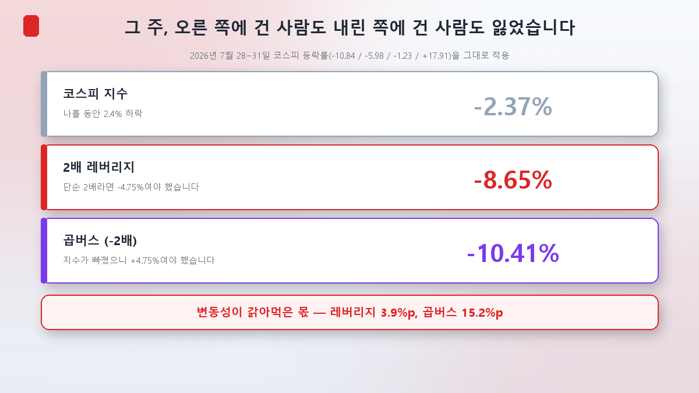
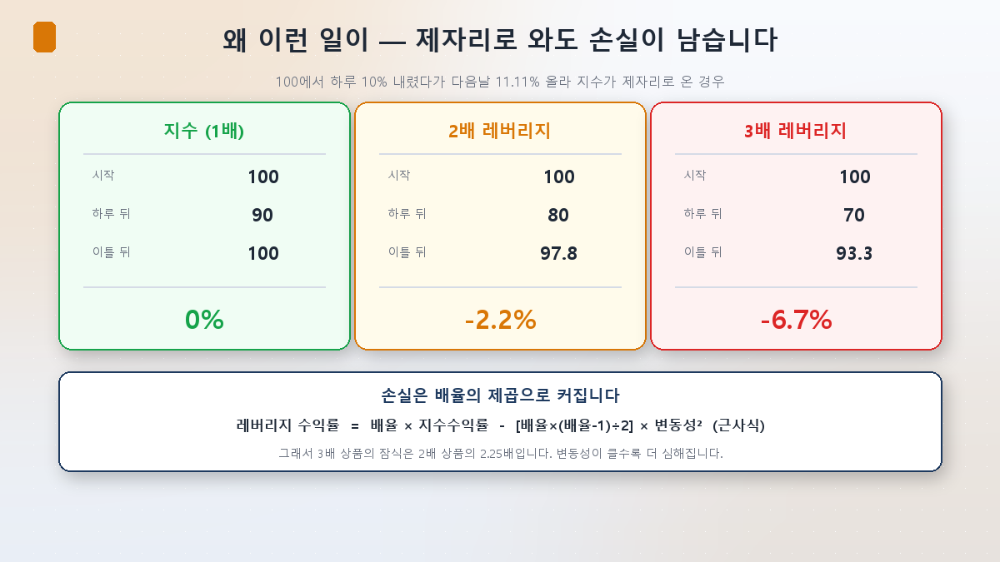
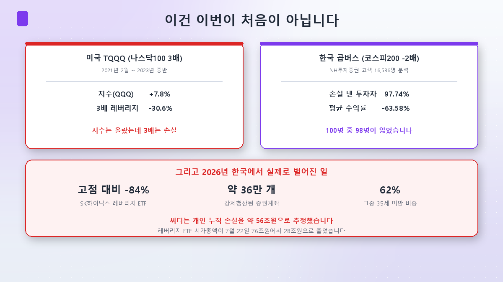
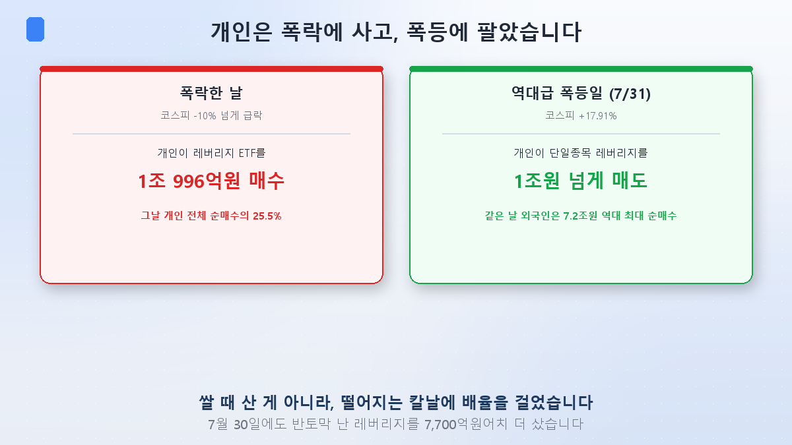

이 시리즈를 시작할 때부터 가장 하고 싶었던 이야기입니다.

[3편](/p/circuit-breaker-week/)에서 2026년 7월 마지막 주를 봤습니다. 코스피가 −10.84%, −5.98%, −1.23%, 그리고 +17.91%로 움직인 나흘이었죠. 그 주가 끝났을 때 **지수는 2.37% 빠져 있었습니다.** 큰 변화가 아닙니다.

그런데 그 주에 레버리지를 들고 있었다면 이야기가 완전히 다릅니다.

## 오른 쪽에 건 사람도, 내린 쪽에 건 사람도 잃었습니다

그 나흘의 일간 등락률을 레버리지 상품에 그대로 적용해 계산해봤습니다.

- **코스피 지수: −2.37%**
- **2배 레버리지: −8.65%** — 단순히 2배라면 −4.75%여야 했습니다
- **곱버스(−2배): −10.41%** — 지수가 빠졌으니 **+4.75%여야 했습니다**

읽고 다시 보셔도 됩니다. **지수가 하락했는데 인버스도 10% 넘게 잃었습니다.** 방향을 맞혔는데 잃은 겁니다.

레버리지는 3.9%p, 곱버스는 무려 15.2%p가 사라졌습니다. 여기에 실제 상품이라면 운용보수와 추적오차가 더 붙습니다.

## 왜 이런 일이 — 변동성 끌림

원인은 **"2배"가 무엇의 2배인지**에 있습니다. **하루 수익률의 2배**이지, 기간 전체 수익률의 2배가 아닙니다.

레버리지 ETF는 매일 종가에 배율을 맞추기 위해 익스포저를 다시 조정합니다(일간 리밸런싱). 오르면 더 사고, 내리면 팝니다. 이 "오르면 사고 내리면 파는" 동작이 매일 반복되면서 가치를 갉아먹습니다. 이걸 **변동성 끌림(volatility decay)** 이라고 부릅니다.

교과서적인 예를 보시죠. 100에서 하루 10% 내렸다가 다음 날 11.11% 올라 **지수가 정확히 제자리로 온 경우**입니다.

- **지수(1배)**: 100 → 90 → 100. **손실 없음**
- **2배**: 100 → 80 → 97.8. **−2.2%**
- **3배**: 100 → 70 → 93.3. **−6.7%**

지수는 본전인데 레버리지만 손실입니다. 그리고 **배율이 오를수록 손실은 제곱으로 커집니다.** 근사식으로 쓰면 이렇습니다.

> 레버리지 수익률 = 배율 × 지수수익률 − [배율×(배율−1)÷2] × 변동성²

3배 상품의 잠식이 2배 상품의 2.25배인 이유가 여기 있습니다. 그리고 **변동성이 클수록** 뒤쪽 항이 커집니다. 7월 마지막 주처럼 하루 10%씩 오르내리는 장이 레버리지에 최악인 이유입니다.

## 이건 이번이 처음이 아닙니다

한국만의 일도, 올해만의 일도 아닙니다.

**미국 TQQQ**(나스닥100 3배)는 2021년 2월부터 2023년 중반까지, **지수(QQQ)가 7.8% 오르는 동안 30.6% 잃었습니다.** 2022년 한 해에만 −79.08%였고 최대 낙폭은 −81.7%였습니다. 80%를 잃으면 본전이 되려면 400%가 올라야 합니다.

**한국 곱버스**는 더 참혹합니다. NH투자증권이 자사 고객 16,536명을 분석했더니 **97.74%가 손실**이었고 **평균 수익률이 −63.58%**였습니다. 100명 중 98명이 잃었습니다.

## 그리고 2026년, 한국에서 벌어진 일

2026년 5월 27일, 삼성전자·SK하이닉스를 기초자산으로 한 단일종목 레버리지·인버스 상품 **18종이 한꺼번에 상장**했습니다. 규모 4조 3,227억원으로 하루 상장 기준 국내 최대였습니다. "미국에서 되는 걸 왜 한국에서 못 하나"는 논리로 규제를 푼 결과였습니다.

두 달도 안 돼 시가총액은 4.4조원에서 **11.9조원**으로 불었습니다. 6월 19일까지 개인이 레버리지 ETF만 **8.2조원**을 순매수했습니다.

그리고 7월이 왔습니다.

**SK하이닉스 레버리지 ETF는 6월 고점 대비 최대 84% 빠졌습니다.** 약 **36만 개 증권계좌가 강제청산**됐고, 그중 **62%가 35세 미만**이었습니다. 씨티는 개인 누적 손실을 **약 56조원**으로 추정했습니다. 레버리지 ETF 시가총액이 7월 22일 76조원에서 28조원으로 줄었으니까요.

올해 하루 반대매매가 1,000억원을 넘긴 6차례 중 5차례가 5월 27일 상장 이후에 나왔습니다.

## 가장 아픈 대목 — 개인은 언제 사고 언제 팔았나

여기가 이 편의 핵심입니다.

**코스피가 10% 넘게 빠진 날, 개인은 레버리지 ETF를 1조 996억원어치 샀습니다.** 그날 유가증권시장 개인 순매수 전체의 **25.5%** 였습니다. 7월 30일에도 이미 반토막 난 레버리지를 7,700억원어치 더 담았습니다.

그리고 **7월 31일, 코스피가 17.91% 폭등한 날 개인은 단일종목 레버리지를 1조원 넘게 팔았습니다.** 같은 날 외국인은 7조 2,414억원을 역대 최대로 사들였고요.

떨어질 때 배율을 걸어 사들이고, 오른 날 던진 겁니다. 저는 이걸 "개인이 어리석다"는 이야기로 쓰고 싶지 않습니다. **떨어지는 자산을 사는 건 그 자체로 합리적인 전략일 수 있습니다.** 문제는 거기에 **2배를 걸었다**는 겁니다. 변동성 끌림은 물타기를 배신하고, 반대매매는 회복을 기다려주지 않습니다.

3편에서 봤듯 지수는 결국 하루 만에 낙폭의 86%를 되돌렸습니다. 하지만 그 전에 강제청산당한 36만 계좌에게 그 반등은 없었습니다.

## 그럼 레버리지가 폭락을 키웠나 — 여기는 갈립니다

한 가지 짚을 게 있습니다. "단일종목 레버리지 ETF가 이번 폭락의 원인"이라는 주장이 많이 나왔는데, 전문가들 의견은 갈립니다.

**증폭했다는 쪽**의 논리는 이렇습니다. 2배를 유지하려면 오르면 더 사고 내리면 더 팔아야 하는데, 이 리밸런싱이 종가 무렵에 몰립니다. 그래서 장 막판에 방향을 밀어붙이는 힘이 생긴다는 겁니다.

**과장이라는 쪽**도 만만치 않습니다. 한국투자증권 염동찬 연구원은 "단일종목 레버리지 ETF는 변동성의 원인이라기보다 **증폭 요인**"이라며, 근본 원인은 글로벌 반도체 기업의 변동성 확대라고 봤습니다. 리밸런싱은 장 후반에 몰리는데 실제 변동성은 오전에 더 컸다는 시간대 불일치도 근거로 들었습니다.

자본시장연구원은 절충적입니다. 리밸런싱이 변동성을 추가로 키울 수 있지만, **개인의 역추세 매매(급락 시 매수, 급등 시 매도)가 그 영향을 일부 상쇄**했다고 봅니다. 아이러니하게도 개인이 손실을 본 그 매매 패턴이 시장 변동성은 줄인 셈입니다.

## 규제는 어떻게 됐나

당국의 대응은 빨랐습니다.

| 날짜 | 조치 |
|---|---|
| 5월 27일 | 단일종목 레버리지·인버스 18종 상장 (예탁금 1,000만원) |
| 7월 16일 | 신규 상장 잠정 중단, 광고·마케팅 즉시 금지 |
| 7월 24일 | 기본예탁금 **3,000만원**(현금만) 상향 발표 |
| 7월 31일 | 규제 조기 시행 |

해외 상장 단일종목 레버리지(테슬라·엔비디아 기초 등)에도 같은 규제를 적용했습니다. 국내만 막으면 자금이 해외로 옮겨가는 풍선효과를 우려해서입니다.

효과는 즉각적이었습니다. 단일종목 레버리지·인버스 16종의 거래대금이 7월 30일 12조 4,485억원에서 **8월 5일 9,199억원**으로 줄었습니다. 코스피 전체 거래대금 대비 비중도 32.5%에서 3.7%로 내려왔습니다.

다만 **7월 31일 그날, 개인은 규제 대상이 아닌 지수형 인버스 ETF를 5,000억원 넘게 사들였습니다.** 막힌 쪽에서 안 막힌 쪽으로 옮겨간 겁니다.

## 투자자 관점 — 네 가지

**① "2배"는 하루의 2배입니다.** 한 달을 들고 있으면 한 달 수익률의 2배가 아닙니다. 이 문장 하나만 기억해도 절반은 피할 수 있습니다.

**② 횡보와 급등락이 레버리지의 적입니다.** 방향을 맞혀도 왕복이 반복되면 잃습니다. 지금처럼 하루 8~18%가 오가는 장은 레버리지에 최악의 환경입니다.

**③ 레버리지에 물타기를 하지 마세요.** 떨어질 때 더 사는 전략 자체는 성립할 수 있지만, 배율이 걸리면 성립하지 않습니다. 변동성 끌림이 평단가 계산을 배신하고, 반대매매가 회복까지 기다려주지 않습니다.

**④ 미국 규제당국의 문장이 가장 정확합니다.** SEC와 FINRA는 레버리지·인버스 ETF에 대해 **"매일 리셋되기 때문에 중장기 투자에는 대체로 부적절하다"** 고 명시합니다. 단기 트레이딩이나 헤지 도구이지, 보유하는 자산이 아닙니다.

## 정리

- **그 주에 양쪽 다 잃었습니다.** 코스피 −2.37%인데 2배 레버리지 −8.65%, 곱버스 −10.41%. 방향을 맞힌 쪽도 잃었습니다.
- **원인은 변동성 끌림입니다.** "2배"는 하루 수익률의 2배이고, 일간 리밸런싱이 왕복장에서 가치를 갉아먹습니다. 손실은 배율의 제곱으로 커집니다. TQQQ는 지수가 7.8% 오르는 동안 30.6% 잃었고, 한국 곱버스 투자자는 97.74%가 손실이었습니다.
- **2026년 한국의 대가는 컸습니다.** SK하이닉스 레버리지 ETF 고점 대비 −84%, **강제청산 계좌 약 36만 개, 그중 62%가 35세 미만.** 개인은 폭락일에 1조원어치 사고 역대급 폭등일에 1조원어치 팔았습니다.

다음 [5편]에서는 방향을 바꿉니다. 레버리지 말고, **AI에 투자하는 ETF를 제대로 고르는 법** — 반도체 ETF와 AI 전력 ETF, 국내와 미국 상품이 어떻게 다르고 무엇을 보고 골라야 하는지 정리하겠습니다.

> ⚠️ 이 글은 공부한 내용을 정리한 것으로, 특정 종목·상품의 매수·매도 추천이 아닙니다. 본문의 레버리지 수익률은 공개된 일간 등락률로 계산한 예시이며 실제 상품 수익률은 보수·추적오차로 달라집니다. 투자 판단과 책임은 본인에게 있습니다.
