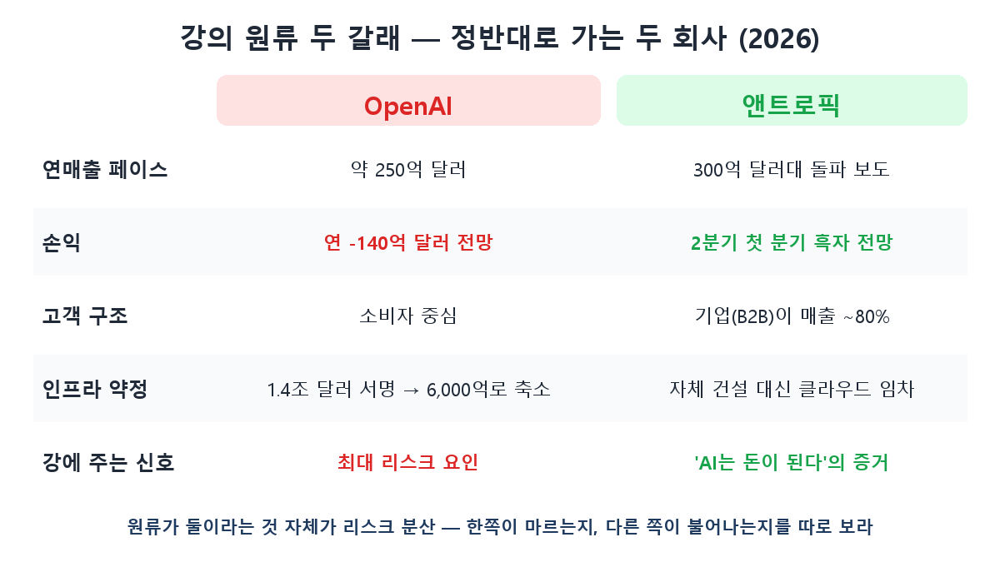
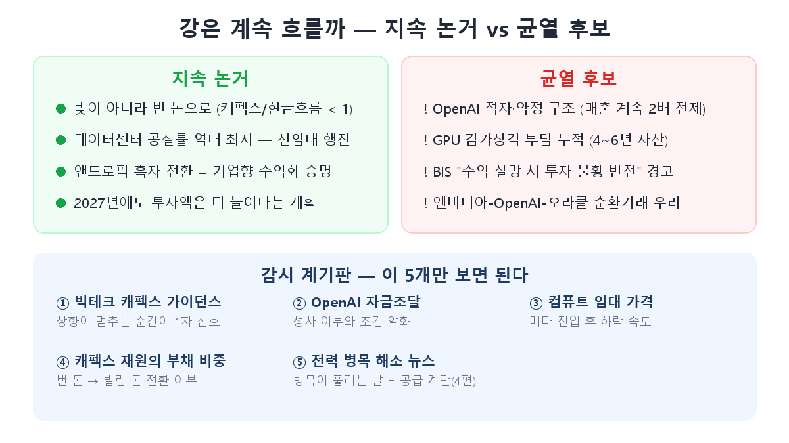

[第6篇](/zh/p/ai-money-flow/)我们画出了AI资金之河：我们 → 科技巨头 → 英伟达 → 韩国存储。但写完之后，最重要的问题反而悬在那里：**"这条河，真的会一直流下去吗？"**海力士和三星都在这条河的下游，上游一旦干涸，大家一起干涸。今天这篇番外，就来检视河的上游——源头（OpenAI与Anthropic）、水库（巨头资本开支），以及新变数（Meta进军云服务的传闻）。

## 上游水量 — 目前不减反增

2026年主要超大规模云厂商的AI基建投资达6000亿~7000亿美元级，2026~28年累计规划**约2.1万亿美元**。摩根大通反而上调了今年的资本开支增速预期（52%→63%），并认为2027年金额还会更大。

与互联网泡沫有一个决定性区别——**这些钱的来源目前依然健康**。巨头的资本开支/自由现金流比率仍低于1，即主要靠赚来的钱、而非借来的钱在建。2000年的光纤是用债务铺的，也随债务崩塌。

## 源头检视① — 背道而驰的OpenAI与Anthropic

在河的最上游，AI模型公司的财务呈现出耐人寻味的对照。

**OpenAI是这条河最大的风险因素。**年营收约250亿美元的节奏，对应2026年约140亿美元的净亏损预期，到2029年累计现金消耗或达千亿美元级。更沉重的是基建承诺：签下名义规模1.4万亿美元的算力合同后，近期据报已调整为到2030年约6000亿美元。这个结构**只有营收持续按计划翻倍才能成立**——有分析指出，营收哪怕偏差10%，叠加多年期合同，到2028~29年就会出现偿付能力疑问。OpenAI的承诺缩减·延期是否会经由甲骨文、星际之门传导到半导体订单，是河中游的核心监控点。

**相反，Anthropic正在成为"AI不赚钱"这一命题的反证。**其年化营收据报突破300亿美元级，且预计2026年第二季度实现**首个盈利季度**（营业利润约5.6亿美元）。秘诀在客户结构——约80%的营收来自企业（B2B），仅一款开发者编程工具就年化创收25亿美元。这不是补贴免费消费者的生意，而是企业当作业务成本来付费的生意。

给投资者的启示：**源头不止一个，正是这条河的安全阀。**要把"一边（OpenAI）是否在干涸"和"另一边（企业AI需求）是否在上涨"分开观察。

## 数据中心不是饱和了吗？

先说结论：**恰恰相反。**北美数据中心空置率处于历史最低，新建项目在竣工前几年就被预租一空。当下的瓶颈不是"建好了没人用"，而是**"缺电缺地建不出来"**。Meta把资本开支指引上调到1250亿~1450亿美元，理由正是"土地、电力、建筑人力的争夺战"；它在俄亥俄的1GW级数据中心自带燃气发电厂，就是因为等不起电网。

不过，虽非"饱和"，**"消化不良"的风险确实存在**：只能用4~6年的GPU资产以数百亿美元级堆积带来的折旧负担；国际清算银行（BIS）正式警告"若回报令人失望，资本开支热潮可能逆转为漫长的投资萧条"；以及英伟达→OpenAI→甲骨文的循环交易疑虑。

## 新变数 — Meta进军云服务的传闻

近期有个有意思的报道：**Meta正考虑将自家AI算力对外出租——"Meta Compute"。**Meta正在建设超大规模厂商中最激进的集群——1GW级"普罗米修斯"（2026年投运）、可扩至5GW的"许珀里翁"——构想是不再独用，而是像AWS一样租出去。

影响分几路看：

- **对河的持续性是利好**：过去Meta资本开支的变现渠道只有广告，做租赁生意后，资本开支本身就能产生营收，更有理由继续激进扩建。
- **对云三强是竞争利空**：供给者增加会压低算力租赁价格。对用AI的一方是好消息。
- **对半导体中性偏正面**：自用也好出租也罢，HBM和存储照买不误。AI股因这条新闻震荡，是因为有人解读为"多到能出租＝过剩的早期信号"，但从空置率和电力瓶颈看，目前证据仍偏向短缺一方。

## 监控仪表盘 — 盯住这5个就够了

① **巨头资本开支指引**——上调停止的那一刻是第一信号。② **OpenAI融资**——能否谈成、条件如何。③ **算力租赁价格**——Meta入场后的下跌速度。④ **资本开支资金中的债务比重**——从赚的钱转向借的钱了吗。⑤ **电力瓶颈缓解的新闻**——瓶颈解除之日，就是供应台阶落地之日（[第4篇](/zh/p/semiconductor-supercycle/)的逻辑原样适用）。

## 小结

- 这条河目前不减反增，瓶颈不是需求饱和而是**供给（电力、土地）**，资金来源也仍是现金流而非债务。
- 源头呈两极——**OpenAI（年亏140亿美元、承诺缩减）是最大风险，Anthropic（首季盈利、B2B占80%）是变现的证据**。请分开跟踪。
- Meta进军云服务为资本开支增加了变现渠道，对河的持续性是加分项，对芯片需求中性偏正面。
- 真正的考场在**2027年以后**——新厂与电力释放、供应台阶落地的时点，恰与OpenAI能否持续翻倍的考验重叠。

> ⚠️ 本文仅为个人学习整理，不构成任何证券的买卖建议。投资决策及责任由本人承担。
