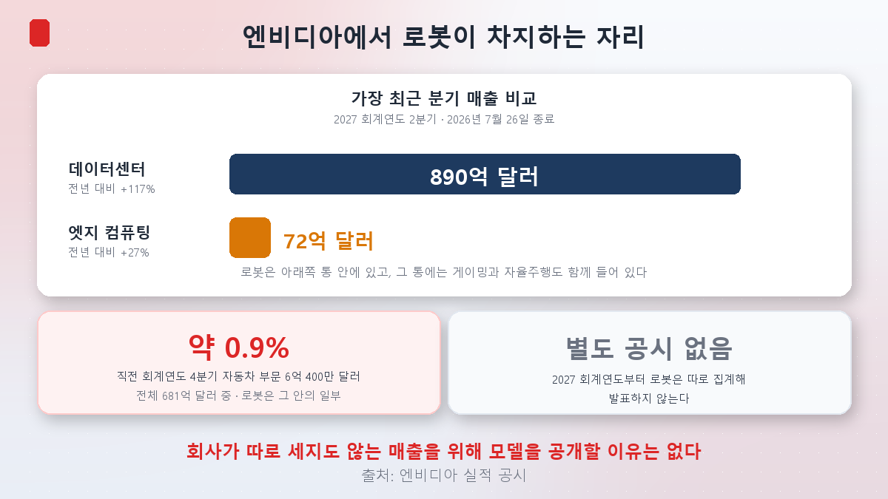
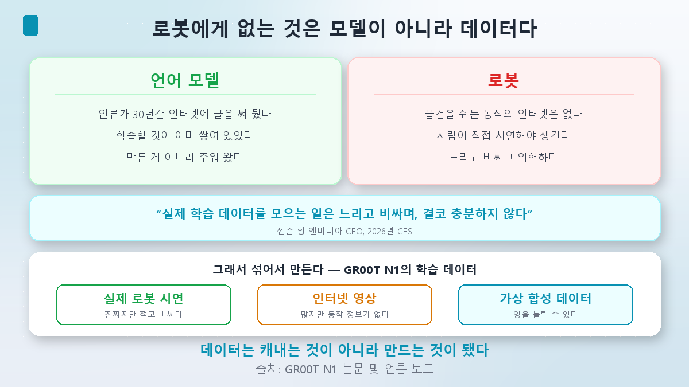
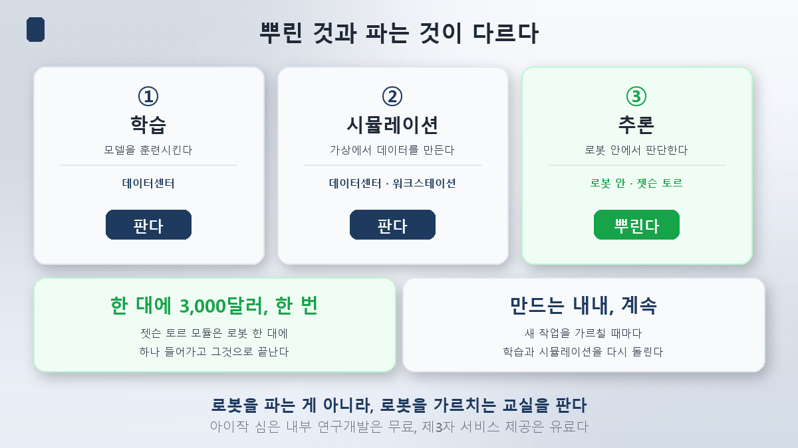
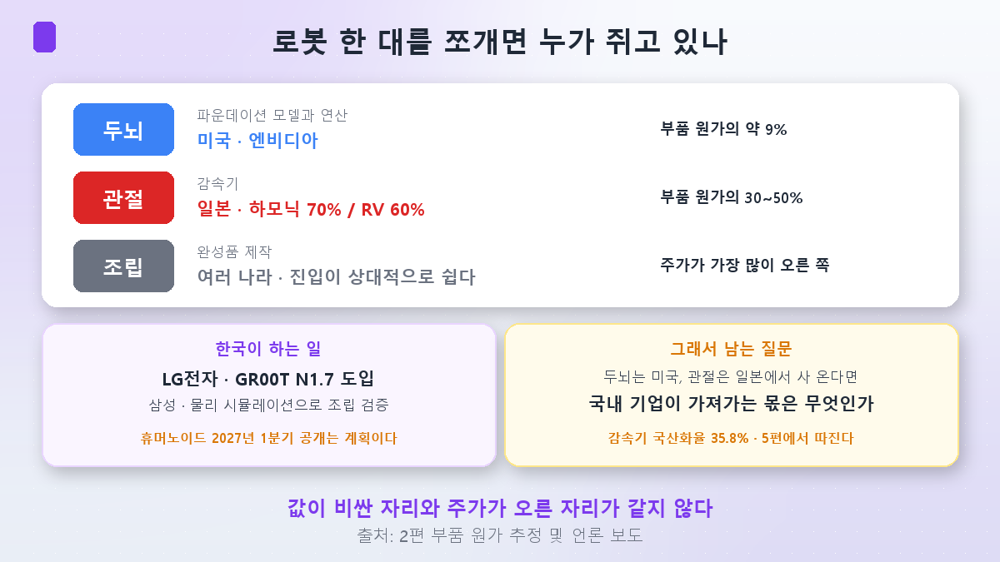

식당 주인이 자기 집 비법 레시피를 공짜로 뿌린다면 이상한 일입니다. 그런데 그 레시피에 들어가는 재료를 **그 집에서만 팔고 있다면** 이야기가 달라집니다.

[1편](/p/what-is-physical-ai/)에서 두 번째 숙제를 남겼습니다.

> **엔비디아가 로봇 두뇌를 공개하는 이유는 칩을 팔기 위해서일 것이다. 그런데 로봇은 아직 칩 수요가 작다.**

이번 편은 그 모순을 풀어보는 편입니다. **결론부터 말씀드리면 제 가설은 틀렸고, 진짜 답은 로봇 안에 없었습니다.**

## 먼저 숫자로 확인해 봅시다

"칩을 팔려고"가 답이려면, 최소한 로봇 칩이 팔리고 있어야 합니다. 확인해 보겠습니다.

엔비디아의 **2026 회계연도 4분기**(2026년 1월 25일 종료) 실적입니다.

| 항목 | 금액 |
|---|---|
| 전체 매출 | **681억 달러** |
| 그중 **자동차 부문** | **6억 400만 달러** |
| 비중 | **약 0.9%** |

여기서 두 가지를 짚어야 합니다.

**첫째, 저 6억 달러는 자동차 부문 전체입니다.** 자율주행 플랫폼이 주력이라고 회사가 밝히고 있고, 로봇은 그 안의 일부입니다. 즉 **로봇만 떼면 0.9%보다도 작습니다.**

**둘째, 그마저 이제는 볼 수 없습니다.** 엔비디아는 2027 회계연도 1분기부터 공시 체계를 바꿨습니다. 이제 **데이터센터**와 **엣지 컴퓨팅** 둘로만 나눕니다. 자동차와 로봇은 별도 항목이 아니라 엣지 컴퓨팅 안에 들어가는 사례로만 언급됩니다.

가장 최근 분기(2027 회계연도 2분기, 2026년 7월 26일 종료)는 이렇습니다.

| 부문 | 매출 | 전년 대비 |
|---|---|---|
| **데이터센터** | **890억 달러** | **+117%** |
| **엣지 컴퓨팅**(로봇이 들어 있는 쪽) | **72억 달러** | **+27%** |
| 전체 | 962억 달러 | +106% |

로봇이 들어 있는 통 전체가 데이터센터의 **12분의 1**이고, 성장률도 4분의 1 수준입니다. 그리고 그 72억 달러는 게이밍 그래픽카드와 자율주행까지 다 합친 숫자입니다.

> 참고로 [1편](/p/what-is-physical-ai/)에서 크기 감각용으로 인용한 엔비디아 분기 매출 **681억 달러**는 위 표의 2026 회계연도 4분기 값이었습니다. 그사이 두 분기가 지나 지금은 **962억 달러**입니다. 숫자를 갱신해 둡니다.

**가설은 여기서 기각됩니다.** 회사가 별도로 공시하지도 않는 규모의 매출을 위해, 수년간 개발한 모델을 공개하고 시뮬레이터를 열고 허깅페이스에까지 올릴 이유가 없습니다.

### 2편의 숫자와 붙여보면 더 분명합니다

[2편](/p/robot-parts-cost/)에서 휴머노이드 한 대의 부품 원가를 약 **3만 5,000달러**로 봤습니다. 그럼 두뇌는 얼마일까요.

엔비디아의 로봇용 컴퓨터 **젯슨 토르**는 개발자 키트가 **3,499달러**, 양산용 T5000 모듈은 1,000개 이상 주문 시 **2,999달러**부터입니다.

| 부위 | 부품 원가에서 차지하는 몫 |
|---|---|
| 관절 액추에이터 | **30~50%** |
| 두뇌(젯슨 토르 모듈 기준) | **약 9%** |

로봇 한 대가 팔릴 때 엔비디아가 가져가는 몫은, 일본 감속기 회사가 가져가는 몫보다 훨씬 작습니다. **로봇을 아무리 많이 팔아도 엔비디아에게 큰 사업이 되기 어렵습니다.**

그렇다면 질문을 바꿔야 합니다. **엔비디아는 로봇에서 무엇을 파는 걸까요.**

## 로봇에게는 인터넷이 없습니다

여기서부터가 이번 편의 핵심입니다.

챗GPT 같은 언어 모델이 빠르게 똑똑해질 수 있었던 이유가 하나 있습니다. **읽을 것이 이미 쌓여 있었습니다.** 인류가 30년간 인터넷에 글을 써 놨으니까요. 모델을 만든 회사가 그 데이터를 만든 게 아닙니다. 주워 온 겁니다.

**로봇에는 그게 없습니다.**

"컵을 3.2뉴턴의 힘으로 쥐고 15도 기울여 옮겼다" 같은 기록은 인터넷에 없습니다. 사람은 그런 걸 글로 남기지 않으니까요. 로봇에게 필요한 데이터는 **누군가 로봇을 직접 움직여서 만들어야만** 존재합니다.

젠슨 황 CEO가 2026년 CES에서 이렇게 말했습니다.

> **"실제 학습 데이터를 모으는 일은 느리고 비싸며, 결코 충분하지 않다."**

실제로 그렇습니다. 사람이 로봇 팔을 잡고 시연을 반복해야 하고, 장소마다 물건마다 다시 해야 하고, 잘못하면 물건이 깨지거나 사람이 다칩니다. [1편](/p/what-is-physical-ai/)에서 본 "되돌릴 수 없는 세계"의 대가입니다.

그래서 답이 이렇게 나왔습니다. **없으면 만든다.**

엔비디아의 GR00T N1 모델은 세 가지를 섞어 학습했다고 논문에 밝혀져 있습니다.

| 데이터 종류 | 성격 |
|---|---|
| 실제 로봇 시연 | 진짜지만 적고 비싸다 |
| 인터넷 영상 | 많지만 로봇 동작 정보가 없다 |
| **가상에서 만든 합성 데이터** | **양을 늘릴 수 있다** |

세 번째가 열쇠입니다. 가상 공간에서 로봇을 수천 번 수만 번 움직여 보고, 그 기록을 데이터로 씁니다. 가상이니까 물건이 깨져도 되고, 밤새 돌려도 됩니다.

**로봇 산업의 진짜 병목은 모델이 아니라 데이터였고, 그 데이터는 채굴하는 게 아니라 제조하는 것이었습니다.**

## 그 데이터 공장은 로봇 안에 없습니다

여기서 돈의 흐름이 보입니다.

엔비디아는 로봇을 세 대의 컴퓨터로 나눠 설명합니다.

| 단계 | 하는 일 | 어디서 도나 |
|---|---|---|
| ① 학습 | 모델을 훈련시킨다 | **데이터센터** (DGX 등) |
| ② 시뮬레이션 | 가상에서 데이터를 만들고 검증한다 | **데이터센터·워크스테이션** (옴니버스·아이작) |
| ③ 추론 | 실제 로봇 안에서 판단한다 | 로봇 안 (젯슨 토르) |

**뿌린 건 ③에 들어가는 모델이고, 파는 건 ①과 ②를 돌리는 컴퓨터입니다.**

젯슨은 로봇 한 대에 하나 들어가고 3,000달러 언저리에서 끝납니다. 그런데 ①과 ②는 **로봇을 만드는 내내, 그리고 만든 뒤에도 계속** 돌아갑니다. 새 작업을 가르칠 때마다, 새 공장에 넣을 때마다 다시 돌려야 하니까요.

라이선스 구조도 같은 방향입니다. 시뮬레이터 아이작 심은 **내부 연구개발 용도로는 무료**입니다. 다만 이걸 제3자에게 서비스로 제공하려면 엔비디아 AI 엔터프라이즈 라이선스가 필요하다고 공식 문서에 적혀 있습니다. **쓰는 건 열어두고, 사업화하는 지점에서 과금합니다.**

정리하면 이렇습니다.

> **엔비디아는 로봇을 파는 게 아니라, 로봇을 가르치는 교실을 팝니다.**

그리고 그 교실은 방금 본 표의 **890억 달러짜리 데이터센터** 쪽에 있습니다. 로봇 이야기를 끝까지 따라가면 결국 데이터센터로 돌아옵니다. [금리 시리즈](/p/why-bigtech-borrows/)에서 본 그 캐펙스, [반도체 시리즈](/p/what-is-hbm/)에서 본 그 부품과 같은 곳입니다.

## 그런데 이 전략에는 구멍이 있습니다

한쪽으로만 쓰면 안 되니 반대편도 보겠습니다. **가장 큰 휴머노이드 업체들은 엔비디아의 두뇌를 쓰지 않습니다.**

| 회사 | 쓰는 두뇌 |
|---|---|
| **테슬라** | 옵티머스는 자율주행(FSD)에서 파생된 **자체 모델** |
| **피규어 AI** | 2025년 오픈AI 협력 종료 후 **자체 모델 헬릭스(Helix)** |

로봇을 직접 만드는 회사일수록 두뇌를 자기 하드웨어에 맞춰 직접 튜닝하려 합니다. 즉 **"모두가 우리 두뇌를 쓸 것"이라는 그림은 맨 위에서 이미 깨져 있습니다.**

다만 여기서 한 단계 더 봐야 합니다. **자체 모델을 만들어도 학습과 시뮬레이션은 어딘가의 GPU에서 해야 합니다.** 실제로 테슬라는 2025년 8월 자체 학습용 슈퍼컴퓨터 도조 개발을 중단하며 엔비디아·AMD 등 외부 의존을 늘리겠다고 했습니다(이후 도조3를 재개했다는 보도도 나와 상황이 유동적입니다).

**두뇌 채택은 놓쳐도 교실 임대료는 받는 구조.** 이게 이 전략이 구멍을 안고도 굴러가는 이유입니다. 물론 이건 지금까지의 구조 설명이지 미래 보장이 아닙니다. 학습용 반도체 경쟁이 어떻게 흘러갈지는 다른 문제입니다.

## 한국은 이 그림의 어디에 있나

국내 투자자에게 의미 있는 대목이 여기입니다.

**LG전자**는 엔비디아의 **아이작 GR00T N1.7**을 도입해 로봇 제어에 쓰고 있고, 이 모델을 기반으로 한 **이족보행 휴머노이드를 2027년 1분기 공개하는 것을 목표**로 하고 있습니다.

**삼성** 쪽은 물리 시뮬레이션 엔진(뉴턴) 협업이 거론됩니다. 조립 로봇의 케이블 작업을 실제 라인에 넣기 전에 가상에서 검증하는 용도입니다.

여기서 **1편의 원칙**을 다시 걸어야 합니다.

> LG전자의 "2027년 1분기 공개"는 **계획**입니다. 실적 칸이 아니라 계획 칸에 적을 숫자입니다.

그리고 [1편](/p/what-is-physical-ai/)에서 주가가 **+327%** 올랐던 그 회사가 바로 LG전자입니다. 오른 것은 사실이고, 공개는 아직 목표입니다. 둘을 섞지 않아야 합니다.

### 2편과 3편을 겹쳐 놓으면

두 편의 결론을 나란히 놓으면 불편한 그림이 하나 나옵니다.

| 로봇의 구성 | 누가 쥐고 있나 |
|---|---|
| 두뇌(파운데이션 모델·연산) | **미국 — 엔비디아** |
| 관절(감속기) | **일본 — 하모닉드라이브 70%, 나브테스코 60%** |
| 조립·완성품 | 여러 나라, 진입 상대적으로 쉬움 |

[2편](/p/robot-parts-cost/)에서 한국의 감속기 국산화율이 **35.8%**라고 확인했습니다. 두뇌는 엔비디아에서, 관절은 일본에서 가져온다면 **국내 기업이 가져가는 몫은 정확히 무엇인가.** 시총 45조원이 그 몫에 대한 값인가.

이 질문은 **5편**에서 정면으로 다루겠습니다. 지금 단정하기에는 확인할 게 남아 있습니다.

## 가설 채점

1편에서 적어둔 이번 편의 가설입니다.

> 엔비디아가 로봇 모델을 개방하는 이유는 **칩을 팔기 위해서**일 것이다.

**틀렸습니다.** 정확히는 **"어떤 칩"인지를 제가 잘못 짚었습니다.**

- **틀린 것**: 로봇에 들어가는 칩을 팔려는 게 아닙니다. 자동차 부문 전체가 분기 6억 400만 달러(**약 0.9%**)였고, 이제는 별도 공시조차 하지 않습니다.
- **맞는 답**: **데이터센터를 팔기 위해서**입니다. 로봇을 똑똑하게 만드는 일은 로봇 안이 아니라 데이터센터에서 일어납니다. 로봇에 없는 건 모델이 아니라 데이터이고, 그 데이터는 GPU로 만들어야 합니다.
- **예상하지 못한 것**: 두뇌가 **부품 원가의 약 9%**로, 2편에서 본 관절(30~50%)보다 훨씬 싸다는 점. 로봇이 아무리 팔려도 엔비디아 매출에는 큰 영향이 없습니다. **그래서 오히려 공짜로 뿌릴 수 있습니다.**

시리즈 관점에서 보면 이번 편이 앞 시리즈들과 다시 이어집니다. 로봇 이야기인 줄 알았는데 **끝이 데이터센터**였습니다.

## 정리

- **"칩을 팔려고 뿌린다"는 설명은 숫자와 맞지 않습니다.** 엔비디아 자동차 부문은 2026 회계연도 4분기 **6억 400만 달러**로 전체 681억 달러의 **약 0.9%**였고, 로봇은 그 안의 일부입니다. 2027 회계연도부터는 아예 별도로 공시하지 않고 **엣지 컴퓨팅**에 묶여 있습니다.
- **가장 최근 분기 기준 데이터센터 890억 달러(+117%) vs 엣지 컴퓨팅 72억 달러(+27%)**입니다. 로봇이 들어 있는 통 전체가 데이터센터의 12분의 1입니다.
- **로봇의 진짜 병목은 모델이 아니라 데이터입니다.** 언어 모델에는 인터넷이 있었지만 로봇 동작에는 그런 저장고가 없습니다. 젠슨 황 CEO도 "실제 학습 데이터 수집은 느리고 비싸며 결코 충분하지 않다"고 했습니다. 그래서 **가상에서 만들어 씁니다.**
- **엔비디아가 파는 것은 ③번 컴퓨터(로봇 안)가 아니라 ①학습과 ②시뮬레이션입니다.** 젯슨 토르는 로봇 한 대당 3,000달러 언저리로 끝나지만, 학습과 시뮬레이션은 계속 돌아갑니다. 아이작 심도 내부 R&D는 무료, 제3자 서비스 제공 시 유료입니다.
- **두뇌는 부품 원가의 약 9%입니다.** 2편에서 본 관절 30~50%와 비교하면 훨씬 작습니다. 싸기 때문에 뿌릴 수 있습니다.
- **구멍도 있습니다.** 테슬라 옵티머스는 FSD 기반 자체 모델, 피규어 AI는 자체 모델 헬릭스를 씁니다. 큰 업체일수록 두뇌를 직접 만듭니다. 다만 학습·시뮬레이션 인프라는 여전히 외부 GPU에 기대는 경우가 많습니다.
- **한국은 LG전자가 GR00T N1.7을 도입**했고 이를 기반으로 한 이족보행 휴머노이드를 **2027년 1분기 공개 목표**로 두고 있습니다. **이건 계획입니다.** 2편의 감속기 국산화율 35.8%와 겹쳐 보면, 국내 기업이 가져가는 몫이 무엇인지가 **5편**의 질문이 됩니다.

다음 편은 이 시리즈에서 가장 중요한 편입니다. **중국이 30%다 — 유니트리와 가격.** 1편에서 본 점유율 전망의 중국 30%가 정말 가격 때문인지, 유니트리의 실제 판매가와 성능으로 확인해 보겠습니다. 앞선 시리즈에서 "중국은 싸구려"라는 손쉬운 결론은 대부분 틀렸습니다. 이번에도 그런지 보겠습니다.

> ⚠️ 이 글은 개인 학습 정리이며 특정 종목이나 투자 방식에 대한 권유가 아닙니다. 엔비디아 실적은 회사 공시 기준이며 회계연도가 일반 달력연도와 달라 해석에 주의가 필요합니다(2026 회계연도 4분기는 2026년 1월 25일, 2027 회계연도 2분기는 2026년 7월 26일 종료). 자동차 부문 매출에는 로봇 외 자율주행 등이 포함되어 로봇만의 규모는 공시되지 않습니다. 부품 원가 비중은 2편의 추정치를 기준으로 한 계산이며 구성에 따라 크게 달라집니다. 젯슨 토르 가격은 공개된 정가 기준이고 실제 공급가는 다를 수 있습니다. LG전자의 휴머노이드 공개 시점은 **계획**이며 실현을 보장하지 않습니다. 언급한 기업명은 산업 구조를 설명하기 위한 예시이고 매수·매도 의견이 아닙니다. 로봇 관련주는 변동성이 특히 큽니다. 달러 금액은 환율 변동을 고려해 원화 환산을 생략했습니다. 투자 판단과 그 결과는 본인의 몫입니다.
