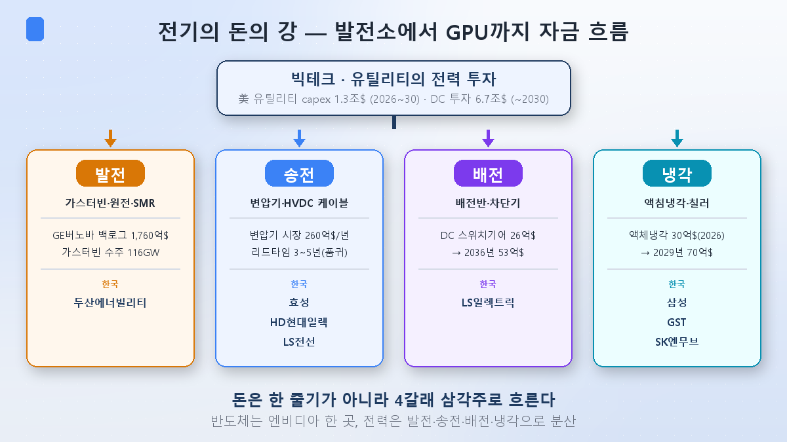
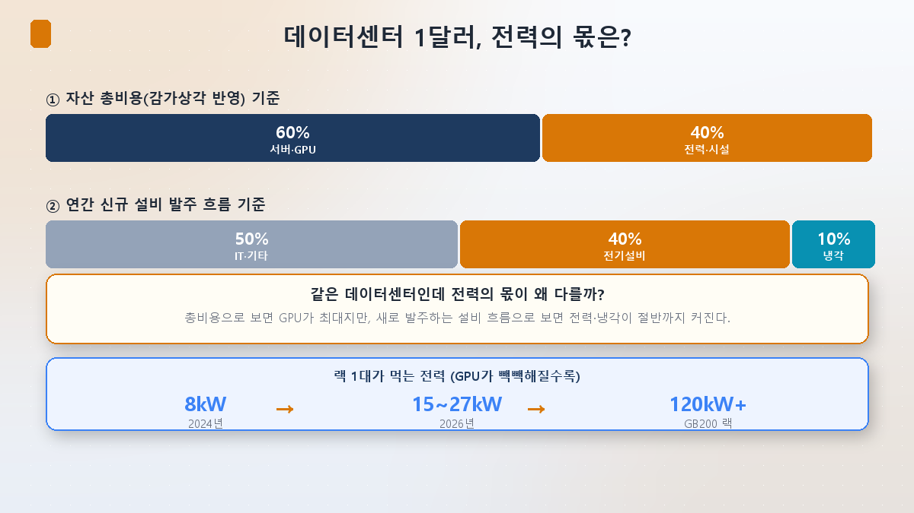
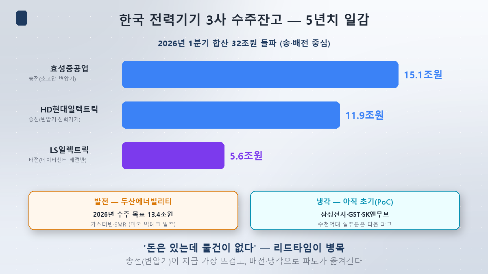

在芯片系列[第6篇](/zh/p/ai-money-flow/)里，我追踪了"我的ChatGPT订阅费如何变成海力士的业绩"——一条从科技巨头capex流经英伟达、台积电、海力士的**钱之河**。今天，我在电力这边做同样的事：跟着科技巨头和电力公司砸下的投资金，看它最终变成哪家公司的业绩。

可一旦画出来就发现，电力的钱之河和芯片**形状完全不同。**

## 芯片是一条河，电力是三角洲

芯片的钱本质上是**一条大河**：科技巨头capex → 英伟达（GPU设计）→ 台积电（代工）→ 海力士、ASML。窄而深，每道关口都由近乎垄断者把守。所以英伟达一只股票就吸走了大半河水。

电力的钱像**三角洲**一样分叉。离开发电厂的资金散成发电 → 输电 → 配电 → 冷却四条支流，变成众多公司的业绩。没有一个像英伟达那样的单一垄断者。这是电力投资最大的特征，也是个股让人犯晕的原因。

## 1. 钱从哪里来 — 河的源头

河有两个源头。

**① 科技巨头的数据中心capex。**麦肯锡估算到2030年将有**6.7万亿美元**涌入数据中心（其中扣除IT设备的基础设施就超1.7万亿美元）。这是[第1篇](/zh/p/ai-power-hunger/)"AI靠吃电成长"翻译成金钱语言后的数字。

**② 电力公司（公用事业）的设备投资。**这是本篇的核心。标普全球预测美国46家电力公司2026~2030年合计capex约**1.3万亿美元**——史上最高，比2025年（约2,000亿美元）一年内**猛增29%**。为了应对数据中心制造的电力需求，它们把电网本身整个扩容。

这两股水流汇合后，分成发电、输电、配电、冷却。看图里的全球代表选手——发电是GE维诺瓦（在手1,760亿美元，燃气轮机在手订单116GW），输电是变压器市场（年260亿美元，交期3~5年），冷却是刚起步的液冷市场（2026年30亿→2029年70亿美元）。

## 2. 数据中心1美元，电力占几分？

那么进入数据中心的每1美元里，电力占几分？有意思的是，**答案取决于你的视角。**

按**资产总成本（含折旧）**看，服务器和GPU仍以60%居首，电力和设施占40%。这就是芯片第6篇"GPU喝光整条河"的那幅图。

可若看**新发订设备的流向**，故事就变了。电气设备约40%、冷却约10%，电力和冷却基础设施升到近一半。因为GPU英伟达已经造好卖出，而驱动它的电力基础设施现在才在手忙脚乱地建。也就是说，**越往下游走（变压器、配电盘、冷却）钱的比重越快变大**，这正是电力之河与芯片不同的决定性一点。

一个数字浓缩了这一切：单机架吃的电从2024年8kW → 2026年15~27kW → 英伟达GB200机架跳到**120kW以上**。GPU越密集，为它散热供电的设备就要成倍增加。

## 3. 那么到韩国个股的钱有多少

河水实际流进韩国公司账户多少，看**在手订单**便知（怎么读在手订单，第10篇另讲）。电力设备三巨头2026年一季度合计在手订单**突破32万亿韩元**，至少是4~5年的活。

- **输电最热。**晓星重工业15.1万亿韩元、HD现代电气11.9万亿韩元——超高压变压器在美国排出3~5年长队的结果（[第3篇](/zh/p/transformer-supercycle/)讲过"HD现代电气为何涨得跟芯片股一样"）。
- **配电是第二波。**LS产电5.6万亿韩元。来自北美科技巨头数据中心的配电盘累计订单已过1万亿韩元，进入2026年后提速。
- **发电**是斗山重工业，2026年订单目标13.4万亿韩元（燃气轮机、SMR），不愧是[第2篇](/zh/p/smr-nuclear-ai/)的主角，正接下美国科技巨头的订单。
- **冷却**仍处早期。三星电子（FläktGroup）、GST、SK Enmove都在动，但多数还在PoC和技术验证阶段，数千亿韩元级的实单还留作下一波。

## 投资者视角 — 读懂三角洲的三只眼

**① 受益是分散的。**芯片看英伟达一只就看到河的八成；电力则要把发电、输电、配电、冷却四条支流都看全，图才完整。没有一只股票能垄断，反过来说也意味着**多家公司同时享受繁荣。**

**② 瓶颈是"交期"而非"技术"。**芯片的瓶颈是尖端制程能力（技术难度）。电力的瓶颈是物理产能——变压器交期3~5年，开关设备到2028年基本售罄。这是**"有钱却没货"**的结构，早已囤下在手订单的公司占优。

**③ 瓶颈会移动。**眼下输电（变压器）最热，一旦缓解，关注就转向下一道关口——配电，然后冷却。有[第5篇](/zh/p/power-value-chain-map/)画的价值链地图，才能追着钱往下一处流。

## 小结

- 电力的钱不像芯片是一条河，而是**发电、输电、配电、冷却四支的三角洲**。所以受益个股多得多、也分散得多。
- 源头是科技巨头数据中心capex（到2030年6.7万亿美元）和公用事业设备投资（美国1.3万亿美元）。与芯片不同之处在于，**越往下游电力占比越大。**
- 钱已经到了韩国：三巨头在手订单32万亿韩元（晓星、HD现代电气、LS产电），发电看斗山，冷却尚早。瓶颈是"交期"，而它会从输电 → 配电 → 冷却**逐级移动。**

下一篇[第7篇]，我们挖这条河最底层铺着的原材料——**铜与电线**，为何成了AI受益股。正如芯片第7篇讲零部件材料设备，这一篇讲电力版的材料。

> ⚠️ 本文仅为个人学习整理，不构成任何证券的买卖建议。所引数值与展望为当时情况，随时可能改变。投资决策及责任由本人承担。
