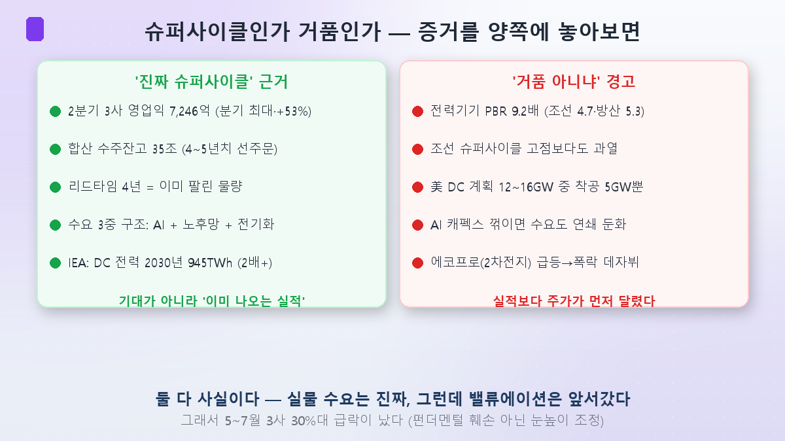
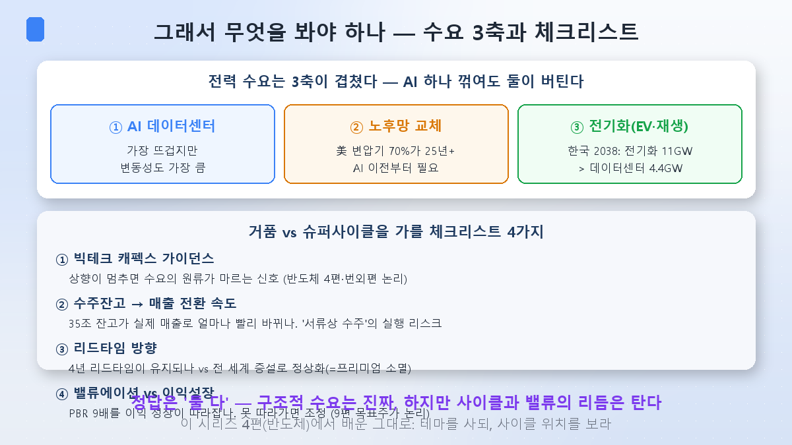

前回の[第3回](/ja/p/transformer-supercycle/)を上げてから、もう6日も経ちました。会社の仕事が立て込んでしばらくブログを開くこともできませんでした。その間に市場はまた揺れました。久しぶりに戻ったので、今回はこのシリーズで先延ばしにしてきた最も不都合な問いに正面から向き合います。

原発（第2回）も変圧器（第3回）も「AI電力難の受益株」として熱狂しました。ところがこれらの銘柄、ここ数ヶ月で30%ずつ下げたのです。だから今日の問いはこれです——**これは本物の10年スーパーサイクルなのか、それとも二次電池のように膨らんでは弾ける泡なのか？**AI半導体第4回で「今回は違う」を検証したように、電力にも同じ天秤を当ててみます。

## 天秤の両側に証拠を載せてみる

結論から言えば、私はどちらか一方が正解だとは思いません。両方とも事実だからです。証拠を並べて見ましょう。

**「本物のスーパーサイクル」という側。**最も強力なのは実績です。電力機器3社（HD現代エレクトリック・暁星重工業・LSエレクトリック）の2026年第2四半期の合算営業利益が7,246億ウォンで四半期史上最大、前年比53%増。合算受注残高は35兆に迫り4～5年分の仕事が積まれています。第3回で見たようにリードタイム4年とは**すでに売れた物量**という意味です。期待ではなく実際の数字で証明されている——これがドットコムバブルや二次電池と違うという強気論の背骨です。

**「泡ではないか」という側。**問題はバリュエーションです。電力機器業種のPBRが9.2倍まで上がりましたが、これは造船（4.7倍）・防衛（5.3倍）よりはるかに高く、造船業が2007年スーパーサイクルの頂点で得た倍率よりも過熱した水準です。しかも需要の実体にも疑問があります。米国データセンターの計画物量が12～16GWなのに、実際の着工は5GWにとどまるという報道があります。計画の半分以上がまだ着工すらできていないのです。もしAI CapExが折れれば（番外編で見たあの論争）、膨らんだ需要推定値が崩れ、この高いバリュエーションを支える実績が出ない可能性があります。

二つの話は矛盾するように聞こえますが、実は両方正しい。**実需は本物なのに、株価（バリュエーション）がそれより先に走った。**だから5～7月に3社が揃って30%超下げたのです。実績が悪化したからではなく、行き過ぎた期待が巻き戻された調整でした。第8回（[KOSPIの集中](/ja/p/kospi-semiconductor/)）で見たあのパターンそのままです。

## 泡論が見落とすもの — 需要の3層構造

しかしここで泡論がよく見落とす点が一つあります。「AIデータセンター投資が折れれば電力株も終わり」という論理ですが、電力需要はAI一つだけで回っているのではありません。

電力需要には**3つの軸**が重なっています。① AIデータセンター（最も熱いが変動性も大きい）、② 老朽電力網の交換（米国変圧器の70%が25年超——AIブーム以前からあった需要）、③ 電化（EV・再生エネルギー転換）。驚くべきは韓国の2038年電力需要見通しで、**電化（11GW）がデータセンター（4.4GW）より2.5倍大きい**ことです。つまりAIは3軸の一つに過ぎず、AIテーマが冷めても老朽網交換と電化という残り2軸が需要を支えます。

これが半導体と電力の決定的な違いです。半導体（特にHBM）は需要が事実上AI一つにかかっているのでAIが折れれば直撃弾です。一方、電力は需要基盤がはるかに広い。「AIバブルが弾けても電気は必要だ」というのが持続論の核心の防御線です。

## で、何を見るべきか — チェックリスト4つ

答えが「両方」なら、投資家がすべきは予言ではなく観察です。このテーマがスーパーサイクルへ行くか泡へ萎むかを分ける信号をチェックリストにまとめると：

- **① ビッグテックCapExガイダンス**：上方修正が止まる瞬間が需要の源が枯れる第一信号です（第4回・番外編の論理そのまま）。
- **② 受注残高→売上の転換速度**：35兆の残高が実際の売上へどれだけ速く変わるか。「書類上の受注」がキャッシュフローになる実行リスクを見るべきです。
- **③ リードタイムの方向**：いまのプレミアムの源泉である4年リードタイムが維持されるか、それとも世界的な増設で正常化するか（=プレミアム消滅）。第3回で押さえた点です。
- **④ バリュエーション vs 利益成長**：PBR9倍を利益成長が追いつくか。追いつけなければ調整が来ます（第9回の目標株価論理）。

## まとめ

- AI電力テーマは**スーパーサイクルであると同時にバリュエーション泡の懸念**を抱えています。実物実績（第2四半期3社営業益+53%、受注残高35兆）は本物ですが、PBR9.2倍は造船スーパーサイクルの頂点よりも過熱。5～7月の30%台調整はその隙間が弾けたもの。
- 泡論の弱点は**需要の3層構造**を見落とす点です——AIが折れても老朽網交換・電化が需要を支えます（韓国2038年：電化11GW > データセンター4.4GW）。これが半導体より需要基盤が広い理由です。
- 予言の代わりに**チェックリスト**で見ましょう——ビッグテックCapEx、受注→売上転換、リードタイムの方向、バリュエーションvs利益成長。このシリーズが繰り返してきた結論と同じです：**テーマを買っても、サイクルの位置を見よ。**

次回・第5回からは再び落ち着いた基礎編です。電力というものがそもそもどう作られてどう私たちに届くのか——**発電・送電・配電を一度に整理**して、このシリーズの銘柄が地図のどこにあるかの骨格を立てます。

> ⚠️ この記事は学んだ内容の整理であり、特定銘柄の売買を推奨するものではありません。引用した数値と見通しは当時のものでありいつでも変わり得ます。投資判断とその責任はご自身にあります。
