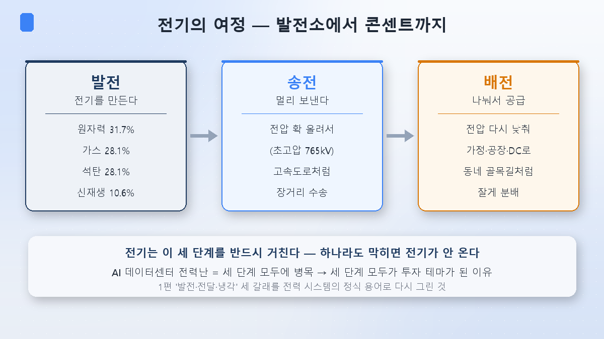
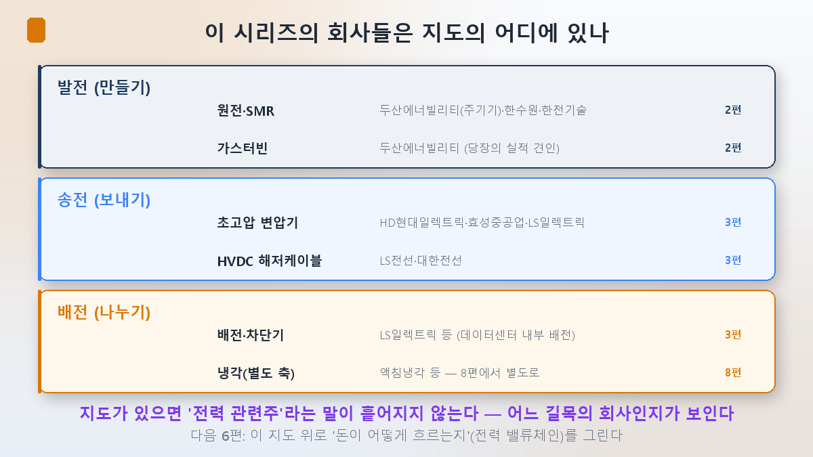

지난 네 편 동안 원전(2편), 변압기(3편), 거품 논쟁(4편)까지 달려왔습니다. 그런데 종목이 많이 나오다 보니 슬슬 헷갈리기 시작하죠. 두산에너빌리티, HD현대일렉트릭, LS전선… 이게 다 '전력 관련주'인데 서로 뭐가 다른 걸까요? 오늘은 잠깐 숨을 고르고, 이 종목들을 **하나의 지도** 위에 정리하겠습니다. 반도체 시리즈 5편(D램·낸드·파운드리)에서 산업 지도를 그렸던 것과 같은 역할이에요.

지도의 뼈대는 아주 단순합니다. 전기가 우리에게 오기까지 반드시 거치는 **세 단계** — 발전, 송전, 배전.

## 전기의 여정 — 발전 → 송전 → 배전

전기는 발전소에서 만들어 그냥 콘센트에 꽂히는 게 아닙니다. 세 단계를 반드시 거칩니다.

**① 발전 — 전기를 만든다.** 발전소에서 전기를 생산하는 단계입니다. 한국의 발전원은 원자력 31.7%, 가스 28.1%, 석탄 28.1%, 신재생 10.6% 순이에요(2025년 기준). 2편에서 본 원전·SMR, 그리고 당장 실적을 끌고 있는 가스터빈이 여기 속합니다.

**② 송전 — 멀리 보낸다.** 만든 전기를 먼 곳까지 실어 나르는 단계입니다. 멀리 보내려면 전압을 확 올려야 해요(초고압 765kV). 고속도로에서 차가 빨리 달리는 것과 같은 원리죠. 3편의 주인공인 초고압 변압기와 HVDC 해저케이블이 이 단계의 핵심입니다.

**③ 배전 — 나눠서 공급한다.** 데이터센터·공장·가정 앞에서 전압을 다시 낮춰 잘게 나눠주는 단계입니다. 고속도로에서 내려와 동네 골목길로 들어가는 것과 같아요. 배전반, 차단기가 여기 속합니다.

이 세 단계 중 **하나라도 막히면 전기가 안 옵니다.** 그리고 1편에서 봤듯 AI 데이터센터 전력난은 세 단계 모두에 병목을 만들었죠. 그래서 세 단계 전부가 투자 테마가 된 겁니다. 1편에서 "발전·전달·냉각 세 갈래"라고 했던 걸, 이번엔 전력 시스템의 정식 용어(발전·송전·배전)로 다시 그린 셈입니다.

## 이 시리즈의 종목들은 지도의 어디에 있나

이제 지금까지 나온 회사들을 이 지도 위에 얹어보죠.

- **발전(만들기)**: 두산에너빌리티(원전 주기기·가스터빈), 한국수력원자력, 한전기술 — 2편의 주인공들.
- **송전(보내기)**: HD현대일렉트릭·효성중공업·LS일렉트릭(초고압 변압기), LS전선·대한전선(HVDC 해저케이블) — 3편의 주인공들.
- **배전(나누기)**: LS일렉트릭 등(데이터센터 내부 배전·차단기). 그리고 이 세 단계와 별개로 열을 식히는 **냉각**은 8편에서 따로 다룹니다.

지도가 머릿속에 있으면, "전력 관련주"라는 뭉뚱그린 말이 흩어지지 않습니다. 어떤 회사가 어느 길목에 서 있는지가 보이니까요. 예를 들어 "두산에너빌리티와 HD현대일렉트릭 둘 다 사면 분산되나?"라고 물으면, 답은 "아니오, 둘 다 AI 전력 테마지만 발전과 송전이라는 다른 길목에 있다"가 됩니다. 반도체 5편에서 삼성전자와 하이닉스를 산업 지도 위에 얹었던 것과 똑같은 사고법이에요.

## 투자자의 관전 포인트

- **길목마다 성격이 다르다**: 발전(특히 SMR)은 2편에서 봤듯 미래 실적 선반영 성격이 강하고, 송전(변압기)은 3편에서 봤듯 이미 수주잔고·실적으로 증명되는 중입니다. 같은 '전력주'라도 리스크와 실적 가시성이 다릅니다.
- **병목은 이동한다**: 지금은 송전(변압기 리드타임 4년)이 가장 뜨거운 병목이지만, 이게 풀리면 다음 병목(예: 배전, 냉각, 혹은 전력망 인허가)으로 관심이 옮겨갑니다. 지도가 있으면 그 이동을 따라갈 수 있습니다.
- **한 종목이 여러 길목에 걸치기도**: 예컨대 LS 계열은 송전(전선)과 배전(LS일렉트릭)에 모두 걸쳐 있습니다. 그 회사가 실제로 어느 단계에서 돈을 버는지 봐야 합니다.

## 정리

- 전기는 **발전 → 송전 → 배전**의 세 단계를 반드시 거칩니다. AI 전력난이 세 단계 모두에 병목을 만들어, 전부가 투자 테마가 됐습니다.
- 이 시리즈의 종목 지도: **발전**(두산에너빌리티·한수원), **송전**(HD현대일렉트릭·효성·LS일렉트릭·LS전선·대한전선), **배전**(LS일렉트릭 등). 냉각은 별도 축(8편).
- 지도가 있으면 '전력 관련주'가 흩어지지 않습니다 — **어느 길목의 회사인지, 병목이 어디로 이동하는지**를 보는 게 핵심입니다.

다음 6편에서는 이 지도 위로 **돈이 어떻게 흐르는지**를 그립니다. 반도체 6편에서 'AI 돈의 강'을 그렸듯, 전력에서도 빅테크의 투자금이 발전에서 배전까지 어떻게 흘러 각 종목의 실적이 되는지 — **전력 밸류체인**을 따라가 보겠습니다.

> ⚠️ 이 글은 공부한 내용을 정리한 것으로, 특정 종목의 매수·매도 추천이 아닙니다. 인용된 수치와 전망은 해당 시점의 것이며 언제든 바뀔 수 있습니다. 투자 판단과 책임은 본인에게 있습니다.
