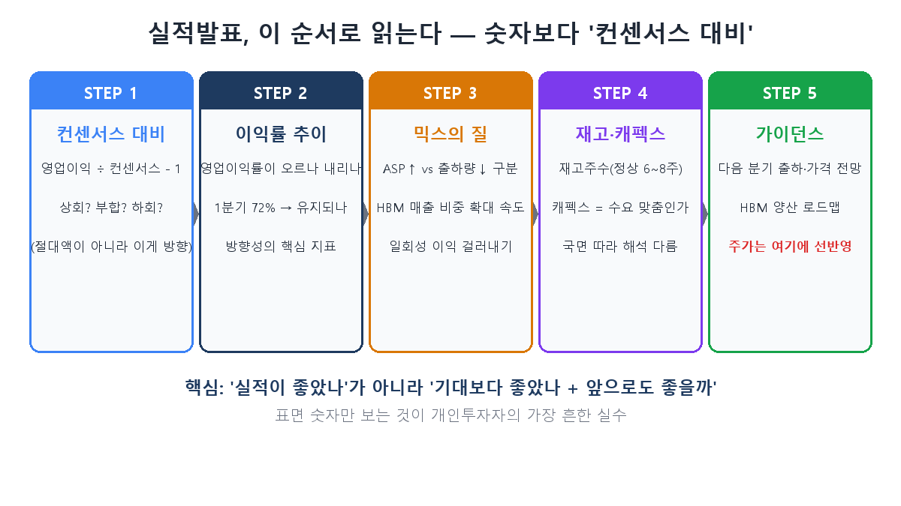
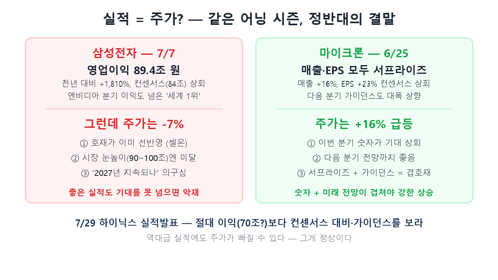

시리즈의 마지막 편입니다. 지금까지 HBM이 뭔지(1편), 누가 이기고 있는지(2·3편), 사이클의 어디쯤인지(4편), 돈이 어떻게 흐르는지(6편), 목표주가가 어떻게 만들어지는지(9편)까지 봤습니다. 이 모든 가정이 맞았는지 **분기마다 채점받는 현장**이 실적발표입니다. 오늘은 그 성적표 읽는 법으로 교과서를 완성합니다.

마침 타이밍이 좋습니다. **11일 뒤인 7월 29일 오전 9시, SK하이닉스가 2분기 실적을 발표**합니다. 이 글을 읽고 나면 그날 뉴스가 전과 다르게 보일 거예요.

## 먼저, 지난달의 미스터리부터

7월 7일 삼성전자가 2분기 잠정실적을 냈습니다. 영업이익 **89.4조 원.** 전년 대비 +1,810%, 엔비디아의 분기 이익마저 넘어선 사실상 세계 1위 성적이었습니다. 그런데 그날 삼성전자 주가는 **7% 가까이 급락**했습니다.

역대급 실적인데 주가가 폭락한다 — 주식을 처음 하는 분에게 가장 당황스러운 장면이죠. "실적 좋으면 주가 오른다"는 상식이 왜 안 통할까요? 이 미스터리를 푸는 것이 오늘의 전부입니다. 답은 세 글자, **컨센서스**입니다.

## STEP 1 — 절대 숫자가 아니라 '컨센서스 대비'

주가는 실적의 좋고 나쁨이 아니라, **실적이 기대보다 좋았는지 나빴는지**에 반응합니다. 그 '기대'가 바로 컨센서스 — 증권사 애널리스트들의 실적 추정치 평균입니다. 실제 실적이 컨센서스를 크게 웃돌면 '어닝 서프라이즈', 밑돌면 '어닝 쇼크'라고 부르죠.

삼성전자 89.4조는 공식 컨센서스(약 84조)는 넘었지만, **시장이 실제로 기대하던 눈높이(90~100조)에는 못 미쳤습니다.** 게다가 그동안 반도체가 워낙 올라서 좋은 실적이 이미 주가에 반영돼 있었죠(이걸 '셀온(sell on)', 재료 소멸이라 합니다). 발표는 오히려 차익실현의 방아쇠가 됐습니다. 그래서 실적발표를 볼 때 첫 계산은 **"영업이익 ÷ 컨센서스 − 1"** 입니다. 절대 액수에 감탄하기 전에 이 한 줄부터 하세요.

## STEP 2~4 — 이익률, 믹스, 재고

숫자 안쪽도 봐야 합니다.

- **이익률 추이**: 영업이익률이 방향성을 말해줍니다. 하이닉스 1분기 영업이익률은 72% — 제조업에서 비현실적인 숫자죠. 2분기에 이게 유지되는지가 관전 포인트입니다.
- **믹스의 질**: 매출이 늘어도 '왜' 늘었는지가 중요합니다. 하이닉스는 1분기에 낸드 출하량이 10% 줄었는데도 ASP(평균판매단가)가 70% 넘게 올라 이익이 늘었습니다. 5편에서 본 것처럼 HBM·eSSD 같은 고부가 제품 비중이 커지는 속도가 진짜 체력입니다.
- **재고·캐펙스**: 재고는 보통 6~8주가 정상인데 지금은 2주 수준의 초긴축입니다. 다만 4편에서 배웠듯 같은 재고 지표도 국면에 따라 해석이 다릅니다 — 과잉 탈출기의 낮은 재고는 건강 신호죠. 캐펙스도 규모보다 "확인된 수요(선주문)에 맞춘 집행인가"를 봅니다.

## STEP 5 — 진짜 주가는 '가이던스'가 움직인다

그리고 가장 중요한 마지막. 시장은 이미 지나간 이번 분기보다 **다음 분기 전망(가이던스)**에 반응합니다. 컨퍼런스콜에서 경영진이 던지는 HBM 물량, 내년 가격, 양산 로드맵 같은 신호죠.

완벽한 대조 사례가 있습니다. 6월 25일 마이크론은 매출·EPS가 컨센서스를 각각 16%, 23% 웃돈 데다 **다음 분기 가이던스까지 대폭 올려** 주가가 16% 급등했습니다. 삼성과 정반대죠. 숫자만 좋은 게 아니라 앞으로도 좋을 거라는 신호가 겹쳐야 주가가 화답합니다.

## 그래서 7월 29일, 하이닉스를 이렇게 보세요

11일 뒤 하이닉스 발표에서 뉴스 헤드라인은 십중팔구 "하이닉스 영업이익 70조 돌파!" 같은 절대 숫자일 겁니다. 하지만 여러분은 이제 다르게 봐야 합니다.

- **컨센서스 대비**: 증권가 2분기 영업이익 컨센서스는 약 65조입니다. 그런데 한국투자증권 등은 60조 안팎으로 컨센서스를 8% 하회할 수 있다고 봤습니다 — 이유가 흥미롭습니다. HBM은 장기계약(1편) 구조라 가격이 미리 고정돼, 범용 D램 값이 급등할 때 오히려 ASP 상승률이 시장 평균보다 낮게 나올 수 있다는 겁니다. 9편에서 본 목표주가 스프레드(430만 vs 185만)가 바로 이 추정 차이에서 나옵니다.
- **가이던스**: HBM4 양산이 3분기로 밀리는지, 내년 물량·가격을 경영진이 어떻게 말하는지. 지난 컨콜에서 하이닉스는 "향후 3년 고객 요청 수요가 이미 공급 캐파를 훨씬 상회한다"고 했습니다. 이 톤이 유지되는지가 4편의 사이클 논쟁, 번외편의 '돈의 강' 지속성 질문에 대한 실물 답변입니다.
- **주가가 빠져도 놀라지 마세요**: 삼성 사례처럼, 역대급 실적에도 주가는 빠질 수 있습니다. 그게 비정상이 아니라 정상입니다.

## 개인투자자가 가장 많이 하는 실수

정리하는 의미로, 실적발표에서 흔히 밟는 지뢰들입니다.

1. **컨센서스를 안 본다** — 절대 이익만 보고 "좋은 실적"이라 단정.
2. **가이던스를 무시한다** — 이번 분기에 취해 다음 분기 전망을 놓침.
3. **셀온을 못 읽는다** — 선반영된 호재를 매수 신호로 오해해 뒤늦게 진입.
4. **믹스를 놓친다** — 총액만 보고 ASP·HBM 비중 같은 질적 변화를 못 봄.
5. **컨콜을 안 듣는다** — 보도자료 숫자만 보고, 경영진이 강조하는 것과 피하는 것의 시그널을 놓침.

## 정리 — 그리고 시리즈를 마치며

- 실적발표는 **"좋았나"가 아니라 "기대보다 좋았나 + 앞으로도 좋을까"**를 보는 자리입니다. 첫 계산은 컨센서스 대비, 마지막 확인은 가이던스.
- 삼성(실적 好·주가 惡)과 마이크론(서프라이즈+가이던스=주가 好)의 대조가 "실적 ≠ 주가"를 증명합니다. 역대급 실적에도 주가는 빠질 수 있습니다.
- 7월 29일 하이닉스 발표는 이 시리즈의 모든 주제가 채점받는 날입니다 — 컨센서스(약 65조) 대비, HBM 장기계약이 만드는 ASP의 역설, 그리고 가이던스에 담길 사이클의 방향.

이걸로 'AI 반도체 투자 교과서' 10편이 끝났습니다. HBM이라는 부품 하나에서 출발해 회사·사이클·밸류체인·지수·목표주가·실적까지 왔네요. 이 시리즈가 준 것은 종목도, 목표가도 아닙니다 — **뉴스를 스스로 읽어내는 틀**입니다. 앞으로 반도체 뉴스가 나올 때, 이 열 편의 개념들이 머릿속에서 연결된다면 그걸로 충분합니다. 긴 여정 함께해 주셔서 고맙습니다.

> ⚠️ 이 글은 공부한 내용을 정리한 것으로, 특정 종목의 매수·매도 추천이 아닙니다. 인용된 수치와 전망은 해당 시점의 것이며, 실제 실적발표 결과는 다를 수 있습니다. 투자 판단과 책임은 본인에게 있습니다.
