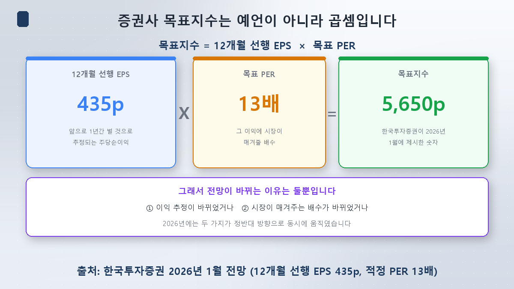
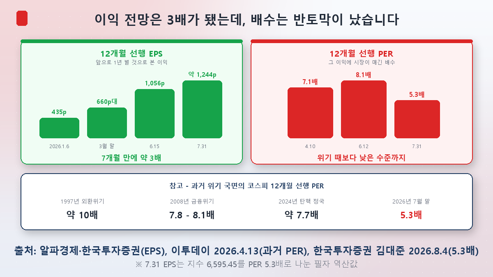
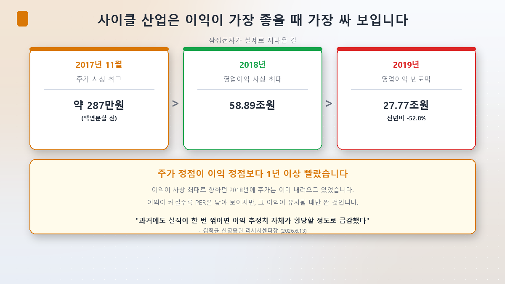
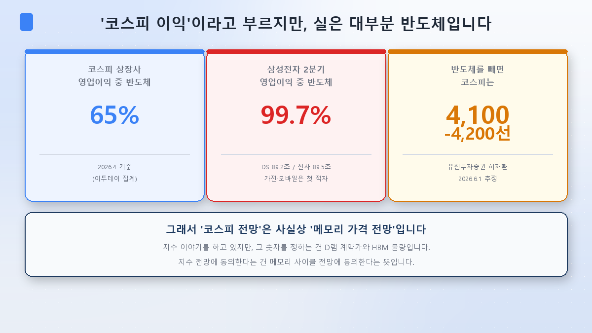
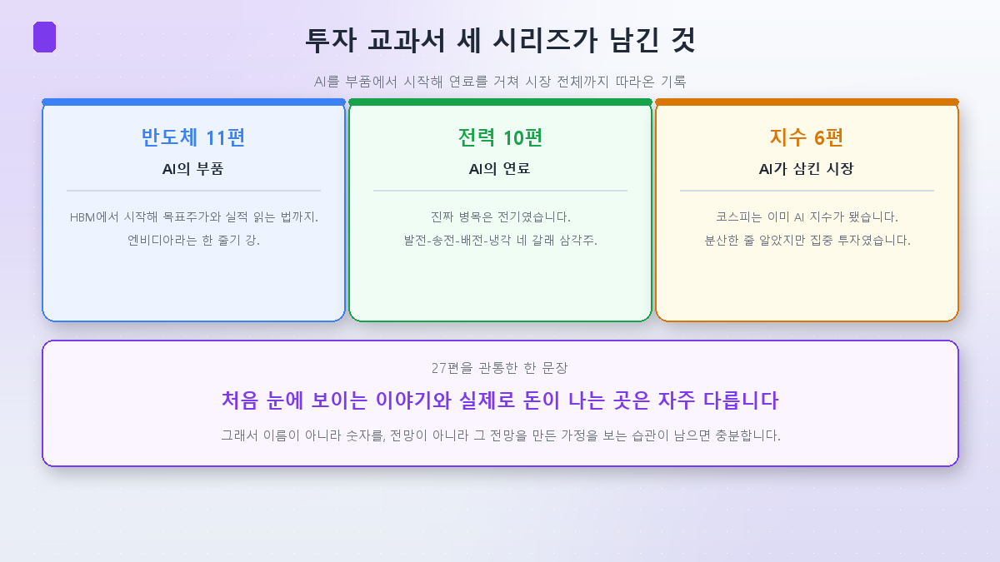

本系列的最后一篇。到[第5篇](/zh/p/how-to-pick-ai-etf/)为止讲的是怎么把产品打开来看，这一篇轮到**把数字打开来看**。

你大概见过这样的新闻标题：「××证券给出韩国综指目标9,300」。乍一看像算命。怎么可能用一个数字说定一年后的指数？

可那个数字不是预言，**是乘法**。而一旦知道它是乘法，你对待预测的态度就完全不同了。

## 目标指数是这么算出来的

公式简单得出人意料。

**目标指数 = 12个月先行EPS × 目标PER**

看个真实例子。韩国投资证券在2026年1月把综指的12个月先行EPS定为**435点**，套用**13倍**的合理PER，给出目标**5,650**。435 × 13 = 5,655。就这么回事。

两个术语先说清楚：

- **12个月先行EPS**：未来一年韩国综指上市公司**预计**能赚到的每股收益。是把分析师的预测汇总平均后的值（一致预期）。
- **目标PER**：市场愿意给这份盈利多少倍。依据是历史区间、与海外市场的比较、ROE等等。

这和[半导体第9篇](/zh/p/target-price-anatomy/)里解剖个股目标价的结构完全一样，只是对象从个股换成了指数。

这里有个要紧的点。**预测会变，原因只有两个**：要么盈利预期变了，要么市场给的倍数变了。所以「为什么下调目标」这个问题，永远可以换成「是下调了EPS，还是下调了PER」。这是两回事。

## 2026年，这两个数字朝相反方向走了

从这里开始才是今年真正的故事。

先看**EPS**。1月6日是435点，而这已经比2025年10月的预测高出28.8%了。之后还没停：3月末660点上下，6月15日**1,056.4点**。七个月大约翻了三倍。

那**PER**呢？以4月10日收盘计，大信证券7.19倍，Eugene投资证券7.1倍。6月12日是8.1倍。到了7月末，韩国投资证券金大俊研究员在8月4日的报告中给出的数字是**5.3倍**。

两组数字并排一放就不对劲了。指数从1月的4,300一带涨到6月的9,000以上，倍数反而降了。信永证券研究中心长金学均的说法很精准：**「过去综指在2300点一带时，市场平均PER约为9.5倍；最近指数大涨，PER反倒降到了8.1倍。」**

原因很简单：**盈利预期上调的速度，比股价上涨的速度还快。**

结果是，现在综指的先行PER比过去的危机时期还低。1997年货币危机时约10倍，2008年金融危机时7.8~8.1倍，2024年弹劾政局约7.7倍。现在是5倍出头。

## 到这里，大多数人会得出同一个结论

「那不就是特别便宜吗？」

反应很自然。而**我认为这一点是本篇最重要的地方。**

低PER有两种读法：

1. 市场**相信**这份盈利，而价格偏低 → 低估
2. 市场**不相信**这份盈利 → 定价合理

同样是5.3倍，含义正好相反。而恰好有一句话告诉我们现在属于哪一种。新韩投资证券卢东吉研究员8月初说：

> 「最近的调整不是盈利的调整，而是对盈利预期的信任的调整」——**「市场目前只相信一致预期的60%。」**

只信60%，意味着市场并不是在给EPS 1,244配5.3倍，而更接近于**给700~800的实际EPS配8~9倍**。计算器上打出来是5.3倍，市场心里想的却不是。

券商实际的动作也印证了这点。大信证券8月3日把目标从11,500下调到**9,300**，给出的理由是**把半导体的目标PER从8倍降到7倍**——动的不是EPS，是倍数。新韩投资证券7月30日也从11,000降到8,800。

**PER与其说是价签，不如说更像信任度指标。**如果盈利预期越膨胀、倍数反而越收缩，那不是变便宜了，而可能是市场给这份预期打了折。

## 周期性行业，往往在盈利最好的时候看起来最便宜

而且这不是新鲜事。存储芯片一向如此。

看看三星电子真实走过的路。

| 时点 | 发生了什么 |
|---|---|
| 2017年11月 | 股价创历史新高（约287万韩元，拆股前） |
| 2018年 | 营业利润**58.89万亿韩元**——当时的历史最高 |
| 2019年 | 营业利润**27.77万亿韩元**——同比**-52.8%** |

**股价见顶比盈利见顶早了一年多。**在利润奔向历史最高的整个2018年，股价其实已经在往下走了。而那个时点的PER正处在历史低位附近。

道理是这样的：周期性行业在景气顶点利润爆发式增长，分母变大，PER自然显得低。可市场知道这份利润撑不住，于是只肯给低倍数。**不是看起来便宜，而是这份利润本就该便宜地定价。**

金学均中心长的警告正落在这里：**「投资半导体，首先最该提防的就是市场停止上调盈利预期的那个时点。」**接着还有一句：**「过去只要业绩一转向，盈利预测本身就会离谱地骤降。」**

这不是夸张。三星电子半导体部门仅2023年一年就亏损约15万亿韩元。三年后的今天，一个季度赚89万亿。这个振幅就是存储。也就是[半导体第4篇](/zh/p/semiconductor-supercycle/)讲过的那个周期。

## 为什么这是整个指数的问题

这里[第1篇](/zh/p/what-is-kospi-index/)和[第2篇](/zh/p/index-concentration-trap/)又回来了。

- **韩国综指上市公司全部营业利润中，半导体占65%**（2026年4月口径）。Eugene投资证券许在焕研究员在6月的报告中估计为60%多接近70%，并推算**剔除半导体后综指只有4,100~4,200一带**。
- 单个公司内部也一样。三星电子2026年第二季度营业利润89.5万亿韩元中，**半导体（DS）部门贡献89.2万亿，占99.7%**。负责家电与手机的DX部门营收48万亿，**营业亏损8,000亿韩元，为成立以来首次亏损**。

于是形成了这样一条链：

**综指预测 → 综指EPS预测 → 半导体利润预测 → DRAM合约价与HBM出货量预测**

嘴上谈的是指数，实际谈的是存储价格。认同某家券商的综指目标，实质上就是**认同它对存储周期的判断**。知道这一层，读预测类报道的方式就变了。

## 那么，预测到底准不准

老实说：不太准。今年就是证据。

2026年1月，各券商给出的综指区间大体在**3,500到5,650**之间。Kiwoom与iM 3,500~4,500，韩华 3,700~4,500，新韩 3,700~5,000，KB 3,800~5,000，三星 4,000~4,900，大信 4,000~5,300，元大 4,200~5,200，现代车最高5,500，韩国投资5,650。

而实际发生的是：

| 时点 | 韩国综指 |
|---|---|
| 1月2日 | 4,309.65 |
| 6月18日 | 9,063.84（首次站上9,000） |
| 6月19日 | 盘中9,385.59 |
| 7月28日 | 6,023.66（-10.84%） |
| 7月29日 | 5,663.24（连续第二天熔断） |
| 7月31日 | 6,595.45（+17.91%） |
| 8月10日 | 6,299.66 |

**连最激进的那个预测（5,650），也只有6月高点的六成左右。**而仅一个月后，那个高点的三分之二就没了。就是[第3篇](/zh/p/circuit-breaker-week/)和[第4篇](/zh/p/leverage-etf-trap/)讲的那一周。

眼下分歧依旧。韩国本土券商正在下调（大信9,300，新韩8,800）：仅7月一个月就有828份下调目标价的报告，8月也接近200份。海外投行则在硬扛：高盛12,000、摩根大通12,500、摩根士丹利9,000均维持不变，摩根士丹利甚至把评级从中性上调到增持。

**面对同一个市场，12,500和8,800同时出现。**这与其说是谁对谁错，不如说是在EPS和PER这两个变量里，各自放进了什么假设。这正是看预测时**要看假设、而非只看数字**的原因。

## 自己动手核对的方法 —— 以及一个常见陷阱

- **韩国交易所信息数据系统**（data.krx.co.kr）→ 基本统计 → 指数 → PER/PBR/股息率。可以查到综指的官方PER与PBR。
- **陷阱**：这里显示的PER是**滞后（trailing）**口径，用最近一期已公布业绩计算，和新闻里说的「12个月先行PER」不是同一个数。在盈利暴涨的阶段，滞后PER会高出很多。把两者混着比，结论必然跑偏。
- **先行PER没有官方统计。**它是分析师预测的汇总，由FnGuide、QuantiWise这类数据商编制；个人通常在券商免费公开的研究PDF里的估值区间图上看到。
- 就算是同一天，不同机构给的值也略有差异（4月10日收盘：大信7.19倍，Eugene 7.1倍），因为各家汇总的分析师预测不同。**这是看方向和量级的数字，不是抠小数点的数字。**

## 小结

- **目标指数不是预言，是乘法。**12个月先行EPS × 目标PER。预测一变，先问是哪一项动了。
- **2026年这两个变量朝相反方向走。**EPS从435点涨到1,000点以上，约三倍；PER却从7~8倍跌到5.3倍，低于过去的危机水平。
- **低PER未必等于便宜。**市场若不信这份盈利预期，就只给低倍数。这正是「只相信一致预期60%」这一判断的由来。
- **周期性行业在盈利顶点看起来最便宜。**三星电子2018年创下最高利润，但股价高点在2017年11月，2019年利润腰斩（-52.8%）。
- **而现在，韩国综指利润的65%来自半导体。**所以综指预测，实质上就是存储周期预测。

## 最后 —— 27篇收官

这篇一发，第三个系列就结束了。[半导体教科书](/zh/p/what-is-hbm/)11篇看的是AI的**零件**，[电力教科书](/zh/p/ai-power-hunger/)10篇看的是AI的**燃料**，指数教科书6篇看的是被AI吞下的**整个市场**。加起来27篇。

回头看，同一件事反复发生：最先被看见的故事，和真正赚到钱的地方，往往不是一回事。从「AI有前景」出发，结果瓶颈是电。都说铜价要涨，可数据中心连铜需求的2%都不到。都说浸没式冷却是未来，真正卖出去的却是冷板。而看上去分散的指数，一半的重量压在两只股票上。

所以我希望这个系列不要变成一份股票清单。我写下的数字，多半半年就旧了。希望留下的只有一个习惯：**看数字而不是看名字，看做出预测的假设而不是预测本身。**

谢谢你一路读到这里。

> ⚠️ 本文仅为个人学习整理，不构成对任何个股或产品的买卖建议。文中的指数、EPS、PER与一致预期均为核对时点的数据，会持续变化，其中盈利预测每个季度都可能大幅变动。投资决策及其后果由本人承担。
