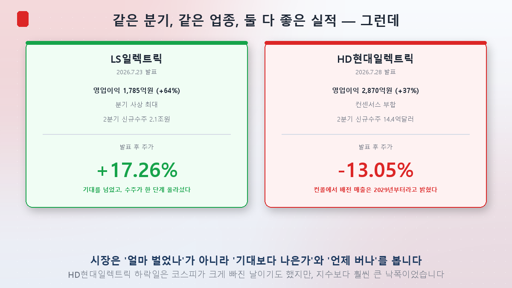
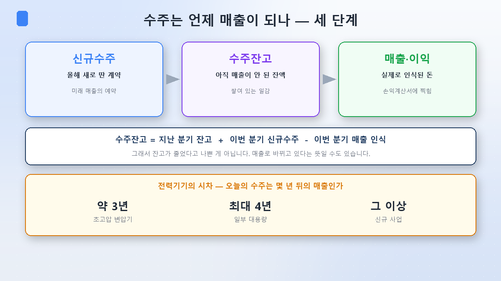
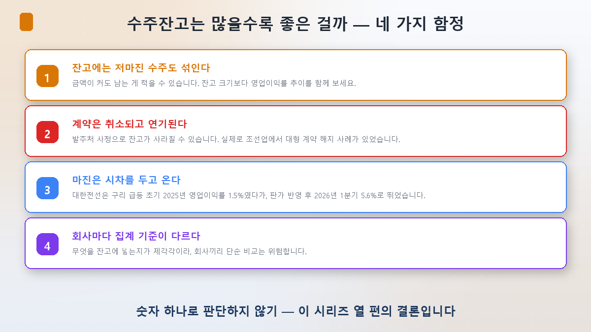
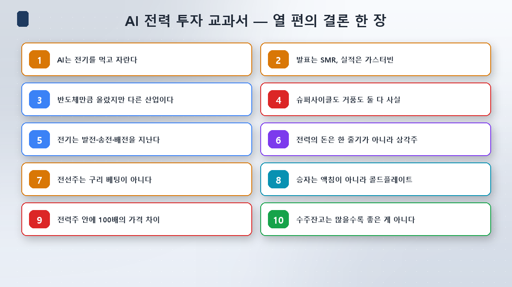

终于到了最后一篇。从[第1篇](/zh/p/ai-power-hunger/)的"AI靠吃电成长"一路走过九篇，这期间**在手订单**这个词被我用了太多次——晓星重工业17.5万亿韩元、三家合计30万亿韩元出头、"四到五年的活"……

今天就把这个词彻底挖开。最后，我会说说写这个系列学到的最重要的一件事。

## 先看2026年二季度发生了什么

实例比教科书快。这是上个月的事。

**LS产电**7月23日公布二季度营业利润1,785亿韩元（+64%），单季历史新高，新接订单也有2.1万亿韩元。当天股价**大涨17.26%**，收于22.35万韩元。

**HD现代电气**7月28日公布二季度营业利润2,870亿韩元（+37.3%）。绝对金额比LS产电更大，也符合市场预期。可第二天股价盘中却跌到**−13.05%**。

同一季度、同一行业、都是好业绩。为什么走向完全相反？

*（说句实在话，7月29日正是[第9篇](/zh/p/korea-power-stock-map/)讲的韩国综指熔断当天，全市场都在大跌。但它的跌幅远超指数，而且券商与媒体指出了另有原因。）*

**压垮HD现代电气的，是电话会上的一句话。**公司表示，新的成长引擎——配电业务的营收要**从2029年起**才会体现。同时，二季度关税退还带来的收益只有约60亿韩元，实质改善大约要等两年。市场失望的是"那到底什么时候变成钱"，券商随即下调目标价（新韩投资150万→100万韩元、三星153万→116万韩元、大信150万→115万韩元）。

反观LS产电，历史最佳业绩之上订单再上一个台阶，券商纷纷上调目标价（KB 26万→28万韩元，韩国投资33万韩元）。

**教训就是：市场问的不是"你赚了多少"，而是"有没有超预期"和"什么时候赚到"。**这与芯片系列[第10篇](/zh/p/reading-earnings/)里三星电子公布89万亿韩元营业利润股价却下跌，是完全相同的道理。

## 在手订单到底指什么

先把术语理清，三个概念要分开。

- **新接订单**：本季度新签下的合同，是未来营收的"预约"。
- **在手订单**：其中尚未确认为营收、堆在那里的金额，也就是"活儿"。
- **营收与利润**：真正记进利润表的钱。

算法很简单。

> **在手订单 = 上季度在手订单 + 本季新接订单 − 本季确认营收**

这里新手常常搞反：**在手订单减少并不一定是坏事。**它可能只是说明确认的营收多过新接订单——堆着的活儿正在变成真金白银。

而且电力设备行业有**很长的时滞**。超高压变压器从下单到交付约三年，部分大容量机型要四年。美国变压器交期从2024年的143周拉长到2026年一季度的160周，说的就是这件事。也就是说，**今天签下的订单是三年后的营收。**[第3篇](/zh/p/transformer-supercycle/)讲"交期是瓶颈"，对投资者而言，它又以"预期与业绩之间的时差"回来了。

## 那在手订单是不是越多越好

整个系列里我一直把在手订单当成正面信号。最后一篇，我想把它翻过来看一次。

**① 在手订单里也混着低毛利订单。**金额大不代表赚得多。有评论指出，全球优质企业的在手订单很少超过三年，而韩国企业却常把三到五年当作炫耀的资本——这可能意味着为做大规模而让渡了毛利。**所以看在手订单规模，一定要同时看营业利润率的走势。**

**② 合同会被取消、被推迟。**即使已计入在手订单，也可能因发包方的状况而消失。造船业就发生过因地缘政治原因大型合同被单方面解约的实例。

**③ 毛利是带着时滞来的。**一个好例子是[第7篇](/zh/p/copper-cable-ai/)讲过的大韩电线。铜价飙涨的2025年，其营业利润率被压到1.5%；等成本联动（escalation）条款把涨价传导出去后，2026年一季度跳到5.6%。同一家公司、同一门生意，是原材料与售价之间的时差决定了毛利。

**④ 各家公司的统计口径不同。**什么算进在手订单，各家标准不一，公司之间简单对比很危险。

补一句：这绝不是说在手订单没用。韩国会计学的实证研究发现，已披露的在手订单信息对未来利润具有显著的预测力。**用得好是不错的领先指标，只盯一个数字就成了陷阱**——这才是准确的说法。

## 自己去核对的步骤

读新闻和读原文是两回事，5分钟就够。

1. 在**韩国电子公告系统（dart.fss.or.kr）**搜索公司名。
2. 把公告类型筛选为**定期公告**，打开事业报告书、季度报告书或半年报告书。
3. 在左侧目录点开**「II. 事业的内容」→「销售及订单情况」**，那里有分业务板块的订单总额、已交付金额与在手订单表格。
4. **三个数字一起看**——新接订单、在手订单，以及营业利润率。
5. **与指引对照。**自己算一下累计新接订单占公司全年订单目标的百分比。

第5步意外地有用。仅2026年，HD现代电气一季度就完成了全年42.2亿美元目标的43%；晓星重工业把目标从8.4万亿韩元上调至**12万亿韩元**；LS产电也从4万亿上调到6万~6.5万亿。**上调指引是股价反应最剧烈的事件之一**，跟踪完成进度就能提前预判。

另外，大额合同也会以**单一销售·供货合同签订**公告出现。但只有超过上年营收5%（大规模法人2.5%，主板）或10%（创业板）才属强制披露，所以**小额合同根本不会出现。**LS产电二季度公告的订单约8,000亿韩元，若把未公告合同算进去则估计超过2万亿。只数公告，就会低估这门生意。

## 投资者视角 — 归纳起来

**① 相对预期比绝对金额重要。**2,870亿韩元大于1,785亿韩元，股价却反着走。共识预期和指引比头条数字更有力。

**② 永远追问"什么时候"。**击垮HD现代电气的不是业绩，而是"2029年"这个时点。看到订单，就顺手加一句"这是几年后的营收"。

**③ 看毛利的方向，而不是水平。**HD现代电气25.1%的营业利润率是业内顶尖。可环比只改善0.2个百分点，就被读成"毛利动能放缓"。市场看的是斜率，不是高度。

**④ 至少把原文打开一次。**新闻里的数字，通常是公司想强调的那些。花5分钟在公告原文里把订单、在手订单和利润率一起看完，画面会准确得多。

## 小结

- **在手订单 = 上期在手 + 新接订单 − 确认营收。**在手订单下降未必是坏信号。电力设备从接单到营收要**三到四年**。
- **市场读的是相对预期和时点，不是绝对金额。**2026年二季度，LS产电凭历史最佳业绩与订单升级涨17.26%；HD现代电气虽符合预期，却因新业务营收要等到2029年而跌13.05%。
- **别只凭在手订单这一个数字下判断。**低毛利订单、取消与延期、原材料与售价的时差、各家口径差异，全都藏在里面。要把在手订单**和营业利润率一起看**，再加上**指引完成率**。

## 系列收尾

把十篇写下来学到的东西压成一句话：**最先被看见的故事，和钱真正生出来的地方，常常不是同一处。**

发布会讲的是SMR，业绩却来自燃气轮机（[第2篇](/zh/p/smr-nuclear-ai/)）。都说铜是被AI推涨的，可数据中心只占需求的2%（[第7篇](/zh/p/copper-cable-ai/)）。浸没式冷却是热门话题，钱却先落在冷水机组上（[第8篇](/zh/p/datacenter-cooling/)）。同一个"电力股"标签里，市盈率差了100倍（[第9篇](/zh/p/korea-power-stock-map/)）。而今天，赚得更多的那家公司，股价跌得更多。

题材的名字只是起点，之后每一次都得自己去核对数字。如果这个系列让这份核对稍微没那么令人发怵，我就满足了。

从[芯片教科书](/zh/p/ai-money-flow/)到电力，感谢各位读完这二十篇。下个系列再见。

> ⚠️ 本文仅为个人学习整理，不构成任何证券的买卖建议。所引数值、目标价与专家观点均为当时情况，随时可能改变。投资决策及责任由本人承担。
