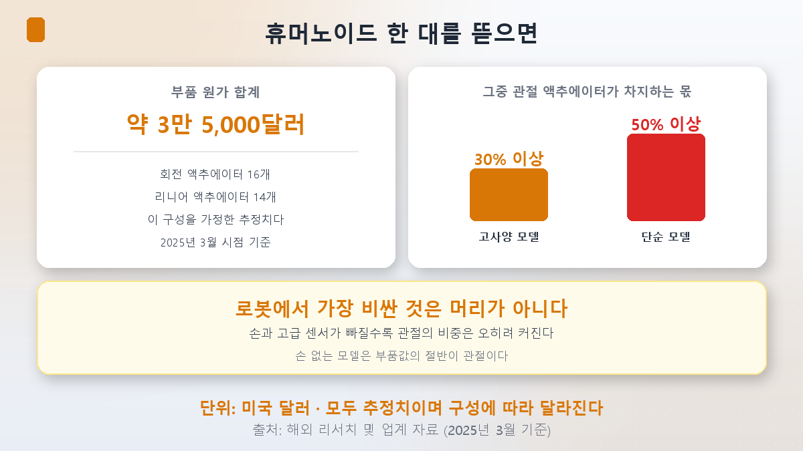
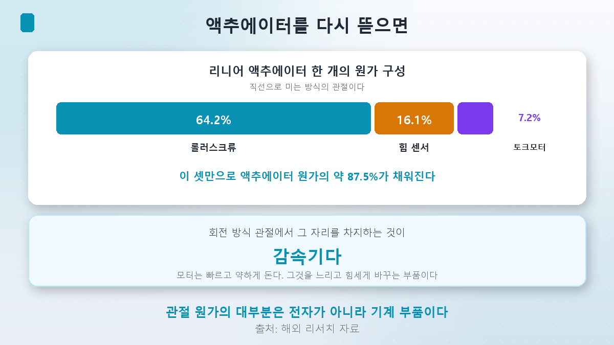
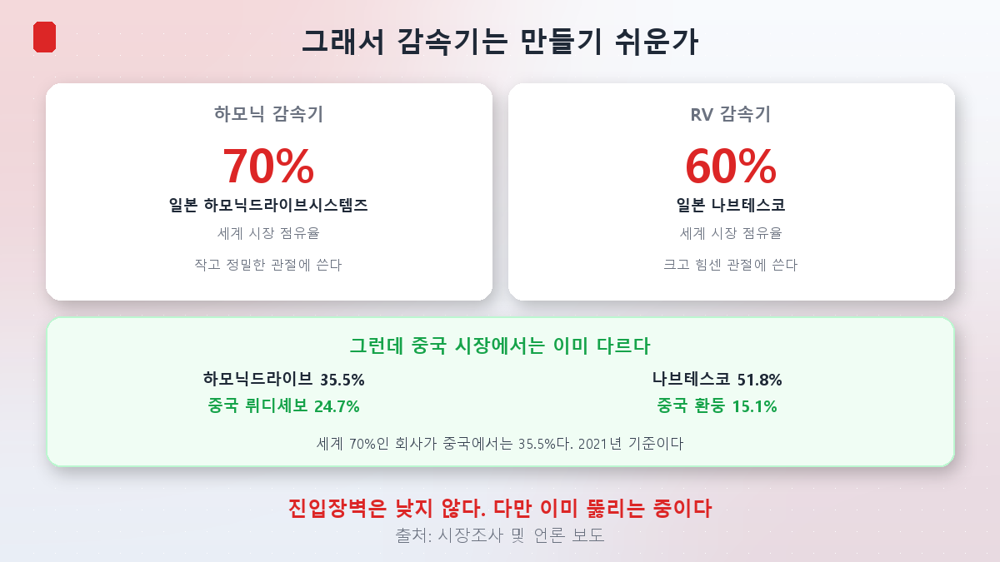
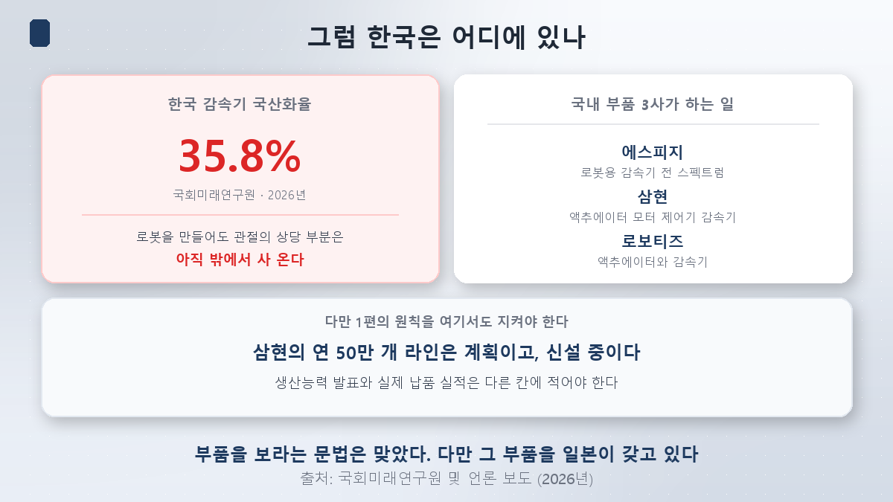

[1편](/p/what-is-physical-ai/)에서 숙제를 두 개 남겼습니다. 그중 하나가 이것입니다.

> **로봇 부품은 반도체와 달리 진입장벽이 낮을 수도 있다.**

[반도체 시리즈](/p/what-is-hbm/)에서 우리는 "완성품 말고 부품을 보라"는 문법을 썼습니다. 스마트폰보다 HBM이 나은 투자였으니까요. 로봇에도 같은 문법이 통할지, 통한다면 그 부품은 무엇인지 확인해 보겠습니다.

**결론부터 말씀드리면, 제 예상은 절반만 맞았습니다.**

## 로봇에서 가장 비싼 건 머리가 아닙니다

'AI 로봇'이라고 하면 자연스럽게 **머리**를 떠올립니다. 1편에서 본 엔비디아의 GR00T 같은 것 말이죠.

그런데 돈이 실제로 들어가는 곳은 다릅니다. 사람으로 치면 **뇌수술보다 무릎 관절 수술이 비싼** 셈입니다.

한 리서치가 추정한 휴머노이드 한 대의 **부품 원가 합계는 약 3만 5,000달러**입니다. 회전 관절 16개와 직선 관절 14개를 가정한 값이고, **2025년 3월 시점의 추정치**입니다. 구성에 따라 크게 달라집니다.

여기서 중요한 건 총액보다 **비중**입니다.

| 로봇 종류 | 관절 액추에이터가 차지하는 몫 |
|---|---|
| 손과 고급 센서가 달린 고사양 모델 | **30% 이상** |
| 손과 고급 센서가 없는 단순 모델 | **50% 이상** |

읽는 법이 조금 특이합니다. **손과 센서를 뺄수록 관절의 비중은 오히려 커집니다.** 다른 게 빠지니 남은 것의 몫이 커지는 거죠. 단순한 로봇은 **부품값의 절반이 관절**입니다.

**액추에이터**는 관절을 움직이는 장치를 통틀어 부르는 말입니다. 모터, 감속기, 센서, 제어기가 한 덩어리로 묶여 있습니다.

## 액추에이터를 다시 뜯으면

그럼 그 액추에이터 안에서는 어디에 돈이 갈까요.

직선으로 미는 방식(리니어)의 액추에이터 원가는 이렇게 나뉩니다.

| 부품 | 비중 |
|---|---|
| **롤러스크류** | **64.2%** |
| 힘 센서 | 16.1% |
| 프레임리스 토크모터 | 7.2% |
| **위 셋의 합** | **약 87.5%** |

**롤러스크류** 하나가 액추에이터 원가의 3분의 2입니다. 회전 운동을 직선 운동으로 바꾸는 나사 형태의 기계 부품입니다.

그리고 회전하는 방식(로터리)의 관절에서 그 자리를 차지하는 것이 **감속기**입니다.

> **감속기**란, 모터의 회전을 느리게 바꾸는 대신 힘을 키우는 부품입니다.
> 모터는 원래 빠르지만 약하게 돕니다. 로봇 관절은 반대로 느리지만 힘세야 합니다. 그 변환을 감속기가 합니다.

여기서 눈여겨볼 대목이 있습니다. **관절 원가의 대부분이 전자 부품이 아니라 기계 부품**이라는 점입니다. 반도체가 아니라 금속 가공물입니다.

이 사실이 제 예상의 근거였습니다. 금속 가공이면 만들기 쉬울 것 같으니까요.

## 그래서 만들기 쉬운가 — 아니었습니다

감속기 시장은 이렇습니다.

| 종류 | 1위 | 세계 점유율 | 쓰이는 곳 |
|---|---|---|---|
| **하모닉 감속기** | 일본 **하모닉드라이브시스템즈** | **약 70%** | 작고 정밀한 관절 |
| **RV 감속기** | 일본 **나브테스코** | **약 60%** | 크고 힘센 관절 |

**일본 두 회사가 각각 70%와 60%를 쥐고 있습니다.** 반도체 장비나 소재 시장의 집중도와 비교해도 뒤지지 않는 수준입니다.

이유는 단순합니다. **금속 가공이라 쉬운 게 아니라, 금속 가공이라 어렵습니다.** 감속기는 미크론 단위의 정밀도로 수천만 번을 반복해도 유격이 생기지 않아야 합니다. 이건 설계도만으로 되는 일이 아니라 **오래 만들어 본 경험**이 필요한 영역입니다.

그러니 1편에서 제가 적어둔 "진입장벽이 낮을 수 있다"는 예상은 **틀렸습니다.**

## 그런데 이미 뚫리는 중입니다

여기서 끝내면 반쪽입니다. 반대 방향도 봐야 하니까요.

**중국 시장의 숫자를 보면 그림이 다릅니다.**

| 감속기 | 일본 업체 점유율 | 중국 업체 점유율 |
|---|---|---|
| 하모닉 | 하모닉드라이브 **35.5%** | 뤼디셰보 **24.7%** |
| RV | 나브테스코 **51.8%** | 환둥 15.1%, 중다리더 7.2% |

**세계 시장에서 70%인 회사가 중국에서는 35.5%입니다.** 절반으로 떨어집니다. 이 수치는 2021년 기준이라 지금은 또 달라졌을 수 있습니다.

즉 정확한 표현은 이렇습니다.

> **진입장벽은 낮지 않습니다. 다만 이미 뚫리는 중입니다.**

그리고 이 문장이 **4편에서 다룰 중국 점유율 30% 전망**의 배경이기도 합니다. 완성품만 싸게 만드는 게 아니라, **부품부터 자기 것으로 바꿔 왔다**는 뜻이니까요.

## 그럼 한국은 어디에 있나

여기서 국내 투자자에게 중요한 숫자가 하나 나옵니다.

> **한국의 감속기 국산화율은 35.8%입니다.** (국회미래연구원, 2026년)

로봇을 만들어도 **관절의 상당 부분은 아직 밖에서 사 온다**는 뜻입니다. 1편에서 본 국내 로봇 상장사 시총 45조원이 무엇을 사는 것인지 생각하게 만드는 숫자입니다. 이건 **5편**에서 제대로 따져보겠습니다.

물론 국내에도 만드는 곳이 있습니다.

| 기업 | 하는 일 |
|---|---|
| **에스피지** | 로봇용 감속기 전 스펙트럼을 생산할 수 있는 사실상 유일한 국내 기업으로 꼽힙니다 |
| **삼현** | 액추에이터·모터·제어기·감속기 |
| **로보티즈** | 액추에이터와 감속기 |

언론은 이 셋을 두고 **"로봇 액추에이터 3파전"**이라 부르기도 합니다.

### 여기서 1편의 원칙을 지켜야 합니다

삼현은 창원 제2공장에 **연간 액추에이터 50만 개, 모터 150만 개, 제어기 100만 개, 감속기 50만 개**를 만들 수 있는 자동화 라인을 짓고 있습니다.

큰 숫자입니다. 그런데 [1편](/p/what-is-physical-ai/)에서 세운 원칙을 여기 적용해야 합니다.

**이건 생산능력이고, 신설 중입니다.** 실제로 몇 개를 납품해 얼마를 벌었는지는 **다른 칸에 적어야 할 숫자**입니다. 생산능력 발표는 "계획", 납품 실적은 "실적"입니다. 로봇 부품 기사에서 이 둘이 가장 자주 섞입니다.

## 가설 채점

1편에서 적어둔 이번 편의 가설은 이랬습니다.

> 반도체 문법("완성품 말고 부품")이 로봇에도 적용될 것이다. 다만 로봇 부품은 진입장벽이 낮을 수 있다.

**앞은 맞고, 뒤는 틀렸습니다.**

- **맞은 것**: 부품이 핵심인 건 사실입니다. 관절이 부품값의 30~50%이고, 그 안에서 롤러스크류 하나가 64.2%입니다. 완성품보다 부품에서 값이 결정됩니다.
- **틀린 것**: 진입장벽은 낮지 않았습니다. 하모닉 70%, RV 60%의 과점입니다.
- **예상하지 못한 것**: 그 과점을 가진 게 한국이 아니라 **일본**이고, 한국의 국산화율은 **35.8%**라는 사실입니다.

반도체에서는 "부품을 보라"가 곧 국내 기업으로 이어졌습니다. 로봇에서는 그 문장이 **일본 회사를 가리킵니다.** 같은 문법인데 도착지가 다릅니다.

## 정리

- **로봇에서 가장 비싼 건 머리가 아니라 관절입니다.** 휴머노이드 부품 원가는 약 **3만 5,000달러**(2025년 3월 추정)이고, 그중 관절 액추에이터가 고사양 모델은 **30% 이상**, 단순 모델은 **50% 이상**을 차지합니다.
- **관절 안에서도 기계 부품이 대부분입니다.** 리니어 액추에이터는 **롤러스크류 64.2%**, 힘 센서 16.1%, 토크모터 7.2%로 셋이 약 87.5%입니다. 회전 관절에서 그 자리를 차지하는 게 **감속기**입니다.
- **진입장벽은 낮지 않았습니다.** 하모닉 감속기는 일본 하모닉드라이브시스템즈가 **약 70%**, RV 감속기는 나브테스코가 **약 60%**를 쥐고 있습니다. 금속 가공이라 쉬운 게 아니라, 오래 만들어 본 경험이 필요해서 어렵습니다.
- **다만 이미 뚫리는 중입니다.** 중국 시장에서는 하모닉드라이브가 **35.5%**로 내려오고 중국 뤼디셰보가 24.7%를 가져갔습니다(2021년 기준). 4편에서 다룰 중국 점유율 전망의 배경입니다.
- **한국의 감속기 국산화율은 35.8%입니다.** 국내에도 에스피지·삼현·로보티즈가 있지만, 관절의 상당 부분은 아직 밖에서 사 옵니다.
- **생산능력과 납품 실적을 구분하십시오.** "연 50만 개 라인"은 계획이고 신설 중입니다. 로봇 부품 기사에서 가장 자주 섞이는 두 가지입니다.

다음 편에서는 **머리 쪽으로 올라갑니다.** 엔비디아가 로봇 파운데이션 모델을 공개하고 개발 도구를 뿌리는 이유가 무엇인지 보겠습니다. 칩을 팔기 위해서라는 게 상식적인 답인데, **로봇은 아직 칩 수요가 작습니다.** 그렇다면 다른 이유가 있을 겁니다.

> ⚠️ 이 글은 개인 학습 정리이며 특정 종목이나 투자 방식에 대한 권유가 아닙니다. 부품 원가와 비중은 특정 구성을 가정한 **추정치**이며 제조사와 모델에 따라 크게 달라집니다. 총 원가는 2025년 3월 시점 기준이라 현재와 다를 수 있습니다. 감속기 점유율은 조사 기관과 시점에 따라 달라지며, 중국 시장 수치는 2021년 기준입니다. 언급한 기업명은 산업 구조를 설명하기 위한 예시이고 매수·매도 의견이 아니며, 생산능력 발표는 실적이 아닙니다. 로봇 관련주는 변동성이 특히 큽니다. 달러 금액은 환율 변동을 고려해 원화 환산을 생략했습니다. 투자 판단과 그 결과는 본인의 몫입니다.
