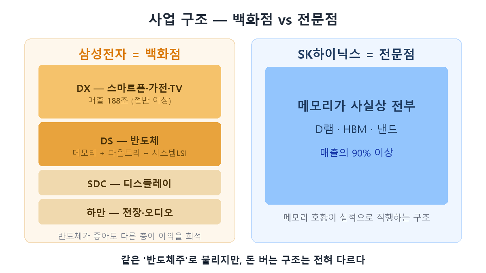
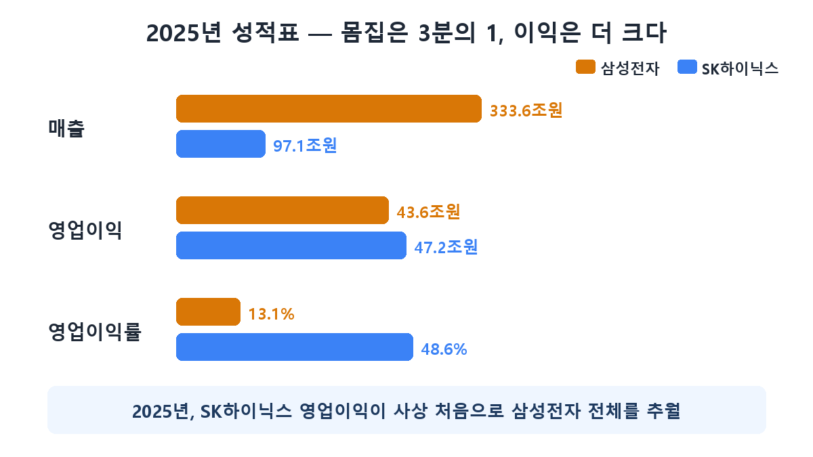

先来个小测验：一家公司营收333万亿韩元，另一家97万亿韩元，谁赚得更多？按常理应该是前者，但**2025年的营业利润：SK海力士47.2万亿韩元，三星电子43.6万亿韩元。**体量只有三分之一的海力士，史上首次超越了整个三星电子。这怎么可能？答案就在两家公司的**业务结构**里。[第1篇](/zh/p/what-is-hbm/)和[第2篇](/zh/p/hbm4-war/)讲了HBM这件武器，今天来比较握着这件武器的两家公司的体质差异。

## 三星电子是"百货商场"

我们习惯叫三星半导体公司，但严格说它是**顺便也卖半导体的综合电子百货商场**。2025年333.6万亿韩元的营收中，一半以上（188万亿）来自卖手机、家电、电视的DX部门。半导体（DS部门）只是其中一层楼，而这层楼里又分为存储、代工（晶圆代工）和系统LSI。此外还有显示面板（SDC）、车载与音响（哈曼）。

这种结构的含义很明确：**存储再景气，只要其他楼层不振，整体成绩单就会被稀释。**事实上2025年存储大爆发，但代工亏损和手机利润率下滑吃掉了利润，三星电子的营业利润率停留在13%左右。

## SK海力士是"专卖店"

相反，SK海力士90%以上的营收来自存储（DRAM、HBM、NAND），是**纯粹的存储专卖店**。没有别的楼层，也就没有稀释。存储景气的利润直接流入公司整体业绩。

结果就是**48.6%的营业利润率**——卖100元能剩49元的生意做了一整年，这在制造业极为罕见。第2篇讲的HBM特性——昂贵、长期合同、海力士握有70%份额——与专卖店结构相遇后引爆的结果。

## 为什么股价走势截然不同

这种体质差异直接体现在股价上。

| | 三星电子 | SK海力士 |
|---|---|---|
| 性质 | 综合电子巨头 | 存储纯粹标的 |
| 存储景气时 | 利润改善被稀释 | 直接反映到业绩和股价 |
| 存储萧条时 | 其他业务缓冲 | 正面挨打（可能亏损） |
| 股价波动性 | 相对较低 | 高（高贝塔） |
| 额外变量 | 代工扭亏、手机 | HBM份额与良率 |

总结：**海力士是存储周期的放大器，三星电子是缓冲器。**对AI存储超级周期的信心越强，海力士的纯粹敞口就越有吸引力；反过来，周期转向时海力士的下行也大得多。三星电子虽无法完整享受存储上涨，但握有**自己的重估牌**：代工扭亏，以及第2篇讲的HBM4反击。

## 投资者要点

- **"看好半导体所以买了三星"**——这句话里有陷阱。想要存储景气的纯粹红利，结构上海力士才是那件商品；买三星电子等于打包买入存储＋代工＋手机＋低估值修复。
- **买海力士**＝押注存储（尤其HBM）周期延续。检查点：HBM份额与良率（第2篇），以及周期所处位置（第4篇讲）。
- **买三星电子**＝对周期＋非存储复苏＋估值重估的分散押注。波动更低，但上行周期中涨不过海力士的原因也来自同一结构。

## 小结

- 2025年海力士营业利润（47.2万亿）史上首次超越三星电子整体（43.6万亿）——**这是结构的胜利，不是体量的胜利**。
- 三星电子是半导体只占一层楼的**百货商场**，海力士是存储就是一切的**专卖店**——它们不是同一种"半导体股"。
- 海力士是周期的**放大器**（高风险高回报），三星电子是**缓冲器**（低波动＋重估牌）——买什么，取决于你相信什么。

下一篇第4篇讲那个"周期"的真面目：**半导体超级周期是什么，我们现在处于哪个阶段**——从历次周期的历史中寻找答案。

> ⚠️ 本文仅为个人学习整理，不构成任何证券的买卖建议。投资决策及责任由本人承担。
