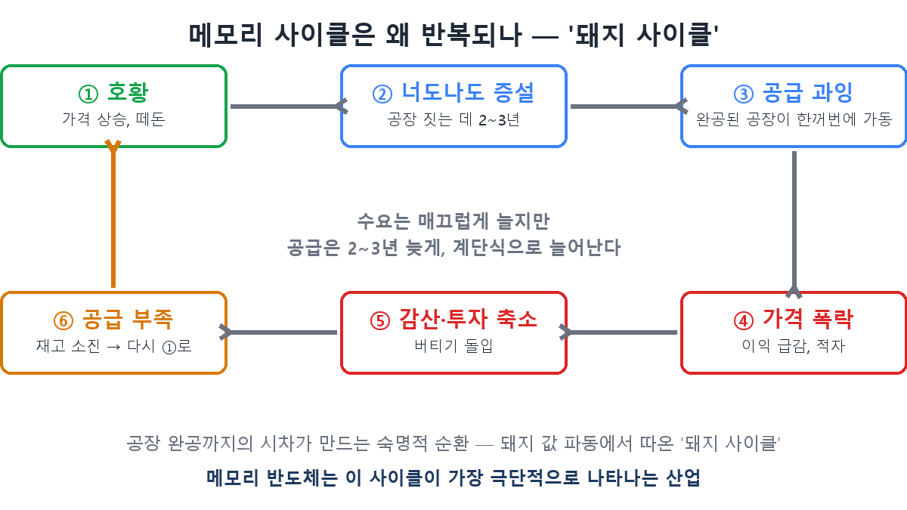
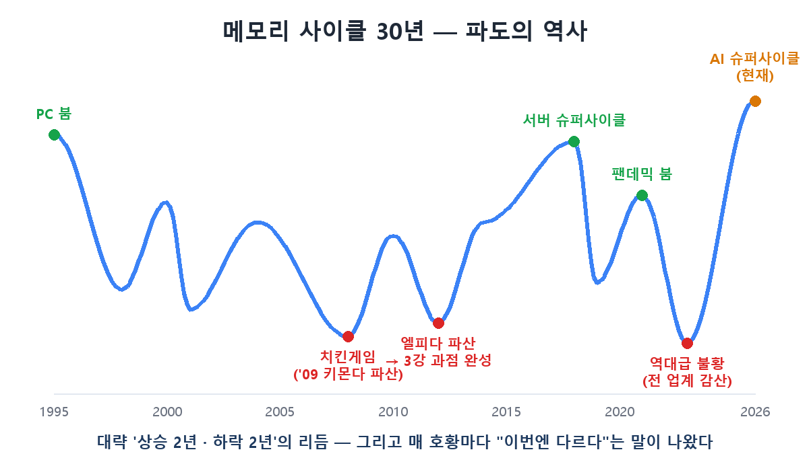

Priced a PC build lately? A 32GB DDR5 kit jumped from ₩170,000 to ₩700,000 in three months — **nearly 4x.** The same phenomenon making PC-builder forums groan sounds, to investors, like one word: "supercycle." In [part 3](/en/p/samsung-vs-hynix/) we called SK hynix an "amplifier of the cycle." Today we examine **the cycle itself** — because only when you understand it can you form your own answer to "how long will this run?"

## Why cycles happen — the 'pork cycle'

Memory prices don't ride a rollercoaster because someone blundered; it's a **structural destiny**. Economists call it the pork cycle, and it works like this.

When pork prices rise, every farm starts raising piglets. But pigs take time to grow — and when they all reach the market **at once**, prices crash. Farms give up, supply dries up a few years later, prices spike again… on repeat, forever.

Memory is exactly this, except instead of piglets it's **fabs costing tens of trillions of won and taking 2–3 years to build.** Demand grows smoothly; supply arrives years late, in giant steps. Boom and bust alternate by necessity.

## A history of waves — the chicken game that made the Big Three

The one episode you must know from this history is the **chicken game**. In the late 2000s, when far more memory makers existed than today, nobody cut production in the downturn — everyone bled on price, waiting for rivals to die first. The results were brutal: Germany's Qimonda went bankrupt in 2009, and in 2012 Japan's pride, Elpida, collapsed.

The survivors — Samsung, SK hynix, Micron — form today's **Big Three oligopoly**. The rules changed from that point: with only three players, they can each trim output in a downturn and defend prices. When the historic bust of 2022–23 hit, all three cut production together and the market rebounded within about a year. That's why the troughs have grown shallower.

The recent rhythm shows the cycle alive and well: the 2017–18 server supercycle → the 2019 downturn → the 2021 pandemic boom → the historic 2022–23 bust → and the AI supercycle from 2024. Roughly **two years up, two years down.**

## The weight of "this time is different"

At every peak, one phrase reliably appears: **"this cycle is different."** In 2018 they said server demand was structural and the cycle was dead — and the market rolled over right after. That's why the phrase is called the most expensive four words in investing.

Yet this time, some things genuinely have changed:

- **HBM is pre-sold**: as we saw in part 1, one to two years of volume is contracted before production. Building to order, not on speculation, changes the mechanics of oversupply.
- **Supply is physically pinned**: with all three makers diverting lines to HBM, commodity DRAM supply has collapsed — today's price explosion (contract prices up 55–63% per quarter) is a boom squeezing itself.
- **Oligopoly discipline**: unlike the chicken-game era, all three are choosing profitability over reckless expansion.

The counterarguments are just as weighty: new fabs are already under construction (supply relief is expected only after H2 2027), every capacity expansion in history turned into oversupply on completion, and if AI infrastructure spending itself cracks, pre-sold or not, the source of demand dries up.

## So where are we now?

By the indicators, we're in the **acceleration phase of an up-cycle**: DRAM contract prices are jumping 55–63% per quarter in H1 2026, all three suppliers are sold out, and supply relief isn't expected before H2 2027. But an acceleration phase is, by definition, one where the distance to the peak is unknowable.

The checklist is the classic set of cycle signals:

| Signal | Now (H1 2026) | Warning sign |
|---|---|---|
| DRAM contract price | +55–63% per quarter | Slowing gains → decline |
| Supplier inventory | Low (sold out) | Weeks of inventory rising |
| Capex | Expanding | Aggressive expansion race resumes |
| New fab ramp | From H2 2027 | Ramp timing = the supply step |

## Recap

- The memory cycle is a structural loop created by the **2–3 year fab construction lag** (the pork cycle). It can't be abolished — only its rhythm changes.
- The chicken game (Qimonda and Elpida bankruptcies) forged the **Big Three oligopoly**, which has made troughs shallower via coordinated cuts.
- This cycle has genuinely new elements — pre-sold HBM, pinned supply — but **"this time is different" has been said at every peak.** Watch contract-price momentum, inventories, capex, and new fab ramps (H2 2027 onward).

Part 5 is a fundamentals workout: **DRAM, NAND, and foundry — what actually separates the three** words you see in every headline.

> ⚠️ This post is a summary of my own learning, not a recommendation to buy or sell any security. Investment decisions and responsibility are your own.
