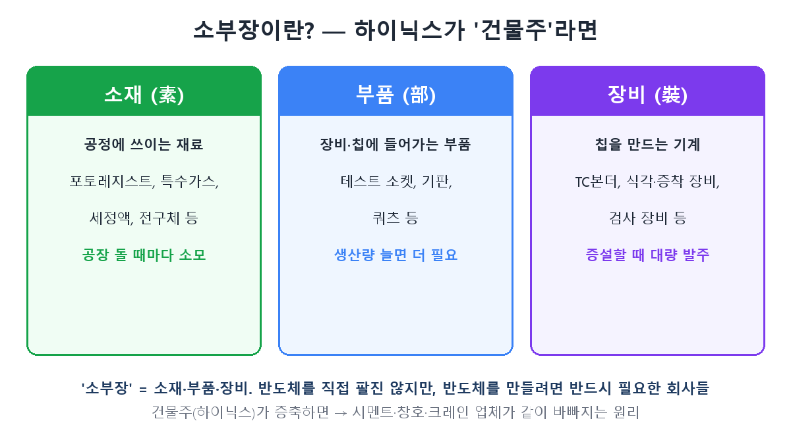
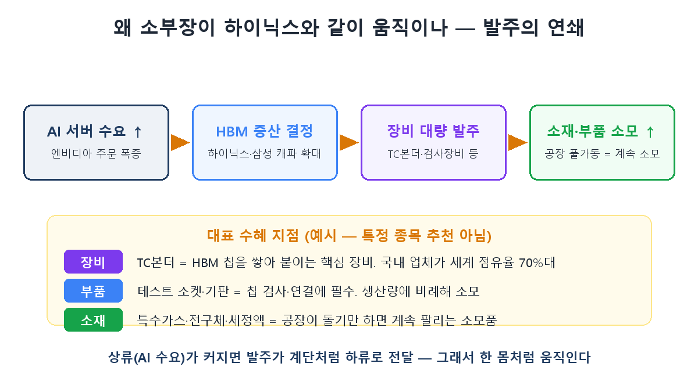

炒股久了会遇到这类股票：既不是三星也不是海力士，可海力士一出好业绩它们就跟涨，HBM一有新闻它们就跟着震荡。韩国称它们为**"素部装"**。正是[第6篇](/zh/p/ai-money-flow/)中我预告的、资金之河第三道闸的那批股票。今天就讲清这个供应链群体到底是什么，以及为何与海力士如同一体地联动。

## 素部装＝材料·零部件·设备

"素部装"取自**素**材（材料）、**部**品（零部件）、**装**备（设备）的首字。它们不是造芯片卖芯片的公司（三星、海力士），而是**为这些公司提供材料、零部件、机器、使其能造出芯片的公司**。用建筑打个比方就清楚了。

- **材料**：工艺中使用的耗材——光刻胶、特种气体、清洗液、前驱体等。**工厂每运转一次就消耗一次。**
- **零部件**：装入设备或芯片的部件——检测芯片的测试插座、承载芯片的基板等。**产量越大需要越多。**
- **设备**：造芯片的机器——把HBM芯片堆叠键合的TC键合机、刻蚀·沉积设备、检测设备等。**扩建产能时大批量下单。**

海力士好比"业主"，业主一决定加盖，水泥、门窗、吊车厂商就一起忙起来——正是这个结构。

## 为何与海力士同涨同跌 — 订单的连锁

关键在**涓滴的顺序**。还记得第6篇的资金之河吗？AI需求变大，水流会以台阶方式向下游传递。

AI服务器需求上升 → 海力士·三星决定扩产HBM → **大批量下单设备** → 工厂满负荷运转、**持续消耗材料与零部件**。所以"海力士扩大HBM产能"这一条新闻，就成了整个供应链的业绩预告。这正是素部装对海力士股价高度敏感的原因。

## 主要受益点 — 为何这些公司会涨

看具体例子理解更快。（以下为说明原理的例子，并非个股推荐。）

- **设备 — TC键合机**：第1篇讲过HBM是把DRAM垂直堆叠。把那些芯片精密堆叠、键合的核心设备就是TC键合机。HBM越多、层数越高，需要的键合机就越精密。韩国厂商在这个市场握有约70%的全球份额，故被称为"HBM旗舰设备股"。
- **零部件 — 测试插座·基板**：检测成品芯片是否正常时，连接芯片与设备的插座、承载芯片的基板等，**随产量成比例消耗**。这是与"生产本身"挂钩、而非仅与扩建挂钩的受益。
- **材料 — 特种气体·前驱体·清洗液**：只要工厂运转就持续售出的耗材。如果说设备是"一次卖一大笔"，材料则是"细水长流"，业绩波动性相对不同。

## 投资者要点

- **素部装是"高贝塔杠杆"**：若海力士是放大器（第3篇），素部装就是加在放大器上的又一重杠杆。周期好时涨得更凶，周期转向时跌得也更狠——因为订单一停，业绩就骤降。
- **"设备 vs 材料"性格不同**：设备股在扩建周期（订单集中期）爆发，但订单结束后会有空档。材料股与工厂稼动率挂钩，相对平稳。要什么，选择就不同。
- **客户集中风险**：许多素部装公司的营收依赖海力士、三星等少数大客户。一个客户的下单决定就能左右业绩，所以要同时盯大厂的业绩和投资计划。
- **怀疑"HBM概念股"的标签**：被主题裹挟上涨的股票里，实际HBM营收占比微乎其微的不在少数。核心是看该公司营收中HBM/AI究竟占多少。

## 小结

- 素部装＝**材料·零部件·设备**。不直接卖芯片，却是造芯片必不可少的公司。
- 因AI需求 → HBM扩产 → 设备下单 → 材料零部件消耗的**订单连锁**，它们与海力士如同一体地联动。
- 素部装是周期的**杠杆**（涨更多、跌更多），设备股（挂钩扩建）与材料股（挂钩稼动率）性格不同。要看**实际HBM营收占比**，而非"主题标签"。

下一篇第8篇放大视野：这一切芯片故事如何体现在指数上——**KOSPI 5000时代，半导体如何拉动指数**。

> ⚠️ 本文仅为个人学习整理，不构成任何证券的买卖建议。投资决策及责任由本人承担。
